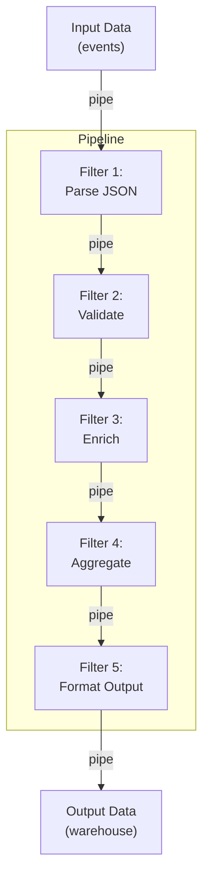

<Hero title="Pipes & Filters / Pipeline Architecture" subtitle="Chain independent processing stages with data flowing through pipes" imageAlt="Pipeline architecture with sequential processing stages" size="large" />

## TL;DR

Pipes & Filters architecture chains independent processing stages (filters) connected by data streams (pipes). Each filter takes input, transforms it, and passes output to the next filter. Inspired by Unix philosophy (cat | grep | sort). Excellent for ETL, data processing, and streaming workloads. Simplicity is its strength; ordering is its constraint.

## Learning Objectives

- Understand filters (processing stages) and pipes (data streams)
- Design reusable, composable filters
- Implement linear data pipelines
- Handle data format compatibility between filters
- Know when to use vs when pipelines become unwieldy

## Motivating Scenario

Your analytics system ingests user event logs, processes them through multiple stages: parse JSON → filter invalid events → enrich with user data → aggregate by hour → send to warehouse. Each stage is independent: parsing doesn't need to know about enrichment, aggregation doesn't care how filtering works. Pipes & Filters matches this naturally: each stage is a filter; data flows through pipes.

## Core Concepts

Pipes & Filters follows the Unix philosophy: small, focused programs chained together.

**Filter**: A processing stage that reads input, transforms it, writes output. Single responsibility.

**Pipe**: A connection between filters. Carries data in a specific format (JSON, CSV, objects).

<Figure caption="Pipes and Filters architecture">

</Figure>

### Key Characteristics

**Linear Flow**: Data flows in one direction through the pipeline.

**Independent Filters**: Each filter knows nothing about others; can test, deploy, scale independently.

**Composability**: Add, remove, or reorder filters without modifying existing ones.

**Streaming**: Can process unbounded data streams, not just batch.

**Simplicity**: Easy to understand, debug, and reason about.

## Practical Example

<Tabs>
  <TabItem value="python" label="Python (Generators)">
    ```python
    # Pipeline using Python generators (pipes are just data flow)

    def parse_events(raw_data):
        """Filter: Parse JSON events."""
        for line in raw_data:
            try:
                yield json.loads(line)
            except json.JSONDecodeError:
                continue  # Skip invalid JSON

    def validate_events(events):
        """Filter: Validate required fields."""
        for event in events:
            if 'user_id' in event and 'action' in event and 'timestamp' in event:
                yield event

    def enrich_events(events, user_db):
        """Filter: Enrich with user data."""
        for event in events:
            user = user_db.get(event['user_id'], {})
            event['user_segment'] = user.get('segment', 'unknown')
            event['user_tier'] = user.get('tier', 'free')
            yield event

    def aggregate_events(events):
        """Filter: Aggregate by hour."""
        hourly_buckets = {}
        for event in events:
            hour_key = event['timestamp'][:13]  # YYYY-MM-DD HH
            if hour_key not in hourly_buckets:
                hourly_buckets[hour_key] = {'count': 0, 'actions': {}}
            hourly_buckets[hour_key]['count'] += 1
            action = event['action']
            hourly_buckets[hour_key]['actions'][action] = \
                hourly_buckets[hour_key]['actions'].get(action, 0) + 1

            yield hourly_buckets[hour_key]

    def format_output(events):
        """Filter: Format as JSON for warehouse."""
        for event in events:
            yield json.dumps(event)

    # Compose the pipeline
    def run_pipeline(raw_data, user_db):
        parsed = parse_events(raw_data)
        validated = validate_events(parsed)
        enriched = enrich_events(validated, user_db)
        aggregated = aggregate_events(enriched)
        formatted = format_output(aggregated)
        return formatted

    # Usage
    with open('events.jsonl') as f:
        user_db = load_user_database()
        results = run_pipeline(f, user_db)
        for line in results:
            warehouse.insert(json.loads(line))
    ```
  </TabItem>

  <TabItem value="java" label="Java (Streams)">
    ```java
    // Java 8+ Stream API naturally supports pipes & filters

    public class EventPipeline {

        // Filter: Parse events
        static Event parseEvent(String line) {
            return objectMapper.readValue(line, Event.class);
        }

        // Filter: Validate
        static boolean isValidEvent(Event event) {
            return event.getUserId() != null &&
                   event.getAction() != null &&
                   event.getTimestamp() != null;
        }

        // Filter: Enrich
        static Event enrichEvent(Event event, UserDatabase userDb) {
            User user = userDb.get(event.getUserId());
            event.setUserSegment(user.getSegment());
            event.setUserTier(user.getTier());
            return event;
        }

        // Filter: Aggregate
        static AggregatedMetric aggregate(List<Event> events) {
            return events.stream()
                .collect(Collectors.groupingBy(
                    e -> e.getTimestamp().truncatedTo(ChronoUnit.HOURS),
                    Collectors.counting()
                ));
        }

        public static void main(String[] args) throws IOException {
            UserDatabase userDb = new UserDatabase();

            try (BufferedReader reader = new BufferedReader(
                    new FileReader("events.jsonl"))) {

                List<AggregatedMetric> results = reader.lines()
                    .map(EventPipeline::parseEvent)
                    .filter(EventPipeline::isValidEvent)
                    .map(e -> enrichEvent(e, userDb))
                    .collect(Collectors.groupingBy(
                        e -> e.getTimestamp().truncatedTo(ChronoUnit.HOURS)
                    ))
                    .entrySet()
                    .stream()
                    .map(e -> new AggregatedMetric(e.getKey(), e.getValue()))
                    .collect(Collectors.toList());

                results.forEach(warehouse::insert);
            }
        }
    }
    ```
  </TabItem>

  <TabItem value="unix" label="Unix Command Line">
    ```bash
    # Unix pipes & filters - the original inspiration

    # Example: Process log files and generate report

    # Filter 1: cat (read raw logs)
    # Filter 2: grep (extract HTTP 500 errors)
    # Filter 3: awk (extract user IDs)
    # Filter 4: sort (sort unique users)
    # Filter 5: uniq -c (count occurrences)

    cat /var/log/app.log \
      | grep "HTTP 500" \
      | awk '{print $5}' \
      | sort \
      | uniq -c \
      | sort -rn

    # Each filter is independent and reusable
    # Output of cat = input of grep
    # Output of grep = input of awk
    # etc.

    # Can swap filters, add/remove stages, reorder as needed
    ```
  </TabItem>

  <TabItem value="framework" label="Using Stream Processing Framework">
    ```python
    # Using Apache Beam (or similar framework)
    # for more complex pipelines

    import apache_beam as beam
    from apache_beam.pipeline import Pipeline

    # Define filters as transforms
    class ParseEventsFn(beam.DoFn):
        def process(self, line):
            try:
                yield json.loads(line)
            except json.JSONDecodeError:
                pass

    class ValidateEventsFn(beam.DoFn):
        def process(self, event):
            if all(k in event for k in ['user_id', 'action', 'timestamp']):
                yield event

    class EnrichEventsFn(beam.DoFn):
        def process(self, event):
            user_db = get_user_db()  # Shared resource
            user = user_db.get(event['user_id'], {})
            event['user_segment'] = user.get('segment')
            yield event

    # Compose the pipeline
    with Pipeline() as pipeline:
        events = (
            pipeline
            | 'Read' >> beam.io.ReadFromText('events.jsonl')
            | 'Parse' >> beam.ParDo(ParseEventsFn())
            | 'Validate' >> beam.ParDo(ValidateEventsFn())
            | 'Enrich' >> beam.ParDo(EnrichEventsFn())
            | 'Aggregate' >> beam.combiners.Count.PerElement()
            | 'Write' >> beam.io.WriteToText('output.txt')
        )
    ```
  </TabItem>
</Tabs>

## When to Use / When Not to Use

<Vs highlight={[1]} items={[
{
    label: "Use Pipes & Filters When:",
    points: [
      "Processing linear data streams (logs, events, files)",
      "Transformation stages are independent and reusable",
      "ETL (Extract, Transform, Load) pipelines",
      "Each stage has a single, well-defined responsibility",
      "Want simplicity and ease of understanding",
      "Can express workflow as a sequence of transforms"
    ],
    highlightTone: "positive"
  },
{
    label: "Avoid Pipes & Filters When:",
    points: [
      "Need branching or conditional logic (if-then-else)",
      "Different stages have complex interdependencies",
      "Require bidirectional or non-linear data flow",
      "Multiple inputs or outputs per stage",
      "Need dynamic pipeline structure at runtime"
    ],
    highlightTone: "warning"
  }
]} />

## Patterns and Pitfalls

<Showcase title="Patterns and Pitfalls" sections={[
  {
    label: "Pitfall: Pipeline Bottleneck",
    body: "One slow filter delays the entire pipeline. E.g., network call in enrichment filter. Profile each filter. Parallelize slow filters. Use connection pooling, caching."
  },
  {
    label: "Pitfall: Incompatible Data Formats",
    body: "Filter A outputs objects, Filter B expects JSON strings. Intermediate transformation needed. Define clear format contracts between filters. Document input/output schema."
  },
  {
    label: "Pitfall: State Leakage Between Records",
    body: "Filter maintains state (counter, cache) that leaks into next record's output. Each filter should be stateless per record. Use explicit state only if necessary and document."
  },
  {
    label: "Pattern: Filter Reusability",
    body: "Design filters that work with any input matching the interface. Generic filters (Parse, Filter, Map, Reduce). Compose them for specific use cases."
  },
  {
    label: "Pattern: Error Handling",
    body: "Invalid data in pipeline. Choose: skip, log, or route to dead letter. Explicit error handling in each filter. Dead letter queues for unparseable data."
  },
  {
    label: "Pattern: Branching",
    body: "Process splits into multiple paths (e.g., valid vs invalid events). Use a Splitter filter that yields to multiple outputs. Or fan-out to parallel pipelines."
  }
]} />

## Design Review Checklist

<Checklist items={[
  "Is each filter focused on a single transformation?",
  "Can filters be tested in isolation with mock input/output?",
  "Is the data format consistent between filters?",
  "Are filters stateless (or is state explicitly documented)?",
  "Can you reorder filters without breaking the pipeline?",
  "Is error handling clear (skip, log, fail fast)?",
  "Are there performance bottlenecks (profile filters)?",
  "Is the pipeline ordering intuitive (matches logical flow)?",
  "Can new filters be added without modifying existing ones?",
  "Is the pipeline testable end-to-end with realistic data?"
]} />

## Self-Check

1. **What's the main benefit of pipes & filters architecture?** Simplicity, reusability, and composability. Each filter is independent; easy to test, modify, and reuse in different pipelines.
2. **When would branching break the pipes & filters model?** If you need different paths (valid vs invalid events), you're not in pure linear flow anymore. Consider event-driven for conditional routing.
3. **How do you handle a filter that's a bottleneck?** Profile it. If it's I/O bound (network call), use connection pooling or caching. If CPU bound, parallelize or optimize algorithm.

:::info
**One Takeaway**: Pipes & Filters is the Unix philosophy applied to system architecture. Use it for linear, data-intensive workflows. When logic becomes conditional or branching, consider event-driven architecture.

:::

## Next Steps

- **Stream Processing Frameworks**: Kafka Streams, Apache Flink, Beam
- **Event-Driven Architecture**: When you need non-linear, conditional workflows
- **Parallelization Strategies**: Process multiple pipelines concurrently
- **Monitoring Data Pipelines**: Lag, throughput, error rates
- **Backpressure Handling**: Managing fast producers and slow consumers

## References

- Richards, M., & Ford, N. (2020). *Fundamentals of Software Architecture*. O'Reilly. ↗️
- McIlroy, M.D. et al. (1978). Unix Time-Sharing System: The UNIX System. Bell Labs ↗️
- Kreps, J. (2014). The Log: What every software engineer should know about real-time data. LinkedIn Engineering ↗️