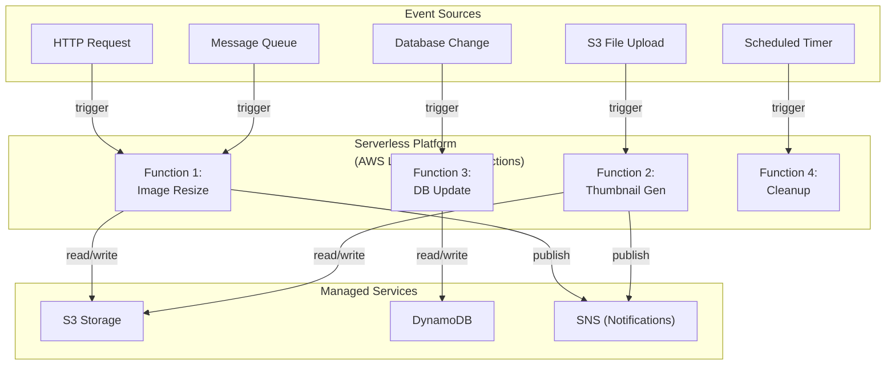

<Hero title="Serverless / FaaS Architecture" subtitle="Event-triggered functions with no server management, pay-per-execution" imageAlt="Serverless architecture with event-triggered functions" size="large" />

## TL;DR

Serverless (Function-as-a-Service) abstracts away server/infrastructure management. You write stateless functions triggered by events (HTTP, timers, queue messages), cloud provider handles scaling, execution environment, and billing. Pay only for execution time. Excellent for event-driven workloads, APIs, and batch processing. Tradeoffs: cold starts, limited execution time, vendor lock-in, harder to test locally.

## Learning Objectives

- Understand FaaS model and event triggers
- Design stateless functions for serverless
- Handle cold starts and execution limits
- Implement serverless patterns (API endpoints, event processors)
- Know when serverless fits vs when traditional servers are better

## Motivating Scenario

Your team is building a photo-sharing app where users upload images. Instead of running servers that sit idle most of the time, you use AWS Lambda: upload triggers a function that resizes the image, another function generates thumbnails, another updates the database. You pay only for the seconds of computation, not for idle servers. If 1000 users upload simultaneously, Lambda scales automatically to handle them.

## Core Concepts

Serverless (FaaS) is a **compute model where you write functions triggered by events**, cloud provider manages execution:

**Function**: Stateless code (Node.js, Python, Go) triggered by an event. Executes once, completes, then function instance is discarded.

**Event Trigger**: What invokes a function. HTTP request, database change, file upload, timer, message from queue.

**Managed Environment**: Cloud provider (AWS, Azure, GCP) allocates resources, scales, monitors. You don't manage servers.

**Stateless**: Functions can't rely on persistent local state. Scaling creates new instances without shared memory.

**Billing**: Pay per execution (milliseconds and memory). Idle time costs nothing.

<Figure caption="Serverless architecture with event-driven functions">

</Figure>

### Key Characteristics

**Event-Driven**: Functions triggered by events, not running continuously.

**Auto-Scaling**: Instantaneously scales from zero to thousands of concurrent executions.

**Stateless**: No persistent local state between executions.

**Ephemeral**: Function instances exist only for the duration of execution, then destroyed.

**Short-Lived**: Typical timeout 15 minutes (AWS Lambda). Designed for quick operations.

**No Server Operations**: No patching, scaling configuration, or infrastructure management.

## Practical Example

```python
# AWS Lambda function (Python)
import json
import boto3
import base64
from PIL import Image
import io

s3 = boto3.client('s3')

def resize_image_handler(event, context):
    """Triggered by S3 file upload."""
    # Parse S3 event
    bucket = event['Records'][0]['s3']['bucket']['name']
    key = event['Records'][0]['s3']['object']['key']

    # Download image from S3
    response = s3.get_object(Bucket=bucket, Key=key)
    image_data = response['Body'].read()

    # Resize image
    image = Image.open(io.BytesIO(image_data))
    image.thumbnail((300, 300))

    # Save resized image
    output_buffer = io.BytesIO()
    image.save(output_buffer, format='JPEG')
    resized_data = output_buffer.getvalue()

    # Upload to S3 (resized folder)
    s3.put_object(
        Bucket=bucket,
        Key=f"resized/{key}",
        Body=resized_data,
        ContentType='image/jpeg'
    )

    return {
        'statusCode': 200,
        'body': json.dumps({
            'message': 'Image resized',
            'bucket': bucket,
            'key': key
        })
    }

# API endpoint function
def create_order_handler(event, context):
    """Triggered by HTTP POST /orders."""
    try:
        body = json.loads(event['body'])
        order_id = create_order_in_db(body)

        return {
            'statusCode': 201,
            'body': json.dumps({'order_id': order_id})
        }
    except Exception as e:
        return {
            'statusCode': 500,
            'body': json.dumps({'error': str(e)})
        }

def create_order_in_db(order_data):
    """Helper: save order (no I/O dependencies in function core)."""
    dynamodb = boto3.resource('dynamodb')
    table = dynamodb.Table('orders')
    table.put_item(Item=order_data)
    return order_data.get('id')

# Scheduled cleanup function (triggered by CloudWatch timer)
def cleanup_temp_files_handler(event, context):
    """Triggered daily at 2 AM."""
    s3 = boto3.client('s3')
    response = s3.list_objects_v2(Bucket='mybucket', Prefix='temp/')

    for obj in response.get('Contents', []):
        s3.delete_object(Bucket='mybucket', Key=obj['Key'])

    return {'statusCode': 200, 'deleted': len(response.get('Contents', []))}

# Note: No servers running.
# No infrastructure to manage.
# Pay only for execution time.
# Auto-scales from 0 to 1000s of concurrent invocations.
```

## Deployment & Configuration

```yaml
# serverless.yml - Serverless Framework configuration
service: image-processing-app

provider:
  name: aws
  runtime: python3.9
  region: us-east-1

functions:
  resizeImage:
    handler: handlers.resize_image_handler
    events:
      - s3:
          bucket: upload-bucket
          event: s3:ObjectCreated:*
          rules:
            - prefix: uploads/
    memory: 512
    timeout: 60

  createOrder:
    handler: handlers.create_order_handler
    events:
      - http:
          path: orders
          method: post
    memory: 256
    timeout: 30

  cleanup:
    handler: handlers.cleanup_temp_files_handler
    events:
      - schedule:
          rate: cron(0 2 * * ? *)  # Daily at 2 AM UTC
    memory: 128

resources:
  Resources:
    UploadBucket:
      Type: AWS::S3::Bucket
      Properties:
        BucketName: upload-bucket
```

## When to Use / When Not to Use

<Vs highlight={[1]} items={[
{
    label: "Use Serverless When:",
    points: [
      "Event-driven workloads (file uploads, database changes, messages)",
      "Highly variable load (spikes to thousands, then quiet periods)",
      "Short-lived operations (< 15 minutes per execution)",
      "Want minimal operational overhead",
      "Cost-sensitive (pay per execution, not for idle capacity)",
      "Building APIs that may not serve requests 24/7"
    ],
    highlightTone: "positive"
  },
{
    label: "Avoid Serverless When:",
    points: [
      "Need long-running processes (> 15 minutes)",
      "Consistent, sustained load (always-on services better)",
      "Cold start latency is unacceptable (< 100 ms critical)",
      "Complex cross-function coordination or state management",
      "Heavily vendor-locked technologies",
      "Need full control over runtime environment"
    ],
    highlightTone: "warning"
  }
]} />

## Patterns and Pitfalls

<Showcase title="Patterns and Pitfalls" sections={[
  {
    label: "Pitfall: Cold Start Delays",
    body: "First invocation after idle period is slow (500-2000 ms for Python). Users notice latency. Use provisioned concurrency. Warm up functions periodically. Accept cold starts for non-critical paths."
  },
  {
    label: "Pitfall: Timeout Surprises",
    body: "Function exceeds 15-minute timeout limit (or configured limit). Execution terminated abruptly. Design functions to complete quickly. Break into smaller steps. Use queues for long-running work."
  },
  {
    label: "Pitfall: Vendor Lock-In",
    body: "Code tightly coupled to AWS Lambda. Hard to migrate to another cloud or on-premise. Abstract cloud-specific code behind interfaces. Use frameworks (Serverless Framework, CDK) for portability."
  ,
    body: "Code tightly coupled to AWS Lambda. Hard to migrate to another cloud or on-premise. Abstract cloud-specific code behind interfaces. Use frameworks (Serverless Framework, CDK) for portability.",
    tone: "positive"
  },
  {
    label: "Pattern: Async Processing",
    body: "Long-running task triggered by API call. API returns immediately; background function processes asynchronously. Use queue (SQS, Pub/Sub). Return queue message ID to caller. Caller polls for completion."
  },
  {
    label: "Pattern: Orchestration",
    body: "Multiple functions need to coordinate. E.g., resize image, generate thumbnail, update database. Use Step Functions (AWS), Durable Functions (Azure) for orchestration."
  }
]} />

## Design Review Checklist

<Checklist items={[
  "Are functions stateless (no reliance on persistent local state)?",
  "Do functions complete within timeout limits?",
  "Is the event trigger appropriate (HTTP, queue, timer, database)?",
  "Are environment secrets injected, not hardcoded?",
  "Can cold start latency be tolerated?",
  "Are dependencies lightweight (minimize deployment package)?",
  "Can functions be tested locally with mocked cloud services?",
  "Are cloud-specific APIs abstracted for portability?",
  "Is error handling graceful (retries, dead letter queues)?",
  "Are function invocations idempotent (safe to retry)?"
]} />

## Self-Check

1. **What's the main advantage of serverless?** Auto-scaling and pay-per-execution. No servers to manage, no paying for idle capacity.
2. **What's the main tradeoff?** Cold starts (latency on first invocation) and execution time limits. Not suitable for long-running processes.
3. **When would you NOT use serverless?** Always-on services with consistent load, or anything exceeding 15-minute timeout.

:::info
**One Takeaway**: Serverless is ideal for event-driven workloads with variable load. Start serverless for new APIs/functions. Migrate to traditional servers only if you hit limitations (cold starts, timeout limits, or consistently high load).

:::

## Next Steps

- **API Gateway**: HTTP endpoint management for serverless functions
- **Event-Driven Architecture**: Event sources and triggers for functions
- **Orchestration Patterns**: Step Functions, Durable Functions for multi-step workflows
- **Monitoring & Observability**: CloudWatch, X-Ray for serverless debugging
- **Infrastructure as Code**: CDK, Terraform, Serverless Framework for managing functions

## Practical Serverless Patterns

### Cold Start Mitigation

**Problem**: First invocation after idle is 500-2000ms slower.

**Solutions**:

```python
# 1. Provisioned Concurrency: Keep N warm instances
#    AWS: AWS Lambda Provisioned Concurrency (costs extra)
#    Trade-off: Eliminates cold starts but adds cost (~$0.015/hour per instance)

# 2. Keep-Alive Ping: Invoke function periodically
#    Simple: CloudWatch rule triggers function every 5 minutes
#    Risk: Adds latency on every cold start if timeout occurs

# 3. Choose Runtime: Node.js/Python cold starts: 200-500ms
#    Go/Rust: 50-100ms (faster)
#    Java/.NET: 1000-2000ms (slowest)

# 4. Optimize Package: Remove unused dependencies
#    Smaller packages load faster
#    Use bundler (esbuild, webpack) to tree-shake dependencies
```

### Error Handling and Dead Letter Queues

```python
def process_order_with_dlq(event, context):
    """Process order, send failures to DLQ."""
    try:
        order = json.loads(event['Records'][0]['body'])
        process_payment(order)
        send_confirmation_email(order)
        return {'statusCode': 200}
    except PaymentFailed as e:
        # Non-retriable error: send to DLQ immediately
        send_to_dlq(order, 'payment_failed', str(e))
        return {'statusCode': 400}
    except Exception as e:
        # Retriable error: let Lambda retry
        # After 2 retries fail, goes to DLQ automatically
        raise e

# DLQ processing: async analysis, manual intervention, metrics
def process_dlq_message(event, context):
    """Process failed messages from DLQ."""
    for message in event['Records']:
        reason = message.get('reason')
        order = json.loads(message['body'])

        if reason == 'payment_failed':
            # Send notification to ops: manual payment retry
            notify_payment_team(order)
        elif reason == 'timeout':
            # Timeouts suggest database slow
            notify_database_team(order)

        # Log to analytics for monitoring
        log_dlq_message(order, reason)
```

### Testing Serverless Functions

```python
# Unit test: mock external services
import pytest
from unittest.mock import patch, MagicMock

@patch('handlers.stripe.Charge.create')
def test_create_order_success(mock_stripe):
    mock_stripe.return_value = {'status': 'succeeded', 'id': 'ch_123'}

    event = {'body': json.dumps({'amount': 100})}
    response = create_order(event, None)

    assert response['statusCode'] == 201
    assert 'order_id' in response['body']

# Integration test: use AWS SAM or LocalStack
# $ sam local start-api
# $ curl http://localhost:3000/orders  (calls local Lambda)

# End-to-end test: deploy to dev, test against real services
# Used before production deploy
```

### Cost Optimization

```
Lambda Pricing Model:
- Request: $0.20 per 1M requests
- Compute: $0.0000166667 per GB-second (1GB for 1 second = ~$0.0000167)

Example: Process 1M events/day, 512MB, 1 second each
- Requests: 1M × $0.20 / 1M = $0.20/day
- Compute: 1M × 1 sec × 512MB/1024 × $0.0000166667 = ~$8.33/day
- Total: ~$250/month

Optimization strategies:
1. Memory: 512MB (default) vs 128MB (cheaper but slower)
   - Faster functions can complete in 0.5s instead of 1s (50% cost reduction)
   - Trade-off: CPU increases with memory

2. Language: Python (simple) vs Go (compiled, faster)
   - Go: 100ms execution → $0.0017 per 1000 requests
   - Python: 500ms execution → $0.0083 per 1000 requests
   - Go is 5x cheaper for same workload

3. Consolidation: Two 512MB functions → One 1024MB function
   - 1GB/sec = $0.0000167 (same as two 512MB for 1 sec each)
   - But simpler to manage, fewer network calls

4. Timeout: 30 seconds (default) is often too long
   - Long timeout = paying for idle time if external service slow
   - Strict timeout forces optimization
```

### Comparison with Containers

| Factor | Lambda | ECS |
|--------|--------|-----|
| Cold start | 200-2000ms | 10-30s (containers must start) |
| Minimum cost | $0 (pay per use) | ~$10/month (always-on instance) |
| Deployment | Upload code | Build/push image |
| Runtime choice | Limited | Any |
| Max execution | 15 minutes | Unlimited |
| Suitable for | Event-driven, spiky load | Always-on services, long jobs |

## References

- Richards, M., & Ford, N. (2020). *Fundamentals of Software Architecture*. O'Reilly. (Chapter on Serverless) ↗️
- AWS Lambda Developer Guide ↗️
- Serverless Framework Documentation ↗️
- AWS Lambda Performance Best Practices ↗️
- Real-world serverless case studies ↗️