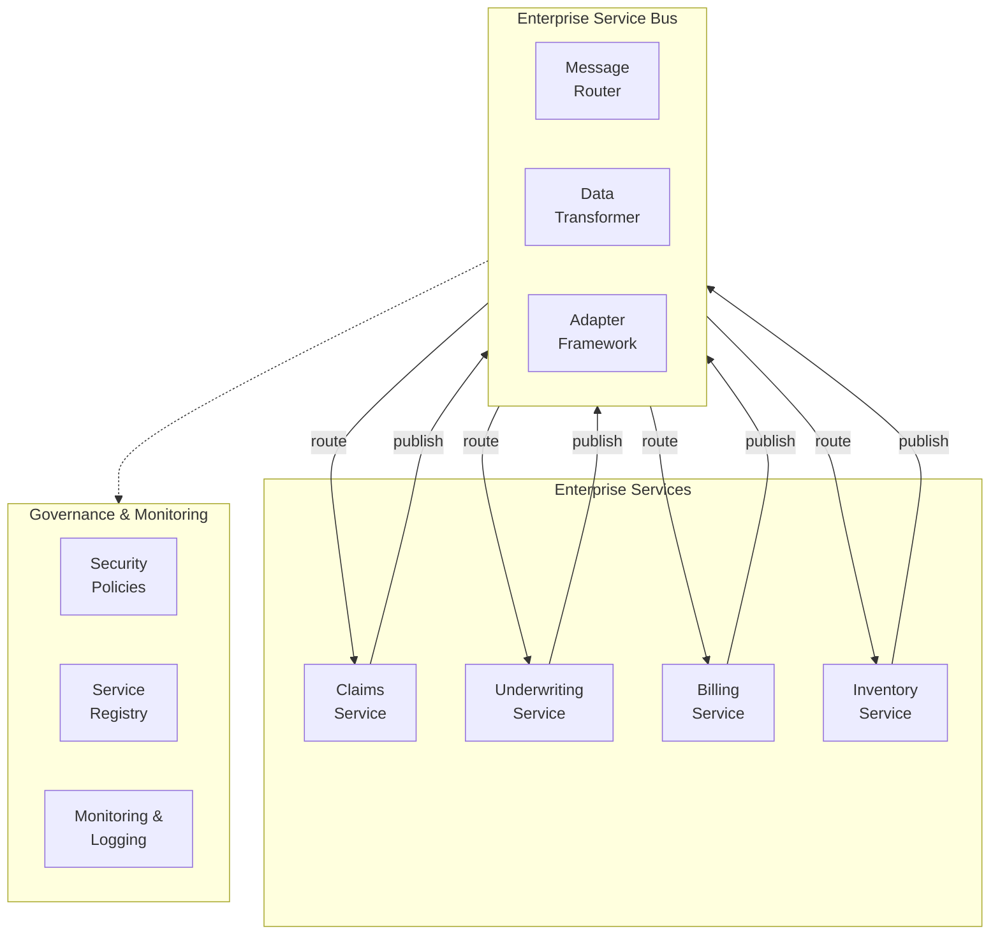

<Hero title="Service-Oriented Architecture (SOA)" subtitle="Coarse-grained services with shared data, governance, and orchestration" imageAlt="SOA architecture with ESB and shared services" size="large" />

## TL;DR

SOA (Service-Oriented Architecture) decomposes enterprise applications into coarse-grained services (often teams/departments map 1:1) with a central Enterprise Service Bus (ESB) for communication and governance. Popular in large enterprises before microservices. Offers reusability and governance but introduces ESB bottleneck, complexity, and slower evolution compared to microservices.

## Learning Objectives

- Understand SOA vs microservices (coarse-grained vs fine-grained services)
- Design enterprise services and service interfaces
- Implement ESB patterns and governance
- Recognize SOA antipatterns (ESB as workflow engine, shared data store)
- Know when SOA makes sense vs microservices

## Motivating Scenario

A large insurance company has three business units: Claims, Underwriting, Billing. Each is a separate department with their own systems. SOA wraps each as a "service" (ClaimsService, UnderwritingService, BillingService) with a common ESB handling message routing, transformation, and governance policies. New business processes (e.g., "fast-track claim approval") orchestrate services through the ESB.

## Core Concepts

SOA organizes an enterprise into **coarse-grained services** managed through an **Enterprise Service Bus**:

**Service**: A coarse-grained business capability (Claims, Payments, Inventory). Often department-sized. Exposes a WSDL or similar interface.

**ESB**: Central hub for service-to-service communication, message transformation, routing, monitoring, and policy enforcement.

**Governance**: Centralized rules for service versioning, security, compliance, deployment.

<Figure caption="SOA architecture with Enterprise Service Bus">

</Figure>

### Key Characteristics

**Coarse-Grained Services**: Typically align with business departments or business capabilities.

**Shared Governance**: Central policies, security, monitoring, versioning rules.

**Synchronous or Asynchronous**: Can use messaging queues or direct calls through ESB.

**Service Contract**: WSDL, OpenAPI, or proprietary interface definitions.

**Orchestration**: Central workflows coordinate multiple services (through ESB or separate orchestration engine).

## Practical Example

```xml
<!-- Claims Service WSDL Interface -->
<definitions xmlns="http://schemas.xmlsoap.org/wsdl/">
  <service name="ClaimsService">
    <port name="ClaimsPort" binding="tns:ClaimsBinding">
      <soap:address location="http://claims.internal/soap"/>
    </port>
  </service>

  <portType name="ClaimsPortType">
    <operation name="createClaim">
      <input message="tns:CreateClaimRequest"/>
      <output message="tns:ClaimResponse"/>
    </operation>
    <operation name="getClaim">
      <input message="tns:GetClaimRequest"/>
      <output message="tns:ClaimResponse"/>
    </operation>
  </portType>
</definitions>
```

```xml
<!-- ESB Configuration: Route CreateClaim requests -->
<route>
  <from uri="direct:createClaim"/>
  <log message="Processing claim creation"/>

  <!-- Transform incoming request -->
  <to uri="bean:claimTransformer?method=transform"/>

  <!-- Call Claims Service -->
  <to uri="cxf:bean:claimsService"/>

  <!-- Transform response -->
  <to uri="bean:responseTransformer?method=transform"/>

  <!-- Log to audit trail (governance)-->
  <to uri="bean:auditLogger"/>
</route>
```

## When to Use / When Not to Use

<Vs highlight={[1]} items={[
{
    label: "Use SOA When:",
    points: [
      "Building enterprise-wide integration of large business units",
      "Organization structure mirrors service boundaries (claims dept, billing dept)",
      "Need centralized governance, security policies, audit trails",
      "Services are coarse-grained (months of work, not days)",
      "Reusing services across multiple business processes"
    ],
    highlightTone: "positive"
  },
{
    label: "Avoid SOA When:",
    points: [
      "Building a new greenfield system with small team",
      "Services need independent scaling (microservices better)",
      "Need faster iteration and deployment cycles",
      "ESB becomes a central bottleneck (common SOA problem)",
      "Organization doesn't have capability/maturity for governance"
    ],
    highlightTone: "warning"
  }
]} />

## Patterns and Pitfalls

<Showcase title="Patterns and Pitfalls" sections={[
  {
    label: "Pitfall: ESB as Workflow Engine",
    body: "Complex business logic moved into ESB routing rules. ESB becomes unmaintainable spaghetti. Keep ESB for routing and basic transformation only. Move business logic into services."
  },
  {
    label: "Pitfall: Shared Database",
    body: "Services share a central database to 'speed up' integration. Creates tight coupling. Each service owns its data. Use service APIs for cross-service queries, not direct DB access."
  },
  {
    label: "Pitfall: ESB Bottleneck",
    body: "All inter-service communication goes through ESB. Becomes performance and reliability bottleneck. Use direct service-to-service calls for latency-sensitive operations. ESB for async, non-critical flows."
  },
  {
    label: "Pattern: Service Registry",
    body: "Central registry (UDDI, Consul, Eureka) where services register themselves. Services register endpoints, versions, capabilities. ESB queries registry for routing."
  },
  {
    label: "Pattern: Protocol Bridges",
    body: "Services use different protocols (SOAP, REST, MQ). ESB translates between them. ESB adapters handle protocol transformation. Services remain protocol-agnostic."
  },
  {
    label: "Pattern: Governance Policies",
    body: "Centralized policies for security, versioning, SLAs enforced at ESB level. Define policy templates. Apply to all service calls. Monitor compliance."
  }
]} />

## Design Review Checklist

<Checklist items={[
  "Are services coarse-grained (months of work, not days)?",
  "Does service boundary align with organizational structure?",
  "Is the ESB used for routing/transformation, not business logic?",
  "Do services own their own data (no shared database)?",
  "Is the service registry maintained and accurate?",
  "Are governance policies clearly documented and enforced?",
  "Can services be deployed independently of the ESB?",
  "Is ESB performance monitored (latency, throughput)?",
  "Are service contracts (WSDL/OpenAPI) versioned?",
  "Can you trace a request through services and ESB for debugging?"
]} />

## SOA Evolution: From Enterprise Integration to Microservices

### Why Organizations Moved Away from SOA

**1. ESB Complexity**: ESB became a single point of failure and bottleneck
- Configuration-heavy (WSDL, transformations, routing rules)
- Performance degradation as message volume increased
- Complex debugging across multiple layers

**2. Governance Overhead**: Centralized governance slowed teams down
- Service versioning required complex compatibility management
- Deployment required coordinating across teams
- Change management process too heavy for rapid iteration

**3. Performance Cost**: Synchronous through ESB added latency
- Every request through ESB = additional latency
- Difficult to trace performance issues across layers
- Hard to optimize individual services independently

**Microservices Solution**:
- Decentralized, point-to-point communication (or lightweight service mesh)
- Each team owns deployment and versioning
- Async messaging for decoupling (Kafka instead of ESB)
- Independent scaling and optimization

### SOA Still Valid Use Cases

Despite the shift to microservices, SOA patterns remain valuable in specific scenarios:

**1. Legacy System Integration**
- Already have 10-20 enterprise systems (mainframe, ERP, CRM)
- ESB acts as integration hub
- Faster than refactoring legacy systems to microservices

**2. Regulated Industries**
- Financial, healthcare, insurance sectors require:
  - Centralized audit trails (ESB provides this)
  - Consistent security policies (ESB enforces at gateway)
  - Compliance documentation (easier with centralized governance)

**3. Large Organizations with Many Teams**
- 100+ teams needing coordination
- Service registry and governance prevent chaos
- ESB as organizational control point

**4. Complex Data Transformations**
- Systems exchange incompatible data formats
- ESB transformation layer reduces mapping complexity
- Alternative: data contracts with schema registry

## Advanced SOA Patterns

### Multi-Protocol Bridging

ESB translates between different protocols:

```xml
<!-- Service A: Old SOAP interface -->
<service name="InventoryService">
  <endpoint protocol="SOAP" url="soap://inventory.internal"/>
</service>

<!-- Service B: New REST interface -->
<service name="OrderService">
  <endpoint protocol="REST" url="rest://orders.internal"/>
</service>

<!-- ESB Bridge: Translates between them -->
<route>
  <from uri="direct:getInventory"/>
  <!-- Convert SOAP request to REST -->
  <to uri="http4://inventory.internal/api/items?method=POST"/>
  <!-- Convert REST response back to SOAP -->
  <to uri="bean:responseTransformer?method=toSOAP"/>
  <to uri="direct:returnSOAPResponse"/>
</route>
```

### Service Versioning Strategy

Managing multiple service versions without breaking clients:

```
Service: InventoryService
Versions: v1, v2, v3

v1: Basic inventory (legacy, deprecated)
v2: Inventory + stock forecasting (current)
v3: Inventory + ML-powered recommendations (beta)

ESB routes based on client preference:
- Legacy clients → v1 (backward compatible)
- New clients → v2 (standard)
- Partner clients → v3 (premium features)

Client explicitly specifies version:
POST /services/inventory/v2/items
```

### Dead Letter Queues for Resilience

Handle failed messages gracefully:

```xml
<route>
  <from uri="jms:orders"/>
  <onException>
    <exception>java.lang.Exception</exception>
    <redeliveryPolicy maximumRedeliveries="3" redeliveryDelay="5000"/>
    <to uri="jms:orders.deadletter"/>
  </onException>
  <to uri="bean:orderProcessor"/>
</route>

<!-- Later: Manual review and retry -->
<route>
  <from uri="jms:orders.deadletter"/>
  <!-- Notify admin -->
  <to uri="log:dead-letters"/>
  <!-- Allow manual retry -->
</route>
```

## Real-World Example: Insurance Claims Processing

**SOA Implementation** for an insurance company:

```
Services:
1. PolicyService (v2)
   - Manage policies, coverage, renewals
   - WSDL interface
   - Database: PolicyDB

2. ClaimsService (v3)
   - Create, evaluate, approve claims
   - WSDL interface
   - Database: ClaimsDB

3. PaymentService (v1)
   - Process payments, refunds
   - REST interface (newer)
   - Database: PaymentDB

4. NotificationService
   - Send email, SMS, letters
   - Asynchronous
   - No database

Business Process: Claim Approval Workflow
┌─────────────┐
│ Claim Filed │
└──────┬──────┘
       │
       ├─> ClaimsService.validateClaim()
       │
       ├─> PolicyService.verifyCoverage()
       │
       ├─> ClaimsService.evaluateRisk()
       │
       ├─> (if approved)
       │   └─> PaymentService.issuePayment()
       │
       └─> NotificationService.notifyClaimant()

ESB handles:
- Service discovery (where is ClaimsService running?)
- Protocol translation (SOAP vs REST)
- Request logging and audit trail
- Security policy enforcement
- Version routing (which version of ClaimsService?)
```

## Design Challenges and Solutions

### Challenge: Service Granularity

Too coarse → inflexible; too fine → too many services

**Solution**: Organize around business capabilities, not technical layers

```
Bad (technical layers):
- DatabaseAccessService
- ValidationService
- SecurityService

Good (business capabilities):
- CustomerService (manages customer data)
- OrderService (processes orders)
- PaymentService (handles payments)
```

### Challenge: Data Consistency Across Services

No shared database; how do you maintain consistency?

**Solution**: Sagas (orchestrated or choreographed)

```
Saga: Process Order Flow

1. Create order (OrderService)
2. Reserve inventory (InventoryService)
3. Process payment (PaymentService)
4. Ship order (ShippingService)

If any step fails:
- Compensate previous steps
- Example: Payment failed?
  → Release inventory reservation
  → Mark order as failed
```

## Self-Check

1. **What's the main difference between SOA and microservices?** SOA has coarse-grained services with centralized governance via ESB; microservices are fine-grained with decentralized governance and direct service-to-service communication.

2. **Why is a shared database an antipattern in SOA?** It couples services tightly; a schema change in one service breaks others. Services should communicate through APIs.

3. **When does ESB become a bottleneck?** When all inter-service communication is synchronous through ESB, or ESB contains complex business logic. Use async messaging and keep ESB thin.

4. **When should you still use SOA instead of microservices?** Large organizations with legacy system integration needs, regulated industries requiring centralized audit trails, or when managing many teams with complex inter-dependencies.

5. **How do you handle service versioning in SOA?** Use explicit version identifiers (v1, v2, v3) in endpoints; route clients to appropriate versions based on compatibility needs.

:::info
**One Takeaway**: SOA works for large enterprises with legacy systems that need integration. Modern microservices replaced SOA's complexity with simpler, decentralized governance. Use SOA when your organization is large, governance is critical, and services are truly coarse-grained. Consider hybrid approaches where microservices handle new development and SOA layers bridge legacy systems.

:::

## Next Steps

- **Microservices Architecture**: Evolution of SOA with finer granularity and decentralized governance
- **Message-Oriented Middleware**: RabbitMQ, Kafka as alternatives to ESB
- **API Gateway Pattern**: Modern replacement for some ESB functions
- **Service Mesh**: Kubernetes sidecars replacing ESB communication layer
- **Domain-Driven Design**: Better approach to designing service boundaries

## References

- Richards, M., & Ford, N. (2020). *Fundamentals of Software Architecture*. O'Reilly. ↗️
- Newman, S. (2015). *Building Microservices*. O'Reilly. ↗️
- Erl, T. (2004). *Service-Oriented Architecture: Concepts, Technology, and Design*. Prentice Hall. ↗️