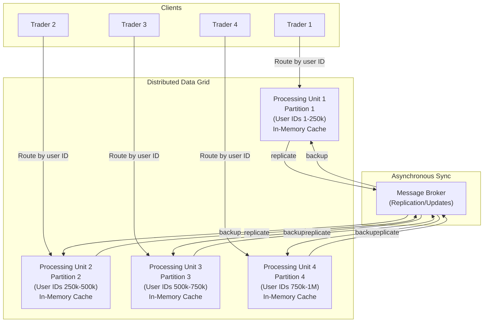

<Hero title="Space-Based Architecture" subtitle="Distributed in-memory data grids for ultra-high scalability and low latency" imageAlt="Space-based architecture with replicated in-memory partitions" size="large" />

## TL;DR

Space-Based Architecture uses a **distributed in-memory data grid** to store and replicate data across nodes with partitioning. Each processing unit has its own copy of data (or partition). Eliminates bottlenecks of central database. Achieves extreme throughput and low latency at cost of eventual consistency and operational complexity. Used for real-time trading, gaming, and systems requiring 100k+ transactions per second.

## Learning Objectives

- Understand distributed in-memory grids and data partitioning
- Design data partitioning (sharding) strategies
- Handle data replication and eventual consistency
- Implement processing units with local data caches
- Know when space-based is necessary vs overkill

## Motivating Scenario

You're building a stock trading platform where 1 million users place trades simultaneously. Each trade updates user balance, account history, and market data. A traditional database becomes a bottleneck; queries per second would overwhelm even the best database. Space-based solution: partition user accounts across nodes (Node A handles user IDs 1-100k, Node B handles 100k-200k, etc.). Each node caches its partition in memory. Trades are processed locally without database roundtrips. Data replicates asynchronously to backup nodes.

## Core Concepts

Space-Based (Tuple Space) eliminates the central database bottleneck through **distributed in-memory partitioning**:

**Processing Unit**: Service instance with embedded in-memory data grid (cache of its partition).

**Data Partitioning (Sharding)**: Data divided across processing units by key (user ID, product ID). Each unit owns its partition.

**Replication**: Data replicated to 1-2 backup nodes for resilience.

**Messaging**: Asynchronous messages propagate state changes (cache invalidation, consistency updates).

<Figure caption="Space-based architecture with partitioned in-memory data grid">

</Figure>

### Key Characteristics

**In-Memory Processing**: Data in RAM, not on disk. Eliminates I/O latency.

**Data Partitioning**: Data sharded across units. No single database bottleneck.

**Local Caching**: Processing unit caches its partition. Queries served from memory.

**Asynchronous Replication**: Data changes replicate to backup nodes asynchronously.

**Eventual Consistency**: Backups may be slightly behind primary.

**Resilience**: Node failure: backup becomes primary. Data not lost.

## Practical Example

```python
# Simplified in-memory grid example
class ProcessingUnit:
    """A processing unit in space-based architecture."""
    def __init__(self, unit_id: int, partition_start: int, partition_end: int):
        self.unit_id = unit_id
        self.partition_start = partition_start
        self.partition_end = partition_end
        self.data_cache = {}  # In-memory store
        self.replication_queue = []

    def owns_key(self, user_id: int) -> bool:
        """Check if this unit owns a key."""
        return self.partition_start <= user_id < self.partition_end

    def get_account(self, user_id: int) -> dict:
        """Read from cache (no database roundtrip)."""
        if not self.owns_key(user_id):
            raise ValueError(f"This unit doesn't own user {user_id}")
        return self.data_cache.get(user_id, {})

    def execute_trade(self, user_id: int, trade: dict) -> dict:
        """Process trade locally (atomic, in-memory)."""
        if not self.owns_key(user_id):
            raise ValueError(f"User {user_id} not in this partition")

        account = self.data_cache.get(user_id, {'balance': 0, 'trades': []})

        # Validate trade (in-memory, fast)
        if trade['amount'] > account['balance']:
            raise ValueError("Insufficient funds")

        # Update account (in-memory, fast)
        account['balance'] -= trade['amount']
        account['trades'].append(trade)
        self.data_cache[user_id] = account

        # Queue for asynchronous replication
        self.replication_queue.append({
            'type': 'update',
            'user_id': user_id,
            'data': account
        })

        return {'status': 'success', 'balance': account['balance']}

    def replicate(self) -> list:
        """Send queued updates to backup nodes."""
        updates = self.replication_queue.copy()
        self.replication_queue = []
        return updates

    def apply_replication(self, updates: list):
        """Receive updates from primary (backup node)."""
        for update in updates:
            if update['type'] == 'update':
                self.data_cache[update['user_id']] = update['data']

# Load balancer (router based on partition key)
class LoadBalancer:
    def __init__(self, processing_units: list):
        self.units = {u.unit_id: u for u in processing_units}

    def route_trade(self, user_id: int, trade: dict) -> dict:
        """Route trade to owning processing unit."""
        # Determine which unit owns this user ID
        for unit in self.units.values():
            if unit.owns_key(user_id):
                return unit.execute_trade(user_id, trade)
        raise ValueError(f"No unit owns user {user_id}")

# Example: 4 processing units, each owns 250k users
units = [
    ProcessingUnit(1, 0, 250_000),
    ProcessingUnit(2, 250_000, 500_000),
    ProcessingUnit(3, 500_000, 750_000),
    ProcessingUnit(4, 750_000, 1_000_000)
]

lb = LoadBalancer(units)

# User 100k trades on Unit 1 (owns 0-250k)
result = lb.route_trade(100_000, {'amount': 500, 'stock': 'AAPL'})
print(result)  # Immediate response from in-memory cache

# User 600k trades on Unit 3 (owns 500k-750k)
result = lb.route_trade(600_000, {'amount': 300, 'stock': 'GOOGL'})
print(result)  # Also immediate, from Unit 3's cache
```

## When to Use / When Not to Use

<Vs highlight={[1]} items={[
{
    label: "Use Space-Based When:",
    points: [
      "Need extreme throughput (100k+ ops/sec)",
      "Latency is critical (sub-millisecond responses)",
      "Data fits in memory across cluster",
      "Willing to accept eventual consistency",
      "Have expertise to manage distributed systems",
      "Real-time trading, gaming leaderboards, live analytics"
    ],
    highlightTone: "positive"
  },
{
    label: "Avoid Space-Based When:",
    points: [
      "Data is larger than available memory",
      "Need strict consistency (financial ledger)",
      "Query patterns don't benefit from partitioning",
      "Team lacks distributed systems expertise",
      "Operational complexity is a concern",
      "Standard microservices with database suffice"
    ],
    highlightTone: "warning"
  }
]} />

## Patterns and Pitfalls

<Showcase title="Patterns and Pitfalls" sections={[
  {
    label: "Pitfall: Data Exceeds Memory",
    body: "Partitions too large to fit in RAM. Requires spilling to disk, defeating purpose. Carefully size partitions. Monitor memory usage. Archive historical data."
  },
  {
    label: "Pitfall: Replication Lag",
    body: "Backup node receives update late. If primary fails before backup is updated, data is lost. Use synchronous replication for critical data. Accept potential latency vs data loss tradeoff."
  },
  {
    label: "Pitfall: Consistency Issues",
    body: "User reads from one unit, another processes their write. See inconsistent state. Route all operations for a user to same unit (sticky partition). Or accept eventual consistency."
  ,
    body: "User reads from one unit, another processes their write. See inconsistent state. Route all operations for a user to same unit (sticky partition). Or accept eventual consistency.",
    tone: "warning"
  },
  {
    label: "Pattern: Data Partitioning Strategy",
    body: "Consistent hashing or range-based partitioning. Key decision affecting performance. Hash user ID → unit mapping. Avoid hot partitions (some units busier than others)."
  },
  {
    label: "Pattern: Rebalancing",
    body: "Add/remove units dynamically. Data must repartition. Implement online rebalancing. Move partitions gradually to avoid downtime."
  }
]} />

## Design Review Checklist

<Checklist items={[
  "Is data small enough to fit in memory across all nodes?",
  "Is the partitioning strategy balanced (no hot spots)?",
  "Can you accept eventual consistency?",
  "Is the router (load balancer) routing correctly by partition key?",
  "Are replication updates asynchronous (for performance)?",
  "Can you recover from node failures?",
  "Is data replication monitored for lag?",
  "Can you rebalance/add nodes without downtime?",
  "Are you measuring actual throughput/latency needs (justify complexity)?",
  "Do developers understand eventual consistency implications?"
]} />

## Self-Check

1. **What's the main benefit of space-based?** Extreme throughput and low latency. No central database bottleneck. In-memory processing.
2. **What's the main tradeoff?** Eventual consistency, complexity, limited data size (must fit in memory). Operational overhead.
3. **When would you NOT use space-based?** Data larger than available memory, need strict consistency, or simpler microservices suffice.

:::info
**One Takeaway**: Space-based architecture is extreme medicine for extreme problems. Use it only when you've proven that microservices with databases can't meet your throughput/latency needs. Otherwise, simpler architectures are better.

:::

## Next Steps

- **Distributed Caching**: Redis, Memcached as simpler alternatives
- **Consistent Hashing**: Partitioning strategy for space-based grids
- **Event-Driven Replication**: How to propagate state changes
- **Failover & Recovery**: Backup node promotion strategies
- **Distributed Transaction Patterns**: Sagas, eventual consistency handling

## Performance Comparison

| Architecture | Latency | Throughput | Consistency | Complexity |
|--------------|---------|-----------|-------------|-----------|
| Traditional DB | 100ms (network + query) | 1000 ops/sec | Strong | Low |
| Distributed Cache | 10ms (in-memory) | 10k ops/sec | Eventual | Medium |
| Space-Based | 1ms (local memory) | 100k ops/sec | Eventual | Very High |

**When space-based pays off**:
- Financial trading (need 100k+ trades/sec)
- Gaming leaderboards (millions of concurrent players)
- Real-time analytics (process events instantly)

**When it's overkill**:
- Blog platform (1k requests/sec with databases is fine)
- Admin dashboard (no speed requirement)
- Batch processing (don't care about milliseconds)

## Advanced Rebalancing

### Online Rebalancing Without Downtime

```python
# Scenario: Add new node to reduce load on existing nodes

class RebalancingOrchestrator:
    def add_node(self, new_node_id, partition_range_start, partition_range_end):
        """
        Add new node and rebalance partitions online.
        Key: move data gradually, don't cut users off.
        """
        # Phase 1: New node joins as replica
        new_node = self.create_node(new_node_id)
        new_node.become_replica()

        # Phase 2: Sync data from primary to new node
        source_node = self.find_node_owning_range(partition_range_start)
        self.replicate_partition_async(source_node, new_node, partition_range_start, partition_range_end)

        # Phase 3: New node becomes primary, old node becomes replica
        new_node.become_primary()
        source_node.become_replica()

        # Phase 4: Verify all reads use new primary, no writes to old
        # Take time (can be hours), no downtime

        # Phase 5: Remove old replica
        source_node.disconnect()

# Load balancer routes traffic
def route_request(user_id):
    partition = user_id % num_partitions
    primary = find_primary_for_partition(partition)
    return primary.process(request)

# If primary fails during rebalancing, replica takes over
```

## References

- Richards, M., & Ford, N. (2020). *Fundamentals of Software Architecture*. O'Reilly. ↗️
- Nygard, M. (2007). *Release It!* Pragmatic Bookshelf. ↗️
- Hazelcast and Apache Ignite documentation for in-memory grids ↗️
- Real-time trading infrastructure case studies ↗️