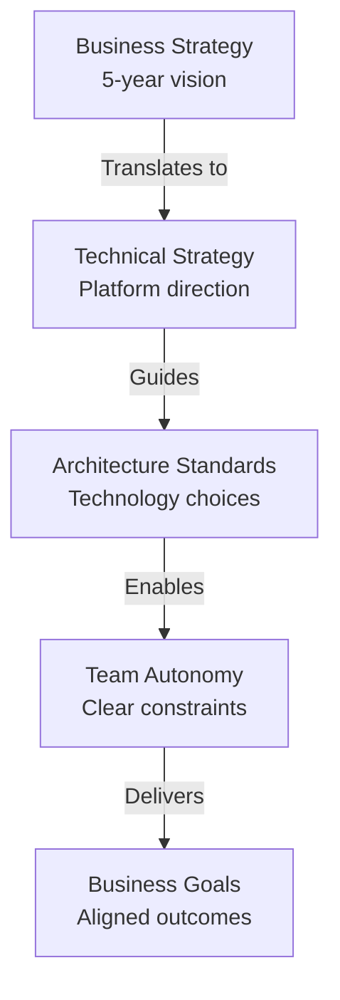

<Hero title="Enterprise Architect" subtitle="Define strategic direction, establish standards, and ensure architectural coherence across the entire organization." imageAlt="Enterprise architecture illustration" size="large" />

## TL;DR

The Enterprise Architect is the keeper of organizational-scale architectural vision. They establish standards, approve high-impact decisions, mentor solution architects, and ensure all business units align with technical direction and strategy. They operate at the intersection of business goals, risk management, and technical coherence, making them critical to long-term organizational success.

## Learning Objectives

- Understand the strategic responsibilities of an Enterprise Architect
- Learn how to balance autonomy and alignment across teams
- Master governance mechanisms that scale without creating bottlenecks
- Develop skills in mentoring solution architects and technical leaders
- Establish clear decision authorities and escalation paths

## Motivating Scenario

Your organization is growing rapidly, with ten teams building different services. Two teams independently decide to use conflicting technology stacks for similar workloads. One team chooses a cutting-edge NoSQL database; another picks a traditional relational database for nearly identical use cases. Six months later, operational costs soar, knowledge transfer becomes painful, and maintenance requires specialists in five different technologies. An engaged Enterprise Architect would have caught this misalignment early and worked with teams to establish a coherent platform vision.

## Core Concepts

### Strategic Direction & Vision

Enterprise Architects translate business strategy into technical direction. This means understanding market pressures, competitive advantages, and multi-year roadmaps—then articulating how technology choices enable or constrain that vision.



### Standards vs. Autonomy

The hardest balance in enterprise architecture is giving teams freedom while maintaining coherence. Standards should clarify boundaries, reduce decisions, and protect against costly mistakes—not stifle innovation.

<Admonition type="tip">
Use "standards with escape hatches." Allow teams to deviate from approved technologies, languages, or databases only with documented business justification and architectural review. This keeps coherence while respecting context.
</Admonition>

### Decision Authority & Escalation

Enterprise Architects don't make all decisions, but they define which decisions matter at scale and who decides. Establish clear thresholds: decisions affecting five teams or costing over $100k in annual infrastructure move to architectural review.

### Governance Without Bureaucracy

Heavy governance kills velocity. Effective enterprise architects use lightweight, asynchronous mechanisms: short ADRs, quarterly alignment meetings, and clear decision templates rather than waterfall-style approval gates.

## Practical Example

<Tabs>
<TabItem value="process" label="Decision Authority Framework">

```yaml
# Enterprise Architect Decision Authority Matrix

Technology Choices:
  - Language Selection (new services):
      Authority: Enterprise Architect + Tech Lead consensus
      Threshold: Affects >1 team or adds new runtime
      Timeline: 1 week review
      Escape: Documented exception with quarterly review

  - Database Selection:
      Authority: Enterprise Architect + Data Architect
      Threshold: New database engine or production-scale data store
      Timeline: 2 weeks evaluation
      Escape: Requires performance justification + ops sign-off

  - Infrastructure/Deployment:
      Authority: Enterprise Architect + Ops Lead
      Threshold: New service topology, protocol, or deployment model
      Timeline: 1 week (or less if urgent)
      Escape: Ephemeral use cases OK; permanent must align

Standards Compliance:
  - Logging, Metrics, Tracing:
      Authority: Observability Lead (delegated from Enterprise Architect)
      Threshold: All production services
      Timeline: Integration required before deploy
      Escape: None—non-negotiable for operations

  - API Design, Data Contracts:
      Authority: Architecture Review Board (quarterly)
      Threshold: External APIs, schema breaking changes
      Timeline: 2 weeks
      Escape: Service-internal contracts are team-owned

Cross-Team Alignment:
  - Shared Libraries, SDKs:
      Authority: Tech Lead consensus + Enterprise Architect veto
      Threshold: Affects >3 teams or central infrastructure
      Timeline: 2 weeks evaluation
      Escape: Teams may fork with documented plan to reunify

Architectural Exceptions:
  - Waiver Authority:
      Authority: Enterprise Architect + affected team lead
      Duration: 3–6 months (then reassess)
      Examples: Urgent migration, new technology evaluation
```

</TabItem>
<TabItem value="standards" label="Technology Standards Artifact">

```markdown
# Technology Standards - Q1 2025

## Approved Platform Choices

### Languages & Runtimes
- **Backend API Services:** Go, Node.js 18+, or Python 3.11+
  - Rationale: Operational maturity, recruiting ease, community libraries
  - New services default to Go for latency-sensitive paths
  - Exceptions: Data science (Python), rapid prototyping (Node)

- **Frontend:** TypeScript + React 18+
  - One language across web and mobile reduces cognitive load
  - Legacy: AngularJS only for maintenance; no new projects

### Databases
- **Primary Transactional:** PostgreSQL 14+
  - ACID guarantees, mature ecosystem, proven at scale
  - All new services assume PostgreSQL unless justified

- **In-Memory Cache:** Redis (Cluster mode for HA)
  - Session storage, feature flags, hot data

- **Document Store:** MongoDB 6.0+ (approved for specific use cases only)
  - Requires Enterprise Architect approval
  - Rationale: Adds operational complexity; limit to flexible schema workloads

- **Event Streaming:** Kafka 3.x
  - All async communication and event sourcing use Kafka
  - Guaranteed ordering, replay, and offset management required for data integrity

### Infrastructure & Deployment
- **Container Orchestration:** Kubernetes (EKS managed service)
  - No standalone Docker Swarm or Nomad
  - All stateless services must be container-native

- **Infrastructure as Code:** Terraform (HCL)
  - CloudFormation used only for AWS-specific resources
  - Git-driven; no console changes permitted

## Variance & Exceptions

| Technology | Status | Approval Path |
|-----------|--------|---|
| TypeScript | Approved | Auto-approved for web/mobile |
| Rust | Approved (Experimental) | Enterprise Architect review (performance-critical systems) |
| Java | Approved (Maintenance) | No new services; legacy support only |
| GraphQL | Under Review | Team trial; consolidation Q2 2025 |
| DynamoDB | Rejected | Requires waiver + cost justification |
```

</TabItem>
<TabItem value="governance" label="Governance Cadence">

```
# Enterprise Architect Governance Calendar

## Weekly
- **Office Hours (30 min):** Async Slack channel for quick questions
- **Escalation Triage (15 min):** Review incoming exceptions/waivers

## Bi-Weekly
- **Design Review Sync (1 hour):**
  - Review ADRs from past 2 weeks
  - Discuss emerging patterns and anti-patterns
  - Mentor solution architects

## Monthly
- **Tech Radar Session (2 hours):**
  - Assess new technologies (Adopt / Trial / Assess / Hold)
  - Update standards and rationale
  - Plan deprecation timelines

## Quarterly
- **Architecture Review Board (3 hours):**
  - Major decisions across all business units
  - Cross-team dependency planning
  - Roadmap alignment
  - Exception and waiver review

## Bi-Annual
- **Strategy Planning (full day):**
  - Business strategy input from executive sponsors
  - Technical direction for next 12 months
  - Risk and compliance landscape
  - Team hiring and capability building
```

</TabItem>
</Tabs>

## Core Responsibilities

### 1. **Establish Architectural Vision & Standards**
- Define a coherent technology platform across the organization
- Publish standards with clear rationales
- Create escape hatches for justified exceptions
- Evolve standards quarterly based on team feedback and market changes

### 2. **Mentor Solution & System Architects**
- Review architectural decisions and ADRs
- Guide teams on applying principles and patterns
- Escalate decisions that need enterprise-level perspective
- Share best practices and lessons learned

### 3. **Governance & Decision Authority**
- Define which decisions require architectural review
- Establish clear decision timelines and approval authorities
- Conduct design reviews for high-impact decisions
- Manage exceptions and waivers with time-boxed reviews

### 4. **Cross-Team Alignment**
- Identify and resolve architectural misalignments
- Facilitate shared library and SDK development
- Coordinate infrastructure and platform investments
- Manage dependencies between teams

### 5. **Risk & Compliance Management**
- Ensure architectural choices support compliance objectives
- Assess technology risk (support, security, licensing)
- Plan technology deprecations and sunsetting
- Guide security and data residency decisions

## Characteristics of Effective Enterprise Architects

✓ **Strategic thinking:** Understand business drivers and translate them to architecture
✓ **Technical depth:** Hands-on experience with production systems and their trade-offs
✓ **Mentorship:** Invest in developing other architects and technical leaders
✓ **Systems thinking:** See connections across teams, technologies, and data flows
✓ **Pragmatism:** Balance principles with delivery realities and team autonomy
✓ **Communication:** Explain technical rationale to both engineers and business stakeholders

## Pitfalls to Avoid

❌ **Ivory tower syndrome:** Making decisions divorced from team reality
❌ **Over-standardization:** Crushing innovation with rigid technology mandates
❌ **Decision bottleneck:** Slow approval processes that block team progress
❌ **Technical conservatism:** Refusing to evolve standards with market and team maturity
❌ **Siloed governance:** Decisions made without consulting solution architects or teams

## Versus Other Roles

| Role | Focus | Scope | Authority |
|------|-------|-------|-----------|
| **Enterprise Architect** | Strategic direction, organizational coherence | Org-wide | Sets standards and approval authority |
| **Solution Architect** | Specific solution or system | Single system/domain | Recommends; E.A. can veto |
| **System Architect** | System boundaries and quality attributes | Single system | Owns design within constraints |
| **Tech Lead** | Team-level decisions and technical execution | Single team | Owns day-to-day technical choices |

## Checklist: Enterprise Architect Readiness

- [ ] Articulate organizational technical vision (3–5 years) in writing
- [ ] Publish technology standards with clear approval criteria for exceptions
- [ ] Establish a lightweight governance cadence (no more than 4 hours per week)
- [ ] Create decision authority matrix for common architectural decisions
- [ ] Mentor at least two solution or system architects
- [ ] Review and approve at least 10 ADRs per quarter
- [ ] Conduct quarterly Tech Radar update and standards review
- [ ] Maintain relationships with peer Enterprise Architects at partner organizations

## Self-Check

1. **Can you articulate the organization's technical strategy in one page?** If not, clarify with business stakeholders.
2. **Do 80% of teams understand why your technology standards exist?** If not, improve communication.
3. **Are exceptions taking more than 10% of your time?** If yes, your standards are too rigid or unclear.
4. **Can a solution architect make their decision without waiting for you?** If no, decentralize authority more.

## Takeaway

The Enterprise Architect's true power is not in making all decisions but in creating clarity so teams can make good decisions autonomously. The best Enterprise Architects are strategic thinkers who mentor, not gatekeepers who bottleneck. Build trust by explaining your rationale, accept that teams know their context better than you do, and establish lightweight governance that scales with the organization's growth.

## Next Steps

1. **Define your organizational technical vision** (1–2 pages)
2. **Inventory current architectural decisions** and identify common patterns and misalignments
3. **Establish a governance cadence** with clear decision authorities
4. **Create a Technology Radar** and publish standards with escape hatches
5. **Schedule mentoring sessions** with your solution architects (monthly)

## References

1. <a href="https://www.infoq.com/articles/what-is-enterprise-architecture/" target="_blank" rel="nofollow noopener noreferrer">InfoQ: What is Enterprise Architecture? ↗️</a>
2. <a href="https://www.thoughtworks.com/radar" target="_blank" rel="nofollow noopener noreferrer">ThoughtWorks Technology Radar ↗️</a>
3. <a href="https://www.iso-architecture.org/42010/" target="_blank" rel="nofollow noopener noreferrer">ISO/IEC/IEEE 42010: Systems and Software Engineering Architecture Description ↗️</a>
4. <a href="https://martinfowler.com/articles/architecture-decision-records.html" target="_blank" rel="nofollow noopener noreferrer">Martin Fowler: Architecture Decision Records ↗️</a>
