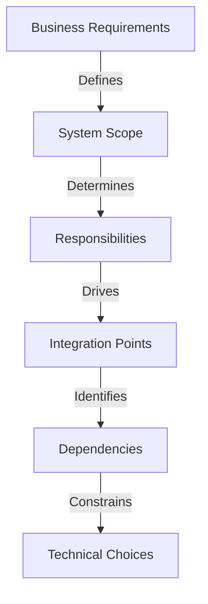

<Hero title="Solution & System Architect" subtitle="Design coherent systems within organizational constraints, balancing business goals with technical feasibility." imageAlt="System architect illustration" size="large" />

## TL;DR

The Solution (or System) Architect translates business requirements into technical designs, making critical decisions about system boundaries, quality attributes, and technology choices within enterprise guidelines. They own the coherence and long-term viability of their system, ensuring it serves business needs while remaining maintainable and operationally sound.

## Learning Objectives

- Understand the scope and responsibilities of a Solution or System Architect
- Learn how to balance business requirements with technical constraints
- Master techniques for designing system boundaries and quality attributes
- Develop skills in communicating architectural decisions to stakeholders
- Apply escalation criteria to know when to involve Enterprise Architects

## Motivating Scenario

You're asked to design a new payment processing system that must handle peak loads of 100,000 transactions per second, integrate with legacy systems, comply with PCI-DSS regulations, and be deployed within six months. The business wants it built cheaply; operations wants it simple to run; security wants it impenetrable. You must balance these competing demands, respect organizational technology standards, and create a design that teams can actually implement and operate successfully.

## Core Concepts

### System Boundaries and Ownership

A system architect defines what belongs inside their system and what stays outside. Clear boundaries make responsibilities obvious, enable independent deployment, and constrain blast radius of failures.



### Quality Attributes & Trade-offs

Every design decision involves trade-offs. Fast systems are often complex. Secure systems require overhead. Scalable systems are expensive. A good system architect makes these trade-offs explicit, quantifies them, and ensures stakeholders understand the implications.

<Admonition type="tip">
Use quality attribute scenarios to make abstract requirements concrete: "The system must handle a 10x load spike in 5 minutes without service degradation." This is testable and measurable, unlike vague requirements like "it must scale."
</Admonition>

### Technology Selection Within Constraints

Enterprise architects set technology standards; solution architects choose within those boundaries. Choices must align with organizational standards unless documented exceptions exist. Even within constraints, many decisions remain: which database, which framework, which deployment model.

### Stakeholder Communication

System architects bridge technical and business worlds. You must explain why a decision matters to both engineers (who care about implementation) and business leaders (who care about time and cost). Documentation like ADRs helps, but direct communication is essential.

## Practical Example

<Tabs>
<TabItem value="design" label="System Design">

```yaml
# Payment Processing System - Architecture Overview

System Purpose:
  Process customer payments safely and reliably, with fraud detection
  and compliance with PCI-DSS standards

System Boundaries:
  INSIDE:
    - Payment processing and routing
    - Fraud detection and risk scoring
    - Transaction logging and audit
    - Regulatory compliance (PCI-DSS)

  OUTSIDE (via integration):
    - Customer authentication (Auth system)
    - Card data storage (PCI-compliant vault)
    - Settlement (Bank integration)
    - Analytics (Data warehouse)

Key Quality Attributes:
  - Availability: 99.99% uptime (max 52 minutes per year downtime)
  - Latency: P99 < 200ms for transaction processing
  - Security: PCI-DSS compliant; no cardholder data in logs
  - Auditability: All transactions logged with audit trail
  - Scalability: Handle 100k transactions/second peak

Technology Choices (with rationale):
  - Language: Go (low-latency, built-in concurrency)
  - Database: PostgreSQL for transactions, Redis for caching
  - Message Queue: Kafka for audit logging and fraud analysis
  - Deployment: Kubernetes with auto-scaling
  - Monitoring: Prometheus + ELK for logs and metrics

Design Decisions:
  - Synchronous processing for initial validation (fast, consistent)
  - Asynchronous fraud analysis (can be delayed without user impact)
  - Multi-region deployment (high availability, regulatory spread)
  - Encrypted communication with all integrations
  - Circuit breakers for external dependencies
```

</TabItem>
<TabItem value="adr" label="Architecture Decision Record">

```markdown
# ADR: Asynchronous Fraud Detection Pipeline

## Decision
We will process fraud detection asynchronously after the transaction completes,
rather than synchronously during authorization.

## Context
- Current design forces fraud scoring to complete before returning to customer
- Complex scoring logic can add 500ms to authorization latency
- Customers experience slower checkout, impacting conversion
- Batch fraud analysis can catch sophisticated patterns better than real-time

## Rationale
- Synchronous fraud checks are slow and frustrate customers
- Asynchronous allows more sophisticated analysis (pattern matching, AI models)
- For most transactions, risk is caught and addressed after completion
- High-value transactions can still use synchronous checks if needed

## Consequences
- **Positive:** 200ms faster authorization, better fraud detection
- **Negative:** Brief window where fraudulent transaction succeeds
  - Mitigated by: same-day transaction reversal, customer support
  - Impact: &lt;0.1% of transactions, caught within 24 hours
- **Risk:** Customers discover fraud before we do
  - Mitigated by: monitoring dashboards, alerts, proactive outreach

## Alternatives Considered
1. **Real-time ML scoring:** Too slow, adds 500ms latency
2. **Delay authorization by 1 second:** Better detection, hurts UX
3. **Two-tier approach:** Sync checks for obvious fraud, async for nuance
   - Selected approach is variation of this

## Implementation
- Transaction marked "pending review" while fraud analysis runs
- Customer notified of provisional authorization
- Asynchronous job completes within 5 minutes
- Automatic reversal if fraud detected
- Manual review for high-risk cases
```

</TabItem>
<TabItem value="review" label="Design Review Checklist">

```
# System Architecture Review Checklist

## Business Alignment
- [ ] Requirements clearly understood and documented
- [ ] Success criteria and acceptance tests defined
- [ ] Constraints (budget, timeline, compliance) understood
- [ ] Stakeholder expectations aligned

## Technical Design
- [ ] System boundaries clearly defined
- [ ] Quality attributes explicit and testable
- [ ] Key design decisions documented in ADRs
- [ ] Technology choices justified and within standards
- [ ] Security architecture reviewed by security team
- [ ] Scalability plan documented

## Risk & Operations
- [ ] Failure modes identified
- [ ] High-availability strategy defined
- [ ] Monitoring and alerting strategy planned
- [ ] Incident response procedures drafted
- [ ] Deployment and rollback strategy clear
- [ ] Runbooks for common operational tasks

## Dependencies & Constraints
- [ ] External integrations clearly defined
- [ ] SLAs with dependencies understood
- [ ] Fallback strategies for failed dependencies
- [ ] Organizational standards compliance verified
- [ ] Exceptions and waivers obtained if needed

## Feasibility
- [ ] Team has required skills or training plan
- [ ] Timeline realistic with team capacity
- [ ] Build vs. buy analysis completed
- [ ] Cost estimates within budget
```

</TabItem>
</Tabs>

## Core Responsibilities

### 1. **Translate Requirements to Design**
- Gather and clarify business and stakeholder requirements
- Define system boundaries and integration points
- Document key design decisions through ADRs

### 2. **Define Quality Attributes**
- Identify and quantify quality requirements (performance, security, availability)
- Make trade-offs explicit and communicate them
- Create testable acceptance criteria

### 3. **Technology & Framework Selection**
- Choose technologies within organizational standards
- Evaluate build vs. buy decisions
- Document rationale for choices

### 4. **Design for Operability**
- Plan monitoring, alerting, and observability
- Design for safe rollout and rollback
- Prepare for failure scenarios

### 5. **Stakeholder Communication**
- Explain decisions to technical and non-technical audiences
- Gather feedback and iterate
- Manage expectations around trade-offs

## Characteristics of Effective System Architects

✓ **Systems thinking:** See connections between components and understand emergent behaviors
✓ **Business acumen:** Understand business drivers and translate them to technical requirements
✓ **Technical depth:** Hands-on experience with distributed systems, databases, and deployment
✓ **Communication:** Explain complex ideas simply to diverse audiences
✓ **Pragmatism:** Balance ideals with delivery constraints (time, budget, team capacity)
✓ **Curiosity:** Stay current with technologies and patterns
✓ **Decisiveness:** Make decisions with incomplete information and move forward

## Pitfalls to Avoid

❌ **Premature optimization:** Designing for scale problems you don't have yet
❌ **Technology chasing:** Adopting shiny new tools instead of proven solutions
❌ **Over-engineering:** Creating complexity that the team can't maintain
❌ **Ignoring operations:** Beautiful designs that are nightmare to run
❌ **Siloed decisions:** Designing without consulting stakeholders
❌ **Analysis paralysis:** Endless design documents without implementation
❌ **Underestimating integration:** Assuming external dependencies work as advertised

## Versus Other Roles

| Role | Focus | Scope | Authority |
|------|-------|-------|-----------|
| **System Architect** | System design and boundaries | Single system | Owns design; E.A. can veto |
| **Enterprise Architect** | Org-wide coherence | All systems | Sets standards and policy |
| **Tech Lead** | Team execution and practices | Single team | Owns daily decisions |
| **DevOps/Platform** | Infrastructure and deployment | Shared platform | Provides tools and support |

## Checklist: System Architect Readiness

- [ ] Requirements clearly documented in writing
- [ ] System boundaries defined and agreed upon
- [ ] Quality attribute scenarios created for each major requirement
- [ ] Architecture Decision Record (ADR) for each major decision
- [ ] Technology choices justified and within organizational standards
- [ ] Operational strategy documented (monitoring, alerting, runbooks)
- [ ] Stakeholder review conducted and feedback incorporated
- [ ] Team understands the architecture and can implement it

## Self-Check

1. **Can you draw your system on a whiteboard and explain it to a new team member in 15 minutes?** If not, your architecture is too complex or poorly understood.
2. **Does your design make trade-offs explicit?** If you're claiming "we have everything," you're fooling yourself.
3. **Have you involved security, operations, and platform teams in design?** If not, expect surprises later.
4. **Can you explain why each technology choice was made?** If you chose it because "it's popular," reconsider.

## Takeaway

System architects succeed by staying grounded in both business reality and technical feasibility. The best designs balance multiple concerns—performance, security, cost, simplicity—without optimizing for just one. Your job is not to build the most impressive system but to build the right system within constraints, operate it reliably, and document it so your team can maintain and evolve it.

## Next Steps

1. **Gather requirements thoroughly:** Interview stakeholders, document constraints
2. **Define system boundaries:** What's in scope? What's external?
3. **Create quality attribute scenarios:** Make requirements testable
4. **Document key decisions:** ADR for each major choice
5. **Review with stakeholders:** Get feedback before implementation

## References

1. <a href="https://www.iso-architecture.org/42010/" target="_blank" rel="nofollow noopener noreferrer">ISO/IEC/IEEE 42010: Systems and Software Engineering Architecture Description ↗️</a>
2. <a href="https://martinfowler.com/articles/architecture-decision-records.html" target="_blank" rel="nofollow noopener noreferrer">Martin Fowler: Architecture Decision Records ↗️</a>
3. <a href="https://www.amazon.com/Software-Architecture-Practice-Len-Bass/dp/0136886094" target="_blank" rel="nofollow noopener noreferrer">Bass, Clements, Kazman: Software Architecture in Practice ↗️</a>
