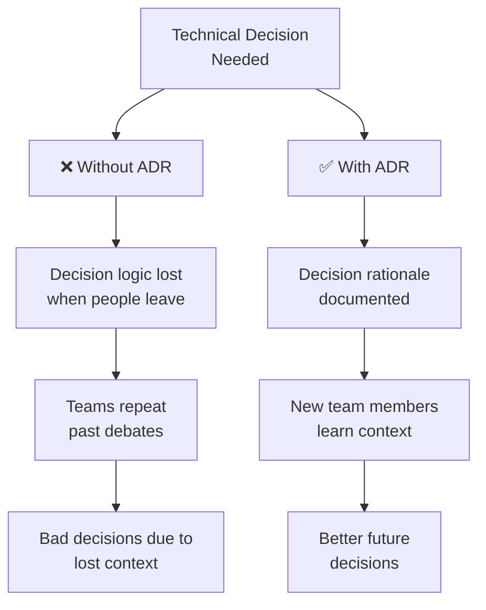

<Hero
  title="Architecture Decision Record (ADR) Template"
  subtitle="Document technical decisions with context, rationale, and consequences for future team members"
  imageAlt="Architecture decision documentation"
  size="large"
/>

## TL;DR

An Architecture Decision Record (ADR) captures a significant technical decision, its context, rationale, and consequences. ADRs create a searchable history of "why" decisions were made, preventing repeated discussions and enabling future architects to understand constraints and trade-offs. Store ADRs alongside code in version control.

## Learning Objectives

After using this template, you will be able to:

- Document technical decisions in a structured, reusable format
- Capture rationale that explains the "why" behind decisions
- Record consequences and trade-offs transparently
- Maintain a searchable decision history
- Enable future team members to understand architectural context

## Why Architecture Decision Records Matter



## ADR Template

### Header

```
ADR-0001: Use PostgreSQL for primary data store
Date: 2025-02-14
Status: Accepted
Authors: Jane Architect, John Engineer
Reviewers: Sarah Tech Lead, Mike Security
```

### 1. Status

<Checklist items={[
  "Proposed: Awaiting team review and decision",
  "Accepted: Decision approved and will be implemented",
  "Superseded: Decision has been overridden by a newer ADR (reference the new ADR)",
  "Deprecated: Decision is no longer relevant or applicable"
]} />

**Example**: "Status: Accepted (updated to Superseded by ADR-0045 on 2025-12-01)"

### 2. Context

Describe the issue or problem that motivated this decision. Include:

- What business or technical problem needs solving?
- What constraints or requirements exist?
- What is the current state?
- Why is this decision needed now?

**Example Context**:

"Our payment processing system currently uses SQLite for data persistence. We've experienced issues with concurrent transactions and data corruption under high load (500+ requests/second). The upcoming high-volume promotional campaign expects 10x traffic increases. SQLite documentation recommends switching to a production database for this scale. We need a solution within 6 weeks."

### 3. Decision

State the decision clearly and concisely. Use active voice.

**Format**: "We will [action] [because of reason]"

**Examples**:
- "We will use PostgreSQL 15 as our primary relational database"
- "We will adopt gRPC for inter-service communication instead of REST"
- "We will implement event sourcing for the order processing domain"

### 4. Rationale

Explain why this decision was made. Cover:

- Why this option over alternatives?
- How does it address the context and constraints?
- What trade-offs are we accepting?
- What evidence supports this choice?

**Example Rationale**:

"PostgreSQL was selected over alternatives for these reasons:

1. **Proven at Scale**: PostgreSQL has been deployed at companies processing millions of transactions daily (Uber, Instagram, Spotify). Well-documented performance at 10,000+ QPS.

2. **ACID Guarantees**: Strong transactional consistency requirements for payment data necessitate ACID compliance. PostgreSQL's ACID implementation is battle-tested.

3. **Cost**: Open source with no licensing costs compared to Oracle or SQL Server. Strong community support reduces proprietary vendor dependency.

4. **Team Expertise**: Our DBA team has 8+ years of PostgreSQL experience, reducing learning curve and support risk.

5. **Ecosystem**: Rich tool ecosystem (pgAdmin, pgBouncer, backup solutions) and abundant community resources.

Trade-offs accepted: PostgreSQL doesn't support graph queries natively (accepted—we'll use separate graph database if needed later). Vertical scaling has limits unlike some NoSQL options (acceptable given anticipated capacity is manageable with standard scaling strategies)."

### 5. Consequences

Detail both positive and negative outcomes of this decision.

**Positive Consequences:**
- Expected improvements and benefits
- Skills and tools available to team
- Long-term sustainability
- Risk reduction

**Negative Consequences:**
- Additional costs (licenses, infrastructure, learning)
- Migration effort required
- Limitations or constraints introduced
- Ongoing maintenance requirements

**Example Consequences**:

**Positive:**
- System can handle 10,000+ QPS with proper indexing and connection pooling
- ACID guarantees prevent data corruption issues in payment processing
- Team productivity increases with familiar tooling (team already expert in PostgreSQL)
- Strong community and documentation resources available
- Open source reduces licensing costs

**Negative:**
- Migration required: 3-4 weeks engineering effort to migrate data from SQLite
- Infrastructure costs increase: Need dedicated database server vs. embedded file-based system
- Learning curve for junior developers unfamiliar with PostgreSQL administration
- Operational complexity: Now requires backup strategy, replication setup, monitoring
- Connection pooling adds operational overhead to manage

### 6. Alternatives Considered

Present alternatives that were evaluated but not selected.

<Showcase title="Alternatives Example">

**Alternative 1: MySQL/MariaDB**
- Pros: Wide availability, good performance, similar ecosystem to PostgreSQL
- Cons: Less strict ACID implementation, InnoDB locking behavior less predictable, team has less expertise
- Decision: Rejected—PostgreSQL's stricter ACID guarantees better for payment system

**Alternative 2: MongoDB (NoSQL)**
- Pros: Horizontal scaling, flexible schema, document model fits order data
- Cons: Eventual consistency problematic for financial transactions, higher memory usage, team less familiar
- Decision: Rejected—ACID requirements for payments incompatible with eventual consistency

**Alternative 3: Amazon Aurora**
- Pros: Managed service reduces operational burden, automatic scaling
- Cons: AWS lock-in, higher costs at our scale, less visibility into database internals
- Decision: Rejected initially—revisit in future as business scales (ADR-0001-F1)

**Alternative 4: Keep SQLite, scale horizontally**
- Pros: No migration, simpler architecture
- Cons: SQLite not designed for high concurrency, data corruption risks remain
- Decision: Rejected—doesn't solve core problem

</Showcase>

### 7. Compliance & Safety Notes

Document relevant considerations:

<Checklist items={[
  "Regulatory requirements affected (GDPR, HIPAA, PCI-DSS, SOC2)",
  "Security implications of choice",
  "Data retention and privacy impact",
  "Audit trail requirements",
  "Disaster recovery and backup requirements",
  "Performance characteristics under various loads"
]} />

**Example Compliance Notes**:

- **PCI-DSS**: PostgreSQL with TLS encryption and access controls satisfies PCI-DSS requirements for payment data storage
- **Data Retention**: Must implement automated purging of payment card data after 13 months per PCI requirement
- **Audit Logging**: Enable PostgreSQL audit logging for compliance verification
- **Disaster Recovery**: Implement daily automated backups with restore testing (RPO: 24 hours, RTO: 4 hours)
- **Encryption at Rest**: Enable PostgreSQL encryption at rest for all payment data
- **Network Security**: Database only accessible from application layer via private network

### 8. Implementation Notes

Practical guidance for implementing this decision:

<Tabs>
  <TabItem value="timeline" label="Timeline">
    - Week 1-2: Environment setup, schema design, configuration
    - Week 2-3: Data migration from SQLite to PostgreSQL
    - Week 3-4: Testing, performance tuning, rollback procedures
    - Week 4: Deployment and monitoring setup
    - Week 5+: Observability improvements and optimization

  </TabItem>
  <TabItem value="dependencies" label="Dependencies">
    - PostgreSQL 15 server deployment (managed or self-hosted)
    - Connection pooling solution (pgBouncer or PgBag)
    - Backup infrastructure (pg_dump automation or WAL archiving)
    - Monitoring and alerting (Prometheus, Datadog, or equivalent)
    - Development environment setup for team

  </TabItem>
  <TabItem value="risks" label="Risks & Mitigation">
    - **Risk**: Data corruption during migration
      **Mitigation**: Test migration on staging environment first, full backup before production migration

    - **Risk**: Performance degradation if not properly tuned
      **Mitigation**: Load testing before deployment, DBA review of schema and indexes

    - **Risk**: Team operational burden
      **Mitigation**: Managed database service considered, runbooks documented, on-call training

  </TabItem>
</Tabs>

### 9. Related Decisions

<Checklist items={[
  "Cross-references to related ADRs",
  "Dependencies on other decisions",
  "Future decisions that depend on this one"
]} />

**Example**:
- Related to ADR-0003: "Implement event sourcing for order domain"
- Supersedes decision made in ADR-0001 (SQLite evaluation)
- Informs ADR-0008: "Implement database replication strategy"

## Common ADR Mistakes

<Showcase title="Mistakes to Avoid">

**Making ADR too long**: ADRs that exceed 2-3 pages often aren't read. Keep them concise and focused.

**Capturing decisions too late**: Document decisions when made, not months later. Fresh perspectives create better explanations.

**Not updating status**: Mark ADRs as Superseded when newer decisions override them. Prevents confusion about what's current.

**Focusing only on the "what"**: The real value is in the "why." Explain rationale, constraints, and trade-offs thoroughly.

**Treating ADR as decision justification**: ADRs document consensus decisions, not used to override existing decisions. Make decision first, document second.

**Ignoring consequences**: Good ADRs are realistic about downsides. Hiding negative consequences reduces trust in the documentation.

</Showcase>

## ADR Workflow

<Tabs>
  <TabItem value="creation" label="Creating an ADR">
    1. **Identify Decision**
       - What significant technical choice needs to be made?
       - Will this impact architecture for 6+ months?
       - Do multiple reasonable options exist?

    2. **Write Initial Draft**
       - Complete Context, Decision, Rationale sections
       - List alternatives considered
       - Document consequences (positive and negative)

    3. **Share with Team**
       - Present ADR in architecture review
       - Gather feedback from stakeholders
       - Update based on questions raised

    4. **Get Approval**
       - Team consensus on decision (not unanimous agreement required)
       - Clear ownership for implementation
       - Document approval date and decision-makers

  </TabItem>
  <TabItem value="review" label="Reviewing an ADR">
    Ask these questions:

    - Is the context clear and sufficient?
    - Is the rationale compelling and well-supported?
    - Are consequences realistic and honest?
    - Have reasonable alternatives been considered?
    - Will future readers understand why this choice was made?
    - Are there missing compliance or security considerations?

  </TabItem>
  <TabItem value="maintenance" label="Maintaining ADRs">
    - Update status when decision changes or is superseded
    - Link related ADRs together
    - Add implementation notes as details emerge
    - Reference from relevant code comments and documentation
    - Review ADRs quarterly to ensure accuracy

  </TabItem>
</Tabs>

## ADR Naming Convention

Store ADRs in version control with clear naming:

```
docs/adr/
├── adr-0001-postgresql-primary-datastore.md
├── adr-0002-grpc-inter-service-communication.md
├── adr-0003-event-sourcing-orders.md
└── adr-0004-kubernetes-orchestration.md
```

**Convention**: `adr-[sequential-number]-[kebab-case-title].md`

## Self-Check

Before finalizing your ADR, verify:

<Checklist items={[
  "Status is clearly stated",
  "Context explains the problem and constraints",
  "Decision is concise and actionable",
  "Rationale explains 'why' thoroughly",
  "Consequences include both positive and negative impacts",
  "Reasonable alternatives were considered",
  "Compliance and safety notes are complete",
  "Related decisions are linked",
  "Target audience could understand the decision from this ADR"
]} />

## One Takeaway

:::info
An ADR is not a record of perfection—it's a record of the best decision your team could make at a specific point in time with available information. Value comes from capturing the reasoning so future teams understand constraints and can make informed changes if circumstances warrant it.
:::

## Next Steps

1. **Start using ADRs** for all major technical decisions
2. **Create ADR-0000** documenting your ADR process and standards
3. **Archive ADRs** in your repository alongside documentation
4. **Link ADRs** from related code and documentation
5. **Review ADRs** when evaluating new decisions to avoid repeating past discussions

## References

- [Original ADR Format](https://adr.github.io/) <a href="https://adr.github.io/" target="_blank" rel="nofollow noopener noreferrer">↗️</a> by Michael Nygard
- [ADR GitHub Organization](https://github.com/adr) <a href="https://github.com/adr" target="_blank" rel="nofollow noopener noreferrer">↗️</a> - Collection of ADR tools and examples
- [Architecture Review Checklist](/docs/checklists-and-templates/architecture-review-checklist-qualities-risks-ops) - Document decisions through review process
- [Building Evolutionary Architectures](https://www.building-evolutionary-architectures.com/) <a href="https://www.building-evolutionary-architectures.com/" target="_blank" rel="nofollow noopener noreferrer">↗️</a> - Discusses architectural decision-making
