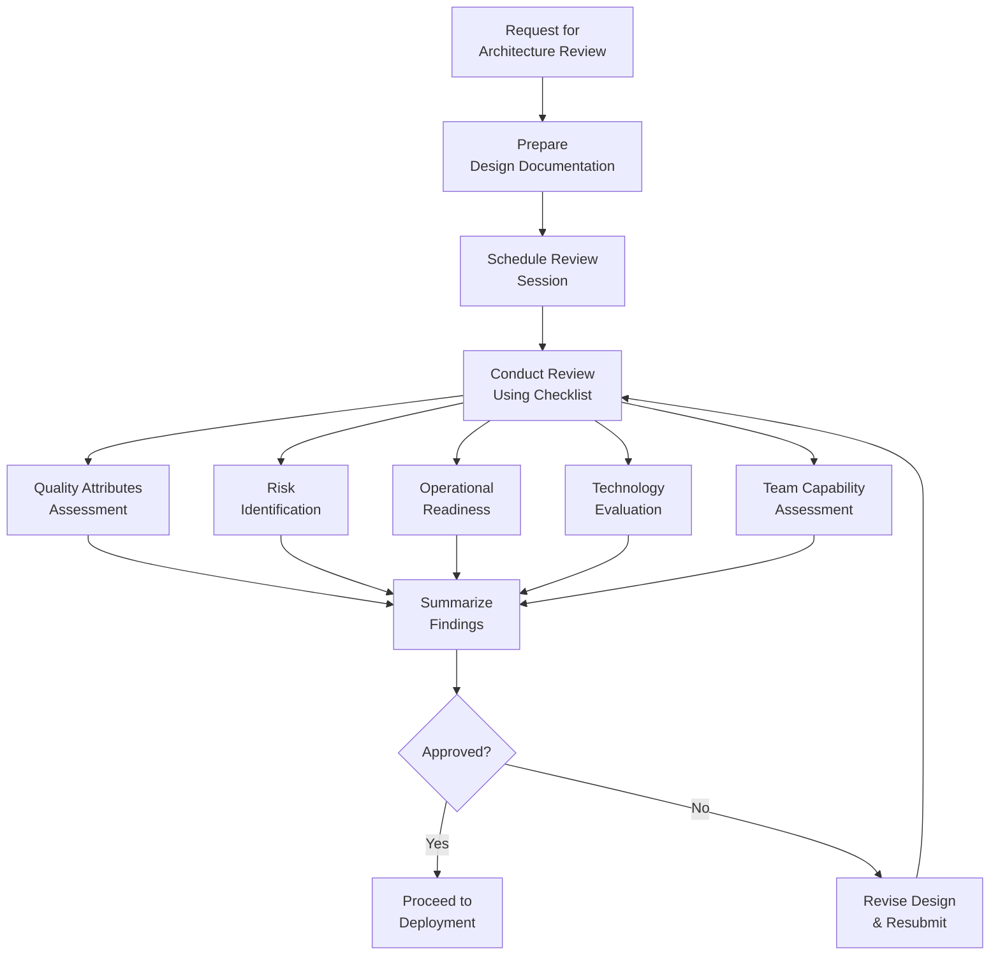

<Hero
  title="Architecture Review Checklist"
  subtitle="Systematic evaluation framework for technical design quality, risk profiles, and operational readiness"
  imageAlt="Architecture review covering design quality, risk assessment, and operations"
  size="large"
/>

## TL;DR

A comprehensive architecture review ensures systems are well-designed, resilient, and operationally sound. This checklist guides reviewers through quality attribute assessment, risk identification, operational readiness evaluation, and team capability evaluation. Use this before major deployments, during system migrations, or when evaluating new architectural patterns.

## Learning Objectives

After using this checklist, you will be able to:

- Evaluate architecture across multiple quality dimensions systematically
- Identify technical risks and dependencies early
- Assess operational readiness before production deployment
- Evaluate technology choices against requirements
- Assess team capability to support the design

## Architecture Review Process

## Review Checklist

### Quality Attributes Assessment

<Checklist items={[
  "Scalability",
  "Load distribution mechanism defined (load balancer, message queue, etc.)",
  "Database scaling approach identified (sharding, replication, caching)",
  "Maximum expected throughput calculated",
  "Scaling testing plan created",
  "Reliability",
  "Redundancy strategy for critical components documented",
  "Recovery time objective (RTO) and Recovery point objective (RPO) defined",
  "Backup and restore procedures tested",
  "Graceful degradation approach established",
  "Performance",
  "Throughput requirements quantified",
  "Caching strategy designed (application, database, CDN)",
  "Database query optimization approach planned",
  "Performance testing approach documented",
  "Maintainability",
  "Documentation strategy established",
  "Logging and observability approach defined",
  "Development workflow and branching strategy documented",
  "Code review process and standards defined",
  "Security",
  "Data encryption in transit and at rest configured",
  "Input validation and sanitization approach documented",
  "Security testing (penetration testing, vulnerability scanning) planned",
  "Secrets management strategy implemented",
  "Usability",
  "Error messages and codes are clear and actionable",
  "Integration with dependent systems is straightforward",
  "Developer experience considered (SDKs, client libraries)",
  "Documentation is complete and up-to-date"
]} />

### Risk Identification

<Checklist items={[
  "Technical Risks",
  "External dependencies mapped with failure scenarios",
  "Technology choices evaluated against maturity and community support",
  "Vendor lock-in risks assessed",
  "Legacy system integration challenges documented",
  "Operational Risks",
  "Data migration challenges identified",
  "Rollback procedures documented and tested",
  "Training and runbook requirements identified",
  "Capacity planning for peak load scenarios completed",
  "Security Risks",
  "Sensitive data exposure risks assessed",
  "Third-party dependency vulnerability scanning implemented",
  "Compliance requirements validated (GDPR, HIPAA, etc.)",
  "Data residency requirements met",
  "Organizational Risks",
  "Knowledge transfer plan created",
  "Team skill assessment completed",
  "Vendor dependency risks assessed",
  "Budget and timeline feasibility confirmed"
]} />

### Operational Readiness

<Checklist items={[
  "Monitoring & Alerting",
  "Alert thresholds defined for critical metrics",
  "Log aggregation strategy implemented",
  "Distributed tracing configured for microservices",
  "Dashboards created for operations team",
  "Health Checks & Self-Healing",
  "Liveness probe logic defined and tested",
  "Startup probe configured for slow-starting components",
  "Circuit breaker patterns implemented for external calls",
  "Auto-recovery mechanisms tested",
  "Incident Response",
  "Escalation procedures defined",
  "On-call rotation established",
  "Communication channels for incidents identified",
  "Postmortem process established",
  "Change Management",
  "Canary deployment strategy planned",
  "Blue-green deployment capability assessed",
  "Rollback procedures tested",
  "Change approval process defined"
]} />

### Technology Evaluation

<Checklist items={[
  "Framework & Language Selection",
  "Framework maturity and community support evaluated",
  "Version management strategy documented",
  "Long-term support (LTS) versions preferred",
  "Training and hiring implications assessed",
  "Data Storage",
  "Data consistency requirements addressed (ACID vs. eventual consistency)",
  "Backup and recovery strategy tested",
  "Data migration path identified",
  "Performance testing of data operations completed",
  "Infrastructure & Deployment",
  "Container orchestration strategy evaluated (Kubernetes vs. alternatives)",
  "Infrastructure-as-code approach adopted",
  "Environment parity (dev, staging, prod) ensured",
  "Cost estimation and optimization completed",
  "Integration & Compatibility",
  "API compatibility and versioning strategy documented",
  "Third-party library dependencies assessed",
  "Cross-platform compatibility verified",
  "Backward compatibility requirements identified"
]} />

### Team Capability Assessment

<Checklist items={[
  "Skills & Expertise",
  "Training needs identified",
  "Mentoring and knowledge sharing plan created",
  "Hiring requirements for missing skills determined",
  "External consulting needs assessed",
  "Team Structure",
  "Roles and responsibilities clearly defined",
  "Cross-functional collaboration ensured",
  "Decision-making authority documented",
  "Escalation paths established",
  "Process & Tooling",
  "Code quality assurance practices established",
  "Continuous integration/deployment pipeline designed",
  "Version control strategy documented",
  "Collaboration and communication tools selected",
  "Support & Sustainability",
  "Documentation and knowledge management plan created",
  "Technical debt tracking and management process established",
  "Architectural governance model defined",
  "Feedback mechanisms for continuous improvement established"
]} />

## Common Review Mistakes

<Showcase title="What NOT to Do During Architecture Reviews">

**Reviewing without documented requirements**: Skipping stakeholder requirements and SLAs leads to misaligned evaluations. Always start with written requirements.

**Focusing only on happy path**: Technical reviews must cover failure modes, edge cases, and error scenarios. Ask "what breaks this design?"

**Ignoring cost implications**: Architectural decisions have cost impacts. Cloud resources, licenses, and operational overhead must be evaluated.

**Skipping security from the beginning**: Security cannot be added late. Threat modeling must be part of initial architecture review, not an afterthought.

**Not validating team capability**: A brilliant architecture is worthless if the team cannot implement and maintain it. Be realistic about skill gaps.

**Overlooking operational aspects**: Designs that work in development but fail in production create expensive surprises. Operations and monitoring must be part of review.

</Showcase>

## Review Workflow

<Tabs>
  <TabItem value="preparation" label="Preparation Phase">
    Before the review session:

    1. **Request Complete Documentation**
       - Architecture diagrams (system, deployment, data flow)
       - Design decisions and rationale
       - Quality attribute requirements
       - Risk assessment and mitigation plans
       - Technology choices and alternatives considered

    2. **Assemble Review Panel**
       - Technical architect or tech lead
       - Operations/reliability engineer
       - Security representative
       - Project manager for timeline/budget context
       - Domain expert if specialized domain involved

    3. **Set Review Scope**
       - Define what is being reviewed (new system, refactor, migration)
       - Establish review criteria and decision authority
       - Allocate sufficient time (typically 4-8 hours for complex systems)

  </TabItem>
  <TabItem value="execution" label="Execution Phase">
    During the review session:

    1. **Context Setting** (15-30 min)
       - Presenter describes business requirements and constraints
       - Architectural overview and key decisions explained
       - Known risks and trade-offs presented

    2. **Systematic Evaluation** (2-3 hours)
       - Work through checklist section by section
       - Ask probing questions about design decisions
       - Identify gaps and risks
       - Document findings

    3. **Validation & Testing** (30-60 min)
       - Walk through critical user journeys
       - Discuss failure scenarios
       - Review proof-of-concept if available
       - Validate that team understands design

  </TabItem>
  <TabItem value="conclusion" label="Conclusion Phase">
    After the review session:

    1. **Summarize Findings**
       - Critical issues requiring remediation before approval
       - Major concerns for risk management planning
       - Recommendations for improvement
       - Items approved without concerns

    2. **Risk Mitigation Planning**
       - For each identified risk, define mitigation strategy
       - Assign ownership for risk tracking
       - Establish verification criteria

    3. **Document & Communicate**
       - Create architecture review report
       - Share findings with full team
       - Establish timeline for remediation
       - Schedule follow-up review if needed

  </TabItem>
</Tabs>

## Self-Check

Before concluding your review, verify:

- All quality attributes have been explicitly discussed and evaluated
- Top 5 risks have been identified and mitigation strategies defined
- Operational readiness has been confirmed (monitoring, alerting, runbooks)
- Technology selections are justified and team is capable of supporting them
- Team structure and skills are adequate for implementation and support
- Decision has been clearly documented (approved, conditional approval, or rejected)

## One Takeaway

:::info One Takeaway
Architecture reviews are not gates—they're checkpoints for alignment and risk management. The goal is not to find flaws but to ensure the team has thoughtfully addressed quality, risk, operations, and capability before investing heavily in implementation.

:::

## Next Steps

1. **Customize the checklist** for your organization's specific concerns and maturity level
2. **Establish review criteria** that clearly define what "approved" means
3. **Train reviewers** on asking good questions and evaluating trade-offs
4. **Create templates** for architecture review reports
5. **Build feedback loops** to continuously improve your review process

## References

- [Architecture Decision Records (ADRs)](/docs/checklists-and-templates/adr-template) for documenting individual decisions
- [Threat Model Template](/docs/checklists-and-templates/threat-model-template) for security evaluation
- [Production Readiness Checklist](/docs/checklists-and-templates/readiness-liveness-and-slo-checklist) for operational requirements
- [ISO/IEC 25010](https://iso.org/standard/35733.html) <a href="https://iso.org/standard/35733.html" target="_blank" rel="nofollow noopener noreferrer">↗️</a> - Software Quality Model
- [The Art of Software Architecture Design](https://www.michaelnygard.com/) <a href="https://www.michaelnygard.com/" target="_blank" rel="nofollow noopener noreferrer">↗️</a> - by Michael Nygard
