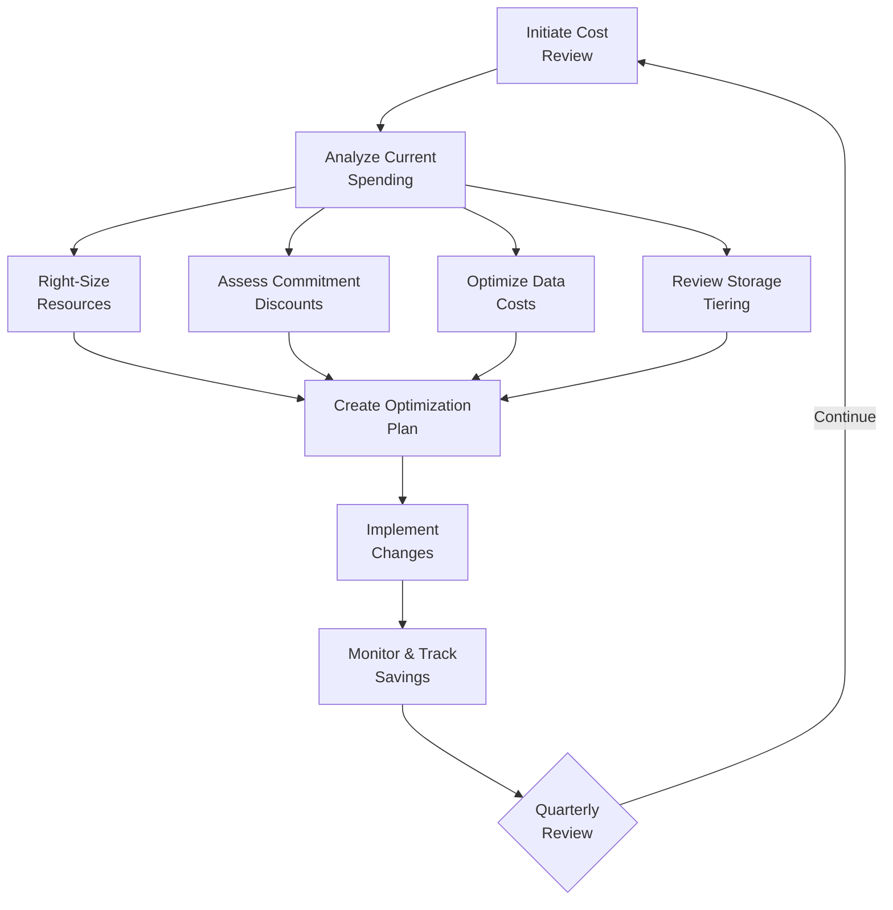

<Hero
  title="Cost Review & FinOps Checklist"
  subtitle="Cloud cost optimization strategy covering resource sizing, reserved capacity, spot instances, data costs, and budget controls"
  imageAlt="Cloud cost optimization"
  size="large"
/>

## TL;DR

Cloud costs grow quickly without discipline. FinOps is a shared responsibility between engineering and finance teams to optimize cloud spending. This checklist covers right-sizing resources, leveraging commitment discounts, using spot instances, managing data costs, and implementing budget controls.

## Learning Objectives

After using this checklist, you will be able to:

- Right-size cloud resources based on actual usage
- Implement commitment discounts (reserved instances) effectively
- Leverage spot instances for fault-tolerant workloads
- Optimize data transfer and storage costs
- Establish budget controls and cost alerts
- Create a culture of cost awareness

## Cost Optimization Process

## Resource Sizing & Optimization

### Current State Analysis

**Cost Data Collection**
- Cloud cost reports available (AWS Cost Explorer, GCP BigQuery, Azure Cost Management)
- Costs broken down by service, environment, team, project
- Cost trends analyzed over 3-6 month period
- Cost anomalies investigated and explained
- Accurate cost allocation applied (tagging, chargeback)

**Usage Analysis**
- Compute instances analyzed for utilization (CPU, memory)
- Storage analyzed for growth and churn rates
- Network bandwidth usage patterns understood
- Database workloads (on-demand vs. reserved vs. serverless) analyzed
- Unused resources identified (stopped instances, orphaned disks)

### Right-Sizing

**Compute Optimization**
- Instance types evaluated for actual workload needs
- Instances with &lt;30% CPU utilization identified for downsizing
- Instances with &gt;80% utilization identified for upsizing
- Serverless options evaluated (Lambda, Cloud Functions) vs. containers
- Right-sizing changes tested in non-production before production deployment

**Memory & Storage Optimization**
- Memory allocation matches actual peak usage (not pessimistic estimates)
- Disk overprovisioning identified and eliminated
- Database instance sizing reviewed and optimized
- Unused storage volumes and backups cleaned up

**Savings From Right-Sizing**
- Potential savings quantified and tracked
- Savings prioritized (highest impact first)
- Changes implemented incrementally with monitoring

## Commitment & Discount Programs

### Reserved Instances & Commitments

**Commitment Analysis**
- Current and 3-year cost forecasts prepared
- Workload stability assessed (can commit for 1-3 years?)
- Reserved instance utilization analyzed (are current commitments fully utilized?)
- Commitment expiration dates tracked and reviewed
- Cost savings from commitments calculated

**Commitment Strategy**
- Reserved instances purchased for 80%+ of stable, on-demand usage
- 1-year commitments for workloads with some growth uncertainty
- 3-year commitments for stable, mature workloads
- Commitment flexibility considered (upfront vs. partial upfront)
- Unused commitments reallocated or sold

**Savings Plan Programs**
- Compute Savings Plans evaluated (more flexible than RIs)
- Storage Savings Plans for predictable data storage costs
- Commitment-based discounts prioritized for largest spend categories

## Spot & Preemptible Instances

### Fault-Tolerant Workload Optimization

**Spot Instance Candidates**
- Batch jobs and data processing workloads identified
- Fault-tolerant services (can tolerate interruptions) identified
- Cost savings from spot instances calculated (typically 70-90% discount)
- Interruption impact on operations understood

**Spot Instance Implementation**
- Multi-instance types and availability zones used for resilience
- Graceful termination handling implemented
- Fallback to on-demand instances configured
- Spot price monitoring and alerting configured
- Cost tracking separates spot from on-demand spending

## Data Transfer & Network Costs

### Data Transfer Optimization

**Data Egress Analysis**
- Data egress costs identified and quantified
- Egress destinations mapped (internet, other regions, etc.)
- Unnecessary data movement eliminated
- CDN usage evaluated for public content
- Cross-region replication requirements justified

**Data Transfer Cost Reduction**
- Redundant cross-region transfers eliminated
- CloudFront (or equivalent) used for frequently accessed content
- Data caching strategies implemented to reduce transfer volume
- API pagination implemented to avoid unnecessary data transfer
- Compression enabled for data transfer (gzip, brotli)

### Network Optimization

**Private Network Usage**
- Services kept within same region when possible (no cross-region traffic)
- Private links/peering used instead of internet gateway
- NAT gateway costs understood and minimized
- VPC endpoints used for AWS services (no internet gateway)

**Bandwidth Reduction**
- Load balancer placement optimized
- Unnecessary traffic patterns identified and eliminated
- Data filtering at source reduces transfer volume

## Storage & Database Optimization

### Storage Tiering

**Storage Lifecycle Policies**
- Hot storage (frequently accessed) uses high-performance tiers
- Warm storage (occasional access) moves to standard tier after 30 days
- Cold storage (archive) moves to glacier/archive tier after 90 days
- Automatic lifecycle policies configured and enforced
- Savings from tiering quantified

**Storage Cleanup**
- Duplicate data identified and deduplicated
- Unused backups deleted (retention policies enforced)
- Unused snapshots cleaned up
- Empty S3 buckets and storage accounts removed
- Data compression evaluated for large datasets

### Database Optimization

**Database Workload Assessment**
- On-demand usage patterns analyzed
- Scheduled/batch workloads identified for provisioned capacity
- Serverless database options evaluated
- Read replicas justified and optimized

**Database Cost Reduction**
- Multi-AZ replication evaluated (necessary for high availability?)
- Index optimization reduces query costs
- Unused indexes and tables removed
- Query optimization reduces database load
- Connection pooling reduces connection overhead

## Budget Management & Controls

### Budget & Cost Alerts

**Budget Planning**
- Monthly, quarterly, and annual budgets established
- Budgets broken down by service, team, environment
- Historical spending trends used for forecasting
- Growth projections incorporated into budgets
- Contingency buffers included (typically 10-15%)

**Cost Alerts & Thresholds**
- Alerts configured at 50%, 75%, 90%, and 100% of budget
- Alert escalation paths defined (who is notified)
- Anomaly detection configured to catch unexpected cost spikes
- Cost tracking updated in real-time (not just monthly)
- Teams have visibility into their costs (cost allocation)

### Accountability & Ownership

**Cost Attribution**
- All resources tagged for cost center, project, environment
- Tagging compliance enforced through policy
- Cost reports available by team/project
- Cost responsibility assigned to specific individuals/teams

**Cost Governance**
- Cost optimization goals established and tracked
- Quarterly cost reviews conducted with stakeholders
- Approval required for high-cost resources
- Cost impact assessment required for architectural decisions
- Chargeback or showback model implemented

## Cost Optimization Best Practices

<Showcase title="FinOps Principles">

**Make Cost Visible**: Teams can't optimize what they can't see. Break down costs by service, team, and project so everyone understands their impact.

**Allocate Costs Accurately**: Accurate cost attribution drives accountability. Use comprehensive tagging and automation to ensure costs are properly assigned.

**Right-Size Ruthlessly**: Oversized instances waste money every month. Regularly review utilization and right-size to actual needs.

**Exploit Discounts Strategically**: Commit discounts (RIs, Savings Plans) offer substantial savings but require forecasting. Combine commitments with on-demand and spot for flexibility.

**Automate Cost Optimization**: Manually managing resources is expensive. Use auto-scaling, lifecycle policies, and cleanup automation.

**Culture Over Tools**: Spreadsheets don't reduce costs—culture does. Build a culture where engineers understand and care about costs.

</Showcase>

## Common FinOps Mistakes

<Showcase title="Mistakes to Avoid">

**Buying commitments without analysis**: 3-year commitments on unstable workloads lock in waste. Analyze workload stability first.

**Forgetting to remove old resources**: Stopped instances, old snapshots, and orphaned disks quietly accumulate. Implement automated cleanup.

**Only reviewing costs monthly**: Cost problems appear quickly in cloud. Set up daily/weekly alerts and reviews.

**Treating cost optimization as fire-and-forget**: Savings creep over time as usage grows. Make optimization an ongoing process.

**Not using spot instances**: Fault-tolerant workloads can save 70%+ with spot instances. Leave this money on the table and you're optimizing incompletely.

**Overprovisioning "just in case"**: Overprovisioning adds cost without benefitting performance. Right-size based on actual needs.

</Showcase>

## Cost Review Workflow

<Tabs>
  <TabItem value="monthly" label="Monthly Process">
    1. **Review Spending**
       - Compare actual spending vs. budget
       - Identify cost anomalies and spikes
       - Investigate root causes

    2. **Trend Analysis**
       - Track cost trends month-over-month
       - Identify growth areas requiring attention
       - Validate forecast accuracy

    3. **Alerts & Action**
       - Respond to budget alerts
       - Adjust forecasts based on trends
       - Flag large variances for investigation

  </TabItem>
  <TabItem value="quarterly" label="Quarterly Process">
    1. **Comprehensive Review**
       - Analyze costs by service, team, environment
       - Identify top cost drivers
       - Assess current optimization initiatives

    2. **Planning**
       - Identify optimization opportunities
       - Estimate savings potential
       - Assign ownership for initiatives

    3. **Adjustment**
       - Update budgets based on actuals and trends
       - Adjust forecasts for next quarter
       - Recommend commitment adjustments

  </TabItem>
  <TabItem value="annual" label="Annual Process">
    1. **Strategic Review**
       - Assess year-over-year spending growth
       - Evaluate effectiveness of optimization initiatives
       - Identify structural cost reduction opportunities

    2. **Forecasting**
       - Build detailed budget for next year
       - Assess commitment strategy (RIs, Savings Plans)
       - Identify emerging cost challenges

    3. **Goals & Targets**
       - Set cost reduction targets for next year
       - Allocate targets to teams
       - Communicate expectations

  </TabItem>
</Tabs>

## Self-Check

Before finalizing your cost review, verify:

- Current spending is analyzed and understood
- Resources are appropriately sized to actual usage
- Commitment discount strategy is in place
- Data transfer and storage costs are optimized
- Budget controls and alerts are configured
- Cost responsibility is assigned to teams
- Cost metrics are tracked and reported regularly
- Optimization initiatives have clear ownership and targets
- Cost impact is assessed for major architectural decisions

## One Takeaway

:::info One Takeaway
Cloud costs are a feature, not a bug. Treating cost optimization as part of normal operations—rather than an afterthought—builds sustainable infrastructure that delivers value without waste.

:::

## Next Steps

1. **Analyze current spending** across all cloud services
2. **Identify top 5 optimization opportunities** by impact
3. **Implement right-sizing** for underutilized instances
4. **Establish commitment strategy** (RIs, Savings Plans)
5. **Configure budget alerts** and cost tracking
6. **Conduct quarterly reviews** with stakeholders

## References

- [FinOps Foundation](https://www.finops.org/) &lt;a href="https://www.finops.org/" target="_blank" rel="nofollow noopener noreferrer">↗️&lt;/a> - FinOps framework and best practices
- [Cloud Cost Management Maturity Model](https://www.finops.org/framework/) &lt;a href="https://www.finops.org/framework/" target="_blank" rel="nofollow noopener noreferrer">↗️&lt;/a>
- [AWS Cost Optimization](https://aws.amazon.com/aws-cost-management/) &lt;a href="https://aws.amazon.com/aws-cost-management/" target="_blank" rel="nofollow noopener noreferrer">↗️&lt;/a>
- [GCP Cost Management](https://cloud.google.com/architecture/best-practices-for-cloud-billing) &lt;a href="https://cloud.google.com/architecture/best-practices-for-cloud-billing" target="_blank" rel="nofollow noopener noreferrer">↗️&lt;/a>
