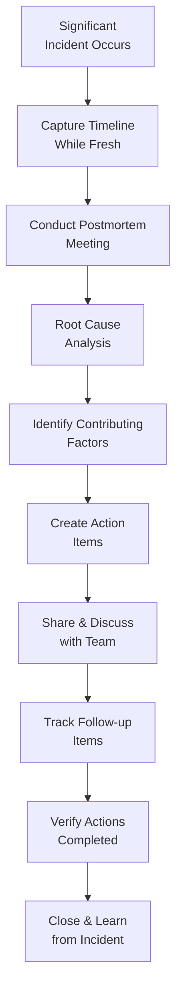

<Hero
  title="Incident Postmortem Template"
  subtitle="Blameless learning framework capturing what happened, why, and how to prevent future incidents"
  imageAlt="Incident postmortem and learning"
  size="large"
/>

## TL;DR

A postmortem is a structured conversation for learning from incidents. Blameless postmortems focus on systems and processes, not people. The goal is to understand what happened, why the system failed, and what systemic improvements prevent recurrence. Conduct postmortems quickly while details are fresh.

## Learning Objectives

After using this template, you will be able to:

- Conduct blameless postmortems that focus on learning
- Perform effective root cause analysis using 5 Whys
- Identify systemic contributing factors
- Create actionable follow-up items
- Track and close action items systematically
- Build a culture of continuous improvement

## What Makes a Good Postmortem

## Postmortem Template

### 1. Incident Summary

<Checklist items={[
  "Incident Details",
  "Date and time incident started (UTC)",
  "Date and time incident resolved",
  "Total duration of incident",
  "Services affected and impact to users",
  "Severity Assessment",
  "Users affected (count or percentage)",
  "Functionality impacted",
  "Financial or reputational impact",
  "Detection & Response",
  "Who detected and reported it",
  "Time from incident start to detection",
  "Time from detection to response began"
]} />

**Example Summary**:
"Incident #2025-002 occurred on Feb 14, 2025 at 14:30 UTC. Payment processing service became unresponsive due to database connection pool exhaustion. Incident lasted 45 minutes (resolved 15:15 UTC). Approximately 2,000 payment transactions failed, affecting 500+ users. Impact: $12K revenue loss, reputational damage. Detected automatically at 14:30 by latency alerts. Response team engaged immediately."

### 2. Incident Timeline

Document what happened chronologically:

<Showcase title="Timeline Example">

| Time (UTC) | Event |
|-----------|-------|
| 14:28 | New code deployment completed (payment-service v2.4.0) |
| 14:30 | Database connection pool hits 100% utilization |
| 14:30 | Latency alert fires (p95 latency > 10 seconds) |
| 14:31 | Incident commander engaged, bridge started |
| 14:32 | Investigation begins: check metrics, logs, recent changes |
| 14:35 | Root cause identified: new code has N+1 query problem |
| 14:40 | Decision made to rollback to v2.3.0 |
| 14:42 | Deployment team initiates rollback |
| 14:46 | Rollback completed, service recovering |
| 14:50 | Database connections normalize |
| 14:55 | Latency returns to baseline |
| 15:00 | Service fully operational, incident declared resolved |
| 15:15 | Incident commander closed bridge |

</Showcase>

<Checklist items={[
  "Timeline Requirements",
  "Entries for significant events (alerts, actions taken, changes made)",
  "Include what was observed (metric values, errors, user complaints)",
  "Include what actions were taken and by whom",
  "Timeline clear enough for future readers to understand sequence of events"
]} />

### 3. Root Cause Analysis (RCA)

Apply structured root cause analysis:

<Tabs>
  <TabItem value="5whys" label="5 Whys Method">
    The 5 Whys technique helps identify deeper systemic causes:

    **Example:**

    **Symptom**: Payment service unresponsive, database connection pool exhausted

    **Why #1**: New code has N+1 query problem (one query per payment instead of batch)
    - Every payment transaction opens a new database query
    - Query volume increases proportionally with traffic
    - Connection pool fills up

    **Why #2**: Code review didn't catch the N+1 query problem
    - Code review process doesn't specifically look for query patterns
    - No automated query analysis in CI/CD pipeline
    - Reviewer unfamiliar with payment service architecture

    **Why #3**: No performance testing before deployment
    - Load testing skipped for this release (time pressure)
    - No requirement to load test before production deployment
    - Performance regression not caught by unit/integration tests

    **Why #4**: Load testing is manual and time-consuming
    - Load testing environment not always available
    - Load testing process not automated
    - Developers avoid manual testing when under time pressure

    **Why #5**: Performance testing not integrated into deployment process
    - No mandatory performance regression check
    - No automated load testing in CI/CD
    - Performance is not treated as a deployment requirement

    **Root Cause**: Lack of automated performance testing in deployment pipeline

  </TabItem>
  <TabItem value="template" label="RCA Template">
    <Checklist items={[
  "Initial Symptom",
  "What did users experience?",
  "What metrics indicated the problem?",
  "Immediate Cause",
  "What system component failed?",
  "What was the failure mode?",
  "Contributing Factors",
  "What were the human and systemic factors?",
  "What could have prevented this?",
  "Root Causes",
  "What processes or controls were missing?",
  "What assumptions proved false?"
]} />

  </TabItem>
</Tabs>

### 4. Contributing Factors

Identify systemic factors that enabled the failure:

<Showcase title="Contributing Factors Example">

**Process Gaps:**
- No mandatory performance regression testing before production deployment
- Load testing environment access limited and difficult to use
- No automated performance testing in CI/CD pipeline
- Code review process doesn't specifically check for database query patterns

**Technical Gaps:**
- No query analysis tooling integrated into codebase
- Database connection pool monitoring not alerted until exhausted
- No graceful degradation when connection pool full
- Slow-query logging not enabled in production database

**Cultural:**
- Team under time pressure skipped load testing to meet deadline
- Developers didn't know performance testing was critical for payment service
- "Performance will be fine" assumption made without validation

**Environmental:**
- Staging environment doesn't replicate production traffic volume
- No canary deployment strategy to detect issues gradually
- Blue-green deployment not available for rapid rollback

</Showcase>

### 5. Action Items

Create specific, assignable action items to prevent recurrence:

<Checklist items={[
  "Action Item Format",
  "Why: How this prevents similar incidents",
  "Who: Specific person or team assigned",
  "When: Target date for completion",
  "How to verify: How will we confirm completion?"
]} />

**Example Action Items:**

| ID | Action | Priority | Owner | Target Date | Status |
|----|--------|----------|-------|-------------|--------|
| A1 | Implement automated load testing in CI/CD pipeline | P1 | Platform Team | 2025-03-15 | In Progress |
| A2 | Add query analysis tool to code review process | P1 | Backend Team | 2025-03-01 | Not Started |
| A3 | Enable slow-query logging in production database | P2 | DBA | 2025-02-21 | Not Started |
| A4 | Implement canary deployments for payment service | P2 | Platform Team | 2025-04-01 | Not Started |
| A5 | Document performance testing requirements for critical services | P3 | Tech Lead | 2025-03-01 | Not Started |

### 6. Lessons Learned

Document key insights from the incident:

<Checklist items={[
  "What went well: What did we handle effectively?",
  "What could be improved: What was difficult or slow?",
  "What surprised us: What didn't we expect?",
  "What we're changing: Specific action items"
]} />

**Example:**

**What Went Well:**
- Fast incident detection and alerting (2 minutes to alert)
- Clear communication on war bridge
- Quick decision to rollback vs. troubleshoot forward
- Rollback process was smooth and fast (4 minutes)

**What Could Be Improved:**
- RCA too late (performed a day after incident) while details fresh
- No communication to affected customers until 30 minutes into incident
- Root cause not obvious from initial metrics
- Staging environment didn't catch this failure

**What Surprised Us:**
- N+1 query issue didn't appear in unit or integration tests
- New developer unfamiliar with performance patterns in this codebase
- Load testing skipped without anyone objecting

### 7. Follow-Up Tracking

<Checklist items={[
  "Action Item Status",
  "Update status in postmortem monthly",
  "Link to related tickets/PRs for transparency",
  "Escalate overdue items for resolution",
  "Verification",
  "Verify action actually prevents the incident scenario",
  "Close action items only when verified complete",
  "Document what was learned from action item completion"
]} />

## Blameless Culture Principles

<Showcase title="Blameless Postmortem Principles">

**Assume Good Intent**: Assume everyone involved was doing their best with available information. Incidents happen because of system failures, not individual failures.

**Focus on Systems, Not People**: "Why did John push buggy code?" is blame. "Why did code review not catch N+1 queries?" is systemic. Ask about systems.

**No Punishment for Incidents**: Punishing incidents discourages transparency and honest postmortems. Punish negligence and ignoring safety practices, not incidents.

**Everyone's a Learner**: All roles contribute to incidents—from code review to deployment to monitoring. Everyone has something to learn.

**Psychological Safety**: Create environment where people can speak honestly about their mistakes, uncertainties, and observations. Without it, root causes stay hidden.

</Showcase>

## Common Postmortem Mistakes

<Showcase title="Mistakes to Avoid">

**Blame the person**: "Alice deployed bad code" doesn't fix systems. Ask why code review didn't catch it, why testing didn't catch it, why deployment allowed it.

**Conducting postmortem too late**: Waiting weeks to conduct postmortem loses details and context. Conduct within 24-48 hours while fresh.

**Action items without owners**: "We should improve monitoring" isn't actionable. "Sarah will implement alerting for X by Feb 28" is actionable.

**Never following up on action items**: Action items that aren't tracked and closed are theater. Make follow-up mandatory.

**Using postmortem for punishment**: If incidents become occasions for blame, people hide them. Transparency collapses.

**Ignoring systemic causes**: If you keep fixing symptoms instead of systems, you'll have incidents repeatedly.

</Showcase>

## Postmortem Workflow

<Tabs>
  <TabItem value="immediate" label="Immediately After Incident">
    1. **Stabilize the Service**
       - Resolve the immediate issue
       - Restore functionality
       - Monitor for stability

    2. **Document Timeline**
       - While events are fresh, record what happened
       - Get details from all incident responders
       - Record all times in UTC

    3. **Identify Obvious Actions**
       - Quick wins to prevent immediate recurrence
       - Temporary mitigations if needed
       - Schedule permanent fixes

  </TabItem>
  <TabItem value="analysis" label="24-48 Hours Later">
    1. **Schedule Postmortem Meeting**
       - Invite everyone involved (responders, engineers, management)
       - Allocate 60-90 minutes
       - Provide timeline in advance for review

    2. **Conduct Analysis**
       - Walk through timeline
       - Ask "Why?" questions
       - Identify systemic contributing factors

    3. **Create Action Items**
       - Assign owners and target dates
       - Prioritize by impact and effort
       - Ensure items are specific and actionable

  </TabItem>
  <TabItem value="followup" label="Ongoing">
    1. **Track Action Items**
       - Update status regularly (weekly/bi-weekly)
       - Escalate if falling behind
       - Verify completion

    2. **Share Learning**
       - Document and share postmortem with team
       - Highlight patterns across multiple incidents
       - Use insights to improve processes

    3. **Prevent Recurrence**
       - Monitor for similar issues
       - Track effectiveness of action items
       - Adjust if issues recur

  </TabItem>
</Tabs>

## Self-Check

After conducting postmortem, verify:

- Timeline is complete and accurate with all timestamps in UTC
- Root cause analysis goes to systemic level (not just immediate cause)
- All action items are specific with assigned owners and target dates
- Action items are tracked and updated regularly
- Postmortem is shared with full team
- There's clear follow-up process for action items
- Learning is captured for future reference
- No one was blamed for the incident

## One Takeaway

:::info One Takeaway
The goal of a postmortem is not to prevent all incidents (impossible) but to learn from each incident so we don't repeat the same failures. Done right, postmortems make your systems more resilient over time.

:::

## Next Steps

1. **Establish postmortem policy** (when required, timeline, process)
2. **Train team on blameless culture** and RCA techniques
3. **Create postmortem template** and process documentation
4. **Conduct postmortems soon after significant incidents** (within 24-48 hours)
5. **Track and verify action items** with visible status tracking
6. **Share postmortem summaries** with entire organization

## References

- [Site Reliability Engineering: Postmortems](https://sre.google/sre-book/postmortem-culture/) <a href="https://sre.google/sre-book/postmortem-culture/" target="_blank" rel="nofollow noopener noreferrer">↗️</a> - Google's SRE book on blameless postmortems
- [Etsy's Debriefing Facilitation Guide](https://blog.etsy.com/news/2012/debriefing-facilitation-guide/) <a href="https://blog.etsy.com/news/2012/debriefing-facilitation-guide/" target="_blank" rel="nofollow noopener noreferrer">↗️</a>
- [Root Cause Analysis (5 Whys)](https://en.wikipedia.org/wiki/5_Whys) <a href="https://en.wikipedia.org/wiki/5_Whys" target="_blank" rel="nofollow noopener noreferrer">↗️</a>
- [Incident Response Best Practices](https://www.pagerduty.com/blog/incident-response-best-practices/) <a href="https://www.pagerduty.com/blog/incident-response-best-practices/" target="_blank" rel="nofollow noopener noreferrer">↗️</a>
