import { useCurrentSidebarCategory } from "@docusaurus/theme-common";

## Overview

Checklists and templates are essential tools for maintaining architectural rigor and operational excellence. This section provides battle-tested reference guides that help teams make consistent, well-documented decisions while ensuring critical aspects of systems design and operation are never overlooked.

These materials serve multiple purposes: they reduce cognitive load by providing structured prompts, enable consistent evaluation across different reviewers, facilitate knowledge transfer between team members, and create artifacts that can be referenced during incident investigations or compliance audits.

Each checklist and template in this section addresses a specific phase of the architecture lifecycle—from initial design decisions through to operational management and post-incident learning. Whether you're evaluating a new microservice architecture, conducting a security threat analysis, or performing a financial optimization review, these tools provide the scaffolding needed to ask the right questions and document the right information.

The templates are designed to be adaptable. While they include comprehensive sections, most organizations will customize them to match their specific requirements, risk profile, and technology constraints. The key is maintaining the discipline of structured review rather than relying on ad-hoc evaluations.

### When to Use Each Template

**Architecture Decision Record (ADR)**: Use when making significant technical decisions that will impact the system for months or years. ADRs create a searchable history of "why" decisions were made.

**Architecture Review Checklist**: Conduct comprehensive reviews when evaluating new system designs, major refactoring efforts, or before moving to production environments.

**Threat Model Template**: Apply during security design phases, before handling sensitive data, or when integrating with external systems. Threat modeling should be part of regular architecture reviews.

**API Review Checklist**: Perform before API contracts are finalized and published. APIs that break are costly to fix, so early review prevents downstream issues.

**Production Readiness Checklist**: Execute before deploying systems to environments with real users or critical workloads. This ensures observability, recovery, and runbook completeness.

**Cost Review & FinOps Checklist**: Schedule regularly (quarterly or before major deployments) to optimize resource utilization and manage cloud expenses.

**Incident Postmortem Template**: Apply immediately after significant incidents to capture learning while events are fresh and to drive systemic improvements.

## Learning Map

```mermaid
flowchart TB
    Start["🏗️ Architecture<br/>Lifecycle"] --> Design["Design Phase"]
    Start --> Security["Security Phase"]
    Start --> Deploy["Deployment Phase"]
    Start --> Operate["Operations Phase"]
    Start --> Finance["Financial Phase"]
    Start --> Learn["Learning Phase"]

    Design --> ADR["📋 ADR Template<br/>Document decisions"]
    Design --> ArchReview["✓ Architecture<br/>Review Checklist"]

    Security --> Threat["🎯 Threat Model<br/>STRIDE analysis"]
    Security --> API["🔌 API Review<br/>Design compliance"]

    Deploy --> Ready["⚡ Production<br/>Readiness Checklist"]

    Operate --> Ready
    Operate --> Cost["💰 Cost Review<br/>FinOps optimization"]

    Finance --> Cost

    Learn --> Postmortem["📝 Incident<br/>Postmortem Template"]
    Postmortem --> Improve["🔄 Continuous<br/>Improvement"]

    ADR --> Improve
    ArchReview --> Improve
    Threat --> Improve
    API --> Improve
    Ready --> Improve
```

## Prerequisites

Before using these checklists and templates, you should have:

- **Basic system design knowledge**: Understanding of components, layers, and dependencies
- **Team context**: Knowledge of your organization's technology stack and constraints
- **Stakeholder awareness**: Understanding who needs to approve or review different decisions
- **Process documentation**: Information about your deployment and operational processes
- **Security baseline**: Understanding of your organization's security requirements and compliance obligations

<DocCardList items={useCurrentSidebarCategory().items} />
