<Hero
  title="Threat Model Template"
  subtitle="Systematic security analysis using STRIDE framework to identify, assess, and mitigate threats"
  imageAlt="Security threat modeling with STRIDE analysis"
  size="large"
/>

## TL;DR

Threat modeling is a disciplined approach to identifying security vulnerabilities before systems are deployed. This template uses the STRIDE methodology to systematically examine spoofing, tampering, repudiation, information disclosure, denial of service, and elevation of privilege threats. Threat models should be completed early in design and revisited when architecture changes.

## Learning Objectives

After completing a threat model using this template, you will be able to:

- Identify critical assets and data flows
- Enumerate threats using the STRIDE framework
- Assess threat likelihood and impact
- Develop mitigation strategies
- Create and maintain a risk register
- Communicate security concerns to stakeholders

## Threat Modeling Process

## Template Sections

### 1. Executive Summary

<Checklist items={[
  "System name and version",
  "Threat modeling date and participants",
  "High-level business purpose",
  "Key security assumptions",
  "Scope boundaries (in and out of scope)",
  "Sensitivity classification of data handled"
]} />

**Example**: "This threat model covers the Customer API v2.0, a REST service handling user authentication and payment processing. The system handles sensitive PII and payment card data subject to PCI-DSS compliance. Threat modeling was conducted on 2025-02-14 with Product, Engineering, and Security teams. Out of scope: third-party payment processor security."

### 2. Assets & Data Classification

<Checklist items={[
  "Critical Assets",
  "Customer PII and sensitive data",
  "Payment card information",
  "Encryption keys and secrets",
  "System configuration and deployment details",
  "Data Classification",
  "Internal: Disclosure harms competitive position",
  "Confidential: Disclosure causes significant business harm",
  "Restricted: Regulated data requiring special handling (PII, payment data)",
  "Asset Register",
  "Classification level",
  "Custodian/owner",
  "Storage location (database, cache, logs)",
  "Backup and recovery requirements"
]} />

### 3. System Architecture & Data Flow Diagram

Create a clear diagram showing:

- **Components**: Services, databases, third-party integrations, user clients
- **Boundaries**: Trust boundaries between components
- **Data flows**: How data moves between components
- **External entities**: Users, admin systems, external APIs

**Mermaid example diagram**:

```mermaid
graph TB
    User["👤 User Client"] -->|HTTPS| APIGw["API Gateway"]
    APIGw -->|HTTP| AuthSvc["Auth Service"]
    APIGw -->|HTTP| PaymentSvc["Payment Service"]
    AuthSvc -->|Query| AuthDB["Auth DB"]
    PaymentSvc -->|Query| PayDB["Payment DB"]
    PaymentSvc -->|API Call| PaymentGateway["Payment Gateway<br/>(External)"]
    APIGw -->|Log| LogSvc["Log Service"]

    style User fill:#e1f5ff
    style PaymentGateway fill:#fff3e0
    style AuthDB fill:#f3e5f5
    style PayDB fill:#f3e5f5
```

### 4. STRIDE Threat Enumeration

<Tabs>
  <TabItem value="spoofing" label="Spoofing">
    **Spoofing Identity**: Attackers impersonate legitimate users or systems

    <Checklist items={[
  "Attacker impersonates legitimate user (fake credentials)",
  "Man-in-the-middle intercepts and replays authentication tokens",
  "Attacker forges API requests with spoofed source IP",
  "Service assumes identity of another service in microservice network",
  "Database connection string modified to connect to attacker-controlled database"
]} />

    **Common Mitigations**:
    - Multi-factor authentication (MFA)
    - JWT with cryptographic signatures
    - TLS/SSL for transport security
    - Mutual TLS between services
    - Network-level identity verification

  </TabItem>
  <TabItem value="tampering" label="Tampering">
    **Tampering with Data**: Attackers modify data in transit or at rest

    <Checklist items={[
  "Payment amount tampered with in transit (man-in-the-middle)",
  "Database records directly modified by attacker with DB access",
  "Configuration files modified to change system behavior",
  "API request parameters altered before reaching service",
  "Cached data poisoned with malicious content"
]} />

    **Common Mitigations**:
    - Message signing and verification
    - Encryption in transit (TLS) and at rest
    - Database access controls and audit logging
    - Configuration management and version control
    - API input validation and sanitization
    - Integrity checking on cached data

  </TabItem>
  <TabItem value="repudiation" label="Repudiation">
    **Repudiation**: Users deny performing actions or deny system behavior

    <Checklist items={[
  "User denies making a payment transaction",
  "Administrator denies making configuration changes",
  "No audit trail of sensitive operations",
  "Timestamps on logs cannot be trusted",
  "User claims unauthorized access to their account"
]} />

    **Common Mitigations**:
    - Comprehensive audit logging of sensitive operations
    - Non-repudiation through digital signatures
    - Immutable log storage (write-once)
    - Synchronized time sources (NTP)
    - User acknowledgment and confirmation steps
    - Transaction receipts and confirmations

  </TabItem>
  <TabItem value="disclosure" label="Information Disclosure">
    **Information Disclosure**: Sensitive data is exposed to unauthorized parties

    <Checklist items={[
  "PII exposed in unencrypted HTTP responses",
  "Sensitive data in application logs or error messages",
  "Database backup files left accessible",
  "Source code or configuration exposed via version control",
  "API responses contain more data than necessary",
  "Data not properly deleted (forgotten backups)"
]} />

    **Common Mitigations**:
    - Encryption in transit and at rest
    - Data minimization (only collect/transmit needed data)
    - Secure log handling (no secrets in logs)
    - Access controls on sensitive files
    - Proper data deletion and cleanup
    - API response filtering
    - Redaction of sensitive data in error messages

  </TabItem>
  <TabItem value="dos" label="Denial of Service">
    **Denial of Service**: System becomes unavailable to legitimate users

    <Checklist items={[
  "Attacker sends massive traffic volume to overwhelm system",
  "Algorithmic complexity attack (e.g., regex DoS)",
  "Resource exhaustion through large file uploads",
  "Database query overload through application logic",
  "Connection pool exhaustion",
  "Dependency service failure cascades to this system"
]} />

    **Common Mitigations**:
    - Rate limiting and throttling
    - DDoS protection (WAF, CDN)
    - Input validation to prevent algorithmic attacks
    - Resource quotas and limits
    - Circuit breakers for external dependencies
    - Capacity planning and auto-scaling
    - Graceful degradation

  </TabItem>
  <TabItem value="elevation" label="Elevation of Privilege">
    **Elevation of Privilege**: Attacker gains higher permissions than intended

    <Checklist items={[
  "Unauthorized access to admin endpoints",
  "Privilege escalation through race conditions",
  "Access control bypass through URL manipulation",
  "SQL injection to extract data as admin",
  "Insufficient permission checks in business logic",
  "API key with excessive permissions compromised"
]} />

    **Common Mitigations**:
    - Role-based access control (RBAC)
    - Attribute-based access control (ABAC)
    - Principle of least privilege
    - Input validation and parameterized queries
    - Authorization checks before sensitive operations
    - API scopes and permissions
    - Regular privilege audits

  </TabItem>
</Tabs>

### 5. Risk Scoring Matrix

For each identified threat, assign scores:

**Likelihood Score** (1-5):
- 1: Very unlikely, sophisticated attack required
- 2: Unlikely, requires specific conditions
- 3: Possible, but would require some effort
- 4: Likely, easily exploitable vulnerability
- 5: Very likely, common attack pattern

**Impact Score** (1-5):
- 1: Minimal (cosmetic issue, no data loss)
- 2: Low (limited data exposure, minor functionality loss)
- 3: Medium (significant data exposure, major feature unavailable)
- 4: High (widespread data compromise, system unavailable)
- 5: Critical (compliance violation, legal liability, full compromise)

**Risk = Likelihood × Impact**

| Threat | Likelihood | Impact | Risk | Priority |
|--------|-----------|--------|------|----------|
| Spoofing user identity via weak auth | 4 | 5 | 20 | Critical |
| Payment tampering in transit | 2 | 5 | 10 | High |
| Unauthorized admin access | 3 | 4 | 12 | High |
| DoS attack on payment endpoint | 4 | 3 | 12 | High |
| Information disclosure in logs | 3 | 3 | 9 | Medium |

### 6. Mitigation Strategies

For each high-risk threat, develop mitigations:

<Showcase title="Threat Mitigation Template">

**Threat**: Spoofing user identity through weak password requirements

**Current State**: System allows short passwords without complexity requirements

**Risk Level**: Critical (Likelihood: 4, Impact: 5)

**Mitigation Option 1: MFA Implementation**
- Implement multi-factor authentication (MFA)
- Require SMS, authenticator app, or hardware token
- Effort: High | Cost: Medium | Effectiveness: Very High

**Mitigation Option 2: Password Policy Enforcement**
- Enforce minimum 12-character passwords
- Require complexity (uppercase, lowercase, numbers, symbols)
- Implement password history and expiration
- Effort: Medium | Cost: Low | Effectiveness: Medium

**Mitigation Option 3: Passwordless Authentication**
- Implement passkey/WebAuthn authentication
- Allow platform-native authentication (biometric, device unlock)
- Effort: Very High | Cost: Medium | Effectiveness: Very High

**Recommendation**: Implement MFA first (high effectiveness, reasonable effort), plan for passwordless authentication in next quarter.

**Responsible Party**: Security Team
**Target Implementation Date**: 2025-05-01
**Verification Method**: Penetration testing, user access verification

</Showcase>

### 7. Mitigation Tracking

<Checklist items={[
  "For Each Mitigation",
  "Responsible owner and team",
  "Target implementation date",
  "Implementation status (Not Started, In Progress, Completed)",
  "Verification method (testing, audit, code review)",
  "Residual risk after mitigation",
  "Risk Register",
  "Track mitigation progress",
  "Update when architecture changes",
  "Review quarterly or when risks change",
  "Acceptance Criteria",
  "No new vulnerabilities introduced",
  "Performance impact is acceptable",
  "User experience is not negatively affected",
  "Compliance requirements are met"
]} />

## Common Threat Modeling Mistakes

<Showcase title="Mistakes to Avoid">

**Threat modeling too late**: Conducting threat modeling after development has begun makes remediation costly. Threat model during architecture phase.

**Focusing only on external attackers**: Don't forget insider threats and accidental misconfigurations. Consider all threat actors.

**Ignoring low-likelihood, high-impact threats**: Critical risks with low probability can still warrant mitigation. Assess impact carefully.

**Treating mitigation as complete**: Security is ongoing. Threats evolve, new vulnerabilities are discovered. Review threat models regularly.

**Lack of implementation accountability**: Good threat models fail without clear ownership. Assign specific people responsible for each mitigation.

**Missing supply chain threats**: Third-party libraries, cloud services, and external APIs introduce threats. Include them in threat modeling.

</Showcase>

## Threat Modeling Workflow

<Tabs>
  <TabItem value="prep" label="Preparation">
    1. **Gather stakeholders**
       - Product manager (understands business impact)
       - Architect or tech lead (understands system design)
       - Security engineer (threat expertise)
       - Developer (implementation considerations)
       - Operations (deployment and monitoring)

    2. **Prepare system documentation**
       - Architecture diagrams
       - Data flow documentation
       - Technology stack details
       - External integrations and dependencies
       - Compliance requirements

    3. **Define scope**
       - What systems are in scope?
       - What threat actors are relevant?
       - What compliance standards apply?
       - What data classifications are involved?

  </TabItem>
  <TabItem value="analysis" label="Analysis">
    1. **Create data flow diagrams**
       - Draw components and trust boundaries
       - Map data flows between components
       - Identify external entities

    2. **Identify assets**
       - What data/systems must be protected?
       - What are the business consequences of compromise?
       - What compliance requirements apply?

    3. **Apply STRIDE systematically**
       - Go through each STRIDE category
       - For each data flow or component, ask STRIDE questions
       - Document threats and attack scenarios

    4. **Score threats**
       - Assess likelihood and impact
       - Calculate risk scores
       - Identify critical risks requiring immediate attention

  </TabItem>
  <TabItem value="planning" label="Planning">
    1. **Develop mitigations**
       - For each high-risk threat, identify mitigation options
       - Evaluate effort, cost, and effectiveness
       - Consider defense-in-depth (multiple controls)

    2. **Create implementation plan**
       - Assign ownership for each mitigation
       - Define success criteria and verification methods
       - Establish timelines

    3. **Estimate residual risk**
       - After implementing mitigations, what risk remains?
       - Is residual risk acceptable?
       - Do additional mitigations or controls needed?

  </TabItem>
  <TabItem value="monitoring" label="Monitoring">
    1. **Track mitigation progress**
       - Status updates in risk register
       - Verify implementation against acceptance criteria
       - Document completion

    2. **Plan for review**
       - Schedule regular threat model reviews
       - Trigger re-evaluation when architecture changes
       - Update when new threats emerge

  </TabItem>
</Tabs>

## Self-Check

Before finalizing your threat model, verify:

- All critical assets have been identified
- Trust boundaries are clearly defined
- STRIDE analysis has been applied systematically
- Top 10 risks have been scored and ranked
- High-risk threats have mitigation strategies
- Mitigations have clear ownership and timelines
- Residual risk is documented and accepted
- Plan for periodic review is established

## One Takeaway

:::info One Takeaway
Threat modeling is not a one-time activity but an ongoing conversation about security. The best threat models are created by diverse teams, revisited when systems change, and treated as living documents that guide security decisions throughout the system lifecycle.

:::

## Next Steps

1. **Schedule threat modeling session** with cross-functional team
2. **Create initial data flow diagrams** to understand system architecture
3. **Apply STRIDE framework** to identify threats
4. **Score and prioritize** the most critical risks
5. **Develop mitigation strategy** and assign ownership
6. **Establish quarterly reviews** to keep threat model current

## References

- [Microsoft STRIDE Methodology](https://learn.microsoft.com/en-us/previous-versions/msp-n-p/ff648644(v=pandp.10)) <a href="https://learn.microsoft.com/en-us/previous-versions/msp-n-p/ff648644(v=pandp.10)" target="_blank" rel="nofollow noopener noreferrer">↗️</a>
- [OWASP Threat Modeling](https://owasp.org/www-community/Threat_Model) <a href="https://owasp.org/www-community/Threat_Model" target="_blank" rel="nofollow noopener noreferrer">↗️</a>
- [Architecture Review Checklist](/docs/checklists-and-templates/architecture-review-checklist-qualities-risks-ops) - Security section
- [Security Architecture](/docs/security-architecture) - Core security principles
