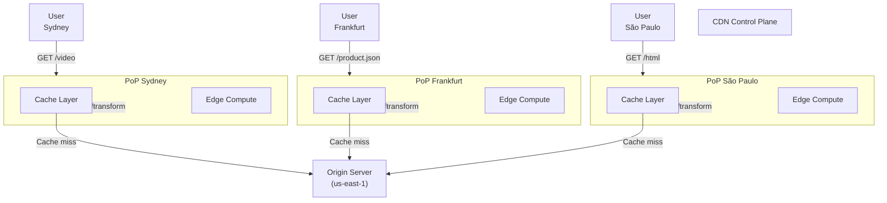

<Hero
  title="CDN & Edge Computing"
  description="Reduce latency and improve performance through geographic distribution and edge caching"
  size="large"
/>

### TL;DR

CDNs (Content Delivery Networks) cache static/semi-static content at edge locations worldwide, serving users from nearest point-of-presence (PoP). Reduces latency, origin load, and bandwidth costs. Edge computing pushes logic to the edge (Cloudflare Workers, AWS Lambda@Edge); suitable for lightweight transformations. Combine with origin auto-scaling for efficient global distribution.

### Learning Objectives

- Understand CDN cache hierarchies and purging strategies.
- Design cache headers and invalidation policies for content freshness.
- Implement edge computing for lightweight request transformation.
- Optimize origin infrastructure for cache misses and purges.
- Monitor CDN performance and cost.

### Motivating Scenario

Your video platform serves global users. Serving all traffic from a single US region means Australian users experience 200+ ms latency. A CDN caches videos at edge locations; AU users get 10 ms latency from a Sydney PoP. Real-time content (product feeds, user profiles) uses edge computing to transform at low latency.

## Mental Model

<Figure caption="CDN architecture: origin, edge caches, and edge compute near users.">



</Figure>

## Core Concepts

**Origin**: Primary server hosting authoritative content.

**Point of Presence (PoP)**: Geographic location with caches and compute. CDNs maintain 100+ PoPs globally.

**Cache Headers**: HTTP directives (Cache-Control, ETag, Last-Modified) control caching behavior and staleness.

**Cache Purge**: Invalidate cached content when origin updates. Can be instant or via surrogate keys.

**Edge Computing**: Execute code (JS, WASM) at CDN edges for request transformation, A/B testing, security filtering.

## Practical Example

<Tabs>
  <TabItem value="cloudfront" label="AWS CloudFront" default>
```hcl
resource "aws_cloudfront_distribution" "main" {
  enabled = true
  is_ipv6_enabled = true

  origin {
    domain_name = aws_s3_bucket.content.bucket_regional_domain_name
    origin_id   = "myS3Origin"

    s3_origin_config {
      origin_access_identity = aws_cloudfront_origin_access_identity.oai.cloudfront_access_identity_path
    }
  }

  origin {
    domain_name = "api.example.com"
    origin_id   = "myAPIOrigin"

    custom_origin_config {
      http_port              = 80
      https_port             = 443
      origin_protocol_policy = "https-only"
      origin_ssl_protocols   = ["TLSv1.2"]
    }

    origin_custom_header {
      name  = "X-Origin-Verify"
      value = "secret-token-123"
    }
  }

  default_cache_behavior {
    allowed_methods  = ["GET", "HEAD", "OPTIONS"]
    cached_methods   = ["GET", "HEAD"]
    target_origin_id = "myS3Origin"

    forwarded_values {
      query_string = false

      cookies {
        forward = "none"
      }
    }

    viewer_protocol_policy = "redirect-to-https"
    min_ttl                = 0
    default_ttl            = 3600
    max_ttl                = 86400

    compress = true
  }

  # API cache behavior (shorter TTL)
  ordered_cache_behavior {
    path_pattern     = "/api/*"
    allowed_methods  = ["GET", "HEAD", "OPTIONS", "PUT", "POST", "PATCH", "DELETE"]
    cached_methods   = ["GET", "HEAD"]
    target_origin_id = "myAPIOrigin"

    forwarded_values {
      query_string = true
      headers      = ["Host", "CloudFront-Viewer-Country"]

      cookies {
        forward = "all"
      }
    }

    viewer_protocol_policy = "https-only"
    min_ttl                = 0
    default_ttl            = 300
    max_ttl                = 3600
  }

  restrictions {
    geo_restriction {
      restriction_type = "none"
    }
  }

  viewer_certificate {
    cloudfront_default_certificate = true
  }
}

# Cache invalidation (on deployment)
resource "aws_cloudfront_invalidation" "deploy" {
  distribution_id = aws_cloudfront_distribution.main.id
  paths           = ["/*"]  # Invalidate all on deploy
}
```
  </TabItem>

  <TabItem value="cloudflare-workers" label="Cloudflare Workers (Edge Compute)">
```javascript
// Edge compute: transform requests at Cloudflare edge (50+ ms faster!)
addEventListener('fetch', event => {
  event.respondWith(handleRequest(event.request))
})

async function handleRequest(request) {
  const url = new URL(request.url)

  // A/B testing: send 10% to v2
  if (Math.random() < 0.1) {
    url.hostname = 'api-v2.example.com'
  }

  // Geo-blocking: deny if from blocked country
  const countryCode = request.headers.get('CF-IPCountry')
  if (['KP', 'IR', 'SY'].includes(countryCode)) {
    return new Response('Access Denied', { status: 403 })
  }

  // Cache static assets longer
  let cacheKey = new Request(url, { method: 'GET' })
  let cache = caches.default

  if (url.pathname.endsWith('.js') || url.pathname.endsWith('.css')) {
    const cached = await cache.match(cacheKey)
    if (cached) return cached
  }

  let response = await fetch(request)
  response = new Response(response.body, response)

  // Set cache headers at edge
  if (url.pathname.endsWith('.js')) {
    response.headers.set('Cache-Control', 'public, max-age=31536000, immutable')
  }

  return response
}
```
  </TabItem>

  <TabItem value="cache-headers" label="Cache Headers (Origin)">
```nginx
# Nginx: set cache headers strategically

# Static assets: cache forever (versioned)
location ~* \.(js|css|png|jpg|jpeg|gif|ico|svg|woff)\$ {
  expires 1y;
  add_header Cache-Control "public, immutable";
  add_header Vary "Accept-Encoding";
}

# HTML: never cache (check freshness)
location ~* \.html\$ {
  expires -1;
  add_header Cache-Control "no-cache, no-store, must-revalidate";
  add_header Pragma "no-cache";
  add_header Vary "Accept-Encoding";
}

# API: cache but revalidate
location /api/ {
  expires 5m;
  add_header Cache-Control "public, max-age=300, must-revalidate";
  add_header ETag $request_time;
}
```
  </TabItem>
</Tabs>

## Decision Checklist

<Checklist items={[
  { label: "CDN configured for geographic distribution?", checked: true },
  { label: "Cache headers set appropriately by content type?", checked: true },
  { label: "Cache purge strategy (instant vs TTL-based) defined?", checked: true },
  { label: "Edge compute used for lightweight transformations?", checked: false },
  { label: "CDN performance metrics monitored (hit ratio, latency)?", checked: true },
]} />

## Self-Check

- How do CDNs reduce latency for global users?
- What cache headers control freshness?
- When would you use edge compute vs traditional CDN caching?
- How do you balance cache TTL with content freshness?

## One Takeaway

CDNs are essential for global performance. Combine long TTLs for static assets, short TTLs for dynamic content, and edge compute for lightweight transformations near users.

## Next Steps

- Study [Topologies](/docs/cloud-native-and-runtime-topology/topologies) for multi-region architecture.
- Explore [Load Balancing](/docs/cloud-native-and-runtime-topology/networking/load-balancing-l4-l7).
- Review [Quality Attributes: Performance](/docs/quality-attributes).

## CDN Cost Optimization

```python
class CDNOptimizer:
    def optimize_cache_ttl(self):
        """Balance freshness vs cache hit ratio"""
        # Analysis of access patterns
        for content_type in ['html', 'css', 'js', 'images', 'videos']:
            hit_ratio = self.get_hit_ratio(content_type)
            staleness_complaints = self.get_staleness_reports(content_type)

            current_ttl = self.current_ttls[content_type]

            # If hit ratio low, increase TTL
            if hit_ratio < 0.5:
                new_ttl = current_ttl * 2
                logger.info(f"{content_type}: Increase TTL {current_ttl}s → {new_ttl}s")

            # If too many complaints, decrease TTL
            if staleness_complaints > 5_per_day:
                new_ttl = current_ttl / 2
                logger.info(f"{content_type}: Decrease TTL {current_ttl}s → {new_ttl}s")

        # Recommended defaults (proven good)
        # HTML (dynamic): 300s (5 min) - frequent updates, prefer fresh
        # CSS/JS (versioned): 31536000s (1 year) - immutable (v1.2.3.css)
        # Images (versioned): 31536000s (1 year)
        # API responses (dynamic): 60s (1 min)

    def estimate_bandwidth_savings(self):
        """Calculate savings from CDN vs direct origin"""
        monthly_bandwidth = 1_000  # TB
        origin_bandwidth_cost = 0.085  # $ per GB
        cdn_cost = 0.085  # $ per GB (varies by provider)

        # Origin: 1000 TB * $0.085 = $85,000/month
        # CDN: 900 TB via CDN (90% hit ratio) = 900 * $0.085 = $76,500
        # Savings: $8,500/month

        # But also:
        # - Reduced origin load (can downsize servers)
        # - Better latency (users happier)
        # - Global redundancy (disaster recovery)
        # - DDoS protection (CDN handles)
```

## Advanced Edge Computing Patterns

### Pattern 1: A/B Testing at Edge

```javascript
// Cloudflare Worker: Route traffic based on user ID
addEventListener('fetch', event => {
  event.respondWith(handleRequest(event.request))
})

async function handleRequest(request) {
  const url = new URL(request.url)
  const userId = request.headers.get('X-User-ID')

  // A/B test: Send 50% to old API, 50% to new API
  const hashCode = hash(userId)
  if (hashCode % 2 === 0) {
    url.hostname = 'api-v1.example.com'  // Control group (old)
  } else {
    url.hostname = 'api-v2.example.com'  // Treatment group (new)
  }

  return fetch(new Request(url, request))
}

// Benefit: No changes to client code, test new APIs at edge
// Faster experimentation (real users, real traffic)
```

### Pattern 2: Geo-Routing for Compliance

```javascript
// Route EU traffic to EU-based origin (GDPR compliance)
// Route US traffic to US-based origin
addEventListener('fetch', event => {
  event.respondWith(handleGeoRouting(event.request))
})

async function handleGeoRouting(request) {
  const country = request.headers.get('CF-IPCountry')
  const url = new URL(request.url)

  if (EU_COUNTRIES.includes(country)) {
    url.hostname = 'eu.example.com'  // EU origin
  } else if (US_COUNTRIES.includes(country)) {
    url.hostname = 'us.example.com'  // US origin
  } else {
    url.hostname = 'global.example.com'  // Default
  }

  return fetch(new Request(url, request))
}

// Ensures data residency compliance without client changes
```

### Pattern 3: Bot Detection at Edge

```javascript
// Cloudflare Worker: Detect and block bots at edge
addEventListener('fetch', event => {
  event.respondWith(detectAndRoute(event.request))
})

async function detectAndRoute(request) {
  const userAgent = request.headers.get('User-Agent') || ''
  const ip = request.headers.get('CF-Connecting-IP')

  // Known bot patterns
  const botPatterns = [
    /googlebot/i,
    /bingbot/i,
    /curl/i,
    /scrapy/i
  ]

  const isBot = botPatterns.some(p => p.test(userAgent))

  if (isBot && !isAllowedBot(ip)) {
    // Route bot traffic to cheaper origin or cache longer
    return new Response('Blocked', { status: 403 })
  }

  // Legitimate traffic proceeds
  return fetch(request)
}

// Benefit: Block scrapers early, reduce origin load
```

## Monitoring and Observability

```python
class CDNMonitoring:
    def monitor_cache_health(self):
        """Track cache performance metrics"""
        metrics = {
            'cache_hit_ratio': self.get_metric('cache_hit_ratio'),  # Target: > 85%
            'p95_latency': self.get_metric('p95_latency'),  # Target: < 100ms
            'origin_requests': self.get_metric('origin_requests'),
            'bandwidth_saved': self.estimate_bandwidth_saved(),
            'geo_distribution': self.get_requests_by_location(),
        }

        # Alert if hit ratio drops
        if metrics['cache_hit_ratio'] < 0.80:
            alert(f"Cache hit ratio low: {metrics['cache_hit_ratio']:.0%}")

        # Alert if origin getting hammered
        if metrics['origin_requests'] > 10_000_per_second:
            alert(f"Origin overloaded: {metrics['origin_requests']} req/s")

        return metrics

    def detect_cache_anomalies(self):
        """Detect unusual cache behavior"""
        # Sudden drop in hit ratio (stale objects?)
        # Spike in origin requests (cache invalidation bug?)
        # Regional latency spike (CDN PoP issue?)
        # Unusual geographic distribution (attack?)
        pass
```

## References

- <a href="https://docs.aws.amazon.com/cloudfront/" target="_blank" rel="nofollow noopener noreferrer">AWS CloudFront Documentation ↗</a>
- <a href="https://workers.cloudflare.com/" target="_blank" rel="nofollow noopener noreferrer">Cloudflare Workers ↗</a>
- <a href="https://developer.mozilla.org/en-US/docs/Web/HTTP/Caching" target="_blank" rel="nofollow noopener noreferrer">HTTP Caching (MDN) ↗</a>
- <a href="https://www.w3.org/Protocols/rfc2616/rfc2616-sec14.html" target="_blank" rel="nofollow noopener noreferrer">HTTP/1.1 Cache Control Headers ↗</a>
- <a href="https://developers.google.com/web/tools/chrome-devtools/progressive-web-apps/service-workers" target="_blank" rel="nofollow noopener noreferrer">Service Workers for Caching ↗</a>
