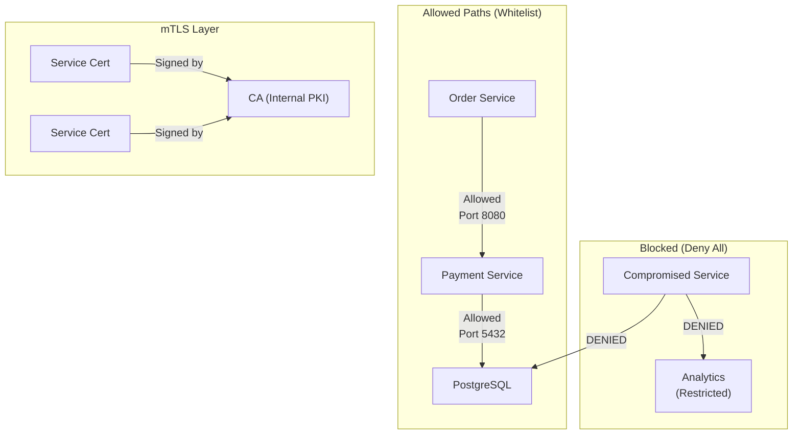

<Hero
  title="Network Policies & mTLS"
  description="Zero-trust networking with encryption in transit and automatic certificate management"
  size="large"
/>

### TL;DR

Network policies implement zero-trust networking: whitelist permitted traffic; deny all else. mTLS (mutual TLS) encrypts service-to-service traffic and authenticates both parties using certificates. Combine with service mesh (Istio, Linkerd) for automatic mTLS, or manage manually with cert-manager. Reduces blast radius if a service is compromised. Start with policies and cert-manager; add service meshes for advanced observability and traffic management.

### Learning Objectives

- Design network policies to restrict inter-service communication using zero-trust principles.
- Implement mTLS for service-to-service encryption and mutual authentication.
- Automate certificate provisioning and rotation with cert-manager.
- Evaluate service mesh architecture for advanced networking and observability.
- Monitor and debug encrypted traffic with network policies in place.
- Troubleshoot common certificate and network policy issues.

### Motivating Scenario

A compromised microservice attempts to exfiltrate data from sensitive services. Without network policies, the attack succeeds (default allow). With policies, unauthorized egress is blocked. mTLS ensures communication partners authenticate each other, preventing man-in-the-middle attacks and credential theft. You need both layers of defense: network policies prevent unwanted connections; mTLS ensures that only legitimate services can communicate.

## Mental Model

<Figure caption="Zero-trust networking: network policies whitelist; mTLS encrypts and authenticates.">



</Figure>

## Core Concepts

**Network Policies**: Firewall rules at the pod level. Default-deny, then whitelist permitted ingress/egress. Pod-to-pod communication is the basis; policies filter by labels and namespaces.

**mTLS (Mutual TLS)**: Both client and server authenticate using certificates. Server proves its identity; client proves its identity. Prevents MITM attacks and spoofing. Essential for zero-trust.

**Service Mesh**: Sidecar proxies (Envoy) in each pod intercept traffic; handle mTLS, retry, rate limiting, observability. Adds operational complexity but simplifies security policy management.

**Certificate Management**: Automatic provisioning, renewal, and rotation using cert-manager or mesh-integrated systems (Istio CA). Reduces manual toil and certificate expiration surprises.

**Zero-Trust**: Assume no network is inherently trusted; verify every request (identity via mTLS, authorization via policies, encryption in transit).

**Blast Radius**: The scope of damage if a service is compromised. Network policies and mTLS limit blast radius by restricting what a compromised service can access.

## Practical Examples

<Tabs>
  <TabItem value="netpol-k8s" label="Kubernetes Network Policies" default>
```yaml
# Start with deny-all policy - default deny ingress and egress
apiVersion: networking.k8s.io/v1
kind: NetworkPolicy
metadata:
  name: deny-all
  namespace: production
spec:
  podSelector: {}
  policyTypes:
  - Ingress
  - Egress
  # No rules = deny everything. This is your safety net.
---
# Order Service: Accept from API Gateway, call Payment Service
apiVersion: networking.k8s.io/v1
kind: NetworkPolicy
metadata:
  name: order-service-policy
  namespace: production
spec:
  podSelector:
    matchLabels:
      app: order-api
  policyTypes:
  - Ingress
  - Egress

  # Allow ingress from API Gateway only
  ingress:
  - from:
    - namespaceSelector:
        matchLabels:
          name: ingress
      podSelector:
        matchLabels:
          app: api-gateway
    ports:
    - protocol: TCP
      port: 8080

  # Allow egress to Payment Service
  egress:
  - to:
    - podSelector:
        matchLabels:
          app: payment-api
    ports:
    - protocol: TCP
      port: 8080

  # Allow egress to PostgreSQL
  - to:
    - podSelector:
        matchLabels:
          app: postgres
    ports:
    - protocol: TCP
      port: 5432

  # Allow DNS (critical - without this, service discovery fails)
  - to:
    - namespaceSelector:
        matchLabels:
          name: kube-system
    ports:
    - protocol: UDP
      port: 53
---
# Payment Service: Accept from Order Service, call Database
apiVersion: networking.k8s.io/v1
kind: NetworkPolicy
metadata:
  name: payment-service-policy
  namespace: production
spec:
  podSelector:
    matchLabels:
      app: payment-api
  policyTypes:
  - Ingress
  - Egress

  # Only Order Service can call Payment Service
  ingress:
  - from:
    - podSelector:
        matchLabels:
          app: order-api
    ports:
    - protocol: TCP
      port: 8080

  # Egress to database
  egress:
  - to:
    - podSelector:
        matchLabels:
          app: postgres
    ports:
    - protocol: TCP
      port: 5432

  # DNS
  - to:
    - namespaceSelector:
        matchLabels:
          name: kube-system
    ports:
    - protocol: UDP
      port: 53
---
# Database: Accept from Order and Payment Services only
apiVersion: networking.k8s.io/v1
kind: NetworkPolicy
metadata:
  name: postgres-policy
  namespace: production
spec:
  podSelector:
    matchLabels:
      app: postgres
  policyTypes:
  - Ingress

  ingress:
  - from:
    - podSelector:
        matchLabels:
          app: order-api
    - podSelector:
        matchLabels:
          app: payment-api
    ports:
    - protocol: TCP
      port: 5432
```
  </TabItem>

  <TabItem value="cert-manager" label="Cert-Manager Setup">
```yaml
# 1. Install cert-manager (via Helm or manifests)
# helm repo add jetstack https://charts.jetstack.io
# helm install cert-manager jetstack/cert-manager -n cert-manager --create-namespace
---
# 2. Create root CA certificate
apiVersion: cert-manager.io/v1
kind: Certificate
metadata:
  name: internal-ca-cert
  namespace: cert-manager
spec:
  commonName: "Internal CA"
  secretName: internal-ca-key-pair
  isCA: true
  issuerRef:
    name: selfsigned-issuer
    kind: Issuer
---
# 3. Self-signed issuer for bootstrapping the CA
apiVersion: cert-manager.io/v1
kind: Issuer
metadata:
  name: selfsigned-issuer
  namespace: cert-manager
spec:
  selfSigned: {}
---
# 4. CA Issuer - used by all services
apiVersion: cert-manager.io/v1
kind: Issuer
metadata:
  name: internal-ca
  namespace: production
spec:
  ca:
    secretRef:
      name: internal-ca-key-pair
---
# 5. Certificate for Order Service
apiVersion: cert-manager.io/v1
kind: Certificate
metadata:
  name: order-service-cert
  namespace: production
spec:
  secretName: order-service-tls
  duration: 2160h  # 90 days
  renewBefore: 720h  # Renew 30 days before expiry
  commonName: order-api.production.svc.cluster.local
  dnsNames:
  - order-api
  - order-api.production
  - order-api.production.svc
  - order-api.production.svc.cluster.local
  issuerRef:
    name: internal-ca
    kind: Issuer
---
# 6. Certificate for Payment Service
apiVersion: cert-manager.io/v1
kind: Certificate
metadata:
  name: payment-service-cert
  namespace: production
spec:
  secretName: payment-service-tls
  duration: 2160h
  renewBefore: 720h
  commonName: payment-api.production.svc.cluster.local
  dnsNames:
  - payment-api
  - payment-api.production
  - payment-api.production.svc
  - payment-api.production.svc.cluster.local
  issuerRef:
    name: internal-ca
    kind: Issuer
---
# 7. Deployment with mTLS
apiVersion: apps/v1
kind: Deployment
metadata:
  name: order-api
  namespace: production
spec:
  replicas: 3
  selector:
    matchLabels:
      app: order-api
  template:
    metadata:
      labels:
        app: order-api
    spec:
      containers:
      - name: order-api
        image: order-api:latest
        ports:
        - containerPort: 8443
          name: https
        volumeMounts:
        - name: tls
          mountPath: /etc/tls/certs
          readOnly: true
        env:
        - name: TLS_CERT_PATH
          value: /etc/tls/certs/tls.crt
        - name: TLS_KEY_PATH
          value: /etc/tls/certs/tls.key
        - name: TLS_CA_PATH
          value: /etc/tls/certs/ca.crt
        livenessProbe:
          httpGet:
            path: /healthz
            port: 8443
            scheme: HTTPS
          initialDelaySeconds: 10
          periodSeconds: 10
      volumes:
      - name: tls
        secret:
          secretName: order-service-tls
---
# 8. Service with HTTPS
apiVersion: v1
kind: Service
metadata:
  name: order-api
  namespace: production
spec:
  ports:
  - name: https
    port: 8443
    targetPort: 8443
  selector:
    app: order-api
  type: ClusterIP
```
  </TabItem>

  <TabItem value="istio-mtls" label="Istio Service Mesh">
```yaml
# Install Istio first:
# istioctl install --set profile=demo -y
---
# 1. Enable sidecar injection for the namespace
apiVersion: v1
kind: Namespace
metadata:
  name: production
  labels:
    istio-injection: enabled
---
# 2. PeerAuthentication: Enforce strict mTLS for all traffic in namespace
apiVersion: security.istio.io/v1beta1
kind: PeerAuthentication
metadata:
  name: default
  namespace: production
spec:
  mtls:
    mode: STRICT  # PERMISSIVE allows both mTLS and plaintext
---
# 3. Authorization Policy: Only Order Service can call Payment Service
apiVersion: security.istio.io/v1beta1
kind: AuthorizationPolicy
metadata:
  name: allow-order-payment
  namespace: production
spec:
  selector:
    matchLabels:
      app: payment-api
  action: ALLOW
  rules:
  - from:
    - source:
        principals: ["cluster.local/ns/production/sa/order-api"]
    to:
    - operation:
        methods: ["POST"]
        paths: ["/payments*"]
---
# 4. VirtualService for traffic management (optional)
apiVersion: networking.istio.io/v1beta1
kind: VirtualService
metadata:
  name: payment-api
  namespace: production
spec:
  hosts:
  - payment-api
  http:
  - match:
    - sourceLabels:
        app: order-api
    route:
    - destination:
        host: payment-api
        port:
          number: 8443
    timeout: 10s
    retries:
      attempts: 3
      perTryTimeout: 2s
---
# 5. DestinationRule for circuit breaking
apiVersion: networking.istio.io/v1beta1
kind: DestinationRule
metadata:
  name: payment-api
  namespace: production
spec:
  host: payment-api
  trafficPolicy:
    connectionPool:
      tcp:
        maxConnections: 100
      http:
        http1MaxPendingRequests: 50
        maxRequestsPerConnection: 2
    outlierDetection:
      consecutive5xxErrors: 5
      interval: 30s
      baseEjectionTime: 30s
```
  </TabItem>
</Tabs>

## Real-World Production Scenarios

### Scenario 1: Multi-Tenant SaaS

Each tenant's workload is isolated via network policies. Tenant A pods cannot see Tenant B's data paths:

```yaml
# Tenant A Network Policy
apiVersion: networking.k8s.io/v1
kind: NetworkPolicy
metadata:
  name: tenant-a-isolation
  namespace: tenant-a
spec:
  podSelector:
    matchLabels:
      tenant: a
  policyTypes:
  - Ingress
  - Egress
  
  # Only ingress from ingress-gateway
  ingress:
  - from:
    - namespaceSelector:
        matchLabels:
          name: ingress
    - podSelector:
        matchLabels:
          tenant: a
  
  # Egress: Tenant A database only, DNS
  egress:
  - to:
    - podSelector:
        matchLabels:
          db: tenant-a
  - to:
    - namespaceSelector:
        matchLabels:
          name: kube-system
    ports:
    - protocol: UDP
      port: 53
```

With mTLS, each tenant's certificate is signed by a tenant-specific CA. If Tenant A's private key is compromised, only Tenant A's traffic can be impersonated.

### Scenario 2: Migrating from HTTP to mTLS

Gradual rollout using Istio PERMISSIVE mode:

```yaml
# Phase 1: PERMISSIVE - accept both mTLS and plaintext
apiVersion: security.istio.io/v1beta1
kind: PeerAuthentication
metadata:
  name: default
  namespace: production
spec:
  mtls:
    mode: PERMISSIVE
---
# Phase 2: Monitor metrics; once traffic is all mTLS, switch to STRICT
apiVersion: security.istio.io/v1beta1
kind: PeerAuthentication
metadata:
  name: default
  namespace: production
spec:
  mtls:
    mode: STRICT
```

### Scenario 3: Certificate Rotation Without Downtime

cert-manager automatically rotates certificates 30 days before expiry. Pods mounted with cert secrets receive updates:

```yaml
# Check certificate expiration
kubectl get certificate -n production -o wide

# Monitor renewals
kubectl logs -n cert-manager deploy/cert-manager -f | grep renew
```

Istio automatically picks up rotated certificates from the pod volume.

## Common Mistakes and Pitfalls

<Showcase sections={[
  {
    title: "Forgetting DNS in Egress Policies",
    description: "Network policy blocks DNS egress. Service discovery fails, pods cannot resolve hostnames.",
    tags: ["networking", "debugging"]
  },
  {
    title: "Over-permissive mTLS Mode",
    description: "Using PERMISSIVE mode indefinitely weakens security. Some old client still sending plaintext.",
    tags: ["security", "operations"]
  },
  {
    title: "Certificates Expiring in Production",
    description: "Manual cert rotation missed. Expired cert breaks traffic. mTLS rejections cascade.",
    tags: ["reliability", "operations"]
  },
  {
    title: "Network Policies Break Pod-to-Pod Communication",
    description: "Default-deny policy implemented, but forgot to allow internal service traffic.",
    tags: ["debugging", "configuration"]
  },
  {
    title: "Service Mesh Sidecar Injection Issues",
    description: "Pod created before sidecar injector enabled. No Envoy proxy. Cannot enforce mTLS.",
    tags: ["operations", "configuration"]
  },
  {
    title: "Ignoring mTLS Upgrade Impact",
    description: "Switching from plaintext to STRICT mTLS breaks old clients. Clients not updated.",
    tags: ["planning", "migration"]
  }
]} />

## Debugging Network Policies and mTLS

<Tabs>
  <TabItem value="debug-netpol" label="Network Policy Debugging">
```bash
# 1. Check if network policies are applied
kubectl get networkpolicies -n production -o wide

# 2. Describe a specific policy
kubectl describe networkpolicy order-service-policy -n production

# 3. Test connectivity (inside cluster, from one pod to another)
kubectl exec -it <order-pod> -n production -- sh

# Inside order pod shell:
# Test DNS
nslookup payment-api.production.svc.cluster.local

# Test TCP connection
nc -zv payment-api.production.svc.cluster.local 8080

# 4. Check pod labels (policies match on labels)
kubectl get pods -n production --show-labels

# 5. Monitor network traffic (tcpdump, only in permissive environments)
kubectl exec <pod> -- tcpdump -i eth0 -A

# 6. Test with netcat or curl from a temporary pod
kubectl run -it --image=busybox --rm debug -- sh
# Inside: wget -O- http://order-api.production.svc.cluster.local:8080/health
```
  </TabItem>

  <TabItem value="debug-mtls" label="mTLS / Certificate Debugging">
```bash
# 1. Check certificate status
kubectl get certificate -n production
kubectl describe certificate order-service-cert -n production

# 2. Check if certificate secret exists
kubectl get secret order-service-tls -n production -o yaml

# 3. Decode certificate to verify CN and DNSNames
kubectl get secret order-service-tls -n production \
  -o jsonpath='{.data.tls\.crt}' | base64 -d | openssl x509 -text -noout

# 4. Check cert-manager logs for renewal issues
kubectl logs -n cert-manager deploy/cert-manager | grep order-service

# 5. For Istio: Check mTLS enforcement
kubectl get peerauthentication -n production
kubectl describe peerauthentication default -n production

# 6. Check Envoy config (if using Istio)
kubectl exec <pod-with-sidecar> -c istio-proxy -- \
  curl localhost:15000/config_dump | grep -A 20 "tls_context"

# 7. Monitor rejected connections due to mTLS
kubectl logs <payment-api-pod> -c istio-proxy | grep "mTLS\|CERTIFICATE"

# 8. Test mTLS from curl (extract certs from secret)
kubectl get secret order-service-tls -n production \
  -o jsonpath='{.data.tls\.crt}' | base64 -d > /tmp/client.crt
kubectl get secret order-service-tls -n production \
  -o jsonpath='{.data.tls\.key}' | base64 -d > /tmp/client.key
kubectl get secret order-service-tls -n production \
  -o jsonpath='{.data.ca\.crt}' | base64 -d > /tmp/ca.crt

curl --cert /tmp/client.crt --key /tmp/client.key --cacert /tmp/ca.crt \
  https://payment-api.production.svc.cluster.local:8443/health
```
  </TabItem>

  <TabItem value="istio-debug" label="Istio Service Mesh Debugging">
```bash
# 1. Check mTLS mode
istioctl authn tls-check <pod-name> -n production

# 2. Analyze traffic policies
istioctl analyze -n production

# 3. Check virtual services and destination rules
kubectl get vs,dr -n production

# 4. View traffic routing
istioctl describe service payment-api -n production

# 5. Enable debug logging on Envoy
kubectl port-forward -n production <payment-api-pod> 15000:15000
curl http://localhost:15000/stats/prometheus | grep connection

# 6. Check if service is behind a load balancer / accessible
kubectl port-forward -n production svc/payment-api 8443:8443
curl -k https://localhost:8443/health

# 7. Verify authorization policies are enforced
istioctl analyze -n production | grep AuthorizationPolicy
```
  </TabItem>
</Tabs>

## Decision Checklist

<Checklist items={[
  { label: "Default-deny network policy in place?", checked: true },
  { label: "Whitelist policies defined for each service pair?", checked: true },
  { label: "DNS egress allowed in network policies?", checked: true },
  { label: "mTLS enabled for service-to-service communication?", checked: true },
  { label: "Certificates auto-renewed before expiration?", checked: true },
  { label: "Certificate rotation process verified (no downtime)?", checked: true },
  { label: "Service mesh (if used) monitoring traffic in real-time?", checked: false },
  { label: "mTLS mode is STRICT (not PERMISSIVE) in production?", checked: true },
  { label: "Authorization policies restrict service pairs (not just mTLS)?", checked: true },
  { label: "Monitoring alerts for certificate expiry?", checked: true },
  { label: "Runbook for debugging network policy failures?", checked: false },
]} />

## Self-Check

- How do network policies reduce blast radius of compromised services?
- What is mTLS, and why is mutual authentication important?
- How do you automatically renew certificates without downtime?
- When would you add a service mesh vs native Kubernetes security?
- How do you debug a network policy that's blocking legitimate traffic?
- What happens if you forget DNS in your egress policies?

## One Takeaway

Zero-trust networking (network policies + mTLS) is essential for production systems. Start with policies and manual cert management; add service meshes when observability and advanced routing justify the complexity. Always test policies in a staging environment first—misconfigured policies silently break production.

## Next Steps

- Study [Load Balancing](/docs/cloud-native-and-runtime-topology/networking/load-balancing-l4-l7).
- Explore [CDN & Edge](/docs/cloud-native-and-runtime-topology/networking/cdn-and-edge).
- Review [Service Discovery](/docs/cloud-native-and-runtime-topology/orchestration/service-discovery-ingress-egress).
- Practice with [Istio Authorization Policies](https://istio.io/latest/docs/tasks/security/authorization/).
- Set up certificate monitoring and alerting.

## References

- Kubernetes Network Policies: https://kubernetes.io/docs/concepts/services-networking/network-policies/
- cert-manager: https://cert-manager.io/
- Istio Security: https://istio.io/latest/docs/concepts/security/
- Zero Trust Networking: NIST SP 800-207
- mTLS Best Practices: https://www.cloudflare.com/learning/access-management/what-is-mutual-tls/
