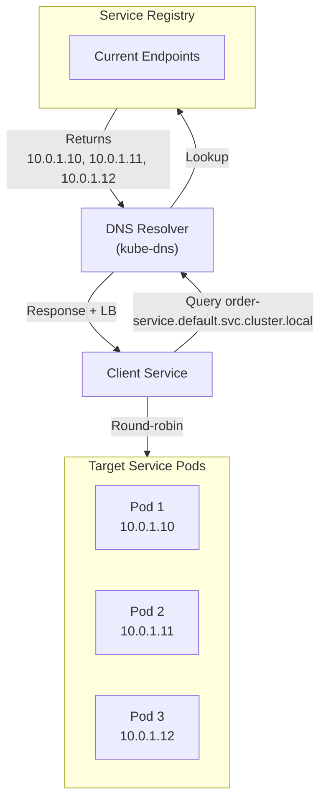

<Hero
  title="Service Discovery, Ingress & Egress"
  description="DNS-based discovery, load-balanced traffic routing, and network policies"
  size="large"
/>

### TL;DR

Service discovery decouples clients from hardcoded IPs via DNS (Kubernetes: order-service.default.svc.cluster.local → [10.0.1.10, 10.0.1.11, 10.0.1.12]). Ingress controllers route external traffic (api.example.com → order-service) with TLS termination. Network policies restrict inter-pod communication via whitelist (only api-gateway can reach order-service). Service meshes (Istio, Linkerd) add resilience (retries, circuit breaking) and observability (distributed tracing) but increase operational complexity. Start with Kubernetes native services + Ingress; add service mesh only when observability and advanced traffic control justify the overhead.

### Learning Objectives

- Design service discovery mechanisms (DNS, load balancer, service registry).
- Configure ingress controllers for HTTP/HTTPS routing and TLS termination.
- Implement network policies to restrict inter-service communication.
- Understand service mesh trade-offs (observability vs operational complexity).

### Motivating Scenario

You're running an e-commerce platform with order, payment, and inventory services on Kubernetes. Initially, hardcoding service IPs in configs works: order-service calls payment-service at 10.0.1.50. But when payment-service scales to 3 pods (10.0.1.50, 10.0.1.51, 10.0.1.52) or restarts (new IP: 10.0.1.100), order-service has stale endpoints and fails. DNS-based discovery eliminates this: payment-service.default.svc.cluster.local always resolves to current endpoints; kube-dns updates automatically. Externally, you need to route api.example.com/orders and api.example.com/payments to the correct services—an Ingress controller handles this. A misconfigured order-service connects to external APIs and exfiltrates data; network policies block outbound traffic except to PostgreSQL and payment-service, reducing blast radius. You need distributed tracing to debug latency issues across service calls; a service mesh (Istio) adds this automatically, though operational complexity rises.

## Mental Model

<Figure caption="Service discovery flow: clients query DNS, resolver returns current endpoints, load balancer distributes traffic.">



</Figure>

## Core Concepts

**Service Discovery**: Maps service names (e.g., order-service.default.svc.cluster.local) to current IP addresses. DNS returns multiple IPs (endpoints); clients load-balance across them. Decouples client code from hardcoded IPs; enables dynamic scaling, rolling updates, and pod restarts without manual intervention.

**Ingress**: Reverse proxy (NGINX, HAProxy, Envoy) that routes external HTTP/HTTPS to internal services. Handles TLS termination, host-based routing (api.example.com → order-service), path-based routing (/orders → order-service, /payments → payment-service), and request rewriting. Reduces TLS overhead on individual services.

**Egress Gateway**: Controls outbound traffic from mesh (rate limiting, logging, policy enforcement, data exfiltration prevention). Centralized exit point for monitoring external API calls.

**Network Policies**: Firewall rules restricting which pods can communicate (whitelist-based). Default-deny all, then explicitly allow pod-to-pod communication. Reduces blast radius: compromised service cannot reach unrelated services.

**Service Mesh**: Sidecar proxies (Istio Envoy, Linkerd) in every pod intercept traffic. Advanced features: retry logic, circuit breaking, distributed tracing, mTLS encryption. Trade-off: observability and resilience vs operational complexity.

## Practical Example

<Tabs>
  <TabItem value="k8s-service" label="Kubernetes Service & Ingress" default>
```yaml
apiVersion: v1
kind: Service
metadata:
  name: order-service
  namespace: ecommerce
spec:
  selector:
    app: order-api
  type: ClusterIP
  clusterIP: 10.0.0.100
  ports:
  - name: http
    port: 8080
    targetPort: 8080
    protocol: TCP
---
apiVersion: networking.k8s.io/v1
kind: NetworkPolicy
metadata:
  name: order-api-policy
spec:
  podSelector:
    matchLabels:
      app: order-api
  policyTypes:
  - Ingress
  - Egress
  ingress:
  - from:
    - namespaceSelector:
        matchLabels:
          name: api-gateway
    ports:
    - protocol: TCP
      port: 8080
  egress:
  - to:
    - namespaceSelector: {}
    ports:
    - protocol: TCP
      port: 5432  # PostgreSQL
  - to:
    - namespaceSelector:
        matchLabels:
          name: payment-service
    ports:
    - protocol: TCP
      port: 8080
---
apiVersion: networking.k8s.io/v1
kind: Ingress
metadata:
  name: api-ingress
  annotations:
    cert-manager.io/cluster-issuer: "letsencrypt-prod"
spec:
  ingressClassName: nginx
  tls:
  - hosts:
    - api.example.com
    secretName: api-tls-cert
  rules:
  - host: api.example.com
    http:
      paths:
      - path: /orders
        pathType: Prefix
        backend:
          service:
            name: order-service
            port:
              number: 8080
      - path: /payments
        pathType: Prefix
        backend:
          service:
            name: payment-service
            port:
              number: 8080
```
  </TabItem>

  <TabItem value="consul" label="Consul Service Discovery">
```hcl
service {
  name = "order-api"
  id   = "order-api-1"
  port = 8080

  tags = ["http", "api", "production"]

  check {
    id       = "order-api-health"
    http     = "http://localhost:8080/health"
    interval = "10s"
    timeout  = "5s"
  }

  connect {
    sidecar_service {
      port = 20000
      proxy {
        upstreams = [
          {
            destination_name = "postgres"
            local_bind_port  = 5432
          },
          {
            destination_name = "payment-api"
            local_bind_port  = 8081
          }
      }
    }
  }
}
```
  </TabItem>
</Tabs>

## Decision Checklist & Troubleshooting

<Checklist items={[
  "Service discovery automatically updated when pods scale or restart?",
  "Ingress TLS certificates automated (cert-manager) and rotated before expiry?",
  "Network policies restrict inter-service communication (whitelist-based)?",
  "Egress policies prevent data exfiltration to unauthorized external endpoints?",
  "DNS resolution tested: kubectl run -it debug --image=busybox -- nslookup order-service?",
  "Ingress annotations (cert-manager, rate limiting) correctly applied?",
  "Network policy allows DNS egress (port 53 UDP) for service discovery to work?",
  "Service endpoints verified: kubectl get endpoints order-service shows live pods?",
  "Ingress controller deployed and receiving traffic (check service type LoadBalancer/NodePort)?",
  "Service mesh observability tools (tracing, metrics) justified before adoption?"
]} />

## Self-Check

- How does DNS-based service discovery handle dynamic endpoints?
- What traffic does an Ingress controller route?
- How do network policies improve security posture?
- When would you add a service mesh vs native Kubernetes networking?

## One Takeaway

Service discovery and ingress decoupling enable dynamic, resilient architectures. Start with DNS + Kubernetes networking; add service meshes only when observability and advanced routing justify operational complexity. Network policies are non-negotiable for security: default-deny, explicitly allow. Test service discovery via DNS lookups and verify Ingress routes traffic correctly before moving to production.

## Next Steps

- Study [Load Balancing](/docs/cloud-native-and-runtime-topology/networking/load-balancing-l4-l7).
- Explore [Network Policies](/docs/cloud-native-and-runtime-topology/networking/network-policies-mtls).
- Review [Stateful Workloads](/docs/cloud-native-and-runtime-topology/orchestration/stateful-workloads-concepts).

## Load Balancing Algorithms

Different load balancers use different algorithms:

```yaml
Round-Robin:
  Description: Distribute requests equally to each backend
  Best for: Equal capacity backends
  Worst for: Variable backend capacity
  Example:
    Request 1 → Backend 1
    Request 2 → Backend 2
    Request 3 → Backend 3
    Request 4 → Backend 1 (cycle repeats)

Least Connections:
  Description: Send to backend with fewest active connections
  Best for: Long-lived connections (WebSockets, databases)
  Example:
    Backend 1: 5 connections
    Backend 2: 12 connections
    New request → Backend 1

IP Hash:
  Description: Hash client IP to same backend
  Best for: Session affinity (user sticks to one backend)
  Problem: If backend dies, all its users fail over
  Use case: Sticky sessions (minimize cache misses)

Weighted:
  Description: Distribute by server weight
  Config: Backend 1 (weight=3), Backend 2 (weight=1)
  Result: 3x more traffic to Backend 1
  Best for: Unequal capacity servers

Least Response Time:
  Description: Track response times, send to fastest
  Best for: Variable backend performance
  Problem: Requires monitoring overhead
  Use case: Mixed backend types (different versions, hardware)
```

## DNS and Service Discovery Deep Dive

### DNS A Records vs SRV Records

```yaml
A Record (Simple):
  Lookup: nslookup order-service.default.svc.cluster.local
  Response: 10.0.0.50
  Problem: Only returns one IP (for load balancing, need multiple)

  Solution 1: Return multiple IPs
    10.0.0.50
    10.0.0.51
    10.0.0.52
  Client performs round-robin locally

SRV Record (Service-aware):
  Lookup: nslookup _order-service._tcp.default.svc.cluster.local
  Response:
    10.0.0.50:8080 priority=1 weight=10
    10.0.0.51:8080 priority=1 weight=10
    10.0.0.52:8080 priority=1 weight=10
  Includes port, priority, weight
  Better for: Microservices with non-standard ports
```

### DNS Caching and TTL Issues

```yaml
DNS Resolution Timeline:
  Client cache (TTL 600s)
    ↓
  CoreDNS cache (TTL 30s)
    ↓
  Authoritative nameserver (TTL from zone file)

Problem: DNS not reflecting new endpoints
  Scenario:
    1. Pod 1 resolves order-service → 10.0.0.50 (cached 600s)
    2. Pod 1 scales to 2 pods: 10.0.0.50, 10.0.0.51
    3. Pod 1 keeps using 10.0.0.50 (cache still valid)
    4. Uneven load: Pod 1 gets 90%, Pod 2 gets 10%

Solutions:
  1. Reduce TTL: Set to 30s (faster updates, more queries)
  2. Use connection pooling: Rediscover endpoints on new connections
  3. Implement smart retry: If endpoint fails, lookup fresh
```

## Additional Patterns & Pitfalls

**Pattern: Headless Service for StatefulSets**: Service with clusterIP: None returns individual pod IPs, enabling direct DNS lookups (pod-0.service-name). Used for stateful databases (Cassandra, MongoDB) that need stable network identities.

**Pattern: Service Mesh Sidecar Injection**: Annotate namespace with istio-injection: enabled; Istio automatically injects Envoy sidecars into all pods. Traffic flows pod → sidecar → actual service. Transparent to application code.

**Pitfall: Network Policy Breaks DNS**: Egress policy allows only specific ports; forget port 53 UDP. Services can't resolve DNS names. Always: allow egress to kube-dns (10.0.0.10:53 or kube-dns.kube-system:53).

**Pitfall: Ingress TLS Certificate Expired**: cert-manager doesn't renew cert before expiry. Solution: monitor certificate age, ensure cert-manager webhook runs before cert renewal window.

**Pitfall: Service Mesh Overhead**: Injected Envoy sidecars consume 50-100MB memory per pod. 100 pods → 5-10GB overhead. Justify with observability ROI before adoption.

## References

- Kubernetes Service Discovery: <a href="https://kubernetes.io/docs/concepts/services-networking/service/" target="_blank" rel="nofollow noopener noreferrer">Official Documentation ↗️</a>
- Kubernetes Ingress: <a href="https://kubernetes.io/docs/concepts/services-networking/ingress/" target="_blank" rel="nofollow noopener noreferrer">Official Documentation ↗️</a>
- Consul Service Mesh: <a href="https://www.consul.io/docs/connect" target="_blank" rel="nofollow noopener noreferrer">Consul Connect ↗️</a>
- Istio Service Mesh: <a href="https://istio.io/latest/docs/concepts/what-is-istio/" target="_blank" rel="nofollow noopener noreferrer">What is Istio? ↗️</a>
- cert-manager for Kubernetes: <a href="https://cert-manager.io/docs/" target="_blank" rel="nofollow noopener noreferrer">Official Documentation ↗️</a>
