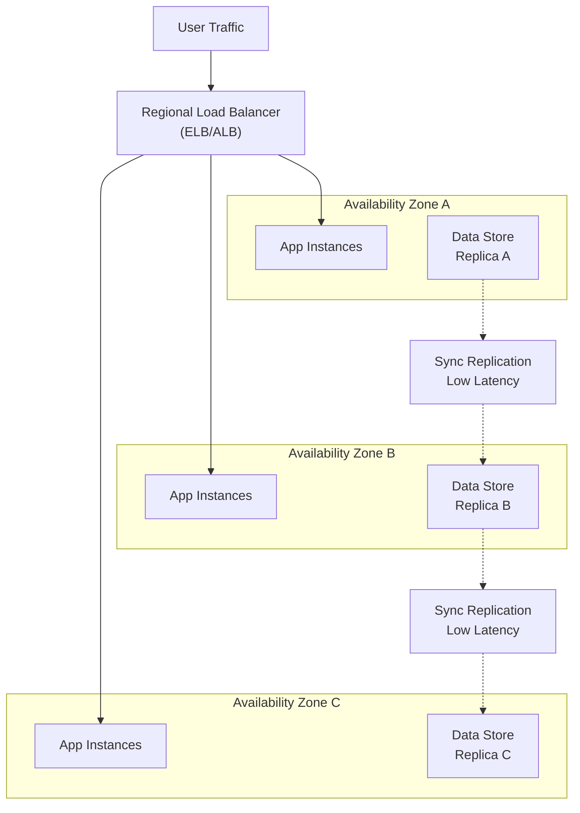

<Hero
  title="Single Region, Multi-Zone Deployments"
  subtitle="Achieve high availability and resilience by distributing workloads across failure-isolated availability zones within a single geographic region."
  difficulty="intermediate"
  time="15 min read"
/>

## TL;DR

Single-region multi-zone (SRMZ) deployments distribute application components across 2-3 availability zones within one AWS/Azure/GCP region. This provides fault tolerance against zone failures while maintaining low latency (sub-millisecond), synchronous consistency, and simplified operational complexity compared to multi-region deployments. Use SRMZ when you need 99.9%-99.95% availability without cross-region complexity.

## Learning Objectives

By the end of this article, you'll understand:
- How availability zones isolate infrastructure failures
- Zone-aware load balancing and traffic distribution strategies
- Data replication and consistency models across zones
- Network latency implications and optimization
- When SRMZ is sufficient versus requiring multi-region approaches

## Motivating Scenario

Your SaaS platform runs on three servers in a single AWS availability zone. During a zone outage affecting 45 minutes, your service becomes completely unavailable, impacting 500+ customers. Post-incident analysis reveals adding two more zones would eliminate this single point of failure with minimal latency penalty. The question: how do you design a topology that survives zone failures while keeping operations manageable?

## Core Concepts

<Figure title="Single-Region Multi-Zone Deployment Topology">

</Figure>

### Availability Zones as Failure Domains

Availability zones are isolated infrastructure segments with independent power, cooling, and networking. A zone failure (network partition, hardware failure, natural disaster) doesn't affect peer zones. Cloud providers typically offer 3-4 zones per region, with deployment across 2-3 providing optimal cost/resilience tradeoff.

**Key characteristics:**
- Independent failure domains
- Sub-millisecond inter-zone latency (typically 1-5ms)
- No data transfer charges between zones
- Automatic isolation on failure

### Zone-Aware Load Balancing

Regional load balancers distribute traffic with zone awareness, maintaining customer affinity when possible while rebalancing on zone failure. Modern implementations use:

**Health Check Models:**
- Per-zone health checks detect zone degradation
- Graceful connection draining removes failed instances without dropping requests
- Active health checks (every 5-30 seconds) detect failures within SLA bounds

**Distribution Strategies:**
- Round-robin with zone awareness
- Least connections (sticky sessions)
- Weighted routing for A/B testing across zones

### Data Replication Strategies

Single-region deployments enable synchronous replication with acceptable latency. Common patterns:

**Write-Through Consistency:**
- Primary zone writes synchronously to 2+ replica zones
- 99.99% durability (no data loss)
- Sub-100ms replication latency
- Higher write latency (network round-trips)
- Typical for financial/critical data

**Read Replicas with Eventual Consistency:**
- Primary zone writes, asynchronous replication
- Lower write latency, temporary inconsistency
- Sufficient for analytics, caching, non-critical reads
- Replica lag: 10-100ms typical

## Practical Example

<Tabs>
<TabItem value="python" label="Python (Flask + Zone-Aware Load)">
```python
from flask import Flask, request, jsonify
import os
from datetime import datetime

app = Flask(__name__)

ZONE = os.getenv('AVAILABILITY_ZONE', 'us-east-1a')

# Database replication tracking
class ZoneAwareDB:
    def __init__(self, zone):
        self.zone = zone
        self.replicas = {
            'us-east-1a': 'db-master.us-east-1a.rds.amazonaws.com',
            'us-east-1b': 'db-replica.us-east-1b.rds.amazonaws.com',
            'us-east-1c': 'db-replica.us-east-1c.rds.amazonaws.com'
        }

    def write(self, data):
        """Write with zone awareness - sync to replicas"""
        timestamp = datetime.utcnow().isoformat()
        # Write to master in current zone
        master_addr = self.replicas[self.zone]

        try:
            # Simulate sync replication to peer zones
            other_zones = [z for z in self.replicas
                          if z != self.zone]

            # Would execute synchronous replication
            print(f"Writing to {master_addr}")
            print(f"Replicating to {other_zones}")

            return {
                'zone': self.zone,
                'timestamp': timestamp,
                'replicated': True
            }
        except Exception as e:
            return {'error': str(e), 'replicated': False}

    def read_local(self):
        """Read from local zone replica"""
        return {
            'zone': self.zone,
            'consistency': 'eventual',
            'latency_ms': '&lt;1'
        }

db = ZoneAwareDB(ZONE)

@app.route('/health', methods=['GET'])
def health():
    """Zone-aware health check"""
    return jsonify({
        'status': 'healthy',
        'zone': ZONE,
        'timestamp': datetime.utcnow().isoformat()
    })

@app.route('/write', methods=['POST'])
def write_data():
    """Replicate writes across zones"""
    data = request.get_json()
    result = db.write(data)
    return jsonify(result), 201 if result.get('replicated') else 500

@app.route('/read', methods=['GET'])
def read_data():
    """Read from local zone"""
    result = db.read_local()
    return jsonify(result)

@app.route('/failover-status', methods=['GET'])
def failover_status():
    """Report replication lag and failover readiness"""
    return jsonify({
        'zone': ZONE,
        'replicas_healthy': 2,
        'replication_lag_ms': 5,
        'failover_ready': True
    })

if __name__ == '__main__':
    app.run(host='0.0.0.0', port=8080)
```
</TabItem>

<TabItem value="go" label="Go (Gin + Zone Health Tracking)">
```go
package main

import (
	"fmt"
	"net/http"
	"os"
	"time"

	"github.com/gin-gonic/gin"
)

var ZONE = getEnv("AVAILABILITY_ZONE", "us-west-2a")

type ReplicationMetrics struct {
	Zone             string        `json:"zone"`
	ReplicaCount     int           `json:"replica_count"`
	ReplicationLag   time.Duration `json:"replication_lag_ms"`
	FailoverReady    bool          `json:"failover_ready"`
	LastHealthCheck  time.Time     `json:"last_health_check"`
}

type ZoneAwareStore struct {
	zone      string
	endpoints map[string]string
	metrics   ReplicationMetrics
}

func NewZoneAwareStore(zone string) *ZoneAwareStore {
	return &ZoneAwareStore{
		zone: zone,
		endpoints: map[string]string{
			"us-west-2a": "db-master.us-west-2a.rds.amazonaws.com",
			"us-west-2b": "db-replica.us-west-2b.rds.amazonaws.com",
			"us-west-2c": "db-replica.us-west-2c.rds.amazonaws.com",
		},
		metrics: ReplicationMetrics{
			Zone:            zone,
			ReplicaCount:    2,
			ReplicationLag:  5 * time.Millisecond,
			FailoverReady:   true,
			LastHealthCheck: time.Now(),
		},
	}
}

func (z *ZoneAwareStore) WriteWithReplication(key string, value interface{}) error {
	fmt.Printf("Writing to %s in zone %s\n", key, z.zone)

	// Simulate synchronous replication to peer zones
	otherZones := []string{}
	for zone := range z.endpoints {
		if zone != z.zone {
			otherZones = append(otherZones, zone)
		}
	}

	fmt.Printf("Replicating to zones: %v\n", otherZones)

	// In production, would track replication ACKs
	z.metrics.LastHealthCheck = time.Now()
	return nil
}

func (z *ZoneAwareStore) GetMetrics() ReplicationMetrics {
	return z.metrics
}

func main() {
	router := gin.Default()
	store := NewZoneAwareStore(ZONE)

	// Zone identification
	router.GET("/zone", func(c *gin.Context) {
		c.JSON(200, gin.H{
			"availability_zone": ZONE,
			"region":           "us-west-2",
		})
	})

	// Health check with zone context
	router.GET("/health", func(c *gin.Context) {
		c.JSON(200, gin.H{
			"status": "healthy",
			"zone":   ZONE,
			"time":   time.Now().Unix(),
		})
	})

	// Replication metrics
	router.GET("/metrics/replication", func(c *gin.Context) {
		metrics := store.GetMetrics()
		c.JSON(200, metrics)
	})

	// Zone-aware write
	router.POST("/write", func(c *gin.Context) {
		var data map[string]interface{}
		if err := c.BindJSON(&data); err != nil {
			c.JSON(400, gin.H{"error": err.Error()})
			return
		}

		err := store.WriteWithReplication("key", data)
		if err != nil {
			c.JSON(500, gin.H{"error": err.Error()})
			return
		}

		c.JSON(201, gin.H{
			"status":      "written",
			"zone":        ZONE,
			"replicated":  true,
			"lag_ms":      store.metrics.ReplicationLag.Milliseconds(),
		})
	})

	router.Run(":8080")
}

func getEnv(key, defaultValue string) string {
	if value, exists := os.LookupEnv(key); exists {
		return value
	}
	return defaultValue
}
```
</TabItem>

<TabItem value="node" label="Node.js (Express + Zone Failover)">
```javascript
const express = require('express');
const app = express();
const os = require('os');

app.use(express.json());

const ZONE = process.env.AVAILABILITY_ZONE || 'eu-west-1a';
const REGION = 'eu-west-1';

// Zone-aware database client
class ZoneAwareDatabase {
  constructor(zone) {
    this.zone = zone;
    this.replicas = {
      'eu-west-1a': 'db-master.eu-west-1a.rds.eu-west-1.amazonaws.com',
      'eu-west-1b': 'db-replica.eu-west-1b.rds.eu-west-1.amazonaws.com',
      'eu-west-1c': 'db-replica.eu-west-1c.rds.eu-west-1.amazonaws.com'
    };
    this.replicationLagMs = 3;
    this.healthyReplicas = 2;
  }

  async write(key, value) {
    console.log(`[${this.zone}] Writing key: ${key}`);

    try {
      // Simulate sync replication to other zones
      const otherZones = Object.keys(this.replicas)
        .filter(z => z !== this.zone);

      console.log(`[${this.zone}] Replicating to: ${otherZones.join(', ')}`);

      // Simulate replication latency
      await new Promise(resolve => setTimeout(resolve, this.replicationLagMs));

      return {
        success: true,
        zone: this.zone,
        key,
        replicaCount: this.healthyReplicas,
        replicationLagMs: this.replicationLagMs,
        timestamp: new Date().toISOString()
      };
    } catch (error) {
      console.error(`[${this.zone}] Write failed:`, error.message);
      return { success: false, error: error.message };
    }
  }

  async readLocal() {
    return {
      zone: this.zone,
      dataCenter: REGION,
      consistency: 'eventual',
      replicationLagMs: this.replicationLagMs
    };
  }

  async getReplicationStatus() {
    return {
      zone: this.zone,
      healthyReplicas: this.healthyReplicas,
      totalReplicas: 2,
      replicationLagMs: this.replicationLagMs,
      failoverReady: this.healthyReplicas >= 2,
      lastChecked: new Date().toISOString()
    };
  }
}

const db = new ZoneAwareDatabase(ZONE);

// Routes
app.get('/health', (req, res) => {
  res.json({
    status: 'healthy',
    zone: ZONE,
    region: REGION,
    uptime: process.uptime(),
    timestamp: new Date().toISOString()
  });
});

app.post('/data', async (req, res) => {
  const { key, value } = req.body;

  if (!key || !value) {
    return res.status(400).json({ error: 'key and value required' });
  }

  const result = await db.write(key, value);
  res.status(result.success ? 201 : 500).json(result);
});

app.get('/data/status', async (req, res) => {
  const status = await db.getReplicationStatus();
  res.json(status);
});

app.get('/zone-info', (req, res) => {
  res.json({
    zone: ZONE,
    region: REGION,
    hostname: os.hostname(),
    loadAvg: os.loadavg()
  });
});

const PORT = process.env.PORT || 8080;
app.listen(PORT, () => {
  console.log(`[${ZONE}] Server listening on port ${PORT}`);
});
```
</TabItem>
</Tabs>

## When to Use / When Not to Use

<Vs highlight={[0,1,0,0]} items={[
{
    label: "Use Single-Region Multi-Zone When:",
    points: ["You need 99.9%-99.95% availability (44.6-8.76 hours/year downtime)", "Latency-sensitive applications (sub-5ms acceptable)", "Data consistency must be strongly guaranteed", "Operational simplicity is important (single region management)", "Cost-conscious with acceptable availability targets", "Compliance allows single-region deployment"],
    highlightTone: "positive"
  },
{
    label: "Use Multi-Region When:",
    points: ["You need 99.99%+ availability (disaster recovery SLA)", "Geographic data residency required across regions", "Serving global users with local latency requirements", "Regulatory requirements force geographic distribution", "Can tolerate eventual consistency and cross-region replication", "Have budget for multi-region infrastructure"],
    highlightTone: "positive"
  }
]} />

## Patterns & Pitfalls

<Showcase  sections={[{
      title: "Failure Domain Isolation",
      description: "Always deploy across physical failure domains. 'Different subnets' doesn't guarantee isolation - zones have independent power, networks, and physical infrastructure.",
      icon: "✓",
      positive: true
    }, {
      title: "Sticky Sessions Anti-Pattern",
      description: "Session affinity to single zones during failures causes cascading failures. Use distributed session storage (Redis, DynamoDB) instead.",
      icon: "✗",
      positive: false
    }, {
      title: "Connection Pooling per Zone",
      description: "Maintain connection pools to each zone's database replica. Rebalance pools when zones fail to prevent connection exhaustion.",
      icon: "✓",
      positive: true
    }, {
      title: "Synchronous Replication Bottleneck",
      description: "Ultra-strict sync replication (waiting for all zones) degrades under latency. Use write-through to primary + quorum replication instead.",
      icon: "✓",
      positive: true
    }, {
      title: "Shared Resources Across Zones",
      description: "NAT gateways, load balancers, or DNS in single zones become bottlenecks. Distribute all customer-facing resources across zones.",
      icon: "✗",
      positive: false
    }, {
      title: "Async Replication Gap Handling",
      description: "With eventual consistency, brief windows exist where replicas diverge. Application logic must tolerate reading stale data or redirect writes to primary zone.",
      icon: "✓",
      positive: true
    }]}
/>

## Design Review Checklist

<Checklist
  items={[
    { label: "Application instances distributed across 3 zones (or 2 if cost-critical)", checked: false },
    { label: "Load balancer routes traffic with zone awareness and health checks", checked: false },
    { label: "Database replication strategy documented (sync vs eventual consistency)", checked: false },
    { label: "Failover tested - application recovers when single zone fails", checked: false },
    { label: "No single points of failure outside zones (NAT, load balancer, DNS)", checked: false },
    { label: "Data loss acceptable in replication lag understood and tested", checked: false },
    { label: "Connection pooling handles zone-to-zone communication", checked: false },
    { label: "Monitoring tracks replication lag and zone health", checked: false },
    { label: "Disaster recovery plan documents manual intervention steps", checked: false },
    { label: "Cost analysis confirmed multi-zone cost-benefit ratio", checked: false }
  ]}
/>

## Self-Check

Ask yourself:
- Can my application tolerate temporary data loss during zone failover?
- Is my database replication strategy documented and tested?
- Do I have visibility into which zone each customer is using?
- What's the maximum acceptable replication lag for my use case?
- Am I monitoring zone-specific error rates separately?

## One Key Takeaway

:::info
**Single-region multi-zone deployments provide high availability (99.9%-99.95%) with minimal latency penalty by distributing workloads across independent failure domains. The key is ensuring zero single points of failure outside zones and testing failure scenarios before they occur in production.**

:::

## Next Steps

1. **Inventory your infrastructure** - Identify components still in single zones
2. **Plan replication strategy** - Decide between sync (data-critical) vs eventual (performance-critical)
3. **Test zone failures** - Use chaos engineering to simulate zone outages
4. **Document runbooks** - Prepare manual intervention steps for degraded scenarios
5. **Monitor by zone** - Add zone-aware monitoring and alerting
6. **Evaluate multi-region** - Assess whether future global expansion requires geographic distribution

## References

- <a href="https://aws.amazon.com/about-aws/global-infrastructure/regions_availability-zones/" target="_blank" rel="nofollow noopener noreferrer">AWS Availability Zones ↗️</a>
- <a href="https://cloud.google.com/architecture/multi-zone-redundancy" target="_blank" rel="nofollow noopener noreferrer">Google Cloud Multi-Zone Redundancy ↗️</a>
- <a href="https://azure.microsoft.com/en-us/products/availability-zones/" target="_blank" rel="nofollow noopener noreferrer">Azure Availability Zones ↗️</a>
- <a href="https://aws.amazon.com/builders/wellarchitected/" target="_blank" rel="nofollow noopener noreferrer">AWS Well-Architected Framework ↗️</a>
