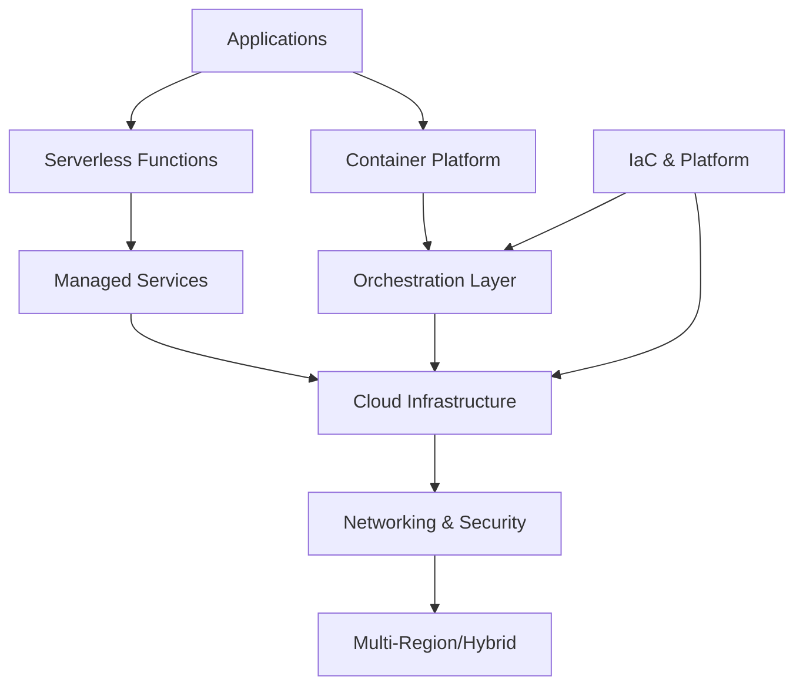

## What this is

The essential concepts and technologies for building applications that leverage cloud-native capabilities at scale. It covers cloud networking fundamentals, container orchestration, serverless computing, Infrastructure as Code (IaC), and platform engineering practices. Critical when moving beyond simple cloud hosting to architectures that exploit cloud elasticity, managed services, and global distribution.

## When to use it

- Applications requiring elastic scaling where traffic patterns vary significantly and resource efficiency matters.
- Multi-environment deployments where Infrastructure as Code ensures consistency across development, staging, and production.
- Distributed teams where platform engineering provides self-service capabilities and reduces operational bottlenecks.
- Global applications requiring multi-region deployment with network optimization and data locality.
- Organizations adopting microservices where container orchestration and service mesh enable reliable service-to-service communication.
- Cost-sensitive workloads where serverless computing and right-sized resources optimize spending.

## When not to

- Simple applications with predictable, stable resource needs that benefit from traditional hosting approaches.
- Highly regulated environments where cloud shared responsibility models introduce unacceptable compliance complexity.
- Legacy systems with deep infrastructure dependencies that make cloud migration costs exceed benefits.
- Small teams where cloud-native operational complexity outweighs the scaling and reliability benefits.

## Core decisions

- Compute model: containers with orchestration vs. serverless functions vs. managed services based on scaling patterns and operational preferences.
- Network architecture: Virtual Private Cloud (VPC) design, subnet segmentation, and security group policies that balance isolation with connectivity needs.
- Infrastructure management: Infrastructure as Code for repeatability vs. manual provisioning vs. platform engineering for developer self-service.
- Multi-cloud strategy: single provider for simplicity vs. hybrid cloud for compliance vs. multi-cloud for vendor independence and risk mitigation.
- Service communication: direct networking vs. service mesh for observability vs. Application Programming Interface (API) gateways for external integration.
- Trade-off: cloud-native complexity vs. operational control — managed services reduce maintenance but increase vendor lock-in and reduce customization options.

## Mental model

_Figure: Cloud platform layers from applications through infrastructure, with IaC and platform engineering enabling consistent deployment._

## What to read next

- [Build secure cloud foundations with Networking fundamentals](/docs/cloud/networking)
- [Deploy anywhere with Hybrid and Multicloud strategies](/docs/cloud/hybrid-multicloud)
- [Scale applications with Containers and Orchestration](/docs/cloud/containers-orchestration)
- [Optimize costs with Serverless computing patterns](/docs/cloud/serverless)
- [Manage infrastructure with IaC and Guardrails](/docs/cloud/iac-guardrails)
- [Enable developer productivity with Platform Engineering](/docs/cloud/platform-engineering)
- [Connect services with Service Mesh and API Gateway](/docs/cloud/service-mesh-api-gateway)

:::note
Orientation: Networking and IaC provide the foundation for all cloud deployments. Containers and Serverless represent the primary compute models for modern applications.
:::
