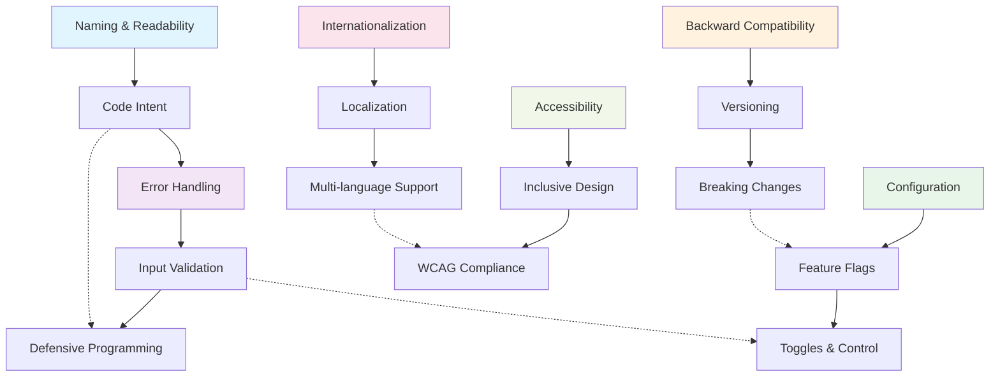

import { useCurrentSidebarCategory } from "@docusaurus/theme-common";

# Coding Discipline

Coding discipline encompasses the practical habits and deliberate choices that transform code from "working" into "professional." This section covers the everyday practices that experienced developers apply to write more maintainable, robust, and sustainable code.

Rather than architectural patterns or abstract principles, coding discipline focuses on the concrete decisions you make at the keyboard: how you name things, how you handle errors, how you validate inputs, and how you manage configuration. These practices compound over time—small choices about naming clarity or error handling robustness shape the trajectory of your entire codebase.

The articles in this section address the tactical work of writing code that is easy to understand, resilient to failure, and designed for change. You'll learn not just the best practices themselves, but the reasoning behind them and how to apply them in real projects where constraints are real and time is limited.

## Learning Map

<Figure caption="Coding Discipline topics and their relationships">

</Figure>

<DocCardList items={useCurrentSidebarCategory().items} />

## Why Coding Discipline Matters

Professional software development requires more than knowledge of syntax or algorithms. The difference between junior and senior developers often comes down to discipline—consistent choices that prioritize clarity, resilience, and maintainability. A project with strong coding discipline is easier to onboard into, faster to debug, and simpler to extend.

Conversely, projects that lack discipline accumulate technical debt rapidly. Inconsistent naming makes code harder to search and understand. Poor error handling masks bugs that surface at the worst times. Unvalidated inputs create security vulnerabilities. Configuration buried in code requires recompilation for changes. Undocumented breaking changes frustrate teams that depend on your work.

## Core Areas

**Clarity & Intent**: Start with naming and readability—these determine whether future maintainers (including yourself) can quickly understand code.

**Resilience**: Error handling and input validation build systems that fail gracefully and predictably rather than catastrophically.

**Flexibility**: Configuration management, feature flags, and versioning enable you to deploy changes without requiring code rewrites or forcing users to jump versions.

**Inclusivity**: Internationalization and accessibility ensure your software works for users everywhere, in their languages and with their tools.

Each area compounds with the others. Well-named code with poor error handling is still fragile. Validated inputs with no i18n support exclude international users. Discipline is about addressing all these dimensions consistently.
