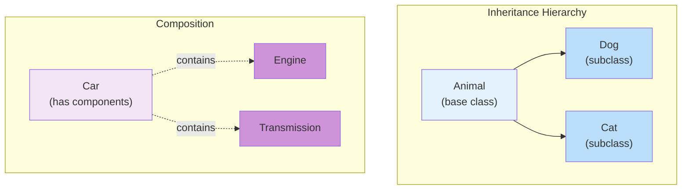

<Hero
  title="Composition Over Inheritance"
  subtitle="Favor object composition over inheritance to achieve flexibility, reduce fragility, and improve code reuse."
  imageAlt="Composition versus Inheritance illustration"
  size="large"
/>

## TL;DR

Inheritance creates rigid "is-a" relationships and fragile base classes. Composition creates flexible "has-a" relationships where objects delegate to components. Inheritance is appropriate for true hierarchies (Dog is-a Animal). Composition is better for feature combinations (Car has-a Engine, has-a Transmission). Composition enables runtime flexibility, easier testing, and simpler code evolution.

## Learning Objectives

You will be able to:
- Distinguish between "is-a" and "has-a" relationships
- Identify inheritance hierarchies that should be composition
- Refactor inheritance-based code toward composition
- Use composition patterns (decorator, strategy, delegation)
- Recognize when inheritance is genuinely appropriate

## Motivating Scenario

A codebase has Vehicle > Car hierarchy. Later, Car needs TaxiDispatchMixin for ride-sharing. Then TrafficReporting. Then ParkingMeterIntegration. The Car class now inherits from four different mixins, creating a fragile diamond problem. Adding a new feature requires modifying the inheritance chain or creating new subclasses.

With composition: Car contains a DispatchService, a TrafficService, a ParkingService. Adding a feature means adding a component, not reorganizing the hierarchy. Car's implementation stays simple.

## Core Concepts

### Inheritance: "Is-A" Relationship

Inheritance models hierarchical relationships where a subclass is a specialized version of its parent.

```
Dog is-a Animal
Square is-a Shape
ElectricCar is-a Car
```

### Composition: "Has-A" Relationship

Composition models capability relationships where an object contains components that provide behavior.

```
Car has-a Engine
Car has-a Transmission
Employee has-a Address
```

<Figure caption="Inheritance vs. Composition">

</Figure>

### The Fragile Base Class Problem

Inheritance creates tight coupling between parent and child. Changes to the base class can break subclasses. Adding features often requires modifying the inheritance hierarchy, affecting all subclasses.

## Practical Example

<Tabs>
<TabItem value="py" label="Python" default>
```python
# ❌ INHERITANCE - Brittle and inflexible
class Animal:
    def speak(self):
        pass

class Dog(Animal):
    def speak(self):
        return "Woof"

class Cat(Animal):
    def speak(self):
        return "Meow"

class RobotDog(Dog):  # Inherits from Dog but isn't really a Dog
    def speak(self):
        return "Beep Boop"

    def charge(self):  # New capability mixed in
        return "Charging..."

# ✅ COMPOSITION - Flexible and composable
class Speaker:
    def speak(self):
        raise NotImplementedError

class DogSpeaker(Speaker):
    def speak(self):
        return "Woof"

class RobotSpeaker(Speaker):
    def speak(self):
        return "Beep Boop"

class Battery:
    def charge(self):
        return "Charging..."

class Dog:
    def __init__(self, speaker, battery=None):
        self.speaker = speaker
        self.battery = battery

    def speak(self):
        return self.speaker.speak()

    def charge(self):
        if self.battery:
            return self.battery.charge()
        return "Cannot charge"

# Usage - flexible combinations
real_dog = Dog(DogSpeaker())
robot_dog = Dog(RobotSpeaker(), Battery())
robot_dog.speak()  # "Beep Boop"
robot_dog.charge()  # "Charging..."
```
</TabItem>
<TabItem value="go" label="Go">
```go
// ❌ INHERITANCE - Using embedding (Go's version), still rigid
type Animal struct {
    Name string
}

func (a *Animal) Speak() string {
    return ""
}

type Dog struct {
    Animal  // Embedding = inheritance
}

func (d *Dog) Speak() string {
    return "Woof"
}

type RobotDog struct {
    Dog  // Inherits from Dog
}

func (rd *RobotDog) Speak() string {
    return "Beep Boop"
}

func (rd *RobotDog) Charge() string {
    return "Charging..."
}

// ✅ COMPOSITION - Flexible and explicit
type Speaker interface {
    Speak() string
}

type DogSpeaker struct{}

func (ds *DogSpeaker) Speak() string {
    return "Woof"
}

type RobotSpeaker struct{}

func (rs *RobotSpeaker) Speak() string {
    return "Beep Boop"
}

type Battery struct{}

func (b *Battery) Charge() string {
    return "Charging..."
}

type Dog struct {
    Name    string
    Speaker Speaker
    Battery *Battery
}

func (d *Dog) Speak() string {
    return d.Speaker.Speak()
}

func (d *Dog) Charge() string {
    if d.Battery != nil {
        return d.Battery.Charge()
    }
    return "Cannot charge"
}

// Usage - flexible combinations
realDog := &Dog{Name: "Fido", Speaker: &DogSpeaker{}}
robotDog := &Dog{Name: "Robby", Speaker: &RobotSpeaker{}, Battery: &Battery{}}
```
</TabItem>
<TabItem value="js" label="Node.js">
```javascript
// ❌ INHERITANCE - Rigid class hierarchy
class Animal {
    speak() {
        return '';
    }
}

class Dog extends Animal {
    speak() {
        return 'Woof';
    }
}

class RobotDog extends Dog {
    speak() {
        return 'Beep Boop';
    }

    charge() {
        return 'Charging...';
    }
}

// ✅ COMPOSITION - Flexible and composable
class Dog {
    constructor(name, speaker, battery = null) {
        this.name = name;
        this.speaker = speaker;
        this.battery = battery;
    }

    speak() {
        return this.speaker.speak();
    }

    charge() {
        return this.battery ? this.battery.charge() : 'Cannot charge';
    }
}

class DogSpeaker {
    speak() {
        return 'Woof';
    }
}

class RobotSpeaker {
    speak() {
        return 'Beep Boop';
    }
}

class Battery {
    charge() {
        return 'Charging...';
    }
}

// Usage - flexible combinations
const realDog = new Dog('Fido', new DogSpeaker());
const robotDog = new Dog('Robby', new RobotSpeaker(), new Battery());
robotDog.speak();   // 'Beep Boop'
robotDog.charge();  // 'Charging...'
```
</TabItem>
</Tabs>

## When to Use / When Not to Use

<Showcase>
  <div>
    <h4>✓ Use Composition When</h4>
    <ul>
      <li>Objects combine multiple features or capabilities</li>
      <li>The relationship is "has-a" not "is-a"</li>
      <li>You need runtime flexibility in behavior</li>
      <li>Inheritance hierarchies would be deep or wide</li>
      <li>Multiple objects share similar behavior but aren't related hierarchically</li>
    </ul>
  </div>
  <div>
    <h4>✓ Use Inheritance When</h4>
    <ul>
      <li>True hierarchical "is-a" relationships exist</li>
      <li>Sharing implementation across the hierarchy is important</li>
      <li>The inheritance is shallow and stable</li>
      <li>Polymorphism relies on inheritance (interfaces in composition are often better)</li>
      <li>The hierarchy reflects domain concepts, not implementation</li>
    </ul>
  </div>
</Showcase>

## Patterns and Pitfalls

### Pitfall: Inheritance for Code Reuse

Using inheritance to share code creates coupling. Use composition instead:

```python
# ❌ Inheritance for reuse
class Logger:
    def log(self, msg):
        print(msg)

class Service(Logger):  # Inherits just for log method
    pass

# ✅ Composition for reuse
class Service:
    def __init__(self, logger):
        self.logger = logger

    def do_something(self):
        self.logger.log("Doing something")
```

### Pattern: Strategy Pattern

Use composition to switch behavior at runtime:
```python
class PaymentProcessor:
    def __init__(self, strategy):
        self.strategy = strategy

    def process(self, amount):
        return self.strategy.process(amount)

processor = PaymentProcessor(CreditCardStrategy())
processor.process(100)
```

### Pattern: Decorator Pattern

Wrap objects to add behavior without inheritance:
```python
class BufferedLogger:
    def __init__(self, logger):
        self.logger = logger
        self.buffer = []

    def log(self, msg):
        self.buffer.append(msg)
        if len(self.buffer) >= 10:
            self.flush()

    def flush(self):
        for msg in self.buffer:
            self.logger.log(msg)
        self.buffer = []
```

## Design Review Checklist

<Checklist
  items={[
    "Is the 'is-a' relationship a true type hierarchy?",
    "Would 'has-a' better describe the relationship?",
    "Is inheritance being used just to reuse code?",
    "Could this behavior be added to an object dynamically?",
    "Would composition allow easier testing and mocking?",
    "Is the inheritance hierarchy shallow and stable?",
    "Are there multiple inheritance paths or deep hierarchies?",
    "Can child classes be substituted for parent class instances?"
  ]}
/>

## Self-Check

1. Look at your inheritance hierarchies. Are they modeling domain concepts or implementation convenience?

2. Could you achieve the same behavior with composition? What would change?

3. How often do you add new subclasses versus modify the base class?

:::info
**One Takeaway**: Inheritance creates rigid "is-a" hierarchies that become fragile as requirements change. Composition creates flexible "has-a" relationships where objects delegate to components. Most features can be expressed through composition, gaining flexibility and simplicity.

:::

## Next Steps

- Study the [Strategy pattern](../../design-patterns/behavioral/strategy) for composition-based polymorphism
- Review the [Decorator pattern](../../design-patterns/structural/decorator) for adding behavior
- Explore [Liskov Substitution Principle](../solid/liskov-substitution) for inheritance guidelines
- Learn about interfaces and protocols for flexible type relationships

## References

1. Gamma, E., Helm, R., Johnson, R., & Vlissides, J. (1994). Design Patterns: Elements of Reusable Object-Oriented Software. Addison-Wesley Professional.
2. Martin, R. C. (2008). Clean Code: A Handbook of Agile Software Craftsmanship. Prentice Hall.
3. McConnell, S. (2004). Code Complete: A Practical Handbook of Software Construction (2nd ed.). Microsoft Press.
4. Fowler, M. (2018). Refactoring: Improving the Design of Existing Code (2nd ed.). Addison-Wesley Professional.
