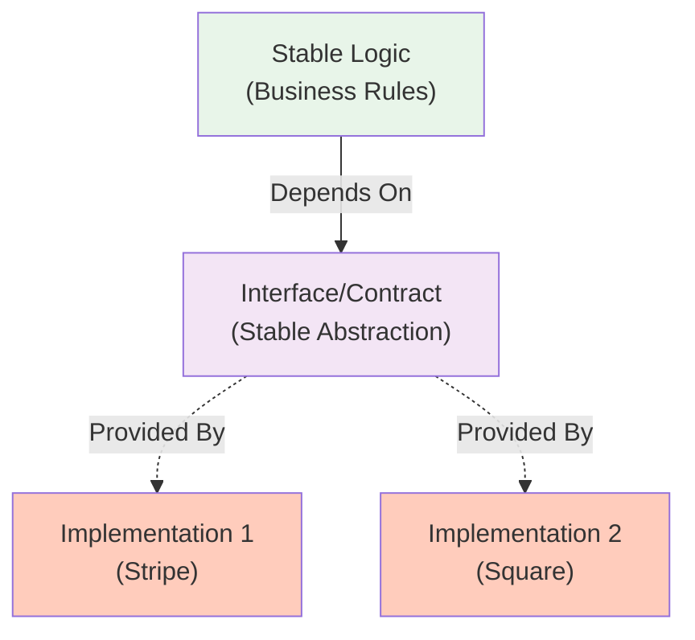

<Hero
  title="Encapsulate What Varies"
  subtitle="Identify volatile aspects of your system and hide them behind stable interfaces to reduce coupling and change impact."
  imageAlt="Encapsulation illustration"
  size="large"
/>

## TL;DR

Identify aspects likely to change: databases, APIs, algorithms, external systems. Encapsulate them behind stable interfaces. When change comes—and it will—you update one module, not dozens. This principle underpins most design patterns. A payment system that encapsulates payment processors won't break when switching providers. Business logic stays clean and independent.

## Learning Objectives

You will be able to:
- Identify what's likely to vary in your system
- Design stable interfaces around volatile code
- Use abstraction to decouple stable from volatile
- Apply this principle through design patterns
- Recognize when variation is hidden and when it's exposed

## Motivating Scenario

An order system processes payments via Stripe. Stripe API calls are scattered throughout: order validation checks Stripe limits, invoicing queries Stripe for transaction status, reporting pulls Stripe data. When the company decides to add Square as an alternative, changing payment providers requires modifying dozens of places.

Encapsulation solves this: create a PaymentProcessor interface. Put Stripe-specific code in StripeProcessor. OrderService depends only on the interface. Adding Square means creating SquareProcessor, changing one dependency injection point. Everything else stays untouched.

## Core Concepts

### Stable vs. Volatile

**Stable code**: business logic, domain rules, core algorithms that rarely change.
**Volatile code**: external dependencies (APIs, databases), implementation choices, anything likely to be swapped.

<Figure caption="Stable Code Depends on Abstraction">

</Figure>

### Interfaces as Contracts

An interface is a contract: "I need something that can do X." It doesn't say how X is done. Multiple implementations can fulfill the contract.

### The Source of Variation

Variation comes from:
- External systems (databases, APIs, services)
- Implementation choices (algorithms, libraries)
- Future requirements (multi-tenant, internationalization)
- Testing needs (mocking, test doubles)

## Practical Example

<Tabs>
<TabItem value="py" label="Python" default>
```python
# ❌ VARIATION EXPOSED - Payment details tangled everywhere
class OrderService:
    def process_order(self, order):
        # Business logic mixed with payment implementation
        if not self._validate_stripe_limits(order.amount):
            raise ValueError("Exceeds Stripe limit")

        # Stripe API call embedded in business logic
        stripe_response = requests.post(
            "https://api.stripe.com/v1/charges",
            headers={"Authorization": f"Bearer {STRIPE_KEY}"},
            data={
                "amount": int(order.amount * 100),
                "currency": "usd",
                "source": order.card_token
            }
        )

        if not stripe_response.ok:
            raise PaymentError("Stripe charge failed")

        order.transaction_id = stripe_response.json()["id"]
        order.status = "paid"
        order.save()

    def _validate_stripe_limits(self, amount):
        # Stripe-specific validation
        return amount <= 100000

class ReportingService:
    def get_payment_status(self, order_id):
        # Direct Stripe API call for reporting
        response = requests.get(
            f"https://api.stripe.com/v1/charges?limit=1",
            headers={"Authorization": f"Bearer {STRIPE_KEY}"}
        )
        # Parse Stripe response...

# ✅ VARIATION ENCAPSULATED - Stable interface
class PaymentProcessor:
    def charge(self, amount, source):
        raise NotImplementedError

class StripeProcessor(PaymentProcessor):
    def __init__(self, api_key):
        self.api_key = api_key

    def charge(self, amount, source):
        """Stripe-specific implementation hidden here."""
        response = requests.post(
            "https://api.stripe.com/v1/charges",
            headers={"Authorization": f"Bearer {self.api_key}"},
            data={
                "amount": int(amount * 100),
                "currency": "usd",
                "source": source
            }
        )
        if not response.ok:
            raise PaymentError("Charge failed")
        return response.json()["id"]

class SquareProcessor(PaymentProcessor):
    def __init__(self, access_token):
        self.access_token = access_token

    def charge(self, amount, source):
        """Square-specific implementation hidden here."""
        response = requests.post(
            "https://connect.squareup.com/v2/payments",
            headers={"Authorization": f"Bearer {self.access_token}"},
            json={"sourceId": source, "amount": int(amount * 100)}
        )
        if not response.ok:
            raise PaymentError("Charge failed")
        return response.json()["payment"]["id"]

class OrderService:
    def __init__(self, payment_processor):
        self.processor = payment_processor

    def process_order(self, order):
        """Pure business logic - no variation."""
        # Only knows about stable interface
        transaction_id = self.processor.charge(order.amount, order.card_token)

        order.transaction_id = transaction_id
        order.status = "paid"
        order.save()

# Usage - business logic is stable, processor is pluggable
service = OrderService(StripeProcessor(api_key="sk_live_..."))
# Later, swap implementations without changing OrderService
service = OrderService(SquareProcessor(access_token="..."))
```
</TabItem>
<TabItem value="go" label="Go">
```go
// ❌ VARIATION EXPOSED - Payment tangled with business logic
func ProcessOrder(order Order, paymentMethod string) error {
    var transactionID string

    if paymentMethod == "stripe" {
        // Stripe-specific code
        body := url.Values{}
        body.Set("amount", fmt.Sprintf("%d", int(order.Total*100)))
        body.Set("currency", "usd")
        body.Set("source", order.CardToken)

        resp, err := http.PostForm("https://api.stripe.com/v1/charges", body)
        if err != nil {
            return err
        }
        var stripeResp map[string]interface{}
        json.NewDecoder(resp.Body).Decode(&stripeResp)
        transactionID = stripeResp["id"].(string)

    } else if paymentMethod == "square" {
        // Square-specific code
        client := squareup.NewClient(accessToken)
        payment := &square.Payment{
            SourceID: order.SourceID,
            Amount:   int64(order.Total * 100),
        }
        result, err := client.Payments().Create(context.Background(), payment)
        if err != nil {
            return err
        }
        transactionID = result.ID
    }

    order.TransactionID = transactionID
    order.Status = "paid"
    return order.Save()
}

// ✅ VARIATION ENCAPSULATED - Stable interface
type PaymentProcessor interface {
    Charge(ctx context.Context, amount float64, source string) (string, error)
}

type StripeProcessor struct {
    apiKey string
}

func (sp *StripeProcessor) Charge(ctx context.Context, amount float64, source string) (string, error) {
    body := url.Values{}
    body.Set("amount", fmt.Sprintf("%d", int(amount*100)))
    body.Set("currency", "usd")
    body.Set("source", source)

    resp, err := http.PostForm("https://api.stripe.com/v1/charges", body)
    if err != nil {
        return "", err
    }
    var result map[string]interface{}
    json.NewDecoder(resp.Body).Decode(&result)
    return result["id"].(string), nil
}

type SquareProcessor struct {
    client *squareup.Client
}

func (sp *SquareProcessor) Charge(ctx context.Context, amount float64, source string) (string, error) {
    payment := &square.Payment{
        SourceID: source,
        Amount:   int64(amount * 100),
    }
    result, err := sp.client.Payments().Create(ctx, payment)
    if err != nil {
        return "", err
    }
    return result.ID, nil
}

type OrderService struct {
    payments PaymentProcessor
}

func (os *OrderService) ProcessOrder(order Order) error {
    // Pure business logic - variation encapsulated
    transactionID, err := os.payments.Charge(context.Background(), order.Total, order.PaymentSource)
    if err != nil {
        return err
    }

    order.TransactionID = transactionID
    order.Status = "paid"
    return order.Save()
}

// Usage - swap implementations as needed
service := &OrderService{payments: &StripeProcessor{apiKey: key}}
// or
service := &OrderService{payments: &SquareProcessor{client: client}}
```
</TabItem>
<TabItem value="js" label="Node.js">
```javascript
// ❌ VARIATION EXPOSED - Payment details tangled
async function processOrder(order, paymentMethod) {
    let transactionId;

    if (paymentMethod === 'stripe') {
        const response = await fetch('https://api.stripe.com/v1/charges', {
            method: 'POST',
            headers: {'Authorization': `Bearer ${STRIPE_KEY}`},
            body: new URLSearchParams({
                amount: Math.floor(order.total * 100),
                currency: 'usd',
                source: order.cardToken
            })
        });
        const data = await response.json();
        transactionId = data.id;

    } else if (paymentMethod === 'square') {
        const response = await fetch('https://connect.squareup.com/v2/payments', {
            method: 'POST',
            headers: {'Authorization': `Bearer ${SQUARE_TOKEN}`},
            body: JSON.stringify({
                sourceId: order.sourceId,
                amountMoney: {
                    amount: Math.floor(order.total * 100),
                    currency: 'USD'
                }
            })
        });
        const data = await response.json();
        transactionId = data.payment.id;
    }

    order.transactionId = transactionId;
    order.status = 'paid';
    await order.save();
}

// ✅ VARIATION ENCAPSULATED - Clean interface
class PaymentProcessor {
    async charge(amount, source) {
        throw new Error('Not implemented');
    }
}

class StripeProcessor extends PaymentProcessor {
    constructor(apiKey) {
        super();
        this.apiKey = apiKey;
    }

    async charge(amount, source) {
        const response = await fetch('https://api.stripe.com/v1/charges', {
            method: 'POST',
            headers: {'Authorization': `Bearer ${this.apiKey}`},
            body: new URLSearchParams({
                amount: Math.floor(amount * 100),
                currency: 'usd',
                source: source
            })
        });
        const data = await response.json();
        return data.id;
    }
}

class SquareProcessor extends PaymentProcessor {
    constructor(accessToken) {
        super();
        this.accessToken = accessToken;
    }

    async charge(amount, source) {
        const response = await fetch('https://connect.squareup.com/v2/payments', {
            method: 'POST',
            headers: {'Authorization': `Bearer ${this.accessToken}`},
            body: JSON.stringify({
                sourceId: source,
                amountMoney: {
                    amount: Math.floor(amount * 100),
                    currency: 'USD'
                }
            })
        });
        const data = await response.json();
        return data.payment.id;
    }
}

class OrderService {
    constructor(paymentProcessor) {
        this.processor = paymentProcessor;
    }

    async processOrder(order) {
        const transactionId = await this.processor.charge(
            order.total,
            order.paymentSource
        );
        order.transactionId = transactionId;
        order.status = 'paid';
        await order.save();
    }
}

// Usage - swap implementations
const service = new OrderService(new StripeProcessor(apiKey));
// Later: new OrderService(new SquareProcessor(token))
```
</TabItem>
</Tabs>

## When to Use / When Not to Use

<Showcase>
  <div>
    <h4>✓ Encapsulate When</h4>
    <ul>
      <li>Code depends on external systems likely to change</li>
      <li>Different implementations of same behavior exist</li>
      <li>Business logic depends on implementation details</li>
      <li>Testing requires mocking or substitution</li>
      <li>Change in one area shouldn't affect others</li>
    </ul>
  </div>
  <div>
    <h4>✗ Avoid Over-Encapsulation When</h4>
    <ul>
      <li>No variation exists or ever will exist</li>
      <li>Creating interface adds more complexity than benefit</li>
      <li>Variation is one-time, not ongoing</li>
      <li>Simple straightforward code is better than abstraction</li>
      <li>Early project stages with unclear requirements</li>
    </ul>
  </div>
</Showcase>

## Patterns and Pitfalls

### Pitfall: Over-Encapsulation

Creating abstractions for everything adds needless complexity.

```python
# ❌ Over-encapsulated - abstraction for no variation
class SystemTime:
    def now(self):
        raise NotImplementedError

class RealTime(SystemTime):
    def now(self):
        return datetime.now()

# ✅ Simple - just use the function
import datetime
datetime.now()
```

### Pattern: Strategy Pattern

Encapsulate algorithms where multiple strategies exist.

### Pattern: Adapter Pattern

Encapsulate differences between systems with adapters.

## Design Review Checklist

<Checklist
  items={[
    "What aspects of this code are likely to change?",
    "Are volatile aspects exposed to stable code?",
    "Could different implementations be swapped easily?",
    "Does the interface capture the stable contract?",
    "Is variation hidden behind a clean abstraction?",
    "Are there multiple implementations of this interface?",
    "Is encapsulation justified by actual variation?",
    "Would removing the abstraction simplify the code?"
  ]}
/>

## Self-Check

1. What aspects of your system change frequently? Are they encapsulated?

2. If you needed to swap payment providers, how many places would change?

3. Are you creating interfaces for variation that doesn't exist?

:::info
**One Takeaway**: Identify what varies and encapsulate it behind stable interfaces. This way, when requirements change—and they will—modifications are localized to one module, not scattered throughout your codebase.

:::

## Next Steps

- Study the [Strategy pattern](../../design-patterns/behavioral/strategy) for encapsulating algorithms
- Review the [Adapter pattern](../../design-patterns/structural/adapter) for managing variations
- Explore [Dependency Inversion Principle](../solid/dependency-inversion) for stable interfaces
- Learn about Factory patterns for object creation

## References

1. Gamma, E., Helm, R., Johnson, R., & Vlissides, J. (1994). Design Patterns: Elements of Reusable Object-Oriented Software. Addison-Wesley Professional.
2. Martin, R. C. (2008). Clean Code: A Handbook of Agile Software Craftsmanship. Prentice Hall.
3. Freeman, E., & Freeman, E. (2004). Head First Design Patterns. O'Reilly Media.
4. McConnell, S. (2004). Code Complete: A Practical Handbook of Software Construction (2nd ed.). Microsoft Press.
