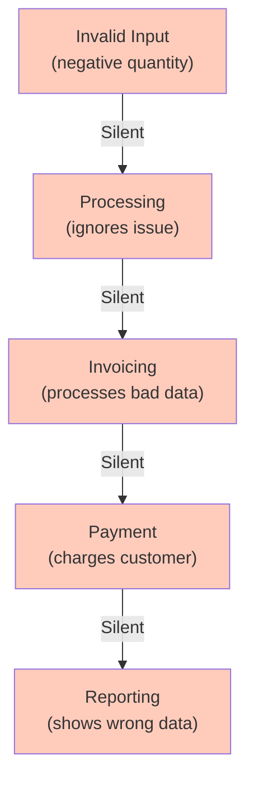

<Hero
  title="Fail Fast"
  subtitle="Detect and report errors immediately to prevent silent failures, data corruption, and cascading problems."
  imageAlt="Fail Fast principle illustration"
  size="large"
/>

## TL;DR

When something wrong happens, fail immediately with a clear error rather than silently continuing with bad data. This prevents cascading failures, makes bugs easier to find, and protects system integrity. Fail fast requires validation at boundaries, assertions for invariants, and explicit error handling. A function operating on invalid data should fail at the entrance, not propagate the error downstream.

## Learning Objectives

You will be able to:
- Identify where to detect errors in code
- Design validation at system boundaries
- Use assertions effectively for invariants
- Distinguish between recoverable and unrecoverable errors
- Recognize silent failures and fix them

## Motivating Scenario

An order processing system accepts an order with a negative quantity. It silently processes it, creates an invoice, charges the customer, and marks inventory as negative. Six hours later, reports are wrong, inventory is corrupted, and the customer complains. Tracing the bug back to the source takes days.

Fail fast prevents this: validate the order when received. If quantity is negative, reject it immediately with "Invalid quantity: must be positive." The error is caught at the boundary, fixed in minutes, and bad data never enters the system.

## Core Concepts

### Silent Failures

Silent failures occur when a system operates on invalid data without notification. The error occurs somewhere early, but downstream code doesn't know, producing subtle wrong results.

<Figure caption="Silent Failure Cascade">

</Figure>

### Fail-Fast Barriers

Validate at system boundaries: API endpoints, function entry points, data stores. Catch problems where they enter, preventing propagation.

### Assertions vs. Exceptions

**Assertions** check invariants you believe are always true. Fail in development to catch logic errors.
**Exceptions** handle errors that can happen and should be caught. Fail to inform callers.

## Practical Example

<Tabs>
<TabItem value="py" label="Python" default>
```python
# ❌ SILENT FAILURE - Bad data silently propagates
class Order:
    def __init__(self, items, quantity):
        self.items = items
        self.quantity = quantity  # No validation!

    def calculate_total(self):
        # Silently uses bad quantity
        return sum(item.price for item in self.items) * self.quantity

    def create_invoice(self):
        # Operates on invalid state
        return {
            'items': self.items,
            'quantity': self.quantity,
            'total': self.calculate_total()
        }

# Negative quantity silently creates wrong invoice
order = Order(['Widget'], -5)
invoice = order.create_invoice()  # {'quantity': -5, 'total': -250}

# ✅ FAIL FAST - Errors caught at boundaries
class Order:
    def __init__(self, items, quantity):
        # Validate immediately at entry
        if not items:
            raise ValueError("Order must have at least one item")
        if quantity <= 0:
            raise ValueError(f"Quantity must be positive, got {quantity}")
        if not isinstance(quantity, int):
            raise TypeError(f"Quantity must be integer, got {type(quantity)}")

        self.items = items
        self.quantity = quantity

    def calculate_total(self):
        # Can assume valid state
        return sum(item.price for item in self.items) * self.quantity

    def create_invoice(self):
        # Safe to proceed - all invariants hold
        return {
            'items': self.items,
            'quantity': self.quantity,
            'total': self.calculate_total()
        }

# Bad data rejected immediately
try:
    order = Order(['Widget'], -5)
except ValueError as e:
    print(f"Error: {e}")  # "Error: Quantity must be positive, got -5"

# API endpoint - validate and fail fast
@app.post('/orders')
def create_order(request):
    # Validate at boundary
    data = request.json
    try:
        order = Order(data['items'], data['quantity'])
    except (ValueError, TypeError) as e:
        return {'error': str(e)}, 400  # Fast failure with clear message

    # Process trusted data
    order.create_invoice()
    return {'success': True}
```
</TabItem>
<TabItem value="go" label="Go">
```go
// ❌ SILENT FAILURE - Ignores errors, propagates bad state
func ProcessOrder(quantity int) Order {
    order := Order{Quantity: quantity}
    // No validation - silently accepts negative

    total := order.CalculateTotal()
    // Uses bad quantity: -5 * price = negative total

    invoice := GenerateInvoice(order)
    // Generates invoice with negative amount

    return order
}

// ✅ FAIL FAST - Validates at boundary
type Order struct {
    Items    []Item
    Quantity int
}

func NewOrder(items []Item, quantity int) (*Order, error) {
    // Validate immediately at construction
    if len(items) == 0 {
        return nil, errors.New("order must have at least one item")
    }
    if quantity <= 0 {
        return nil, fmt.Errorf("quantity must be positive, got %d", quantity)
    }

    return &Order{
        Items:    items,
        Quantity: quantity,
    }, nil
}

func (o *Order) CalculateTotal() float64 {
    // Can assume valid state
    total := 0.0
    for _, item := range o.Items {
        total += item.Price
    }
    return total * float64(o.Quantity)
}

// API handler - validate and fail fast
func CreateOrderHandler(w http.ResponseWriter, r *http.Request) {
    var req struct {
        Items    []Item `json:"items"`
        Quantity int    `json:"quantity"`
    }

    json.NewDecoder(r.Body).Decode(&req)

    // Fail fast at boundary
    order, err := NewOrder(req.Items, req.Quantity)
    if err != nil {
        w.WriteHeader(http.StatusBadRequest)
        json.NewEncoder(w).Encode(map[string]string{"error": err.Error()})
        return
    }

    // Proceed with validated order
    invoice := order.GenerateInvoice()
    w.Header().Set("Content-Type", "application/json")
    json.NewEncoder(w).Encode(invoice)
}
```
</TabItem>
<TabItem value="js" label="Node.js">
```javascript
// ❌ SILENT FAILURE - No validation, bad data propagates
class Order {
    constructor(items, quantity) {
        this.items = items;
        this.quantity = quantity;  // No validation
    }

    calculateTotal() {
        // Silently uses invalid quantity
        return this.items.reduce((sum, item) => sum + item.price, 0) * this.quantity;
    }

    createInvoice() {
        return {
            items: this.items,
            quantity: this.quantity,
            total: this.calculateTotal()  // Wrong total!
        };
    }
}

const order = new Order(['Widget'], -5);
const invoice = order.createInvoice();  // {quantity: -5, total: -250}

// ✅ FAIL FAST - Validate at boundaries
class Order {
    constructor(items, quantity) {
        // Validate immediately
        if (!items || items.length === 0) {
            throw new Error('Order must have at least one item');
        }
        if (typeof quantity !== 'number' || quantity <= 0) {
            throw new Error(`Quantity must be positive number, got ${quantity}`);
        }

        this.items = items;
        this.quantity = quantity;
    }

    calculateTotal() {
        // Safe to operate - state is valid
        return this.items.reduce((sum, item) => sum + item.price, 0) * this.quantity;
    }

    createInvoice() {
        return {
            items: this.items,
            quantity: this.quantity,
            total: this.calculateTotal()
        };
    }
}

// Bad data rejected immediately
try {
    new Order(['Widget'], -5);
} catch (error) {
    console.error(`Error: ${error.message}`);  // Fast, clear error
}

// API endpoint - validate and fail fast
app.post('/orders', (req, res) => {
    try {
        const order = new Order(req.body.items, req.body.quantity);
        const invoice = order.createInvoice();
        res.json({ success: true, invoice });
    } catch (error) {
        // Fail fast with clear message
        res.status(400).json({ error: error.message });
    }
});
```
</TabItem>
</Tabs>

## When to Use / When Not to Use

<Showcase>
  <div>
    <h4>✓ Fail Fast When</h4>
    <ul>
      <li>Invalid data could corrupt state or cause bugs</li>
      <li>An operation depends on preconditions being met</li>
      <li>Silent failure would hide the real problem</li>
      <li>Early detection saves debugging time</li>
      <li>Data entered externally (APIs, user input)</li>
    </ul>
  </div>
  <div>
    <h4>✗ Don't Over-Validate When</h4>
    <ul>
      <li>Performance is critical and validation is expensive</li>
      <li>Code is internal and you control inputs</li>
      <li>Graceful degradation is more important</li>
      <li>Recovery is possible and preferable</li>
      <li>Invalid state doesn't cause harm</li>
    </ul>
  </div>
</Showcase>

## Patterns and Pitfalls

### Pitfall: Defensive Coding Everywhere

Excessive validation adds complexity. Validate at boundaries where data enters, trust internal code.

### Pattern: Design by Contract

Document preconditions (what must be true), postconditions (what's guaranteed after), and invariants (what's always true).

```python
def transfer(self, from_account, to_account, amount):
    """
    Transfer money between accounts.

    Preconditions:
    - amount > 0
    - from_account.balance >= amount

    Postconditions:
    - from_account.balance decreased by amount
    - to_account.balance increased by amount
    - total money unchanged

    Invariants:
    - All balances >= 0
    """
```

### Pattern: Assertion vs. Exception

- **Assertions**: internal logic errors (programmer mistakes)
- **Exceptions**: external/runtime errors (bad input, missing files)

## Design Review Checklist

<Checklist
  items={[
    "Are inputs validated at system boundaries?",
    "Could invalid data silently propagate through the system?",
    "Are preconditions documented and checked?",
    "Are errors reported clearly with context?",
    "Could a function fail silently without the caller knowing?",
    "Are invariants checked or asserted?",
    "Is validation appropriate for the context?",
    "Are errors caught where they occur or allowed to propagate?"
  ]}
/>

## Self-Check

1. What invalid states could silently propagate in your code?

2. Where should validation happen: at API boundaries, in functions, or both?

3. When you encounter a bug, how quickly can you identify its source? Could fail-fast help?

:::info
**One Takeaway**: Catch problems as early as possible. When data enters your system, validate it immediately. When invariants are violated, fail with a clear error. Silent failures are harder to debug than loud ones. The earlier you detect an error, the easier it is to fix.

:::

## Next Steps

- Study error handling patterns and try-catch strategies
- Review defensive programming techniques
- Explore logging and monitoring for production errors
- Learn about error recovery strategies

## References

1. Martin, R. C. (2008). Clean Code: A Handbook of Agile Software Craftsmanship. Prentice Hall.
2. McConnell, S. (2004). Code Complete: A Practical Handbook of Software Construction (2nd ed.). Microsoft Press.
3. Hunt, A., & Thomas, D. (2019). The Pragmatic Programmer: Your Journey to Mastery in Software Development (2nd ed.). Addison-Wesley Professional.
4. Fowler, M. (2018). Refactoring: Improving the Design of Existing Code (2nd ed.). Addison-Wesley Professional.
