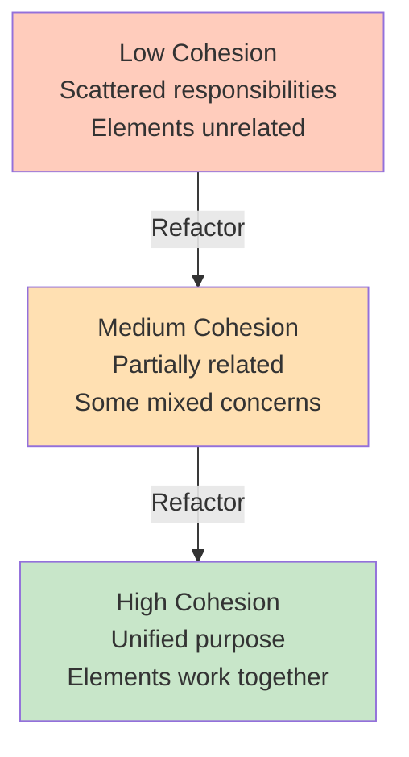

<Hero
  title="High Cohesion, Low Coupling"
  subtitle="Build systems where components relate strongly to their purpose while remaining loosely connected to other components."
  imageAlt="Cohesion and Coupling illustration"
  size="large"
/>

## TL;DR

**Cohesion**: elements within a component should be strongly related and work together toward a single purpose. **Coupling**: dependencies between components should be minimal and loosely connected. High cohesion + low coupling = modular systems that are easy to test, modify, and extend. When a change in one module forces changes in many others, you have low cohesion and high coupling.

## Learning Objectives

You will be able to:
- Distinguish between cohesion and coupling
- Measure and improve cohesion within modules
- Identify types of coupling and reduce unnecessary dependencies
- Design interfaces that minimize coupling
- Recognize when cohesion and coupling are misaligned

## Motivating Scenario

A payment module handles credit card processing, invoice generation, email notifications, and analytics logging—all mixed together. Credit card validation calls invoice functions, which call email senders, which call analytics. A change to invoice format breaks email templates. Adding a new payment method requires understanding the entire module. Testing payment logic requires mocking six other systems.

In contrast: a cohesive payment module handles only payment processing. It delegates invoicing to an invoice service, notifications to a notification service, analytics to an analytics service. These interact through clean interfaces. Each can evolve independently.

## Core Concepts

### Cohesion: Internal Relationship

Cohesion measures whether elements within a module work together toward a unified purpose. High cohesion: elements are tightly related and interdependent. Low cohesion: elements are loosely related and could be separated.

<Figure caption="Cohesion Spectrum">

</Figure>

### Coupling: External Dependency

Coupling measures dependencies between modules. Low coupling: modules depend on minimal external interfaces. High coupling: modules deeply depend on each other's implementations.

### Types of Coupling

**Content Coupling** (worst): Module A directly accesses internals of Module B.
```
A.field = "value"  // Accessing B's internals directly
```

**Common Coupling**: Modules share global state.
```
global_config = ...  // Both modules depend on same global
```

**Control Coupling**: A calls B and tells it how to behave.
```
processPayment(amount, method="direct", retry=True, log=True)  // Too many control options
```

**Data Coupling** (best): Modules depend only on data interfaces.
```
pay(amount)  // Simple, focused interface
```

## Practical Example

<Tabs>
<TabItem value="py" label="Python" default>
```python
# ❌ LOW COHESION + HIGH COUPLING
class PaymentProcessor:
    def process(self, order_id, card):
        # Payment processing (cohesive)
        validate_card(card)
        charge_card(card, order.amount)

        # Invoice generation (not cohesive)
        invoice = Invoice()
        invoice.order_id = order_id
        invoice.items = order.items  # Direct access to order internals
        invoice.save()

        # Email notification (not cohesive)
        email_body = f"Invoice for {invoice.customer_name}..."
        send_email(invoice.customer_email, email_body)

        # Analytics logging (not cohesive)
        global analytics_buffer
        analytics_buffer.append({
            'event': 'payment',
            'order_id': order_id
        })

# ✅ HIGH COHESION + LOW COUPLING
class PaymentProcessor:
    def __init__(self, card_gateway, invoice_service, notifier, analytics):
        self.gateway = card_gateway
        self.invoices = invoice_service
        self.notifier = notifier
        self.analytics = analytics

    def process(self, amount, card_token):
        """Cohesive: only handles payment."""
        # Validate with card gateway
        if not self.gateway.validate_token(card_token):
            raise InvalidCardError()

        # Charge the card
        transaction = self.gateway.charge(card_token, amount)

        # Emit event - others decide what to do with it
        self.analytics.record_event('payment.completed', {
            'amount': amount,
            'transaction_id': transaction.id
        })

        return transaction

class InvoiceService:
    def create_for_order(self, order):
        """Cohesive: only handles invoices."""
        invoice = Invoice(order)
        invoice.save()
        return invoice

class NotificationService:
    def notify_payment_received(self, invoice):
        """Cohesive: only handles notifications."""
        message = self._render_template('payment_received', {'invoice': invoice})
        self.send_email(invoice.customer_email, message)

# Workflow: Each component does one thing
payment_processor.process(amount, card_token)
invoice_service.create_for_order(order)
notifier.notify_payment_received(invoice)
```
</TabItem>
<TabItem value="go" label="Go">
```go
// ❌ LOW COHESION + HIGH COUPLING
type PaymentService struct {
    database *sql.DB
    emailSvc *EmailService
    // ... many other dependencies
}

func (ps *PaymentService) ProcessPayment(orderID int, card *Card) error {
    // Payment logic (cohesive)
    if !ps.validateCard(card) {
        return errors.New("invalid card")
    }
    txn, err := ps.chargeCard(card, amount)
    if err != nil {
        return err
    }

    // Invoice generation (not cohesive - direct DB access)
    var order Order
    ps.database.QueryRow("SELECT * FROM orders WHERE id=?", orderID).Scan(&order)
    invoiceID := uuid.New().String()
    ps.database.Exec("INSERT INTO invoices ...", invoiceID, order.CustomerID)

    // Email (not cohesive - mixed in)
    ps.emailSvc.Send(order.Email, "Payment received")

    // Analytics (not cohesive - mixed in)
    ps.recordAnalytics("payment_processed")

    return nil
}

// ✅ HIGH COHESION + LOW COUPLING
type PaymentGateway interface {
    ValidateToken(token string) bool
    Charge(token string, amount float64) (*Transaction, error)
}

type EventRecorder interface {
    RecordEvent(eventType string, data map[string]interface{})
}

type PaymentService struct {
    gateway PaymentGateway
    events  EventRecorder
}

func (ps *PaymentService) ProcessPayment(amount float64, cardToken string) (*Transaction, error) {
    // Only handles payment concerns
    if !ps.gateway.ValidateToken(cardToken) {
        return nil, errors.New("invalid card")
    }

    txn, err := ps.gateway.Charge(cardToken, amount)
    if err != nil {
        return nil, err
    }

    // Emit event - others respond
    ps.events.RecordEvent("payment.completed", map[string]interface{}{
        "amount":        amount,
        "transactionID": txn.ID,
    })

    return txn, nil
}

type InvoiceService struct {
    repository InvoiceRepository
}

func (is *InvoiceService) CreateForOrder(order Order) (*Invoice, error) {
    // Only handles invoice creation
    invoice := NewInvoice(order)
    return is.repository.Save(invoice)
}
```
</TabItem>
<TabItem value="js" label="Node.js">
```javascript
// ❌ LOW COHESION + HIGH COUPLING
class PaymentProcessor {
    async processPayment(orderId, cardToken) {
        // Payment logic (cohesive)
        if (!this.validateCard(cardToken)) throw new Error('Invalid card');
        const txn = await this.chargeCard(cardToken, amount);

        // Invoice generation (not cohesive - accessing order internals)
        const order = await db.query('SELECT * FROM orders WHERE id=?', orderId);
        const invoice = {
            orderId: order.id,
            items: order.items,  // Tight coupling to order structure
            customer: order.customer
        };
        await db.query('INSERT INTO invoices ...', invoice);

        // Email (not cohesive)
        await emailService.send(order.email, 'Payment received');

        // Analytics (not cohesive)
        analyticsBuffer.push({ event: 'payment', orderId });

        return txn;
    }
}

// ✅ HIGH COHESION + LOW COUPLING
class PaymentService {
    constructor(cardGateway, eventBus) {
        this.gateway = cardGateway;
        this.events = eventBus;
    }

    async processPayment(amount, cardToken) {
        // Only handles payment
        if (!this.gateway.validateToken(cardToken)) {
            throw new Error('Invalid card');
        }

        const transaction = await this.gateway.charge(cardToken, amount);

        // Emit event - others listen
        this.events.emit('payment.completed', {
            amount,
            transactionId: transaction.id
        });

        return transaction;
    }
}

class InvoiceService {
    async createForOrder(order) {
        // Only handles invoices
        const invoice = {
            orderId: order.id,
            customerId: order.customerId
        };
        return db.query('INSERT INTO invoices ...', invoice);
    }
}

// Usage: Clean separation
await paymentService.processPayment(100, tokenId);
const invoice = await invoiceService.createForOrder(order);
await notificationService.send(invoice);
```
</TabItem>
</Tabs>

## When to Use / When Not to Use

<Showcase>
  <div>
    <h4>✓ Increase Cohesion When</h4>
    <ul>
      <li>Functions in a module don't work together</li>
      <li>Module changes for multiple unrelated reasons</li>
      <li>Difficult to understand what a module does</li>
      <li>Testing requires mocking many external systems</li>
      <li>One feature change ripples through multiple modules</li>
    </ul>
  </div>
  <div>
    <h4>✓ Decrease Coupling When</h4>
    <ul>
      <li>Modules have direct dependencies on internals</li>
      <li>Modules share global state</li>
      <li>Changing one module forces changes elsewhere</li>
      <li>Difficult to test modules independently</li>
      <li>Modules could evolve independently but don't</li>
    </ul>
  </div>
</Showcase>

## Patterns and Pitfalls

### Pitfall: Cohesion Through Size

Creating a small module with unrelated functions doesn't create cohesion. Cohesion requires elements to work toward a unified purpose.

### Pattern: Dependency Injection

Use dependency injection to reduce coupling:
```python
# High coupling - hard dependency
class PaymentProcessor:
    def __init__(self):
        self.gateway = StripeGateway()  # Hard dependency

# Low coupling - injected dependency
class PaymentProcessor:
    def __init__(self, gateway):
        self.gateway = gateway  # Can be any gateway
```

### Pattern: Event-Driven Architecture

Use events to decouple modules:
```python
# Tightly coupled - direct function call
payment_processor.process()
invoice_service.create_invoice()

# Loosely coupled - event-driven
event_bus.emit('payment.completed')  # Multiple listeners can respond
```

## Design Review Checklist

<Checklist
  items={[
    "Do all elements in this module work toward one purpose?",
    "Does this module handle multiple unrelated concerns?",
    "Can you understand this module without understanding others?",
    "Does changing one module force changes in many others?",
    "Can you test this module without mocking many dependencies?",
    "Does this module depend on internals of other modules?",
    "Are dependencies explicit and minimal?",
    "Could another module be substituted for a dependency?"
  ]}
/>

## Self-Check

1. Pick a module in your codebase. Can you explain its purpose in one sentence? If not, it likely has low cohesion.

2. How many modules must change when you change how you store data? Ideally just one (the persistence layer).

3. Can you test a module's business logic without setting up databases or external services?

:::info
**One Takeaway**: High cohesion means a module does one thing well. Low coupling means modules are independent and can evolve separately. Together, they create systems that are testable, maintainable, and flexible.

:::

## Next Steps

- Review [Separation of Concerns](./separation-of-concerns) for organizing responsibilities
- Study [Single Responsibility Principle](../solid/single-responsibility) for module design
- Explore [Law of Demeter](./law-of-demeter) for managing dependencies
- Learn about event-driven architecture for decoupling systems

## References

1. Stevens, W. P., Myers, G. J., & Constantine, L. L. (1974). Structured design. IBM Systems Journal.
2. Martin, R. C. (2008). Clean Code: A Handbook of Agile Software Craftsmanship. Prentice Hall.
3. Newman, S. (2015). Building Microservices: Designing Fine-Grained Systems. O'Reilly Media.
4. Fowler, M. (2002). Patterns of Enterprise Application Architecture. Addison-Wesley Professional.
