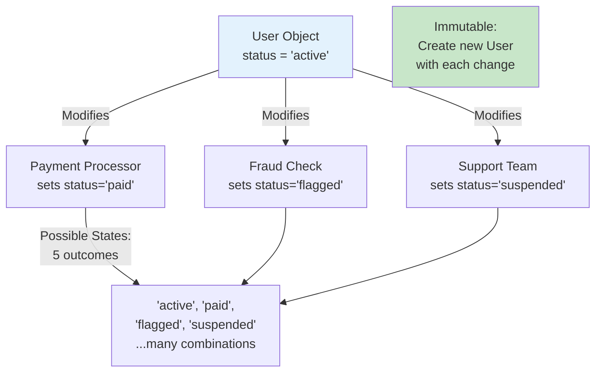

<Hero
  title="Immutability Where Possible"
  subtitle="Prefer immutable data structures to reduce bugs, improve thread safety, and simplify reasoning about code."
  imageAlt="Immutability illustration"
  size="large"
/>

## TL;DR

Immutable data can't be changed after creation. Each modification creates a new version. Benefits: easier reasoning (no side effects), thread safety (no locks), simpler debugging (history is visible). Mutable state makes code harder to understand because the same variable holds different values over time. Use immutability where possible; mutate only when performance demands it or mutability is truly necessary.

## Learning Objectives

You will be able to:
- Recognize problems caused by mutable state
- Design immutable data structures
- Use immutable libraries and patterns
- Balance immutability with performance needs
- Identify when immutability is worth the cost

## Motivating Scenario

A user object has a `status` field. Across the application, various systems modify it: payment processor sets it to "paid," fraud check sets it to "flagged," support team sets it to "suspended." A week later, the status is "flagged" but nobody knows how it got there. Was it fraud detection? Did support flag it? When? The mutable state made it impossible to trace.

With immutability: each status change creates a new User version. The history is visible. You can see the full timeline: "paid" → "flagged" → "paid" → "suspended." Every change is traceable, testable, and reversible.

## Core Concepts

### Mutable State Complexity

Every time a variable changes, it's a new version. If ten places can modify it, there are many possible states. This exponential complexity makes code hard to reason about.

<Figure caption="State Space Complexity">

</Figure>

### Thread Safety

Immutable data is inherently thread-safe. Multiple threads can read safely without locks because nothing changes.

### Referential Transparency

Immutable data enables referential transparency: the same input always produces the same output. This makes reasoning about code much simpler.

## Practical Example

<Tabs>
<TabItem value="py" label="Python" default>
```python
# ❌ MUTABLE - Hard to trace state changes
class User:
    def __init__(self, name, status):
        self.name = name
        self.status = status

    def process_payment(self):
        self.status = "paid"

    def flag_fraud(self):
        self.status = "flagged"

    def suspend(self):
        self.status = "suspended"

# State is unclear and unseen
user = User("Alice", "active")
user.process_payment()  # status is now "paid", no record of change
user.flag_fraud()  # status is now "flagged", old state lost
user.suspend()  # status is now "suspended"

# What states did it go through? Unknown.

# ✅ IMMUTABLE - Full history, easy reasoning
from dataclasses import dataclass
from typing import Tuple

@dataclass(frozen=True)  # frozen=True makes it immutable
class User:
    name: str
    status: str
    timestamp: float

def process_payment(user: User, timestamp: float) -> User:
    """Returns new User with payment status."""
    return User(
        name=user.name,
        status="paid",
        timestamp=timestamp
    )

def flag_fraud(user: User, timestamp: float) -> User:
    """Returns new User with fraud flag."""
    return User(
        name=user.name,
        status="flagged",
        timestamp=timestamp
    )

def suspend(user: User, timestamp: float) -> User:
    """Returns new User with suspended status."""
    return User(
        name=user.name,
        status="suspended",
        timestamp=timestamp
    )

# Immutable transformations create a history
user1 = User("Alice", "active", 100.0)
user2 = process_payment(user1, 101.0)  # New user, old unchanged
user3 = flag_fraud(user2, 102.0)       # New user, user2 unchanged
user4 = suspend(user3, 103.0)          # New user, user3 unchanged

# Full history visible
users = [user1, user2, user3, user4]
for u in users:
    print(f"{u.status} at {u.timestamp}")

# Thread-safe: all versions exist simultaneously, no locks needed
```
</TabItem>
<TabItem value="go" label="Go">
```go
// ❌ MUTABLE - Dangerous with concurrency
type User struct {
    Name   string
    Status string
}

func (u *User) ProcessPayment() {
    u.Status = "paid"  // Modifies in place
}

func (u *User) FlagFraud() {
    u.Status = "flagged"
}

// If two goroutines call these concurrently, race condition!
// u.Status changes unpredictably

// ✅ IMMUTABLE - Thread-safe by design
type User struct {
    Name      string
    Status    string
    Timestamp int64
}

// Immutable functions return new User
func ProcessPayment(u User, timestamp int64) User {
    return User{
        Name:      u.Name,
        Status:    "paid",
        Timestamp: timestamp,
    }
}

func FlagFraud(u User, timestamp int64) User {
    return User{
        Name:      u.Name,
        Status:    "flagged",
        Timestamp: timestamp,
    }
}

func Suspend(u User, timestamp int64) User {
    return User{
        Name:      u.Name,
        Status:    "suspended",
        Timestamp: timestamp,
    }
}

// Safe with concurrent access - no locks needed
user1 := User{Name: "Alice", Status: "active", Timestamp: 100}
user2 := ProcessPayment(user1, 101)  // user1 unchanged
user3 := FlagFraud(user2, 102)       // user2 unchanged

// Pass immutable User to concurrent goroutines safely
go func(u User) {
    // Can safely read u - it won't change
    fmt.Println(u.Status)
}(user3)
```
</TabItem>
<TabItem value="js" label="Node.js">
```javascript
// ❌ MUTABLE - Changes are hidden
class User {
    constructor(name, status) {
        this.name = name;
        this.status = status;
    }

    processPayment() {
        this.status = "paid";
    }

    flagFraud() {
        this.status = "flagged";
    }
}

const user = new User("Alice", "active");
user.processPayment();  // user.status is now "paid"
user.flagFraud();       // user.status is now "flagged"
// What happened? Unknown without tracing.

// ✅ IMMUTABLE - History is visible
const createUser = (name, status, timestamp = Date.now()) => ({
    name,
    status,
    timestamp,
    // Object.freeze prevents modification
    __proto__: Object.freeze({})
});

// Use Object.freeze to make truly immutable
const user1 = Object.freeze(createUser("Alice", "active", 100));

const processPayment = (user, timestamp = Date.now()) =>
    Object.freeze({...user, status: "paid", timestamp});

const flagFraud = (user, timestamp = Date.now()) =>
    Object.freeze({...user, status: "flagged", timestamp});

const suspend = (user, timestamp = Date.now()) =>
    Object.freeze({...user, status: "suspended", timestamp});

// Create sequence of immutable versions
const user2 = processPayment(user1, 101);   // user1 unchanged
const user3 = flagFraud(user2, 102);        // user2 unchanged
const user4 = suspend(user3, 103);          // user3 unchanged

// Full history available
const history = [user1, user2, user3, user4];
history.forEach(u => {
    console.log(`${u.status} at ${u.timestamp}`);
});

// Easy to reason about: each user is a snapshot at a moment
// Thread-safe in single-threaded JS (event loop)
// Easy testing: no hidden state
```
</TabItem>
</Tabs>

## When to Use / When Not to Use

<Showcase>
  <div>
    <h4>✓ Use Immutability When</h4>
    <ul>
      <li>Data is shared across multiple parts of the system</li>
      <li>Code runs in concurrent/multi-threaded environments</li>
      <li>Traceability and auditability matter</li>
      <li>You need to undo/redo operations</li>
      <li>Reasoning about state is difficult with mutability</li>
    </ul>
  </div>
  <div>
    <h4>✗ Mutable is Acceptable When</h4>
    <ul>
      <li>Performance is critical and immutability is too slow</li>
      <li>Data is local and never shared</li>
      <li>Large collections that would be expensive to copy</li>
      <li>Single-threaded code with clear control flow</li>
      <li>Mutation is properly encapsulated and controlled</li>
    </ul>
  </div>
</Showcase>

## Patterns and Pitfalls

### Pitfall: Pretend Immutability

Immutability must be deep. Freezing an object that contains mutable references doesn't make it truly immutable.

```javascript
// ❌ Shallow freeze - not truly immutable
const user = Object.freeze({
    name: "Alice",
    profile: { email: "alice@example.com" }
});

user.profile.email = "alice2@example.com";  // Modifies! Not immutable.

// ✅ Deep freeze
const deepFreeze = (obj) => {
    Object.freeze(obj);
    Object.values(obj).forEach(value => {
        if (typeof value === 'object') deepFreeze(value);
    });
    return obj;
};

const immutableUser = deepFreeze({
    name: "Alice",
    profile: { email: "alice@example.com" }
});
```

### Pattern: Copy-on-Write

For performance-critical code, use structural sharing (only copy changed parts):
```python
# Instead of deep copying entire structure,
# only changed nodes are copied
```

### Pattern: Value Objects

Create immutable value objects that represent domain concepts.

## Design Review Checklist

<Checklist
  items={[
    "Is this data shared across multiple parts of the system?",
    "Could mutable state cause bugs from unexpected changes?",
    "Is the data truly immutable (deep, not shallow)?",
    "Would immutability help with testing or reasoning?",
    "Are there uncontrolled mutations happening?",
    "Is the performance cost of immutability acceptable?",
    "Could structural sharing reduce copy overhead?",
    "Is mutation properly encapsulated and controlled?"
  ]}
/>

## Self-Check

1. What data in your system changes? Could it be immutable instead?

2. Have you debugged a bug caused by unexpected state changes? Could immutability have prevented it?

3. Do you have code that's hard to test because of mutable state dependencies?

:::info
**One Takeaway**: Mutable state is the enemy of predictability. Every change is an opportunity for bugs. Use immutability where possible—for domain objects, configuration, shared data. Make mutation explicit and controlled. The less state changes, the easier code is to understand and debug.

:::

## Next Steps

- Explore functional programming languages and concepts
- Learn about immutable data structure libraries for your language
- Study event sourcing for immutable state management
- Review concurrency patterns for immutable-first designs

## References

1. Martin, R. C. (2008). Clean Code: A Handbook of Agile Software Craftsmanship. Prentice Hall.
2. Hickey, R. (2009). The Value of Values. Rich Hickey lecture on immutability.
3. Hunt, A., & Thomas, D. (2019). The Pragmatic Programmer: Your Journey to Mastery in Software Development (2nd ed.). Addison-Wesley Professional.
4. Fowler, M. (2018). Refactoring: Improving the Design of Existing Code (2nd ed.). Addison-Wesley Professional.
