import { useCurrentSidebarCategory } from "@docusaurus/theme-common";

# General Principles

General principles are cross-cutting design heuristics that guide decision-making across all software projects. They transcend specific programming languages, frameworks, and architectural patterns, providing universal guidance for writing code that is maintainable, testable, and resilient to change.

These principles form the foundation upon which more specialized design patterns and architectural approaches are built. They answer fundamental questions: How do we eliminate unnecessary complexity? When should we add features? How do we organize responsibilities? By internalizing these principles, developers build intuition for making good design decisions under uncertainty.

Unlike rigid rules, principles require judgment. They sometimes conflict with each other, and applying them involves trade-offs. The goal is not blind adherence but thoughtful application—understanding the "why" behind each principle so you can make informed decisions about when to apply them and when to break them intentionally.

```mermaid
flowchart TB
    GP["General Principles"]
    DRY["DRY<br/>Don't Repeat Yourself"]
    KISS["KISS<br/>Keep It Simple"]
    YAGNI["YAGNI<br/>You Ain't Gonna Need It"]
    SOC["Separation of Concerns"]
    HCLC["High Cohesion<br/>Low Coupling"]
    COI["Composition<br/>Over Inheritance"]
    LOD["Law of Demeter"]
    EWV["Encapsulate<br/>What Varies"]
    FF["Fail Fast"]
    POLA["Principle of Least<br/>Astonishment"]
    IM["Immutability<br/>Where Possible"]

    GP --> DRY
    GP --> KISS
    GP --> YAGNI
    GP --> SOC
    GP --> HCLC
    GP --> COI
    GP --> LOD
    GP --> EWV
    GP --> FF
    GP --> POLA
    GP --> IM

    style GP fill:#e1f5ff
    style DRY fill:#fff3e0
    style KISS fill:#fff3e0
    style YAGNI fill:#fff3e0
    style SOC fill:#fff3e0
    style HCLC fill:#fff3e0
    style COI fill:#fff3e0
    style LOD fill:#fff3e0
    style EWV fill:#fff3e0
    style FF fill:#fff3e0
    style POLA fill:#fff3e0
    style IM fill:#fff3e0
```

<Figure caption="General Principles Learning Map">

</Figure>

<DocCardList items={useCurrentSidebarCategory().items} />
