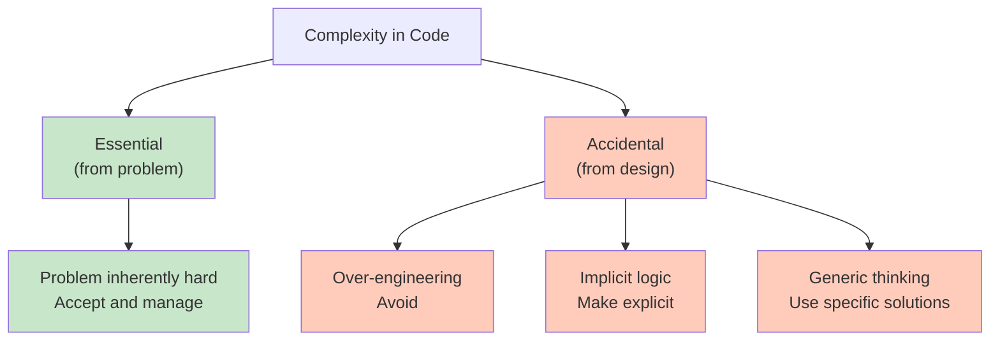

<Hero
  title="KISS: Keep It Simple, Stupid"
  subtitle="Simplicity first: write code that humans understand before optimizing for machines."
  imageAlt="KISS principle illustration"
  size="large"
/>

## TL;DR

Most systems are over-engineered. KISS prioritizes human-readable, straightforward solutions over clever or generic ones. Choose clarity over cleverness, explicit over implicit, and direct solutions over premature generalization. Simpler code costs less to maintain, is easier to test, and contains fewer bugs.

## Learning Objectives

You will be able to:
- Recognize over-engineering and unnecessary complexity
- Write clear, readable code that communicates intent
- Balance simplicity with necessary functionality
- Identify when complexity is justified versus when it adds waste
- Refactor toward simplicity without sacrificing correctness

## Motivating Scenario

A developer implements a generic factory pattern to handle three types of configuration loaders (JSON, YAML, and XML). The abstraction is mathematically elegant, with interfaces, registries, and reflection. Six months later, only JSON is used. When a new requirement arrives—support TOML—the complex abstraction actually hinders adoption because understanding it requires navigating multiple layers.

A simpler approach: conditional logic that's immediately obvious. "If JSON, use JSONLoader. If YAML, use YAMLLoader." This trades mathematical beauty for directness and clarity.

## Core Concepts

### Simplicity vs. Complexity

Simplicity means a solution is easy to understand and reason about. Complexity can be essential (from the problem domain) or accidental (from poor design choices). KISS targets accidental complexity.

<Figure caption="Sources of Complexity">

</Figure>

### Clear Intent

Simple code makes intent obvious. A reader should understand what the code does without being a domain expert or reading ten layers of abstraction.

### Direct Solutions

The most direct solution is often the simplest. Avoid premature generalization. Specific, straightforward logic beats generic frameworks until generalization is proven necessary.

### Readability Over Cleverness

Code is read 100 times for every time it's written. Optimize for readers. A solution that's slightly longer but immediately clear beats a clever one-liner that requires decoding.

## Practical Example

<Tabs>
<TabItem value="py" label="Python" default>
```python
# ❌ OVER-ENGINEERED - Generic, clever, hard to understand
class StrategyFactory:
    _strategies = {}

    @classmethod
    def register(cls, name):
        def decorator(strategy_class):
            cls._strategies[name] = strategy_class
            return strategy_class
        return decorator

    @classmethod
    def create(cls, name, *args, **kwargs):
        if name not in cls._strategies:
            raise ValueError(f"Unknown strategy: {name}")
        return cls._strategies[name](*args, **kwargs)

@StrategyFactory.register("discount")
class DiscountStrategy:
    def calculate(self, price): return price * 0.9

@StrategyFactory.register("bulk")
class BulkStrategy:
    def calculate(self, price): return price * 0.8

# Usage is obtuse
strategy = StrategyFactory.create("discount")
result = strategy.calculate(100)

# ✅ SIMPLE - Direct, obvious, easy to understand
def apply_discount(price):
    """Apply 10% discount to price."""
    return price * 0.9

def apply_bulk_discount(price):
    """Apply 20% bulk discount to price."""
    return price * 0.8

# Usage is crystal clear
result = apply_discount(100)
# or
result = apply_bulk_discount(100)
```
</TabItem>
<TabItem value="go" label="Go">
```go
// ❌ OVER-ENGINEERED - Generic interface pattern, hard to understand
type CalculatorFunc func(float64) float64

type CalculatorRegistry struct {
    calculators map[string]CalculatorFunc
    mu          sync.RWMutex
}

func (r *CalculatorRegistry) Register(name string, fn CalculatorFunc) {
    r.mu.Lock()
    defer r.mu.Unlock()
    r.calculators[name] = fn
}

func (r *CalculatorRegistry) Execute(name string, value float64) float64 {
    r.mu.RLock()
    defer r.mu.RUnlock()
    if fn, exists := r.calculators[name]; exists {
        return fn(value)
    }
    return 0
}

// ✅ SIMPLE - Direct functions, obvious behavior
func ApplyDiscount(price float64) float64 {
    return price * 0.9  // 10% discount
}

func ApplyBulkDiscount(price float64) float64 {
    return price * 0.8  // 20% bulk discount
}

// Usage is immediate and clear
result := ApplyDiscount(100)
```
</TabItem>
<TabItem value="js" label="Node.js">
```javascript
// ❌ OVER-ENGINEERED - Abstract strategy pattern, unnecessary complexity
class StrategyContext {
    setStrategy(strategy) { this.strategy = strategy; }
    execute(value) { return this.strategy.execute(value); }
}

class DiscountStrategy {
    execute(price) { return price * 0.9; }
}

class BulkStrategy {
    execute(price) { return price * 0.8; }
}

const context = new StrategyContext();
context.setStrategy(new DiscountStrategy());
const result = context.execute(100);

// ✅ SIMPLE - Plain functions, immediate understanding
const applyDiscount = (price) => price * 0.9;
const applyBulkDiscount = (price) => price * 0.8;

// Usage is obvious
const result = applyDiscount(100);
```
</TabItem>
</Tabs>

## When to Use / When Not to Use

<Showcase>
  <div>
    <h4>✓ Prioritize Simplicity When</h4>
    <ul>
      <li>The problem is straightforward and doesn't require abstraction</li>
      <li>Team members can understand the solution immediately</li>
      <li>Generalization isn't proven necessary yet</li>
      <li>Readability and maintainability matter more than performance</li>
      <li>Code will be modified by multiple developers</li>
    </ul>
  </div>
  <div>
    <h4>✗ Accept Complexity When</h4>
    <ul>
      <li>The problem domain genuinely demands it</li>
      <li>Performance is critical and simplicity costs too much</li>
      <li>Abstraction is proven necessary by repeated patterns</li>
      <li>Industry standards or frameworks require it</li>
      <li>Safety or security concerns justify additional layers</li>
    </ul>
  </div>
</Showcase>

## Patterns and Pitfalls

### Pitfall: Premature Optimization

Adding complexity in the name of performance before profiling is the most common KISS violation. Optimize what matters after measurement, not before.

### Pattern: Name Things Well

Naming is one of the simplest ways to reduce complexity. A well-named function or variable makes code self-documenting.

```python
# ❌ Unclear
def calc(x, y):
    return x * y * 0.1

# ✅ Clear
def calculate_commission(sale_amount, commission_rate):
    return sale_amount * commission_rate * 0.1
```

### Pitfall: Architecture Theater

Building elaborate architectures because "that's how it's done" adds complexity without benefit. Start simple and evolve toward complexity only when needed.

## Design Review Checklist

<Checklist
  items={[
    "Can a junior developer understand this code in 5 minutes?",
    "Does this code do exactly what it needs to, no more?",
    "Are there unnecessary abstractions or layers?",
    "Is the solution more general than the problem requires?",
    "Are variable and function names clear and descriptive?",
    "Would a simpler approach still work?",
    "Is there implicit behavior that requires domain knowledge?",
    "Does complexity justify itself with clear benefits?"
  ]}
/>

## Real-World Complexity Examples

### Example 1: Configuration Loading

**Overly Generic (Bad)**
```python
class ConfigStrategy(ABC):
    @abstractmethod
    def load(self): pass

class YAMLConfigStrategy(ConfigStrategy):
    def load(self): ...

class JSONConfigStrategy(ConfigStrategy):
    def load(self): ...

class XMLConfigStrategy(ConfigStrategy):
    def load(self): ...

registry = ConfigStrategyRegistry()
config = registry.get('yaml').load()  # Over-engineered for 3 formats
```

**Simple (Good)**
```python
def load_config(format='yaml'):
    if format == 'yaml':
        with open('config.yaml') as f:
            return yaml.safe_load(f)
    elif format == 'json':
        with open('config.json') as f:
            return json.load(f)
    elif format == 'xml':
        return xml.parse('config.xml')
    else:
        raise ValueError(f"Unknown format: {format}")

config = load_config()  # Clear, obvious, easy to modify
```

The simple version is immediately understandable. Adding a format? Add one line. Refactoring? 10 lines to understand. Generic version requires understanding registry pattern, strategy pattern, all types. More code doesn't mean more functionality—it means more hidden.

### Example 2: Data Validation

**Over-Engineered (Bad)**
```python
class ValidatorChain:
    def __init__(self):
        self.validators = []

    def add(self, validator):
        self.validators.append(validator)
        return self

    def validate(self, data):
        for validator in self.validators:
            if not validator(data):
                return False
        return True

class EmailValidator(Validator):
    def validate(self, data):
        return '@' in data.get('email', '')

class AgeValidator(Validator):
    def validate(self, data):
        return data.get('age', 0) >= 18

# Usage
chain = ValidatorChain()
chain.add(EmailValidator()).add(AgeValidator())
if chain.validate(user):
    pass
```

**Simple (Good)**
```python
def validate_user(user):
    if '@' not in user.get('email', ''):
        raise ValueError("Invalid email")
    if user.get('age', 0) < 18:
        raise ValueError("User too young")
    return True

# Usage
if validate_user(user):
    pass
```

The simple version: 4 lines. Over-engineered: 30+ lines across multiple classes. Both do the same thing. Which is easier to debug? Easier to maintain? Easier to extend?

### Example 3: Logging

**Overly Generic (Bad)**
```python
class LoggerFactory:
    _loggers = {}

    @classmethod
    def get_logger(cls, name):
        if name not in cls._loggers:
            cls._loggers[name] = Logger(name)
        return cls._loggers[name]

class Logger:
    def __init__(self, name):
        self.name = name
        self.level = LogLevel.INFO
        self.handlers = []

    def log(self, level, message):
        # Complex filtering logic
        pass

logger = LoggerFactory.get_logger('myapp')
logger.log(LogLevel.INFO, "Something happened")
```

**Simple (Good)**
```python
import logging

logger = logging.getLogger('myapp')
logger.info("Something happened")
```

Python's standard library handles logging better than custom code. KISS: use what exists. If you need custom behavior, extend—don't rewrite.

## When Not to Follow KISS

KISS isn't absolute. Some domains genuinely require complexity:

**Machine Learning:** Complex algorithms are necessary. Linear regression, neural networks—inherent complexity is justified.

**Cryptography:** Security primitives can't be simplified without losing safety. AES-256 encryption involves math; you can't simplify it to 5 lines.

**Finance:** Regulatory requirements (HIPAA, SOX, PCI) mandate certain structures. Audit trails, access controls, separation of duties—these add complexity legitimately.

**High-Scale Systems:** Managing 1 million requests per second requires distributed systems complexity. Caching, sharding, load balancing—complexity is warranted by requirements.

**Question to Ask:** Does the complexity come from the problem domain, or from the solution design? If from the problem domain, accept it. If from the solution design, simplify.

## Refactoring Toward Simplicity

### Step 1: Identify Accidental Complexity

Read your code. Ask: "Does this complexity solve the business problem, or am I overengineering?"

Examples of accidental complexity:
- Abstraction layers not yet needed
- Design patterns used "just in case"
- Premature optimization before profiling
- Indirect code paths (5 levels of indirection to do one thing)

### Step 2: Extract to Simplest Possible Thing

```python
# Complex before
class UserRepositoryFactory:
    _instance = None
    _config = None

    @classmethod
    def get_instance(cls):
        if cls._instance is None:
            cls._instance = UserRepository(cls._config)
        return cls._instance

# Simpler after
def get_user_repository():
    return UserRepository(config)

# Even simpler if using dependency injection
# (injected into constructor)
```

### Step 3: Test, Then Remove

After simplifying, run tests. If tests pass, the simpler version is correct. Delete the old code. Git history preserves it if you need to reference why the complex version existed.

### Step 4: Repeat

Make simplicity a habit. Every code review: "Can this be simpler?" Refactor constantly. Simple codebases age better than complex ones.

## Self-Check

1. What's the simplest way to solve the problem you're working on? Does your current approach beat it, and if so, why?

2. Can you explain your solution to someone unfamiliar with the codebase in 30 seconds? If not, it's likely too complex.

3. Are you adding complexity for a feature that might be needed "someday"? How could you defer that decision? (YAGNI: You Aren't Gonna Need It)

4. If you removed this abstraction/class/pattern, would the code be easier to understand? (Probably yes, so remove it)

5. How many design patterns are in this file? If more than 2, you might be over-engineering.

:::info
**One Takeaway**: Code is written once and read many times. Optimize for reader comprehension, not programmer cleverness. When in doubt, choose the straightforward solution you can explain to a junior developer over the elegant one that requires a PhD to understand. Simple code costs less to maintain, is easier to test, scales better with team growth, and ages gracefully.

:::

## KISS vs. Other Principles

### KISS vs. YAGNI

Both prioritize simplicity, but with different focus:

**KISS:** Simplify the solution. Write code that's easy to understand.
**YAGNI:** Don't add features not yet needed. Avoid premature generalization.

Example: Implementing user registration.

```python
# YAGNI says: don't support 10 auth methods yet
# Just support email/password now

def create_user(email, password):
    if not email or '@' not in email:
        raise ValueError("Invalid email")
    if len(password) < 8:
        raise ValueError("Password too short")
    # Store user
```

Later: "We need social login!" Add it then. Don't add OAuth2 infrastructure today.

**KISS says:** Even if you implement email/password, keep it simple.

```python
# KISS: Simple validation
if not email or '@' not in email:
    raise ValueError("Invalid email")

# KISS violation: Over-engineered validation
from email_validator import validate_email, EmailNotValidError
try:
    valid = validate_email(email, check_deliverability=False)
except EmailNotValidError as e:
    raise ValueError(str(e))
```

### KISS vs. DRY

Both improve code quality, but different concerns:

**KISS:** Don't overcomplicate.
**DRY:** Don't repeat code.

Example: Three endpoints returning user data.

```python
# DRY violation: Code repeated 3 times
def get_user_by_id(user_id):
    user = db.query("SELECT * FROM users WHERE id = ?", user_id)
    return {'id': user.id, 'name': user.name, 'email': user.email}

def get_user_by_email(email):
    user = db.query("SELECT * FROM users WHERE email = ?", email)
    return {'id': user.id, 'name': user.name, 'email': user.email}

def get_user_by_name(name):
    user = db.query("SELECT * FROM users WHERE name = ?", name)
    return {'id': user.id, 'name': user.name, 'email': user.email}

# DRY: Extract common formatting
def _format_user(user):
    return {'id': user.id, 'name': user.name, 'email': user.email}

def get_user_by_id(user_id):
    user = db.query("SELECT * FROM users WHERE id = ?", user_id)
    return _format_user(user)

# KISS violation: Overcomplicated helper
def _format_user(user, fields=None, transformers=None):
    if fields is None:
        fields = ['id', 'name', 'email']
    result = {f: getattr(user, f) for f in fields}
    if transformers:
        for field, fn in transformers.items():
            result[field] = fn(result[field])
    return result
```

## KISS in Specific Domains

### KISS in Machine Learning

Some complexity is necessary for ML. You can't make neural networks "simple."

But you can keep the training pipeline simple:

```python
# Simple pipeline
def train_model(data):
    model = RandomForest(n_estimators=100)
    model.fit(data.X_train, data.y_train)
    return model

# Overcomplicated pipeline (unnecessary)
class MetaLearner(ABC):
    def __init__(self, base_learners):
        self.base_learners = base_learners
        self.weights = None

    def fit(self, X, y):
        # Stacking, ensemble weighting, validation curves...
```

Start simple. Add complexity when results demand it.

### KISS in Web APIs

Simple REST API design:

```python
# Simple (KISS)
GET /users - list users
GET /users/123 - get user 123
POST /users - create user
PUT /users/123 - update user 123
DELETE /users/123 - delete user 123

# Overcomplicated (KISS violation)
GET /users?filter=active&sort=created_at&page=1&limit=20&fields=id,name&include=posts
# Can do everything, very flexible, hard to implement

# Better KISS approach
GET /users - list active users (sensible defaults)
GET /users?status=inactive - filter
GET /users/123?include=posts - include related data
```

## Team-Wide KISS Implementation

**In Code Reviews:**
- "Can this function do one thing more simply?"
- "Does this design pattern add value or complexity?"
- "Can we remove a layer of indirection here?"
- "Is there a standard library function that does this?"

**In Documentation:**
- Explain why complexity exists, if it does
- "This generality is needed because X feature..."
- "This design was over-engineered; we're simplifying in Q2"
- "We chose the simple solution because..."

**In Architecture Decisions:**
- Start with simplest possible design
- Add abstraction only when needed by 2+ cases
- Refactor toward simplicity quarterly
- Ask: "Can we solve this with off-the-shelf tools?"

**In Hiring/Mentoring:**
- Explain: "Our codebase values clarity. We choose simple solutions."
- Praise: "Great refactoring! Much simpler now."
- Coach: "Let's think about the simplest way to solve this."
- Share: "We chose framework X because it's simple, not powerful."

**In Retrospectives:**
- Ask: "Where did complexity cause problems?"
- Ask: "What could we simplify this quarter?"
- Celebrate: "This refactoring removed 500 lines with same functionality!"

## Next Steps

- Explore [YAGNI](./yagni) to complement simplicity with need-driven development
- Learn about [DRY](./dry) to eliminate duplication without over-engineering
- Review [Separation of Concerns](./separation-of-concerns) for organizing complex systems
- Study refactoring techniques for simplifying existing code
- Read [Clean Code by Robert Martin](https://www.oreilly.com/library/view/clean-code-a/9780136083238/) for deeper patterns on simplicity

## References

1. McConnell, S. (2004). Code Complete: A Practical Handbook of Software Construction (2nd ed.). Microsoft Press.
2. Martin, R. C. (2008). Clean Code: A Handbook of Agile Software Craftsmanship. Prentice Hall.
3. Fowler, M. (2018). Refactoring: Improving the Design of Existing Code (2nd ed.). Addison-Wesley Professional.
4. Hunt, A., & Thomas, D. (2019). The Pragmatic Programmer: Your Journey to Mastery in Software Development (2nd ed.). Addison-Wesley Professional.
5. Dijkstra, E. W. (1974). On the role of scientific thought. Springer Berlin Heidelberg.
