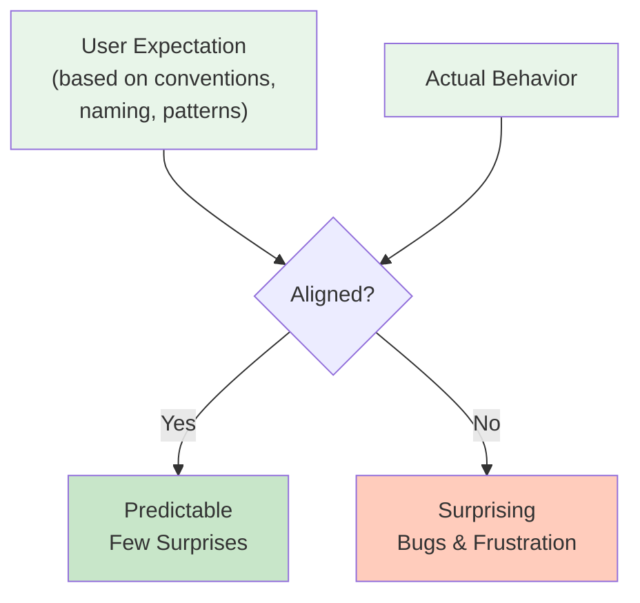

<Hero
  title="Principle of Least Astonishment"
  subtitle="Design systems where behavior matches user expectations, minimizing surprise and confusion."
  imageAlt="Principle of Least Astonishment illustration"
  size="large"
/>

## TL;DR

Design systems so behavior matches what users expect. Surprising behavior—where functions modify inputs, naming doesn't match behavior, or conventions are violated—creates bugs and frustration. Use names that match behavior, follow established conventions, document exceptions, and test against user expectations. Code should feel natural to use, not require deep study of implementation.

## Learning Objectives

You will be able to:
- Recognize surprising behavior and fix it
- Design consistent, predictable interfaces
- Choose names that reflect true behavior
- Follow language and domain conventions
- Test assumptions about user expectations

## Motivating Scenario

A function named `process_user` modifies the input object in-place and returns nothing (None/null). A developer calls it expecting the original to be preserved, gets back null, and loses their data. Separately, a `sort()` function returns a new sorted list instead of modifying in place, the opposite of conventional behavior. These surprises cause bugs that waste hours debugging.

Predictable design prevents this: `process_user` documents whether it modifies in-place. `sort()` follows language conventions (modifying in-place in Python, returning new in functional languages). Names and behavior align.

## Core Concepts

### Expectation Mismatch

Users approach code with mental models based on:
- **Language conventions**: how other functions in the language work
- **Domain patterns**: how similar operations work elsewhere
- **Naming intuition**: what a name suggests about behavior

Surprises occur when code violates these expectations.

<Figure caption="Where Surprises Come From">

</Figure>

### Convention vs. Configuration

Follow established patterns in your language/domain. Violating conventions requires configuration (documentation) to warn users.

## Practical Example

<Tabs>
<TabItem value="py" label="Python" default>
```python
# ❌ SURPRISING - Violates expectations
class User:
    def __init__(self, name):
        self.name = name

    def greet(self, greeting="Hello"):
        # Surprising: mutates self, doesn't return
        self.greeting = greeting

    def reset(self):
        # Surprising: returns True/False but names suggest side effect
        self._reset_internal()
        return True

# Surprising behavior
user = User("Alice")
user.reset()  # What does this return? Unclear from name
result = user.greet("Hi")  # Returns None, but looks like it should return greeting

# Surprising: copy behavior not obvious
original = User("Bob")
copy = original  # Is this a copy or a reference? Unclear

# ✅ PREDICTABLE - Follows conventions
class User:
    def __init__(self, name):
        self.name = name
        self._greeting = "Hello"

    @property
    def greeting(self):
        """Get current greeting (property, read-only behavior expected)."""
        return self._greeting

    def set_greeting(self, greeting):
        """Set greeting (verb form clearly indicates mutation)."""
        self._greeting = greeting

    def reset(self):
        """Reset to defaults (verb, clear it's a side-effect operation)."""
        self._greeting = "Hello"
        # Returns nothing - consistent with convention
        # Or explicitly return self for method chaining:
        return self

    def __copy__(self):
        """Support copy.copy(user) - follows Python convention."""
        return User(self.name)

# Clear behavior
user = User("Alice")
user.set_greeting("Hi")  # Clear it's a setter
greeting = user.greeting  # Clear it's a getter
user.reset()  # Clear it does something

# Expected behavior
from copy import copy
original = User("Bob")
new_copy = copy(original)  # Clear this is a copy
```
</TabItem>
<TabItem value="go" label="Go">
```go
// ❌ SURPRISING - Violates Go conventions
type User struct {
    Name string
}

// Surprising: pointer receiver but named like pure function
func (u *User) String() string {  // This is fine, implements Stringer
    return fmt.Sprintf("User: %s", u.Name)
}

// Surprising: mutation without indication
func (u *User) Process(data string) string {
    // Modifies receiver unexpectedly
    u.processInternal()
    return u.Name + ": " + data
}

// Surprising: inconsistent with language
func (u *User) Greeting() string {
    // Should start with Get if it's a getter in Go convention
    return "Hello"
}

// ✅ PREDICTABLE - Follows Go conventions
type User struct {
    Name string
}

// Implements fmt.Stringer interface - clear pattern
func (u *User) String() string {
    return fmt.Sprintf("User: %s", u.Name)
}

// Pure function - no receiver modification
func ProcessData(u *User, data string) string {
    return u.Name + ": " + data
}

// Clear getter convention
func (u *User) GetGreeting() string {
    return "Hello"
}

// Clear mutator
func (u *User) SetGreeting(greeting string) {
    u.greeting = greeting
}

// Go convention: simple, direct names
type Config struct {
    Host string
    Port int
}

// Create copy
func (c *Config) Copy() *Config {
    return &Config{
        Host: c.Host,
        Port: c.Port,
    }
}
```
</TabItem>
<TabItem value="js" label="Node.js">
```javascript
// ❌ SURPRISING - Violates expectations
class User {
    constructor(name) {
        this.name = name;
    }

    // Surprising: mutates original array but doesn't show it
    addFriends(friends) {
        this.friends = this.friends || [];
        this.friends = this.friends.concat(friends);  // Returns array but method doesn't
    }

    // Surprising: verb suggests action but returns value like getter
    process() {
        return this.name.toUpperCase();  // Returns value but named like side effect
    }

    // Surprising: name doesn't match behavior
    remove() {
        // Actually modifies in place, not returns a modified copy
        this.name = null;
    }
}

// Unclear behavior
const user = new User("Alice");
user.addFriends(["Bob"]);  // Returns what? Nothing?
const processed = user.process();  // Does this mutate?
user.remove();  // Does this return something? Delete internally?

// ✅ PREDICTABLE - Follows JavaScript conventions
class User {
    constructor(name) {
        this.name = name;
        this.friends = [];
    }

    // Array method convention: returns new array
    withFriends(friends) {
        return {
            ...this,
            friends: [...this.friends, ...friends]
        };
    }

    // Verb method: mutates and returns nothing (or this for chaining)
    addFriend(friend) {
        this.friends.push(friend);
        return this;  // Allow chaining if useful
    }

    // Verb method: mutates and returns nothing
    remove() {
        this.name = null;
    }

    // Getter convention: noun or "get" prefix
    getGreeting() {
        return `Hello, I'm ${this.name}`;
    }

    // Or use property getter
    get displayName() {
        return this.name || 'Unknown';
    }

    // toString follows JavaScript convention
    toString() {
        return `User(${this.name})`;
    }
}

// Clear behavior
const user = new User("Alice");
const updated = user.withFriends(["Bob"]);  // Returns new user, clear
user.addFriend("Charlie");  // Mutates, no confusion
console.log(user.toString());  // Standard convention
```
</TabItem>
</Tabs>

## When to Use / When Not to Use

<Showcase>
  <div>
    <h4>✓ Apply Principle When</h4>
    <ul>
      <li>Designing public APIs used by others</li>
      <li>Function names don't match behavior</li>
      <li>Users must read implementation to understand usage</li>
      <li>Following language conventions would be easy</li>
      <li>Function behavior is surprising to new users</li>
    </ul>
  </div>
  <div>
    <h4>✗ Less Critical When</h4>
    <ul>
      <li>Internal implementation details only you see</li>
      <li>Surprising behavior is well-documented</li>
      <li>Performance justifies violating convention</li>
      <li>Following convention would be much more complex</li>
      <li>Domain has established different conventions</li>
    </ul>
  </div>
</Showcase>

## Patterns and Pitfalls

### Pitfall: Clever Code

Clever code surprises people. Simple, obvious code is better.

```python
# ❌ Clever, surprising
result = [x for x in data if (lambda y: y > 0)(x - 10)]

# ✅ Clear, obvious
result = []
for x in data:
    if x > 10:
        result.append(x)
```

### Pattern: Follow Language Conventions

Learn and follow established patterns in your language:
- Python: mutation methods return None
- JavaScript: array methods can be chainable
- Go: use interfaces, simple names
- Java: getters/setters for properties

### Pattern: Meaningful Names

```python
# ❌ Unclear
def p(x):
    return x * 1.1

# ✅ Clear
def apply_sales_tax(price):
    return price * 1.1
```

## Design Review Checklist

<Checklist
  items={[
    "Does the name match the actual behavior?",
    "Would users be surprised by how this works?",
    "Does this follow language/domain conventions?",
    "Is the surprising behavior documented?",
    "Could a simpler, more obvious implementation work?",
    "Do verb names (set, add) suggest mutations that don't happen?",
    "Could users guess the behavior from the name and signature?",
    "Is side-effect behavior explicit?"
  ]}
/>

## Self-Check

1. Write down what you expect a function named `remove()` to do without reading implementation. Does the code match?

2. If you left your code for 6 months, would behavior surprise you?

3. What conventions does your language/framework establish? Are you following them?

:::info
**One Takeaway**: Code should surprise no one. Use names that match behavior, follow established conventions, and keep implementation obvious. When you must surprise users, document it clearly. The less surprising your code, the easier it is to use correctly.

:::

## Next Steps

- Study naming conventions in your language
- Review API design guidelines for popular frameworks
- Learn from well-designed libraries and APIs
- Practice writing self-documenting code

## References

1. Martin, R. C. (2008). Clean Code: A Handbook of Agile Software Craftsmanship. Prentice Hall.
2. McConnell, S. (2004). Code Complete: A Practical Handbook of Software Construction (2nd ed.). Microsoft Press.
3. Hunt, A., & Thomas, D. (2019). The Pragmatic Programmer: Your Journey to Mastery in Software Development (2nd ed.). Addison-Wesley Professional.
4. Fowler, M. (2018). Refactoring: Improving the Design of Existing Code (2nd ed.). Addison-Wesley Professional.
