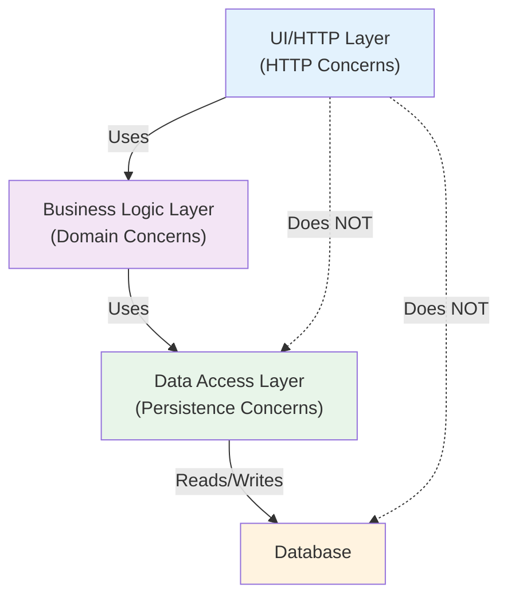

<Hero
  title="Separation of Concerns"
  subtitle="Design systems where different areas address different aspects of functionality, improving modularity and maintainability."
  imageAlt="Separation of Concerns illustration"
  size="large"
/>

## TL;DR

Separate different concerns into distinct modules so each handles one aspect of functionality. A web application might separate HTTP handling from business logic from data persistence. Benefits include easier testing, independent development, and flexible architectural changes. Related concepts: Single Responsibility Principle, layering, modularity.

## Learning Objectives

You will be able to:
- Identify concerns in a system and separate them
- Design module boundaries that align with concerns
- Understand layering architectures and their tradeoffs
- Recognize when concerns are mixed inappropriately
- Apply separation strategically without over-engineering

## Motivating Scenario

A payment service mixes concerns throughout its code: HTTP handlers call database queries directly, business logic performs logging, data access handles validation, and UI code contains calculations. When requirements change—adding a new API format, switching databases, changing validation rules—you must update multiple modules. A single change ripples everywhere.

With clear separation: HTTP handlers delegate to business logic. Business logic calls data access. Each layer has one job. A database change affects only the data layer. New API format affects only the handler layer. Changes are localized and testable.

## Core Concepts

### What Is a Concern?

A concern is an aspect of functionality that can be meaningfully separated. Examples:
- **HTTP handling**: parsing requests, returning responses
- **Business logic**: calculations, rules, workflows
- **Data persistence**: reading/writing to databases
- **Authentication**: verifying user identity
- **Logging**: recording events
- **Validation**: checking data correctness

<Figure caption="Concerns in Layered Architecture">

</Figure>

### Cross-Cutting Concerns

Some concerns span multiple layers: logging, security, error handling, performance monitoring. These need special handling—frameworks like aspect-oriented programming or middleware address them.

### Cohesion

Within a module, keep code related to the same concern together. High cohesion means code in a module works together toward one goal.

## Practical Example

<Tabs>
<TabItem value="py" label="Python" default>
```python
# ❌ MIXED CONCERNS - Everything tangled together
class UserController:
    def create_user(self, request):
        # HTTP parsing (concerns: request handling)
        name = request.json.get('name')
        email = request.json.get('email')

        # Validation (concern: validation)
        if not email or '@' not in email:
            return {'error': 'Invalid email'}, 400

        # Business logic (concern: user creation)
        user_id = str(uuid.uuid4())

        # Persistence (concern: database)
        conn = psycopg2.connect('...')
        cursor = conn.cursor()
        cursor.execute(
            'INSERT INTO users (id, name, email) VALUES (%s, %s, %s)',
            (user_id, name, email)
        )
        conn.commit()

        # Logging (concern: audit)
        print(f"User created: {user_id}")

        # Response (concern: HTTP)
        return {'id': user_id}, 201

# ✅ SEPARATED CONCERNS - Each layer handles its aspect
class EmailValidator:
    @staticmethod
    def validate(email):
        """Validation concern only."""
        return email and '@' in email and '.' in email.split('@')[1]

class UserRepository:
    def __init__(self, db_connection):
        self.db = db_connection

    def save(self, user):
        """Persistence concern only."""
        cursor = self.db.cursor()
        cursor.execute(
            'INSERT INTO users (id, name, email) VALUES (%s, %s, %s)',
            (user.id, user.name, user.email)
        )
        self.db.commit()

class UserService:
    def __init__(self, repository, validator):
        self.repository = repository
        self.validator = validator

    def create_user(self, name, email):
        """Business logic concern only."""
        if not self.validator.validate(email):
            raise ValueError("Invalid email")
        user = User(id=str(uuid.uuid4()), name=name, email=email)
        self.repository.save(user)
        return user

class UserController:
    def __init__(self, service, logger):
        self.service = service
        self.logger = logger

    def create_user(self, request):
        """HTTP handling concern only."""
        data = request.json
        try:
            user = self.service.create_user(data['name'], data['email'])
            self.logger.info(f"User created: {user.id}")
            return {'id': user.id}, 201
        except ValueError as e:
            return {'error': str(e)}, 400
```
</TabItem>
<TabItem value="go" label="Go">
```go
// ❌ MIXED CONCERNS - Tangled responsibilities
func (h *Handler) CreateUser(w http.ResponseWriter, r *http.Request) {
    // HTTP parsing
    var req struct {
        Name  string
        Email string
    }
    json.NewDecoder(r.Body).Decode(&req)

    // Validation
    if req.Email == "" || !strings.Contains(req.Email, "@") {
        http.Error(w, "Invalid email", http.StatusBadRequest)
        return
    }

    // Business logic
    userID := uuid.New().String()

    // Persistence
    _, err := h.DB.Exec(
        "INSERT INTO users (id, name, email) VALUES ($1, $2, $3)",
        userID, req.Name, req.Email)
    if err != nil {
        http.Error(w, "Database error", http.StatusInternalServerError)
        return
    }

    // Logging
    log.Printf("User created: %s", userID)

    // Response
    w.Header().Set("Content-Type", "application/json")
    json.NewEncoder(w).Encode(map[string]string{"id": userID})
}

// ✅ SEPARATED CONCERNS
type User struct {
    ID    string
    Name  string
    Email string
}

type EmailValidator struct{}

func (v *EmailValidator) Validate(email string) error {
    if email == "" || !strings.Contains(email, "@") {
        return errors.New("invalid email")
    }
    return nil
}

type UserRepository struct {
    db *sql.DB
}

func (r *UserRepository) Save(user User) error {
    _, err := r.db.Exec(
        "INSERT INTO users (id, name, email) VALUES ($1, $2, $3)",
        user.ID, user.Name, user.Email)
    return err
}

type UserService struct {
    repo      *UserRepository
    validator *EmailValidator
    logger    *log.Logger
}

func (s *UserService) CreateUser(name, email string) (*User, error) {
    if err := s.validator.Validate(email); err != nil {
        return nil, err
    }

    user := &User{
        ID:    uuid.New().String(),
        Name:  name,
        Email: email,
    }

    if err := s.repo.Save(*user); err != nil {
        return nil, err
    }

    s.logger.Printf("User created: %s", user.ID)
    return user, nil
}

type UserHandler struct {
    service *UserService
}

func (h *UserHandler) CreateUser(w http.ResponseWriter, r *http.Request) {
    var req struct {
        Name  string
        Email string
    }
    json.NewDecoder(r.Body).Decode(&req)

    user, err := h.service.CreateUser(req.Name, req.Email)
    if err != nil {
        http.Error(w, err.Error(), http.StatusBadRequest)
        return
    }

    w.Header().Set("Content-Type", "application/json")
    json.NewEncoder(w).Encode(user)
}
```
</TabItem>
<TabItem value="js" label="Node.js">
```javascript
// ❌ MIXED CONCERNS - Everything in one handler
app.post('/users', async (req, res) => {
    // HTTP parsing
    const { name, email } = req.body;

    // Validation
    if (!email || !email.includes('@')) {
        return res.status(400).json({ error: 'Invalid email' });
    }

    // Business logic
    const userId = crypto.randomUUID();

    // Persistence
    await db.query(
        'INSERT INTO users (id, name, email) VALUES ($1, $2, $3)',
        [userId, name, email]
    );

    // Logging
    console.log(`User created: ${userId}`);

    // Response
    res.status(201).json({ id: userId });
});

// ✅ SEPARATED CONCERNS
class EmailValidator {
    validate(email) {
        return email && email.includes('@');
    }
}

class UserRepository {
    constructor(db) {
        this.db = db;
    }

    async save(user) {
        await this.db.query(
            'INSERT INTO users (id, name, email) VALUES ($1, $2, $3)',
            [user.id, user.name, user.email]
        );
    }
}

class UserService {
    constructor(repository, validator, logger) {
        this.repository = repository;
        this.validator = validator;
        this.logger = logger;
    }

    async createUser(name, email) {
        if (!this.validator.validate(email)) {
            throw new Error('Invalid email');
        }

        const user = {
            id: crypto.randomUUID(),
            name,
            email
        };

        await this.repository.save(user);
        this.logger.info(`User created: ${user.id}`);
        return user;
    }
}

const validator = new EmailValidator();
const repository = new UserRepository(db);
const service = new UserService(repository, validator, logger);

app.post('/users', async (req, res) => {
    try {
        const user = await service.createUser(req.body.name, req.body.email);
        res.status(201).json(user);
    } catch (error) {
        res.status(400).json({ error: error.message });
    }
});
```
</TabItem>
</Tabs>

## When to Use / When Not to Use

<Showcase>
  <div>
    <h4>✓ Apply Separation When</h4>
    <ul>
      <li>Different concerns need independent testing</li>
      <li>Multiple teams will work on different aspects</li>
      <li>Concerns are likely to change at different rates</li>
      <li>Architecture includes multiple layers (web, business, data)</li>
      <li>Code handles multiple cross-cutting concerns</li>
    </ul>
  </div>
  <div>
    <h4>✗ Avoid Over-Separation When</h4>
    <ul>
      <li>Creating modules with minimal responsibility</li>
      <li>Splitting concerns that change together</li>
      <li>Adding abstraction layers without clear benefit</li>
      <li>Building for separation itself, not real needs</li>
      <li>Simple scripts or small projects</li>
    </ul>
  </div>
</Showcase>

## Patterns and Pitfalls

### Pitfall: Separation Without Cohesion

Separating concerns while leaving unrelated code in the same module defeats the purpose. Separation and cohesion work together.

### Pattern: Layered Architecture

Organize code into layers where each handles distinct concerns:
- **Presentation layer**: HTTP, user interface
- **Business logic layer**: domain rules, calculations
- **Data access layer**: persistence, queries

### Pattern: Dependency Injection

Pass dependencies to modules rather than having them create dependencies internally. This maintains separation while allowing flexibility.

## Design Review Checklist

<Checklist
  items={[
    "Does this module handle multiple unrelated concerns?",
    "Are different concerns mixed in the same code?",
    "Could this module be tested independently?",
    "Does the module change for only one reason?",
    "Is clear layering or organization visible?",
    "Do changes in one concern force changes elsewhere?",
    "Is the boundary between concerns clear?",
    "Is the separation justified or is it over-engineered?"
  ]}
/>

## Self-Check

1. Can you identify the main concerns in your application? Are they separated or tangled?

2. If you change how you store data, how many files need updating? More than one suggests poor separation.

3. Can you test business logic without setting up databases or HTTP servers?

:::info
**One Takeaway**: Organize code so each module addresses one aspect of functionality. When business logic is tangled with HTTP handling and persistence, changes ripple everywhere. Clear separation makes systems easier to test, modify, and understand.

:::

## Next Steps

- Study [Single Responsibility Principle](../solid/single-responsibility) for complementary guidance
- Explore [Law of Demeter](./law-of-demeter) for managing dependencies between concerns
- Review [High Cohesion, Low Coupling](./high-cohesion-low-coupling) for relationship patterns
- Learn about layering architectures and their tradeoffs

## References

1. Dijkstra, E. W. (1974). On the role of scientific thought. The Essential Edsger W. Dijkstra.
2. Martin, R. C. (2008). Clean Code: A Handbook of Agile Software Craftsmanship. Prentice Hall.
3. Newman, S. (2015). Building Microservices: Designing Fine-Grained Systems. O'Reilly Media.
4. Fowler, M. (2002). Patterns of Enterprise Application Architecture. Addison-Wesley Professional.
