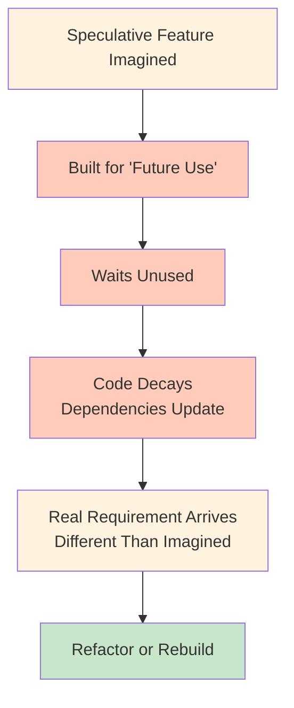

<Hero
  title="YAGNI: You Aren't Gonna Need It"
  subtitle="Avoid speculative generality: implement only features needed today, not imagined future requirements."
  imageAlt="YAGNI principle illustration"
  size="large"
/>

## TL;DR

Implement features when needed, not when imagined. Speculative code for "future requirements" rarely gets used and adds maintenance burden. Build what solves today's problem. If future requirements emerge, refactor to support them then. YAGNI prevents waste, reduces complexity, and keeps codebases focused.

## Learning Objectives

You will be able to:
- Distinguish between present requirements and speculative futures
- Resist the urge to build "for extensibility"
- Estimate the true cost of speculative features
- Refactor incrementally to add capabilities when needed
- Recognize patterns of speculative generality in code

## Motivating Scenario

A team building an e-commerce platform anticipates needing multiple payment processors in the future. They design an elaborate abstraction: a PaymentProcessorFactory with plugins, adapters, and a registry system. Two years later, they still use only Stripe. When a new processor is actually needed, the abstraction has bitrotted and doesn't match current needs anyway. They refactor from scratch in two days.

The direct approach: implement Stripe payment processing. When another processor is genuinely needed, spend one day refactoring. Net result: months of less wasted engineering, simpler code, and the same outcome.

## Core Concepts

### Speculative Generality

Speculative generality means building flexibility for scenarios that haven't happened and might never happen. Classic examples: "We might need multiple databases," "We might need to scale to 10x users," "We might need internationalization."

### The Cost of Speculation

Speculative code costs in multiple ways:
- **Development time**: engineering effort today
- **Cognitive load**: team must understand unused paths
- **Maintenance burden**: unused code decays and breaks
- **Opportunity cost**: engineering capacity for actual features

<Figure caption="The Speculative Feature Lifecycle">

</Figure>

### Just-in-Time Development

Contrast with YAGNI: implement features when they're actually needed. This means:
- Build for today's requirements
- Refactor when new requirements arrive
- Keep code focused and testable
- Reduce waste and complexity

## Practical Example

<Tabs>
<TabItem value="py" label="Python" default>
```python
# ❌ YAGNI VIOLATION - Building for speculative requirements
class DataStore:
    """Flexible data store that supports multiple backends."""

    def __init__(self, backend_type):
        if backend_type == "sql":
            self.backend = SQLBackend()
        elif backend_type == "nosql":
            self.backend = NoSQLBackend()
        elif backend_type == "redis":
            self.backend = RedisBackend()
        elif backend_type == "file":
            self.backend = FileBackend()
        else:
            raise ValueError(f"Unknown backend: {backend_type}")

    def get(self, key):
        return self.backend.get(key)

    def set(self, key, value):
        return self.backend.set(key, value)

    def delete(self, key):
        return self.backend.delete(key)

# Currently only PostgreSQL is used
# NoSQL, Redis, File backends were "for the future"

# ✅ YAGNI COMPLIANT - Build what's needed today
class PostgresStore:
    """Store data in PostgreSQL."""

    def get(self, key):
        # Implementation using psycopg2
        pass

    def set(self, key, value):
        # Implementation using psycopg2
        pass

    def delete(self, key):
        # Implementation using psycopg2
        pass

# When Redis is actually needed, refactor then.
# Estimated effort: 1-2 days when requirement arrives
# Current effort saved: 1 week of over-engineering
```
</TabItem>
<TabItem value="go" label="Go">
```go
// ❌ YAGNI VIOLATION - Over-engineered for speculative requirements
type BackendFactory interface {
    CreateBackend(config map[string]string) Backend
}

type Backend interface {
    Get(ctx context.Context, key string) (string, error)
    Set(ctx context.Context, key, value string) error
    Delete(ctx context.Context, key string) error
}

type SQLBackend struct { /* ... */ }
type NoSQLBackend struct { /* ... */ }
type RedisBackend struct { /* ... */ }
type FileBackend struct { /* ... */ }

// Complex registration system for backends
// Only SQL is actually used in production

// ✅ YAGNI COMPLIANT - PostgreSQL store for current needs
type PostgresStore struct {
    db *sql.DB
}

func (ps *PostgresStore) Get(ctx context.Context, key string) (string, error) {
    // Simple, focused implementation
    var value string
    err := ps.db.QueryRowContext(ctx,
        "SELECT value FROM store WHERE key = $1", key).Scan(&value)
    return value, err
}

func (ps *PostgresStore) Set(ctx context.Context, key, value string) error {
    _, err := ps.db.ExecContext(ctx,
        "INSERT INTO store (key, value) VALUES ($1, $2)", key, value)
    return err
}

// When another backend is needed, build it then
```
</TabItem>
<TabItem value="js" label="Node.js">
```javascript
// ❌ YAGNI VIOLATION - Abstract plugin system for future use
class StorageManager {
    constructor() {
        this.plugins = new Map();
    }

    registerPlugin(name, plugin) {
        this.plugins.set(name, plugin);
    }

    async getStorage(type) {
        if (!this.plugins.has(type)) {
            throw new Error(`Storage type ${type} not registered`);
        }
        return this.plugins.get(type);
    }

    async get(type, key) {
        const storage = await this.getStorage(type);
        return storage.get(key);
    }

    async set(type, key, value) {
        const storage = await this.getStorage(type);
        return storage.set(key, value);
    }
}

// Registers for SQL, NoSQL, Redis, etc.
// Only PostgreSQL is actually used

// ✅ YAGNI COMPLIANT - PostgreSQL implementation for today
class PostgresStorage {
    constructor(pool) {
        this.pool = pool;
    }

    async get(key) {
        const result = await this.pool.query(
            'SELECT value FROM store WHERE key = $1', [key]
        );
        return result.rows[0]?.value;
    }

    async set(key, value) {
        await this.pool.query(
            'INSERT INTO store (key, value) VALUES ($1, $2)',
            [key, value]
        );
    }
}

// Need Redis later? Implement RedisStorage then, refactor to use it.
```
</TabItem>
</Tabs>

## When to Use / When Not to Use

<Showcase>
  <div>
    <h4>✓ Follow YAGNI When</h4>
    <ul>
      <li>Building features for requirements that don't exist yet</li>
      <li>Designing for "future extensibility" without present need</li>
      <li>Creating generic abstractions for similar features</li>
      <li>Building configurable systems "just in case"</li>
      <li>Team capacity is limited and every hour matters</li>
    </ul>
  </div>
  <div>
    <h4>✗ Plan for Known Future When</h4>
    <ul>
      <li>Requirements are explicitly documented and coming</li>
      <li>Architecture decisions have locked-in costs (databases, platforms)</li>
      <li>Multiple users/teams depend on a stable interface</li>
      <li>Performance characteristics demand forward planning</li>
      <li>Changing direction later is prohibitively expensive</li>
    </ul>
  </div>
</Showcase>

## Patterns and Pitfalls

### Pitfall: "Just in Case" Code

The most common YAGNI violation: adding functionality "just in case" it's needed. Challenge every "just in case." If it's not needed today, ask: "How will we know when it's needed?"

### Pattern: Incremental Refactoring

Implement today, refactor tomorrow. When requirements change:
1. Implement the new requirement directly
2. Refactor shared logic if patterns emerge
3. Document the evolution

### Pitfall: Gold Plating

Excess features that weren't requested. Every feature carries cost in code complexity, testing, documentation, and cognitive load.

```python
# ❌ Gold plating - adding features nobody asked for
def process_payment(amount, currency="USD",
                   apply_tax=True, use_rewards=False,
                   notify_customer=True, log_transaction=True):
    # Many unnecessary optional features

# ✅ YAGNI - exactly what's needed
def process_payment(amount):
    # Core logic only
```

## Design Review Checklist

<Checklist
  items={[
    "Is this feature needed by current requirements?",
    "Are we building for 'someday' use cases?",
    "Does the code add support for scenarios that don't exist?",
    "Could we refactor to add this capability later if needed?",
    "Is the solution focused on today's problem only?",
    "Are we over-engineering for extensibility?",
    "Could unused code paths cause maintenance issues?",
    "Is there explicit, documented reason for the added complexity?"
  ]}
/>

## Self-Check

1. What features in your codebase were built for "future requirements" that never came? What was the maintenance cost?

2. When you're tempted to build something "for extensibility," what's the real requirement you're solving?

3. How often do speculative assumptions about future requirements actually match what's needed?

:::info
**One Takeaway**: The best code is the code you don't write. Implement what's needed today. When requirements change—and they will—refactor to accommodate them. YAGNI isn't about never planning; it's about avoiding waste on speculative futures that rarely materialize as imagined.

:::

## Next Steps

- Explore [KISS](./kiss) for complementary simplicity principles
- Learn [Separation of Concerns](./separation-of-concerns) to organize features that do exist
- Study refactoring techniques to evolve code as requirements change
- Review [DRY](./dry) to eliminate duplication when patterns do emerge

## References

1. Beck, K. (2000). Extreme Programming Explained: Embrace Change. Addison-Wesley Professional.
2. Martin, R. C. (2008). Clean Code: A Handbook of Agile Software Craftsmanship. Prentice Hall.
3. McConnell, S. (2004). Code Complete: A Practical Handbook of Software Construction (2nd ed.). Microsoft Press.
4. Fowler, M. (2018). Refactoring: Improving the Design of Existing Code (2nd ed.). Addison-Wesley Professional.
