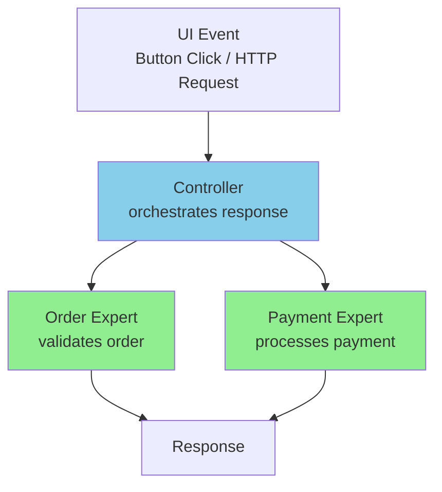

<Hero title="Controller" subtitle="Assign system event handling to a non-UI class that mediates between requests and domain logic" imageAlt="Controller pattern illustration" size="large" />

## TL;DR

Assign responsibility for handling system events to a non-UI class that acts as a middleman between the UI/API layer and your domain logic. This Controller class mediates between external requests and the objects that perform the actual work, keeping UI concerns out of your domain model.

## Learning Objectives

- Understand why domain objects shouldn't directly handle UI or API requests
- Learn when to create a Controller and what responsibilities it should have
- Recognize different types of Controllers and their appropriate uses
- Avoid mixing UI concerns with domain logic
- Design systems with clear separation between presentation and business logic

## Motivating Scenario

A user clicks an "Checkout" button in your e-commerce application. The button handler could directly access Order objects and manipulate them, tightly coupling the UI to domain logic. Instead, a CheckoutController receives the button click event, coordinates with Order and Payment objects, and returns results to the UI. Now the domain remains independent of UI technology.

## Core Concepts

The **Controller** pattern addresses a critical architectural concern: how should external requests (from UI, API, messages) reach your domain logic without coupling them together? A Controller is a non-UI class that receives system events and coordinates the response by delegating to other objects.

Controllers serve several key purposes:

1. **Decouple UI from Domain**: Domain objects don't know about screens, buttons, or HTTP requests
2. **Coordinate Complex Operations**: Controllers can orchestrate multiple objects to fulfill a use case
3. **Handle Session and Request Data**: Controllers can manage request-specific state
4. **Control Access**: Controllers can enforce security, validation, or authorization rules
5. **Bridge Technology Gaps**: Different UIs (web, desktop, mobile) can use the same Controllers

A good Controller is a "use case controller"—one Controller per use case or user goal. It delegates the actual work to Information Experts rather than doing the work itself. Controllers should be thin and focused, not bloated with business logic.

<Figure caption="Controller: Request Handling Flow">

</Figure>

## Practical Example

Consider a checkout system where users submit orders. Instead of having the UI directly manipulate Orders, we create a CheckoutController:

<Tabs>
<TabItem value="python" label="Python">
```python title="controller_example.py" showLineNumbers
from dataclasses import dataclass
from typing import List

@dataclass
class Product:
    id: str
    name: str
    price: float

class Order:
    def __init__(self, customer_id: str):
        self.customer_id = customer_id
        self.line_items: List[tuple] = []
        self.status = "pending"

    def add_line_item(self, product: Product, quantity: int):
        self.line_items.append((product, quantity))

    def validate(self) -> bool:
        return len(self.line_items) > 0

    def get_total(self) -> float:
        return sum(p.price * q for p, q in self.line_items)

class PaymentProcessor:
    def process(self, amount: float, card_token: str) -> bool:
        # Simulate payment processing
        return card_token and amount > 0

class CheckoutController:
    """Controller: mediates between UI and domain objects"""
    def __init__(self):
        self.payment_processor = PaymentProcessor()

    def process_checkout(self, customer_id: str,
                        items: List[tuple],
                        card_token: str) -> dict:
        """Coordinate checkout use case"""
        # Create domain object
        order = Order(customer_id)

        # Populate with domain-relevant data
        for product, quantity in items:
            order.add_line_item(product, quantity)

        # Validate business rules
        if not order.validate():
            return {"success": False, "error": "Order is empty"}

        # Delegate to expert
        if not self.payment_processor.process(order.get_total(), card_token):
            return {"success": False, "error": "Payment failed"}

        order.status = "confirmed"
        return {"success": True, "order_id": id(order)}

# Usage
controller = CheckoutController()

apple = Product("P001", "Apple", 1.50)
orange = Product("P002", "Orange", 2.00)

result = controller.process_checkout(
    customer_id="cust-123",
    items=[(apple, 5), (orange, 3)],
    card_token="valid-token"
)

print(result)
```
</TabItem>

<TabItem value="go" label="Go">
```go title="controller_example.go" showLineNumbers
package main

import (
    "fmt"
)

type Product struct {
    ID    string
    Name  string
    Price float64
}

type Order struct {
    CustomerID string
    LineItems  []struct {
        Product  *Product
        Quantity int
    }
    Status string
}

func (o *Order) AddLineItem(product *Product, quantity int) {
    o.LineItems = append(o.LineItems, struct {
        Product  *Product
        Quantity int
    }{Product: product, Quantity: quantity})
}

func (o *Order) Validate() bool {
    return len(o.LineItems) > 0
}

func (o *Order) GetTotal() float64 {
    total := 0.0
    for _, item := range o.LineItems {
        total += item.Product.Price * float64(item.Quantity)
    }
    return total
}

type PaymentProcessor struct{}

func (pp *PaymentProcessor) Process(amount float64,
                                     cardToken string) bool {
    return cardToken != "" && amount > 0
}

type CheckoutController struct {
    paymentProcessor *PaymentProcessor
}

func (cc *CheckoutController) ProcessCheckout(customerID string,
    items []struct {
        Product  *Product
        Quantity int
    }, cardToken string) map[string]interface{} {

    order := &Order{CustomerID: customerID, Status: "pending"}

    for _, item := range items {
        order.AddLineItem(item.Product, item.Quantity)
    }

    if !order.Validate() {
        return map[string]interface{}{
            "success": false,
            "error":   "Order is empty",
        }
    }

    if !cc.paymentProcessor.Process(order.GetTotal(), cardToken) {
        return map[string]interface{}{
            "success": false,
            "error":   "Payment failed",
        }
    }

    order.Status = "confirmed"
    return map[string]interface{}{
        "success": true,
        "order_id": fmt.Sprintf("%p", order),
    }
}

func main() {
    controller := &CheckoutController{
        paymentProcessor: &PaymentProcessor{},
    }

    apple := &Product{"P001", "Apple", 1.50}
    orange := &Product{"P002", "Orange", 2.00}

    items := []struct {
        Product  *Product
        Quantity int
    }{
        {apple, 5},
        {orange, 3},
    }

    result := controller.ProcessCheckout("cust-123", items, "valid-token")
    fmt.Println(result)
}
```
</TabItem>

<TabItem value="nodejs" label="Node.js">
```javascript title="controller_example.js" showLineNumbers
class Product {
    constructor(id, name, price) {
        this.id = id;
        this.name = name;
        this.price = price;
    }
}

class Order {
    constructor(customerId) {
        this.customerId = customerId;
        this.lineItems = [];
        this.status = "pending";
    }

    addLineItem(product, quantity) {
        this.lineItems.push({ product, quantity });
    }

    validate() {
        return this.lineItems.length > 0;
    }

    getTotal() {
        return this.lineItems.reduce(
            (sum, item) => sum + item.product.price * item.quantity,
            0
        );
    }
}

class PaymentProcessor {
    process(amount, cardToken) {
        return cardToken && amount > 0;
    }
}

class CheckoutController {
    constructor() {
        this.paymentProcessor = new PaymentProcessor();
    }

    processCheckout(customerId, items, cardToken) {
        // Create domain object
        const order = new Order(customerId);

        // Populate with items
        for (const { product, quantity } of items) {
            order.addLineItem(product, quantity);
        }

        // Validate business rules
        if (!order.validate()) {
            return { success: false, error: "Order is empty" };
        }

        // Delegate to expert
        if (!this.paymentProcessor.process(order.getTotal(), cardToken)) {
            return { success: false, error: "Payment failed" };
        }

        order.status = "confirmed";
        return { success: true, orderId: Math.random() };
    }
}

// Usage
const controller = new CheckoutController();

const apple = new Product("P001", "Apple", 1.50);
const orange = new Product("P002", "Orange", 2.00);

const result = controller.processCheckout(
    "cust-123",
    [
        { product: apple, quantity: 5 },
        { product: orange, quantity: 3 }
    ],
    "valid-token"
);

console.log(result);
```
</TabItem>
</Tabs>

## When to Use / When Not to Use

<Vs highlight={[1]} items={[
{
    label: "Use",
    points: [
      "Creating entry points for use cases or features",
      "Mediating between UI/API and domain logic",
      "Handling request-specific data and session state",
      "Coordinating multiple domain objects for a transaction",
      "Implementing authorization and validation at system boundary"
    ],
    highlightTone: "positive"
  },
{
    label: "Avoid",
    points: [
      "Putting business logic directly in Controllers",
      "Creating one controller for all system events",
      "Having Controllers directly expose domain data to UI",
      "Using Controllers to implement cross-cutting concerns",
      "Making Controllers stateful beyond a request scope"
    ],
    highlightTone: "warning"
  }
]} />

## Patterns and Pitfalls

<Showcase title="Controller Implementation Patterns" sections={[
  {
    label: "Do",
    body: <>
      <p><strong>Create one controller per use case:</strong> If you have a "Checkout" use case and a "Return Order" use case, create separate Controllers for each. This keeps responsibilities focused.</p>
      <p><strong>Delegate to domain objects:</strong> Controllers coordinate but shouldn't perform business logic. Ask Order objects to validate themselves; ask PaymentProcessor to charge cards.</p>
      <p><strong>Keep Controllers thin:</strong> Controllers should orchestrate, not implement. Most of your logic belongs in domain objects, not Controllers.</p>
    </>,
    tone: "positive"
  ,
    body: <>
      <p><strong>Create one controller per use case:</strong> If you have a "Checkout" use case and a "Return Order" use case, create separate Controllers for each. This keeps responsibilities focused.</p>
      <p><strong>Delegate to domain objects:</strong> Controllers coordinate but shouldn't perform business logic. Ask Order objects to validate themselves; ask PaymentProcessor to charge cards.</p>
      <p><strong>Keep Controllers thin:</strong> Controllers should orchestrate, not implement. Most of your logic belongs in domain objects, not Controllers.</p>
    </>,
    tone: "positive"
  ,
    tone: "positive"
  },
  {
    label: "Avoid",
    body: <>
      <p><strong>God Controllers:</strong> Don't create one massive Controller that handles all system events. This defeats the purpose of the pattern.</p>
      <p><strong>Exposing domain data directly:</strong> Controllers should adapt domain objects for UI consumption, not expose them raw. Use DTOs or view models.</p>
      <p><strong>Putting business logic in Controllers:</strong> If you're writing complex if/else chains or calculations, that logic belongs in domain objects, not Controllers.</p>
    </>,
    tone: "warning"
  ,
    body: <>
      <p><strong>God Controllers:</strong> Don't create one massive Controller that handles all system events. This defeats the purpose of the pattern.</p>
      <p><strong>Exposing domain data directly:</strong> Controllers should adapt domain objects for UI consumption, not expose them raw. Use DTOs or view models.</p>
      <p><strong>Putting business logic in Controllers:</strong> If you're writing complex if/else chains or calculations, that logic belongs in domain objects, not Controllers.</p>
    </>,
    tone: "warning"
  ,
    tone: "warning"
  }
]} />

## Design Review Checklist

<Checklist items={[
  "Is each Controller responsible for a single use case?",
  "Does the Controller delegate actual work to domain objects?",
  "Is the Controller free of business logic?",
  "Does the Controller avoid directly exposing domain objects to the UI?",
  "Can domain objects be used independently without the Controller?",
  "Is authorization and validation handled at the system boundary?"
]} />

## Self-Check

1. **What's the primary purpose of a Controller?** To mediate between external requests (UI, API) and domain logic, keeping them decoupled.

2. **Should a Controller contain business logic?** No. Controllers should orchestrate and delegate, not implement business logic. That belongs in domain objects.

3. **How many Controllers do I need?** Generally one per use case. If you're tempted to create one massive Controller, split it into focused, use-case-specific Controllers.

:::info
**One Takeaway**: Controllers are thin mediators between your system's entry point and your domain logic. They orchestrate and delegate, never implement business rules directly.

:::

## Next Steps

- Study [Information Expert](/docs/core-design-and-programming-principles/grasp/information-expert) to see which domain objects should do the work
- Learn about [Polymorphism](/docs/core-design-and-programming-principles/grasp/polymorphism) for handling different request types in Controllers
- Review [Low Coupling](/docs/core-design-and-programming-principles/grasp/low-coupling) to ensure Controllers don't create dependencies
- Explore [Pure Fabrication](/docs/core-design-and-programming-principles/grasp/pure-fabrication) for when Controller logic becomes complex

## References

1. <a href="https://en.wikipedia.org/wiki/GRASP_(object-oriented_design)" target="_blank" rel="nofollow noopener noreferrer">GRASP (Object-Oriented Design) - Wikipedia ↗️</a>
2. <a href="https://www.oreilly.com/library/view/applying-uml-and/0131489062/" target="_blank" rel="nofollow noopener noreferrer">Applying UML and Patterns by Craig Larman ↗️</a>