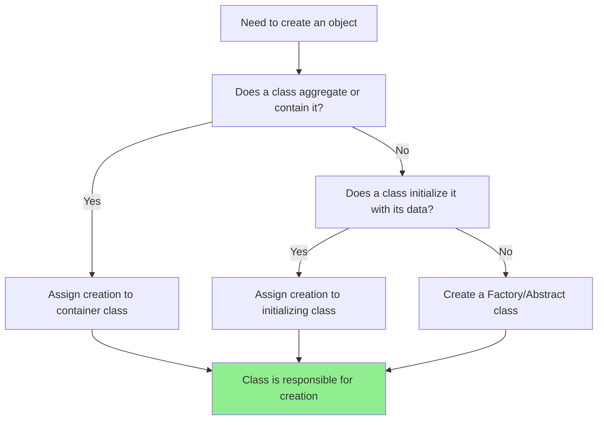

<Hero title="Creator" subtitle="Assign object creation responsibility to the class best suited to create instances" imageAlt="Creator pattern illustration" size="large" />

## TL;DR

The Creator pattern assigns object creation responsibility to the class that has a strong connection to the objects being created—typically through aggregation, composition, or initialization. This reduces coupling between classes and keeps creation logic close to the classes that use the created objects.

## Learning Objectives

- Understand when a class should be responsible for creating instances
- Learn how to identify the best "creator" for a given object type
- Apply Creator pattern rules to reduce coupling in your designs
- Recognize when to use factories instead of direct instantiation
- Avoid scattering creation logic throughout your codebase

## Motivating Scenario

You have a `Restaurant` and a `MenuItem` class. Who should be responsible for creating MenuItem instances? If every function that needs a menu item creates one directly, you have creation logic scattered everywhere. But if the Restaurant class—which naturally manages a collection of menu items—handles creation, the logic stays centralized and easier to modify.

## Core Concepts

The **Creator** pattern answers a fundamental question: who should be responsible for instantiating a new object? Rather than having multiple classes scattered throughout your codebase creating instances, Creator guides you to assign creation responsibility to a class that has a natural connection to the created object.

The pattern provides these rules for assigning creation responsibility:

1. **Assign to the class that aggregates, composes, or closely uses the created object.** If class A contains or uses instances of class B, A is a good candidate to create B.

2. **Assign to the class that has the data to initialize the created object.** If initialization requires data that only one class has, that class should create the object.

3. **Assign to the class that should logically control the lifecycle.** In an e-commerce system, an Order should create its LineItems, not some external factory.

Creator works in tandem with Information Expert: the class that has the information needed to initialize an object is often the right class to create it. By keeping creation and use together, you maintain cohesion and reduce coupling to factory classes or global creation methods.

<Figure caption="Creator Pattern: Determining Responsibility">

</Figure>

## Practical Example

Consider an order management system where Orders need to create their LineItems. Let's see how Creator guides our design:

<Tabs>
<TabItem value="python" label="Python">
```python title="creator_example.py" showLineNumbers
from dataclasses import dataclass
from typing import List

@dataclass
class Product:
    id: str
    name: str
    price: float

class LineItem:
    def __init__(self, product: Product, quantity: int):
        self.product = product
        self.quantity = quantity

    def get_total(self) -> float:
        return self.product.price * self.quantity

class Order:
    """Order is responsible for creating its LineItems"""
    def __init__(self, order_id: str):
        self.order_id = order_id
        self.line_items: List[LineItem] = []

    def add_item(self, product: Product, quantity: int) -> LineItem:
        """Creator responsibility: Order creates LineItems"""
        line_item = LineItem(product, quantity)
        self.line_items.append(line_item)
        return line_item

    def get_total(self) -> float:
        return sum(item.get_total() for item in self.line_items)

# Usage
product1 = Product("P001", "Laptop", 999.99)
product2 = Product("P002", "Mouse", 29.99)

order = Order("ORD-001")
order.add_item(product1, 1)
order.add_item(product2, 2)

print(f"Order {order.order_id} total: ${order.get_total():.2f}")
```
</TabItem>

<TabItem value="go" label="Go">
```go title="creator_example.go" showLineNumbers
package main

import "fmt"

type Product struct {
    ID    string
    Name  string
    Price float64
}

type LineItem struct {
    Product  *Product
    Quantity int
}

func (li *LineItem) GetTotal() float64 {
    return li.Product.Price * float64(li.Quantity)
}

type Order struct {
    OrderID   string
    LineItems []*LineItem
}

// Creator responsibility: Order creates LineItems
func (o *Order) AddItem(product *Product, quantity int) *LineItem {
    lineItem := &LineItem{
        Product:  product,
        Quantity: quantity,
    }
    o.LineItems = append(o.LineItems, lineItem)
    return lineItem
}

func (o *Order) GetTotal() float64 {
    total := 0.0
    for _, item := range o.LineItems {
        total += item.GetTotal()
    }
    return total
}

func main() {
    product1 := &Product{"P001", "Laptop", 999.99}
    product2 := &Product{"P002", "Mouse", 29.99}

    order := &Order{OrderID: "ORD-001"}
    order.AddItem(product1, 1)
    order.AddItem(product2, 2)

    fmt.Printf("Order %s total: $%.2f\n", order.OrderID, order.GetTotal())
}
```
</TabItem>

<TabItem value="nodejs" label="Node.js">
```javascript title="creator_example.js" showLineNumbers
class Product {
    constructor(id, name, price) {
        this.id = id;
        this.name = name;
        this.price = price;
    }
}

class LineItem {
    constructor(product, quantity) {
        this.product = product;
        this.quantity = quantity;
    }

    getTotal() {
        return this.product.price * this.quantity;
    }
}

class Order {
    constructor(orderId) {
        this.orderId = orderId;
        this.lineItems = [];
    }

    // Creator responsibility: Order creates LineItems
    addItem(product, quantity) {
        const lineItem = new LineItem(product, quantity);
        this.lineItems.push(lineItem);
        return lineItem;
    }

    getTotal() {
        return this.lineItems.reduce((sum, item) => sum + item.getTotal(), 0);
    }
}

// Usage
const product1 = new Product("P001", "Laptop", 999.99);
const product2 = new Product("P002", "Mouse", 29.99);

const order = new Order("ORD-001");
order.addItem(product1, 1);
order.addItem(product2, 2);

console.log(`Order ${order.orderId} total: $${order.getTotal().toFixed(2)}`);
```
</TabItem>
</Tabs>

## When to Use / When Not to Use

<Vs highlight={[1]} items={[
{
    label: "Use",
    points: [
      "Creating objects that are contained or aggregated by another class",
      "When the creator has the data needed to initialize the object",
      "For objects that logically belong to a parent object's lifecycle",
      "When you want creation logic close to where objects are used",
      "For simple object creation without complex initialization"
    ],
    highlightTone: "positive"
  },
{
    label: "Avoid",
    points: [
      "Complex creation with multiple initialization steps",
      "Creating objects with many optional parameters",
      "Creating different implementations based on conditions",
      "When creation should be decoupled from the using class",
      "When multiple unrelated classes need to create the same type"
    ],
    highlightTone: "warning"
  }
]} />

## Patterns and Pitfalls

<Showcase title="Creator Implementation Patterns" sections={[
  {
    label: "Do",
    body: <>
      <p><strong>Keep creation with containers:</strong> If a class aggregates or contains instances of another class, it should create them. An Order contains LineItems, so Order should create them.</p>
      <p><strong>Use Factory when Creator doesn't fit:</strong> If the Creator pattern would create tight coupling or complex responsibilities, introduce a Factory class. This is not a violation—it's a refinement.</p>
      <p><strong>Initialize fully in the constructor:</strong> When a creator creates an object, it should fully initialize it to a valid state. Don't create half-initialized objects that require external setup.</p>
    </>,
    tone: "positive"
  ,
    body: <>
      <p><strong>Keep creation with containers:</strong> If a class aggregates or contains instances of another class, it should create them. An Order contains LineItems, so Order should create them.</p>
      <p><strong>Use Factory when Creator doesn't fit:</strong> If the Creator pattern would create tight coupling or complex responsibilities, introduce a Factory class. This is not a violation—it's a refinement.</p>
      <p><strong>Initialize fully in the constructor:</strong> When a creator creates an object, it should fully initialize it to a valid state. Don't create half-initialized objects that require external setup.</p>
    </>,
    tone: "positive"
  ,
    tone: "positive"
  },
  {
    label: "Avoid",
    body: <>
      <p><strong>Mixing creation concerns:</strong> Don't mix simple object creation with complex business logic in the same method. If creation is complex, extract it to a dedicated factory method or class.</p>
      <p><strong>Creating objects you don't use:</strong> If a class creates an object but has no strong connection to it, question whether it should really be the creator. This is a sign to use Pure Fabrication.</p>
      <p><strong>Scattering creation logic:</strong> Don't have multiple classes creating the same type independently. Consolidate creation responsibility in one logical place.</p>
    </>,
    tone: "warning"
  ,
    body: <>
      <p><strong>Mixing creation concerns:</strong> Don't mix simple object creation with complex business logic in the same method. If creation is complex, extract it to a dedicated factory method or class.</p>
      <p><strong>Creating objects you don't use:</strong> If a class creates an object but has no strong connection to it, question whether it should really be the creator. This is a sign to use Pure Fabrication.</p>
      <p><strong>Scattering creation logic:</strong> Don't have multiple classes creating the same type independently. Consolidate creation responsibility in one logical place.</p>
    </>,
    tone: "warning"
  ,
    tone: "warning"
  }
]} />

## Design Review Checklist

<Checklist items={[
  "Is creation responsibility assigned to a class that aggregates the created objects?",
  "Does the creator have all data needed to initialize the created object?",
  "Are created objects fully initialized in a valid state?",
  "Is creation logic localized rather than scattered?",
  "Would using a Factory reduce inappropriate coupling?",
  "Does the creation responsibility fit naturally with the creator's role?"
]} />

## Self-Check

1. **What's the primary rule for assigning creation responsibility?** Assign it to the class that aggregates, composes, or most closely uses the created object.

2. **How does Creator relate to Information Expert?** Both patterns look at what information a class has. The creator has initialization information; the object expert has operational information.

3. **When should you use a Factory instead of Creator?** When the creator would need to depend on many unrelated classes, or when creating different implementations based on conditions, extract creation to a Factory.

:::info
**One Takeaway**: Keep object creation responsibility close to the classes that aggregate or use the created objects. This maintains cohesion and reduces coupling between unrelated parts of your system.

:::

## Next Steps

- Learn about [Factory Pattern](/docs/core-design-and-programming-principles/grasp/pure-fabrication) when Creator needs refinement
- Study [Information Expert](/docs/core-design-and-programming-principles/grasp/information-expert) to see how it guides Creator decisions
- Explore [Low Coupling](/docs/core-design-and-programming-principles/grasp/low-coupling) to understand when to introduce a Factory
- Review [Polymorphism](/docs/core-design-and-programming-principles/grasp/polymorphism) for creating different object types

## References

1. <a href="https://en.wikipedia.org/wiki/GRASP_(object-oriented_design)" target="_blank" rel="nofollow noopener noreferrer">GRASP (Object-Oriented Design) - Wikipedia ↗️</a>
2. <a href="https://www.oreilly.com/library/view/applying-uml-and/0131489062/" target="_blank" rel="nofollow noopener noreferrer">Applying UML and Patterns by Craig Larman ↗️</a>