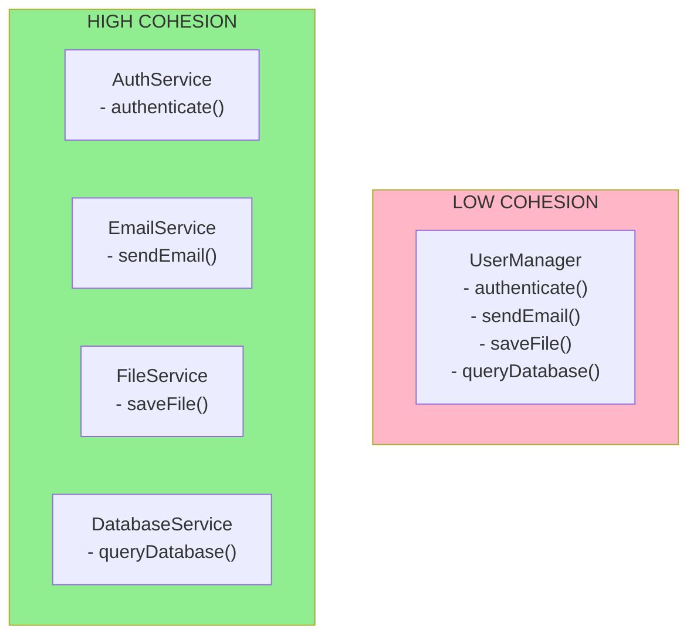

<Hero title="High Cohesion" subtitle="Keep class responsibilities focused and strongly related to its purpose" imageAlt="High Cohesion illustration" size="large" />

## TL;DR

High Cohesion is a principle that encourages classes to have a single, well-defined purpose with responsibilities that are closely related to each other. Classes with high cohesion are easier to understand, test, reuse, and maintain because all their functionality focuses on accomplishing one clear goal.

## Learning Objectives

- Understand what cohesion means and its relationship to class design
- Learn to identify low-cohesion classes that need refactoring
- Apply techniques to improve cohesion in your designs
- Balance High Cohesion with Low Coupling for optimal designs
- Recognize when a class has too many unrelated responsibilities

## Motivating Scenario

You have a `UserManager` class that handles user authentication, email sending, file storage, and database queries. When you need to change how emails are sent, you must modify `UserManager`, affecting authentication logic. If instead responsibilities are split so each class handles one concern, changes are localized and tests are simpler.

## Core Concepts

**Cohesion** measures how strongly related and focused the methods and variables in a class are. **High Cohesion** means a class has a single, clear responsibility, with all its methods working together toward that goal.

Low cohesion creates problems:

1. **Difficulty Understanding**: Classes do too many unrelated things
2. **Difficulty Testing**: Testing one responsibility requires creating complex test setups for others
3. **Difficulty Reusing**: A class doing five things can't be reused when you need only one
4. **Difficulty Maintaining**: Changes to one responsibility affect the entire class
5. **High Coupling**: Unrelated responsibilities create unnecessary dependencies

High cohesion benefits include:

- **Clarity**: Each class has one clear purpose
- **Testability**: Testing focuses on one responsibility
- **Reusability**: Classes can be used in different contexts
- **Maintainability**: Changes are localized
- **Extensibility**: New functionality fits cleanly into the design

Achieve High Cohesion by keeping methods closely related, with strong relationships between attributes and methods. If you find yourself explaining a class as "it does X and Y and Z," it probably has low cohesion.

<Figure caption="High Cohesion: Focused Responsibilities">

</Figure>

## Practical Example

Let's refactor a low-cohesion class to achieve High Cohesion:

<Tabs>
<TabItem value="python" label="Python">
```python title="high_cohesion_example.py" showLineNumbers
# LOW COHESION (avoid this)
class LowCohesionUserManager:
    """Does too many unrelated things"""
    def authenticate(self, username, password):
        # Authentication logic
        return username == "admin"

    def send_email(self, recipient, message):
        # Email logic
        print(f"Sending email to {recipient}")

    def save_file(self, filename, content):
        # File storage logic
        with open(filename, 'w') as f:
            f.write(content)

# HIGH COHESION (good design)
class AuthService:
    """Single responsibility: authentication"""
    def authenticate(self, username: str, password: str) -> bool:
        # Authentication logic only
        return username == "admin"

    def validate_password(self, password: str) -> bool:
        return len(password) >= 8

class EmailService:
    """Single responsibility: sending emails"""
    def send_email(self, recipient: str, message: str) -> bool:
        # Email logic only
        print(f"Sending email to {recipient}: {message}")
        return True

class FileService:
    """Single responsibility: file operations"""
    def save_file(self, filename: str, content: str) -> bool:
        # File storage logic only
        with open(filename, 'w') as f:
            f.write(content)
        return True

class User:
    """High cohesion: only user data"""
    def __init__(self, username: str, email: str):
        self.username = username
        self.email = email

class UserController:
    """Coordinates multiple services for user operations"""
    def __init__(self, auth: AuthService,
                 email: EmailService, files: FileService):
        self.auth = auth
        self.email = email
        self.files = files

    def register_user(self, username: str,
                      password: str, email: str) -> bool:
        if not self.auth.validate_password(password):
            return False

        user = User(username, email)
        self.email.send_email(email,
            f"Welcome {username}!")
        return True

# Usage
auth = AuthService()
email = EmailService()
files = FileService()
controller = UserController(auth, email, files)

controller.register_user("john", "password123", "john@example.com")
```
</TabItem>

<TabItem value="go" label="Go">
```go title="high_cohesion_example.go" showLineNumbers
package main

import (
    "fmt"
)

// HIGH COHESION: Each service has one responsibility

type AuthService struct{}

func (as *AuthService) Authenticate(username, password string) bool {
    return username == "admin"
}

func (as *AuthService) ValidatePassword(password string) bool {
    return len(password) >= 8
}

type EmailService struct{}

func (es *EmailService) SendEmail(recipient, message string) bool {
    fmt.Printf("Sending email to %s: %s\n", recipient, message)
    return true
}

type FileService struct{}

func (fs *FileService) SaveFile(filename, content string) bool {
    // File storage logic
    fmt.Printf("Saving file: %s\n", filename)
    return true
}

type User struct {
    Username string
    Email    string
}

type UserController struct {
    auth  *AuthService
    email *EmailService
    files *FileService
}

func NewUserController(auth *AuthService,
    email *EmailService, files *FileService) *UserController {
    return &UserController{auth, email, files}
}

func (uc *UserController) RegisterUser(username, password,
    email string) bool {
    if !uc.auth.ValidatePassword(password) {
        return false
    }

    user := &User{Username: username, Email: email}
    uc.email.SendEmail(email,
        fmt.Sprintf("Welcome %s!", user.Username))
    return true
}

func main() {
    auth := &AuthService{}
    email := &EmailService{}
    files := &FileService{}
    controller := NewUserController(auth, email, files)

    controller.RegisterUser("john", "password123", "john@example.com")
}
```
</TabItem>

<TabItem value="nodejs" label="Node.js">
```javascript title="high_cohesion_example.js" showLineNumbers
// HIGH COHESION: Each class has one clear responsibility

class AuthService {
    authenticate(username, password) {
        return username === "admin";
    }

    validatePassword(password) {
        return password.length >= 8;
    }
}

class EmailService {
    sendEmail(recipient, message) {
        console.log(`Sending email to ${recipient}: ${message}`);
        return true;
    }
}

class FileService {
    saveFile(filename, content) {
        console.log(`Saving file: ${filename}`);
        return true;
    }
}

class User {
    constructor(username, email) {
        this.username = username;
        this.email = email;
    }
}

class UserController {
    constructor(auth, email, files) {
        this.auth = auth;
        this.email = email;
        this.files = files;
    }

    registerUser(username, password, email) {
        if (!this.auth.validatePassword(password)) {
            return false;
        }

        const user = new User(username, email);
        this.email.sendEmail(email, `Welcome ${user.username}!`);
        return true;
    }
}

// Usage
const auth = new AuthService();
const email = new EmailService();
const files = new FileService();
const controller = new UserController(auth, email, files);

controller.registerUser("john", "password123", "john@example.com");
```
</TabItem>
</Tabs>

## When to Use / When Not to Use

<Vs highlight={[1]} items={[
{
    label: "Use",
    points: [
      "Keeping each class focused on one responsibility",
      "Grouping only closely related methods and attributes",
      "Naming classes after what they do, not what they contain",
      "Splitting classes when they become too focused on unrelated tasks",
      "Designing for clarity and maintainability"
    ],
    highlightTone: "positive"
  },
{
    label: "Avoid",
    points: [
      "Creating classes that do multiple unrelated things",
      "Mixing different concerns in a single class",
      "Over-fragmenting into too many micro-classes",
      "Separating related operations into different classes",
      "Designing for imagined future needs too early"
    ],
    highlightTone: "warning"
  }
]} />

## Patterns and Pitfalls

<Showcase title="High Cohesion Implementation" sections={[
  {
    label: "Do",
    body: <>
      <p><strong>Keep methods related:</strong> Methods in a class should work together. If a method seems unrelated, it might belong elsewhere.</p>
      <p><strong>Use descriptive names:</strong> Name your class after its single purpose. If you need "and" in the name, it might have multiple responsibilities.</p>
      <p><strong>Split when cohesion drops:</strong> If you find yourself explaining a class as "it does X, Y, and Z," split it. Each class should do one thing well.</p>
    </>,
    tone: "positive"
  ,
    body: <>
      <p><strong>Keep methods related:</strong> Methods in a class should work together. If a method seems unrelated, it might belong elsewhere.</p>
      <p><strong>Use descriptive names:</strong> Name your class after its single purpose. If you need "and" in the name, it might have multiple responsibilities.</p>
      <p><strong>Split when cohesion drops:</strong> If you find yourself explaining a class as "it does X, Y, and Z," split it. Each class should do one thing well.</p>
    </>,
    tone: "positive"
  ,
    tone: "positive"
  },
  {
    label: "Avoid",
    body: <>
      <p><strong>God objects:</strong> Don't create classes that do everything. AuthService, EmailService, and FileService should be separate, focused classes.</p>
      <p><strong>Feature envy:</strong> If a class frequently calls methods on another class to get work done, that work might belong in the other class (Information Expert).</p>
      <p><strong>Over-splitting:</strong> Don't fragment related operations. If methods work closely together and modify the same state, they belong in the same class.</p>
    </>,
    tone: "warning"
  ,
    body: <>
      <p><strong>God objects:</strong> Don't create classes that do everything. AuthService, EmailService, and FileService should be separate, focused classes.</p>
      <p><strong>Feature envy:</strong> If a class frequently calls methods on another class to get work done, that work might belong in the other class (Information Expert).</p>
      <p><strong>Over-splitting:</strong> Don't fragment related operations. If methods work closely together and modify the same state, they belong in the same class.</p>
    </>,
    tone: "warning"
  ,
    tone: "warning"
  }
]} />

## Design Review Checklist

<Checklist items={[
  "Can you describe the class's purpose in one sentence?",
  "Do all methods work together toward that purpose?",
  "Are attributes used by most methods?",
  "Could you reasonably split this class into smaller focused classes?",
  "Would the class be easier to test if it had fewer responsibilities?",
  "Do changes to one responsibility require modifying unrelated code?"
]} />

## Self-Check

1. **What is cohesion and how does it relate to class design?** Cohesion measures how focused a class is. High cohesion means all methods work together toward one clear purpose.

2. **How do you improve cohesion?** Split classes that have multiple unrelated responsibilities. Each class should do one thing well.

3. **How does High Cohesion relate to Low Coupling?** They work together: High Cohesion keeps each class focused (internal organization), while Low Coupling limits dependencies between them (external relationships).

:::info
**One Takeaway**: Keep each class focused on one clear responsibility. All methods should work together toward that single purpose, making classes easier to understand, test, and maintain.

:::

## Next Steps

- Study [Low Coupling](/docs/core-design-and-programming-principles/grasp/low-coupling) to balance High Cohesion
- Learn [Information Expert](/docs/core-design-and-programming-principles/grasp/information-expert) to assign responsibilities properly
- Review [Single Responsibility Principle](/docs/core-design-and-programming-principles) for related concepts
- Explore [Pure Fabrication](/docs/core-design-and-programming-principles/grasp/pure-fabrication) for creating focused classes

## References

1. <a href="https://en.wikipedia.org/wiki/GRASP_(object-oriented_design)" target="_blank" rel="nofollow noopener noreferrer">GRASP (Object-Oriented Design) - Wikipedia ↗️</a>
2. <a href="https://www.oreilly.com/library/view/applying-uml-and/0131489062/" target="_blank" rel="nofollow noopener noreferrer">Applying UML and Patterns by Craig Larman ↗️</a>