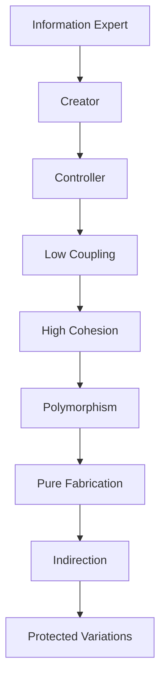

import { useCurrentSidebarCategory } from "@docusaurus/theme-common";

# GRASP

GRASP (General Responsibility Assignment Software Patterns) is a set of nine principles and patterns for assigning responsibilities to objects in object-oriented design. Introduced by Craig Larman in his seminal work on applying UML and patterns, GRASP provides guidance on how to design flexible, maintainable, and extensible object-oriented systems by making thoughtful decisions about which objects should be responsible for which behaviors.

Unlike design patterns like Gang of Four patterns that focus on solving specific structural or behavioral problems, GRASP patterns address the fundamental question of responsibility assignment: "Who should do this task?" By applying GRASP patterns consistently, you create systems with better separation of concerns, reduced coupling between classes, and improved code reusability.

The nine GRASP patterns work together synergistically. The foundational patterns like Information Expert and Creator establish basic responsibility assignment principles. Intermediate patterns like Controller and Polymorphism refine these principles for specific scenarios. Advanced patterns like Pure Fabrication and Indirection address complex situations where naive responsibility assignment would lead to tight coupling or violations of the foundational patterns. Protected Variations wraps the entire framework with a philosophy of managing change through abstraction.

<Figure caption="GRASP patterns learning map">

</Figure>

## The Nine GRASP Patterns

**Information Expert** teaches you to assign responsibilities to objects that have the information needed to fulfill them. This is the primary principle that guides most responsibility assignment decisions.

**Creator** provides rules for determining which object should be responsible for creating instances of other objects. This pattern complements Information Expert by focusing specifically on object instantiation.

**Controller** guides you in designing entry points to your system that mediate between external requests and your domain logic, preventing domain objects from being tightly coupled to UI or API concerns.

**Low Coupling** is a principle that encourages you to minimize dependencies between classes, reducing the ripple effects of changes and improving the flexibility of your system.

**High Cohesion** works hand-in-hand with Low Coupling to ensure that classes have clear, focused responsibilities with strong internal relationships among their attributes and methods.

**Polymorphism** shows you how to handle variations in behavior through polymorphic types rather than through conditional logic, leveraging the power of inheritance and interfaces.

**Pure Fabrication** addresses situations where assigning a responsibility to an Information Expert would violate Low Coupling or High Cohesion by introducing artificial classes that represent conceptual operations rather than domain entities.

**Indirection** provides a way to decouple objects by introducing an intermediate object that acts as a mediator, reducing direct dependencies between otherwise related classes.

**Protected Variations** is the ultimate principle that ties all others together, teaching you to design systems that are protected from variations in requirements, implementation details, and external dependencies.

## Why GRASP Matters

Many developers struggle with object-oriented design, creating systems with excessive coupling, poor cohesion, and responsibilities scattered across inappropriate classes. GRASP provides a systematic approach to thinking about design decisions before you write code, not as an afterthought. By understanding and applying these patterns, you'll write code that is easier to test, maintain, extend, and refactor.

Each pattern in GRASP addresses a specific aspect of responsibility assignment and is grounded in practical reasoning about how objects interact. Rather than memorizing patterns, GRASP teaches you how to think about design, developing the intuition to make good decisions regardless of the specific problem domain.

<DocCardList items={useCurrentSidebarCategory().items} />
