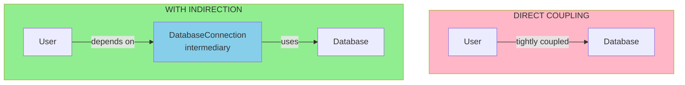

<Hero title="Indirection" subtitle="Assign responsibility to an intermediate object that mediates between other objects" imageAlt="Indirection pattern illustration" size="large" />

## TL;DR

Indirection is a pattern that assigns responsibility to an intermediate object that mediates between other objects, reducing direct dependencies. Instead of two objects knowing about each other directly, they communicate through an intermediary (a mediator, adapter, or similar object), achieving loose coupling and flexibility.

## Learning Objectives

- Understand how indirection reduces coupling between objects
- Learn different types of intermediaries and when to use each
- Apply indirection to decouple otherwise tightly connected objects
- Recognize opportunities to introduce intermediaries in existing designs
- Balance indirection benefits against added complexity

## Motivating Scenario

A User might directly call methods on a Database, creating tight coupling. If User later needs to work with different database implementations, it requires changes. An intermediary DatabaseConnection object can accept requests from User and delegate to the appropriate database, allowing User to remain independent of database technology changes.

## Core Concepts

**Indirection** in GRASP means introducing an intermediate object between two objects that would otherwise have a direct dependency. This intermediate object (mediator, adapter, wrapper) accepts requests and delegates them appropriately.

Common indirection patterns include:

1. **Mediator**: Centralizes communication between multiple objects
2. **Adapter**: Translates between incompatible interfaces
3. **Facade**: Provides a simplified interface to a complex subsystem
4. **Proxy**: Controls access to another object
5. **Observer/Publisher-Subscriber**: Decouples event producers from consumers

Indirection provides benefits:

- **Loose Coupling**: Objects don't depend directly on each other
- **Flexibility**: Change implementation without affecting dependents
- **Reusability**: Objects work in different contexts
- **Centralized Control**: Common behavior can be applied uniformly
- **Testability**: Easy to mock or stub intermediaries

The trade-off is added complexity: you have another class to understand and maintain. Use indirection when direct dependencies would create real problems, not preemptively.

<Figure caption="Indirection: Decoupling Through Intermediaries">

</Figure>

## Practical Example

Let's see how indirection decouples objects:

<Tabs>
<TabItem value="python" label="Python">
```python title="indirection_example.py" showLineNumbers
# DIRECT COUPLING (avoid)
class BadUser:
    def __init__(self, name: str, database):
        self.name = name
        self.database = database  # Direct dependency

    def save(self):
        # Tightly coupled to database implementation
        self.database.connect()
        self.database.insert("users", {"name": self.name})
        self.database.close()

# WITH INDIRECTION (good design)
class UserRepository:
    """Intermediary: mediates between User and persistence"""
    def __init__(self, database):
        self.database = database

    def save(self, user):
        """User doesn't know about database specifics"""
        self.database.connect()
        self.database.insert("users", {"name": user.name})
        self.database.close()

class User:
    def __init__(self, name: str):
        self.name = name
        # No direct dependency on database

class DatabaseAdapter:
    """Adapter indirection: hides implementation details"""
    def __init__(self, db_type: str):
        self.db_type = db_type

    def connect(self):
        if self.db_type == "sqlite":
            print("Connecting to SQLite")
        elif self.db_type == "postgres":
            print("Connecting to PostgreSQL")

    def insert(self, table: str, data: dict):
        print(f"Inserting into {table}: {data}")

    def close(self):
        print("Closing connection")

# Usage
user = User("John Doe")
db = DatabaseAdapter("sqlite")
repo = UserRepository(db)
repo.save(user)

# Now we can switch database implementations without changing User
db2 = DatabaseAdapter("postgres")
repo2 = UserRepository(db2)
repo2.save(user)
```
</TabItem>

<TabItem value="go" label="Go">
```go title="indirection_example.go" showLineNumbers
package main

import "fmt"

// Database interface: Indirection point
type Database interface {
    Connect()
    Insert(table string, data map[string]interface{})
    Close()
}

// WITH INDIRECTION: User doesn't know about specific implementations
type User struct {
    Name string
}

type UserRepository struct {
    db Database // Depends on interface, not implementation
}

func (ur *UserRepository) Save(user *User) {
    ur.db.Connect()
    ur.db.Insert("users", map[string]interface{}{"name": user.Name})
    ur.db.Close()
}

// SQLite implementation
type SQLiteDatabase struct{}

func (sdb *SQLiteDatabase) Connect() {
    fmt.Println("Connecting to SQLite")
}

func (sdb *SQLiteDatabase) Insert(table string,
    data map[string]interface{}) {
    fmt.Printf("Inserting into %s: %v\n", table, data)
}

func (sdb *SQLiteDatabase) Close() {
    fmt.Println("Closing SQLite connection")
}

// PostgreSQL implementation
type PostgresDatabase struct{}

func (pdb *PostgresDatabase) Connect() {
    fmt.Println("Connecting to PostgreSQL")
}

func (pdb *PostgresDatabase) Insert(table string,
    data map[string]interface{}) {
    fmt.Printf("Inserting into %s: %v\n", table, data)
}

func (pdb *PostgresDatabase) Close() {
    fmt.Println("Closing PostgreSQL connection")
}

func main() {
    user := &User{Name: "John Doe"}

    // Use SQLite
    sqlite := &SQLiteDatabase{}
    repo1 := &UserRepository{db: sqlite}
    repo1.Save(user)

    fmt.Println()

    // Switch to PostgreSQL without changing User
    postgres := &PostgresDatabase{}
    repo2 := &UserRepository{db: postgres}
    repo2.Save(user)
}
```
</TabItem>

<TabItem value="nodejs" label="Node.js">
```javascript title="indirection_example.js" showLineNumbers
// WITH INDIRECTION: User doesn't know about specific implementations

class User {
    constructor(name) {
        this.name = name;
    }
}

class UserRepository {
    constructor(database) {
        this.database = database; // Depends on interface
    }

    save(user) {
        this.database.connect();
        this.database.insert("users", { name: user.name });
        this.database.close();
    }
}

// SQLite implementation
class SQLiteDatabase {
    connect() {
        console.log("Connecting to SQLite");
    }

    insert(table, data) {
        console.log(`Inserting into ${table}:`, data);
    }

    close() {
        console.log("Closing SQLite connection");
    }
}

// PostgreSQL implementation
class PostgresDatabase {
    connect() {
        console.log("Connecting to PostgreSQL");
    }

    insert(table, data) {
        console.log(`Inserting into ${table}:`, data);
    }

    close() {
        console.log("Closing PostgreSQL connection");
    }
}

// Usage
const user = new User("John Doe");

// Use SQLite
const sqlite = new SQLiteDatabase();
const repo1 = new UserRepository(sqlite);
repo1.save(user);

console.log();

// Switch to PostgreSQL without changing User
const postgres = new PostgresDatabase();
const repo2 = new UserRepository(postgres);
repo2.save(user);
```
</TabItem>
</Tabs>

## When to Use / When Not to Use

<Vs highlight={[1]} items={[
{
    label: "Use",
    points: [
      "When direct dependencies would create tight coupling",
      "For handling multiple implementations of a concept",
      "When you want to apply common behavior uniformly",
      "For adapting incompatible interfaces",
      "When controlling access or order of operations"
    ],
    highlightTone: "positive"
  },
{
    label: "Avoid",
    points: [
      "For simple, stable dependencies (premature indirection)",
      "When the intermediary adds no real value",
      "Creating excessive layers of indirection",
      "When it obscures rather than clarifies relationships",
      "For performance-critical paths where the overhead matters"
    ],
    highlightTone: "warning"
  }
]} />

## Patterns and Pitfalls

<Showcase title="Indirection Implementation" sections={[
  {
    label: "Do",
    body: <>
      <p><strong>Use interfaces for intermediaries:</strong> Define clear interfaces that intermediaries implement, allowing different implementations to be substituted.</p>
      <p><strong>Keep intermediaries focused:</strong> An intermediary should have one clear purpose—mediate between specific types of objects.</p>
      <p><strong>Make decisions explicit:</strong> If an intermediary chooses between implementations, make that decision logic clear and testable.</p>
    </>,
    tone: "positive"
  ,
    body: <>
      <p><strong>Use interfaces for intermediaries:</strong> Define clear interfaces that intermediaries implement, allowing different implementations to be substituted.</p>
      <p><strong>Keep intermediaries focused:</strong> An intermediary should have one clear purpose—mediate between specific types of objects.</p>
      <p><strong>Make decisions explicit:</strong> If an intermediary chooses between implementations, make that decision logic clear and testable.</p>
    </>,
    tone: "positive"
  ,
    tone: "positive"
  },
  {
    label: "Avoid",
    body: <>
      <p><strong>Over-indirecting:</strong> Not every dependency needs an intermediary. Simple, stable dependencies can be direct.</p>
      <p><strong>God mediators:</strong> Don't create one massive mediator that handles all communication. Keep mediators focused.</p>
      <p><strong>Hidden indirection:</strong> If you introduce indirection, make it explicit. Hidden layers make code harder to understand.</p>
    </>,
    tone: "warning"
  ,
    body: <>
      <p><strong>Over-indirecting:</strong> Not every dependency needs an intermediary. Simple, stable dependencies can be direct.</p>
      <p><strong>God mediators:</strong> Don't create one massive mediator that handles all communication. Keep mediators focused.</p>
      <p><strong>Hidden indirection:</strong> If you introduce indirection, make it explicit. Hidden layers make code harder to understand.</p>
    </>,
    tone: "warning"
  ,
    tone: "warning"
  }
]} />

## Design Review Checklist

<Checklist items={[
  "Is the intermediary necessary or is it premature indirection?",
  "Does the intermediary have a clear, single purpose?",
  "Are dependent objects freed from knowledge of implementation details?",
  "Can you substitute different implementations through the intermediary?",
  "Is the intermediary's role explicit in the design?",
  "Would removing the intermediary create coupling problems?"
]} />

## Self-Check

1. **What's the main benefit of indirection?** It reduces coupling by introducing an intermediate object that handles communication, allowing objects to change implementations without affecting each other.

2. **When should you use indirection?** When direct dependencies would create problems: tight coupling to infrastructure, inability to substitute implementations, or too much shared responsibility.

3. **What's the risk of over-indirecting?** Excessive indirection adds complexity and layers that obscure relationships without providing real benefits. Use indirection purposefully, not preemptively.

:::info
**One Takeaway**: Use indirection pragmatically. Introduce intermediaries when direct dependencies would create tight coupling or reduce flexibility, not as a default approach.

:::

## Next Steps

- Study [Low Coupling](/docs/core-design-and-programming-principles/grasp/low-coupling) to understand why indirection matters
- Learn [Pure Fabrication](/docs/core-design-and-programming-principles/grasp/pure-fabrication) for creating intermediary classes
- Review [Adapter Pattern](/docs/core-design-and-programming-principles) for interface translation
- Explore [Mediator Pattern](/docs/core-design-and-programming-principles) for complex object interactions

## References

1. <a href="https://en.wikipedia.org/wiki/GRASP_(object-oriented_design)" target="_blank" rel="nofollow noopener noreferrer">GRASP (Object-Oriented Design) - Wikipedia ↗️</a>
2. <a href="https://www.oreilly.com/library/view/applying-uml-and/0131489062/" target="_blank" rel="nofollow noopener noreferrer">Applying UML and Patterns by Craig Larman ↗️</a>