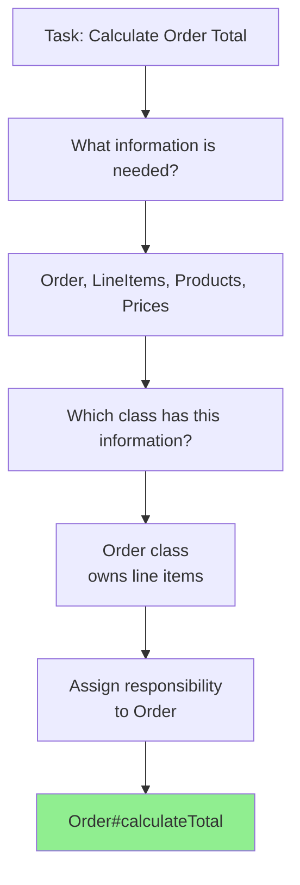

<Hero title="Information Expert" subtitle="Assign responsibility to the class that has the information needed to fulfill it" imageAlt="Information Expert pattern illustration" size="large" />

## TL;DR

Assign a responsibility to the class that has the information necessary to fulfill it. This foundational GRASP pattern ensures that objects directly use their own data rather than exposing it to other classes, improving encapsulation, cohesion, and making responsibilities clear and intuitive.

## Learning Objectives

- Understand the core principle of assigning responsibilities based on information ownership
- Learn how to identify which object should be responsible for a given behavior
- Recognize how Information Expert improves encapsulation and maintains cohesion
- Avoid the anti-pattern of exposing internal data to accomplish tasks
- Apply Information Expert reasoning to design more maintainable systems

## Motivating Scenario

You're building an e-commerce system with `Order`, `LineItem`, and `Product` classes. When you need to calculate the total price of an order, where should this logic live? You could expose all the line items and their prices to some external calculator, but that would scatter the knowledge of how pricing works throughout the codebase. Or you could recognize that the `Order` object already has all the information needed: it knows its line items, and each line item knows its product and quantity.

## Core Concepts

**Information Expert** is the foundational GRASP pattern that states: assign a responsibility to the class that has the most information needed to fulfill it. This simple principle is the primary driver of responsibility assignment in object-oriented design.

The pattern works by analyzing what information is needed to perform a task, then assigning that responsibility to the class that already possesses or can easily access that information. When information is scattered across multiple classes, you assign the responsibility to the class that has the most of it, potentially asking other objects for information it doesn't have.

By applying Information Expert consistently, you achieve:

- **High Cohesion**: Classes contain responsibilities closely related to their attributes and purpose
- **Encapsulation**: Objects don't expose their internal data; they perform operations on it directly
- **Clear Responsibilities**: Each class knows what it's responsible for based on its data
- **Maintainability**: Changes to how data is used stay localized to the class that owns the data

The pattern becomes especially powerful when combined with other GRASP patterns. Creator (who creates objects?), Controller (who handles system-wide responsibilities?), and Polymorphism (how do variations in behavior get handled?) all build upon the foundation of Information Expert.

<Figure caption="Information Expert: Responsibility Assignment Flow">

</Figure>

## Practical Example

Consider calculating an order's total price, applying discounts, and determining tax. Let's see how Information Expert guides our design:

<Tabs>
<TabItem value="python" label="Python">
```python title="information_expert_example.py" showLineNumbers
class Product:
    def __init__(self, name: str, price: float):
        self.name = name
        self.price = price

class LineItem:
    def __init__(self, product: Product, quantity: int):
        self.product = product
        self.quantity = quantity

    def get_subtotal(self) -> float:
        """LineItem has all info: product price and quantity"""
        return self.product.price * self.quantity

class Order:
    def __init__(self, customer_id: str, tax_rate: float = 0.08):
        self.customer_id = customer_id
        self.line_items: list[LineItem] = []
        self.tax_rate = tax_rate

    def add_item(self, product: Product, quantity: int):
        self.line_items.append(LineItem(product, quantity))

    def get_subtotal(self) -> float:
        """Order has all info: knows its line items"""
        return sum(item.get_subtotal() for item in self.line_items)

    def get_tax(self) -> float:
        """Order knows tax rate and can ask LineItems for subtotals"""
        return self.get_subtotal() * self.tax_rate

    def get_total(self) -> float:
        """Order has all responsibilities it needs to calculate total"""
        return self.get_subtotal() + self.get_tax()

# Usage
apple = Product("Apple", 1.50)
orange = Product("Orange", 2.00)

order = Order("customer-123", tax_rate=0.08)
order.add_item(apple, 5)
order.add_item(orange, 3)

print(f"Subtotal: ${order.get_subtotal():.2f}")
print(f"Tax: ${order.get_tax():.2f}")
print(f"Total: ${order.get_total():.2f}")
```
</TabItem>

<TabItem value="go" label="Go">
```go title="information_expert_example.go" showLineNumbers
package main

import "fmt"

type Product struct {
    Name  string
    Price float64
}

type LineItem struct {
    Product  *Product
    Quantity int
}

func (li *LineItem) GetSubtotal() float64 {
    // LineItem has all info: product price and quantity
    return li.Product.Price * float64(li.Quantity)
}

type Order struct {
    CustomerID string
    LineItems  []*LineItem
    TaxRate    float64
}

func (o *Order) AddItem(product *Product, quantity int) {
    o.LineItems = append(o.LineItems, &LineItem{
        Product:  product,
        Quantity: quantity,
    })
}

func (o *Order) GetSubtotal() float64 {
    // Order has all info: knows its line items
    subtotal := 0.0
    for _, item := range o.LineItems {
        subtotal += item.GetSubtotal()
    }
    return subtotal
}

func (o *Order) GetTax() float64 {
    // Order knows tax rate and can ask LineItems for subtotals
    return o.GetSubtotal() * o.TaxRate
}

func (o *Order) GetTotal() float64 {
    // Order has all responsibilities it needs to calculate total
    return o.GetSubtotal() + o.GetTax()
}

func main() {
    apple := &Product{"Apple", 1.50}
    orange := &Product{"Orange", 2.00}

    order := &Order{CustomerID: "customer-123", TaxRate: 0.08}
    order.AddItem(apple, 5)
    order.AddItem(orange, 3)

    fmt.Printf("Subtotal: $%.2f\n", order.GetSubtotal())
    fmt.Printf("Tax: $%.2f\n", order.GetTax())
    fmt.Printf("Total: $%.2f\n", order.GetTotal())
}
```
</TabItem>

<TabItem value="nodejs" label="Node.js">
```javascript title="information_expert_example.js" showLineNumbers
class Product {
    constructor(name, price) {
        this.name = name;
        this.price = price;
    }
}

class LineItem {
    constructor(product, quantity) {
        this.product = product;
        this.quantity = quantity;
    }

    getSubtotal() {
        // LineItem has all info: product price and quantity
        return this.product.price * this.quantity;
    }
}

class Order {
    constructor(customerId, taxRate = 0.08) {
        this.customerId = customerId;
        this.lineItems = [];
        this.taxRate = taxRate;
    }

    addItem(product, quantity) {
        this.lineItems.push(new LineItem(product, quantity));
    }

    getSubtotal() {
        // Order has all info: knows its line items
        return this.lineItems.reduce((sum, item) => sum + item.getSubtotal(), 0);
    }

    getTax() {
        // Order knows tax rate and can ask LineItems for subtotals
        return this.getSubtotal() * this.taxRate;
    }

    getTotal() {
        // Order has all responsibilities it needs to calculate total
        return this.getSubtotal() + this.getTax();
    }
}

// Usage
const apple = new Product("Apple", 1.50);
const orange = new Product("Orange", 2.00);

const order = new Order("customer-123", 0.08);
order.addItem(apple, 5);
order.addItem(orange, 3);

console.log(`Subtotal: $${order.getSubtotal().toFixed(2)}`);
console.log(`Tax: $${order.getTax().toFixed(2)}`);
console.log(`Total: $${order.getTotal().toFixed(2)}`);
```
</TabItem>
</Tabs>

## When to Use / When Not to Use

<Vs highlight={[1]} items={[
{
    label: "Use",
    points: [
      "Assigning core business logic responsibilities",
      "When one class clearly has all needed information",
      "Designing domain models and entities",
      "Deciding where to place calculation methods",
      "When you want to maintain encapsulation"
    ],
    highlightTone: "positive"
  },
{
    label: "Avoid",
    points: [
      "Cross-cutting concerns (logging, security)",
      "When applying it creates high coupling to many classes",
      "System-level responsibilities like request handling",
      "When information is scattered across many classes without a clear owner",
      "When it would create circular dependencies"
    ],
    highlightTone: "warning"
  }
]} />

## Patterns and Pitfalls

<Showcase title="Information Expert Patterns" sections={[
  {
    label: "Do",
    body: <>
      <p><strong>Encapsulate related data and operations:</strong> If a class owns data, assign it the responsibility to operate on that data. The LineItem class owns product price and quantity, so it's responsible for calculating subtotal.</p>
      <p><strong>Ask for information rather than expose it:</strong> Instead of exposing internal lists or primitives, ask objects to perform operations. Order doesn't expose line_items directly; it asks each LineItem for its subtotal.</p>
      <p><strong>Follow the data:</strong> Trace what information is needed and which class already has it. That's often your answer for responsibility assignment.</p>
    </>,
    tone: "positive"
  ,
    body: <>
      <p><strong>Encapsulate related data and operations:</strong> If a class owns data, assign it the responsibility to operate on that data. The LineItem class owns product price and quantity, so it's responsible for calculating subtotal.</p>
      <p><strong>Ask for information rather than expose it:</strong> Instead of exposing internal lists or primitives, ask objects to perform operations. Order doesn't expose line_items directly; it asks each LineItem for its subtotal.</p>
      <p><strong>Follow the data:</strong> Trace what information is needed and which class already has it. That's often your answer for responsibility assignment.</p>
    </>,
    tone: "positive"
  ,
    tone: "positive"
  },
  {
    label: "Avoid",
    body: <>
      <p><strong>Information scattered across the codebase:</strong> Don't grab data from multiple classes to perform an operation. Instead, assign the responsibility to the class that has the most information and has it ask others.</p>
      <p><strong>Creating utility classes that expose data:</strong> Avoid patterns where you pull data out of objects into static utility methods. This violates both Information Expert and Encapsulation.</p>
      <p><strong>Forced Information Expert:</strong> If applying Information Expert would create a class that knows about too many other classes' details, that's a sign to use Pure Fabrication or Indirection instead.</p>
    </>,
    tone: "warning"
  ,
    body: <>
      <p><strong>Information scattered across the codebase:</strong> Don't grab data from multiple classes to perform an operation. Instead, assign the responsibility to the class that has the most information and has it ask others.</p>
      <p><strong>Creating utility classes that expose data:</strong> Avoid patterns where you pull data out of objects into static utility methods. This violates both Information Expert and Encapsulation.</p>
      <p><strong>Forced Information Expert:</strong> If applying Information Expert would create a class that knows about too many other classes' details, that's a sign to use Pure Fabrication or Indirection instead.</p>
    </>,
    tone: "warning"
  ,
    tone: "warning"
  }
]} />

## Design Review Checklist

<Checklist items={[
  "Does each class have responsibilities related to its data?",
  "Are calculations kept in the class that owns the data?",
  "Does the class avoid exposing its internal data to other classes?",
  "Are responsibilities cohesive within each class?",
  "Does applying this pattern avoid excessive dependencies?",
  "Can you trace each responsibility back to information ownership?"
]} />

## Self-Check

1. **How do you determine which class should be responsible for a task?** Look at what information is needed and assign it to the class that has most of that information.

2. **What's the relationship between Information Expert and encapsulation?** Information Expert enforces encapsulation by keeping data operations in the class that owns the data rather than exposing the data itself.

3. **When should you not use Information Expert?** When applying it would require a class to depend on many other classes, or for cross-cutting concerns that don't cleanly belong to any data owner.

:::info
**One Takeaway**: The class that has the information needed to perform a task should be responsible for performing it. This simple principle is the foundation of object-oriented design.

:::

## Next Steps

- Learn about [Creator](/docs/core-design-and-programming-principles/grasp/creator) for responsibility assignment in object creation
- Explore [Low Coupling](/docs/core-design-and-programming-principles/grasp/low-coupling) to understand how Information Expert reduces dependencies
- Study [Pure Fabrication](/docs/core-design-and-programming-principles/grasp/pure-fabrication) for when Information Expert would violate other principles
- Review [High Cohesion](/docs/core-design-and-programming-principles/grasp/high-cohesion) to see how Information Expert maintains focused responsibilities

## References

1. <a href="https://en.wikipedia.org/wiki/GRASP_(object-oriented_design)" target="_blank" rel="nofollow noopener noreferrer">GRASP (Object-Oriented Design) - Wikipedia ↗️</a>
2. <a href="https://www.oreilly.com/library/view/applying-uml-and/0131489062/" target="_blank" rel="nofollow noopener noreferrer">Applying UML and Patterns by Craig Larman ↗️</a>