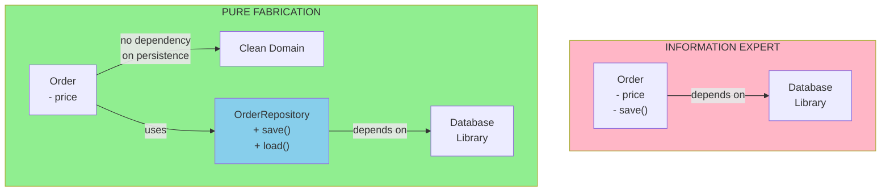

<Hero title="Pure Fabrication" subtitle="Create artificial classes to represent operations when domain objects can't handle them" imageAlt="Pure Fabrication pattern illustration" size="large" />

## TL;DR

Pure Fabrication is a pattern that addresses situations where assigning a responsibility to an Information Expert would violate Low Coupling or High Cohesion. You create an artificial class (one not based on domain concepts) that represents a conceptual operation or service. This keeps domain classes focused while handling complex cross-cutting concerns.

## Learning Objectives

- Understand when Information Expert would create design problems
- Learn to identify situations requiring Pure Fabrication
- Recognize the difference between domain classes and service classes
- Create service classes that maintain Low Coupling and High Cohesion
- Balance between domain-driven design and practical architecture

## Motivating Scenario

You need to save Order objects to a database. Information Expert says the Order should save itself (it has the data). But if Order depends on a database library, every Order instance couples the domain logic to persistence technology. Pure Fabrication suggests creating an OrderRepository or OrderPersister class that knows about databases but handles persistence, freeing Order to focus on business logic.

## Core Concepts

**Pure Fabrication** is a compromise between strict Information Expert and practical design constraints. It says: when assigning a responsibility to an Information Expert would violate Low Coupling or High Cohesion, create an artificial class that doesn't represent a domain concept but represents a needed operation.

Pure Fabrication classes are typically:

1. **Service Classes**: Encapsulate operations that don't naturally belong to domain objects
2. **Repository/Persistence Classes**: Handle data storage and retrieval
3. **Utility Classes**: Perform calculations or transformations
4. **Adapter Classes**: Bridge different technologies or interfaces
5. **Factory Classes**: Handle complex object creation

The pattern trades "purity" (every class represents a domain concept) for practical benefits: Low Coupling, High Cohesion, and clear separation of concerns. A good Pure Fabrication class has a clear, single responsibility and uses patterns like Singleton, Factory, or Strategy.

<Figure caption="Pure Fabrication: When Information Expert Isn't Enough">

</Figure>

## Practical Example

Let's see how Pure Fabrication handles persistence:

<Tabs>
<TabItem value="python" label="Python">
```python title="pure_fabrication_example.py" showLineNumbers
# INFORMATION EXPERT (creates coupling)
class BadOrder:
    """Mixes domain logic with persistence"""
    def __init__(self, order_id: str, customer: str):
        self.order_id = order_id
        self.customer = customer
        self.total = 100.0

    def save(self):
        # Order knows how to save itself - but now it's coupled to DB
        import sqlite3
        conn = sqlite3.connect("orders.db")
        # ... persistence logic ...

# PURE FABRICATION (separates concerns)
class Order:
    """Pure domain class - no persistence knowledge"""
    def __init__(self, order_id: str, customer: str, total: float):
        self.order_id = order_id
        self.customer = customer
        self.total = total

    def apply_discount(self, percent: float):
        self.total *= (1 - percent / 100)

class OrderRepository:
    """Pure Fabrication: handles persistence concerns"""
    def __init__(self, db_connection):
        self.db = db_connection

    def save(self, order: Order) -> bool:
        """Save an Order to the database"""
        try:
            self.db.execute(
                "INSERT INTO orders (id, customer, total) VALUES (?, ?, ?)",
                (order.order_id, order.customer, order.total)
            )
            return True
        except Exception as e:
            print(f"Error saving order: {e}")
            return False

    def load(self, order_id: str) -> Order:
        """Load an Order from the database"""
        cursor = self.db.execute(
            "SELECT * FROM orders WHERE id = ?",
            (order_id,)
        )
        row = cursor.fetchone()
        if row:
            return Order(row[0], row[1], row[2])
        return None

# Usage
import sqlite3
db = sqlite3.connect(":memory:")
db.execute("""
    CREATE TABLE orders (
        id TEXT PRIMARY KEY,
        customer TEXT,
        total REAL
    )
""")

# Order stays clean and focused
order = Order("ORD-001", "John", 150.00)
order.apply_discount(10)

# Repository handles persistence
repo = OrderRepository(db)
repo.save(order)

# Load it back
loaded_order = repo.load("ORD-001")
print(f"Loaded: {loaded_order.customer}, ${loaded_order.total:.2f}")
```
</TabItem>

<TabItem value="go" label="Go">
```go title="pure_fabrication_example.go" showLineNumbers
package main

import (
    "database/sql"
    "fmt"
    _ "github.com/mattn/go-sqlite3"
)

// PURE FABRICATION: Order knows nothing about persistence
type Order struct {
    OrderID  string
    Customer string
    Total    float64
}

func (o *Order) ApplyDiscount(percent float64) {
    o.Total *= (1 - percent/100)
}

// OrderRepository: Pure Fabrication class handles persistence
type OrderRepository struct {
    db *sql.DB
}

func NewOrderRepository(db *sql.DB) *OrderRepository {
    return &OrderRepository{db: db}
}

func (or *OrderRepository) Save(order *Order) error {
    query := `INSERT INTO orders (id, customer, total)
              VALUES (?, ?, ?)`
    _, err := or.db.Exec(query,
        order.OrderID,
        order.Customer,
        order.Total)
    return err
}

func (or *OrderRepository) Load(orderID string) (*Order, error) {
    query := `SELECT id, customer, total FROM orders WHERE id = ?`
    row := or.db.QueryRow(query, orderID)

    order := &Order{}
    err := row.Scan(&order.OrderID, &order.Customer, &order.Total)
    if err != nil {
        return nil, err
    }
    return order, nil
}

func main() {
    db, _ := sql.Open("sqlite3", ":memory:")
    db.Exec(`
        CREATE TABLE orders (
            id TEXT PRIMARY KEY,
            customer TEXT,
            total REAL
        )
    `)

    // Order stays clean
    order := &Order{OrderID: "ORD-001", Customer: "John", Total: 150.00}
    order.ApplyDiscount(10)

    // Repository handles persistence
    repo := NewOrderRepository(db)
    repo.Save(order)

    loaded, _ := repo.Load("ORD-001")
    fmt.Printf("Loaded: %s, $%.2f\n", loaded.Customer, loaded.Total)
}
```
</TabItem>

<TabItem value="nodejs" label="Node.js">
```javascript title="pure_fabrication_example.js" showLineNumbers
// PURE FABRICATION: Order knows nothing about persistence

class Order {
    constructor(orderId, customer, total) {
        this.orderId = orderId;
        this.customer = customer;
        this.total = total;
    }

    applyDiscount(percent) {
        this.total *= (1 - percent / 100);
    }
}

// OrderRepository: Pure Fabrication class handles persistence
class OrderRepository {
    constructor(database) {
        this.db = database;
    }

    async save(order) {
        try {
            const query = `
                INSERT INTO orders (id, customer, total)
                VALUES (?, ?, ?)
            `;
            await this.db.run(query,
                [order.orderId, order.customer, order.total]);
            return true;
        } catch (error) {
            console.error("Error saving order:", error);
            return false;
        }
    }

    async load(orderId) {
        try {
            const query = `
                SELECT * FROM orders WHERE id = ?
            `;
            const row = await this.db.get(query, [orderId]);
            if (row) {
                return new Order(row.id, row.customer, row.total);
            }
            return null;
        } catch (error) {
            console.error("Error loading order:", error);
            return null;
        }
    }
}

// Usage
const order = new Order("ORD-001", "John", 150.00);
order.applyDiscount(10);

// Repository handles persistence
const repo = new OrderRepository(database);
await repo.save(order);

const loaded = await repo.load("ORD-001");
console.log(`Loaded: ${loaded.customer}, $${loaded.total.toFixed(2)}`);
```
</TabItem>
</Tabs>

## When to Use / When Not to Use

<Vs highlight={[1]} items={[
{
    label: "Use",
    points: [
      "When Information Expert would require domain objects to know about infrastructure",
      "For persistence, logging, or other cross-cutting concerns",
      "When you need a service to coordinate multiple domain objects",
      "For factory methods that are too complex to put in domain objects",
      "When external technology dependencies need isolation"
    ],
    highlightTone: "positive"
  },
{
    label: "Avoid",
    points: [
      "For every operation - keep most logic in domain objects",
      "Creating service classes that duplicate domain logic",
      "Over-fragmenting - not every small operation needs a fabricated class",
      "Making fabricated classes too complex or too many",
      "Losing domain knowledge in translation to service classes"
    ],
    highlightTone: "warning"
  }
]} />

## Patterns and Pitfalls

<Showcase title="Pure Fabrication Implementation" sections={[
  {
    label: "Do",
    body: <>
      <p><strong>Create for clear needs:</strong> Use Pure Fabrication when Information Expert would create coupling problems. OrderRepository makes sense because orders shouldn't know about databases.</p>
      <p><strong>Keep them focused:</strong> A fabricated class should have one clear responsibility. OrderRepository handles persistence for orders; it doesn't handle authentication or validation.</p>
      <p><strong>Name them clearly:</strong> Use names like Repository, Service, Factory, or Manager to signal that these are fabricated, not domain classes.</p>
    </>,
    tone: "positive"
  ,
    body: <>
      <p><strong>Create for clear needs:</strong> Use Pure Fabrication when Information Expert would create coupling problems. OrderRepository makes sense because orders shouldn't know about databases.</p>
      <p><strong>Keep them focused:</strong> A fabricated class should have one clear responsibility. OrderRepository handles persistence for orders; it doesn't handle authentication or validation.</p>
      <p><strong>Name them clearly:</strong> Use names like Repository, Service, Factory, or Manager to signal that these are fabricated, not domain classes.</p>
    </>,
    tone: "positive"
  ,
    tone: "positive"
  },
  {
    label: "Avoid",
    body: <>
      <p><strong>Anemic domain models:</strong> Don't push all logic into service classes, leaving domain objects as empty data containers. Domain objects should have behavior.</p>
      <p><strong>Too many service classes:</strong> If you find yourself creating a service for every operation, you've over-fragmented the design. Let domain objects do their job first.</p>
      <p><strong>Service-to-service dependencies:</strong> If service classes depend on many other services, you've likely created artificial hierarchy that's hard to understand.</p>
    </>,
    tone: "warning"
  ,
    body: <>
      <p><strong>Anemic domain models:</strong> Don't push all logic into service classes, leaving domain objects as empty data containers. Domain objects should have behavior.</p>
      <p><strong>Too many service classes:</strong> If you find yourself creating a service for every operation, you've over-fragmented the design. Let domain objects do their job first.</p>
      <p><strong>Service-to-service dependencies:</strong> If service classes depend on many other services, you've likely created artificial hierarchy that's hard to understand.</p>
    </>,
    tone: "warning"
  ,
    tone: "warning"
  }
]} />

## Design Review Checklist

<Checklist items={[
  "Would assigning this to a domain object create coupling problems?",
  "Does this fabricated class have a single, clear responsibility?",
  "Is it named appropriately (Repository, Service, Factory, etc.)?",
  "Does it use domain objects, not duplicate their logic?",
  "Could domain objects handle this responsibility if coupling wasn't an issue?",
  "Does this class reduce overall complexity and improve design clarity?"
]} />

## Self-Check

1. **What's the difference between Information Expert and Pure Fabrication?** Information Expert assigns responsibilities to classes with the information. Pure Fabrication creates artificial classes when Information Expert would violate coupling or cohesion principles.

2. **When should you create a Pure Fabrication class?** When a responsibility would require domain objects to depend on infrastructure, external systems, or have multiple unrelated concerns.

3. **What makes a good fabricated class?** A clear, single responsibility, appropriate naming (Service, Repository, Factory), and focus on supporting domain objects rather than duplicating their logic.

:::info
**One Takeaway**: Use Pure Fabrication pragmatically. When assigning a responsibility to a domain object would create coupling or complexity problems, create a specialized service class to handle it.

:::

## Next Steps

- Study [Information Expert](/docs/core-design-and-programming-principles/grasp/information-expert) to understand when Pure Fabrication is needed
- Learn [Low Coupling](/docs/core-design-and-programming-principles/grasp/low-coupling) and [High Cohesion](/docs/core-design-and-programming-principles/grasp/high-cohesion) to see why these matter
- Review [Indirection](/docs/core-design-and-programming-principles/grasp/indirection) for a related pattern
- Explore common Pure Fabrication examples: Repository pattern, Service layer pattern

## References

1. <a href="https://en.wikipedia.org/wiki/GRASP_(object-oriented_design)" target="_blank" rel="nofollow noopener noreferrer">GRASP (Object-Oriented Design) - Wikipedia ↗️</a>
2. <a href="https://www.oreilly.com/library/view/applying-uml-and/0131489062/" target="_blank" rel="nofollow noopener noreferrer">Applying UML and Patterns by Craig Larman ↗️</a>