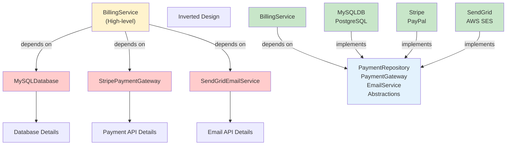

<Hero
  title="Dependency Inversion Principle"
  description="High-level modules should not depend on low-level modules; both should depend on abstractions. Invert the dependency flow."
  size="large"
/>

## TL;DR

The Dependency Inversion Principle states that high-level policy modules should not depend on low-level implementation details. Instead, both should depend on abstractions. This inverts traditional dependency flow: rather than business logic depending directly on concrete implementations (database, file system, API), the concrete implementations depend on the interfaces that the business logic defines. This enables flexibility, testability, and loose coupling.

## Learning Objectives

You will be able to:

- **Understand the dependency flow** and why inverting it matters
- **Distinguish between high-level and low-level modules**
- **Design abstractions** that express business needs, not implementation details
- **Apply dependency injection** to achieve inversion
- **Recognize and fix traditional dependency hierarchies**

## Motivating Scenario

Your billing system (`BillingService`) directly instantiates and depends on concrete classes: `MySQLDatabase` for storage, `StripePaymentGateway` for payments, and `SendGridEmailService` for notifications. When you want to switch from MySQL to PostgreSQL, or Stripe to PayPal, you modify `BillingService`. Testing is painful—you need actual database connections and payment APIs. The high-level billing logic is tightly coupled to low-level infrastructure choices.

By applying DIP, you define abstractions (`PaymentRepository`, `PaymentGateway`, `EmailService`) that express what the billing system needs. The database, payment gateway, and email service implement these interfaces. Now `BillingService` depends on abstractions. Swapping implementations doesn't touch the billing logic. Testing uses mock implementations.

## Core Concepts

### The Dependency Direction Problem

Traditional designs flow "downward":

```
Business Logic (High-level)
         ↓
Application Services (Mid-level)
         ↓
Infrastructure (Low-level: Database, APIs, File System)
```

Problem: High-level logic can't change without changing low-level details. The policy depends on implementation.

**Inverted design:**

```
Business Logic
         ↑ (depends on)
Abstractions
         ↑ (depends on)
Infrastructure
```

Now implementations depend on the abstractions that business logic defined.

<Figure caption="Traditional vs. Inverted Dependencies">

</Figure>

### High-Level vs. Low-Level Modules

- **High-Level Modules**: Business logic, policies, and rules (billing calculation, order fulfillment)
- **Low-Level Modules**: Technical details (database access, API calls, file I/O)

The principle says: don't make high-level logic depend on which database you use.

### Abstractions: The Inversion Point

Abstractions break the dependency chain:

```python
# Traditional: BillingService depends on concrete implementation
class BillingService:
    def __init__(self):
        self.db = MySQLDatabase()  # Direct dependency!

    def charge_customer(self, customer_id, amount):
        customer = self.db.find_customer(customer_id)
        # ...
```

**Inverted**: Both depend on abstraction

```python
# DIP: BillingService depends on abstraction
class BillingService:
    def __init__(self, repository: CustomerRepository):
        self.repository = repository  # Abstraction!

    def charge_customer(self, customer_id, amount):
        customer = self.repository.find_customer(customer_id)
        # ...

# Concrete implementations implement the abstraction
class MySQLCustomerRepository(CustomerRepository):
    def find_customer(self, customer_id):
        # MySQL-specific code
        pass
```

## Practical Example

**BEFORE (DIP Violation):**

<Tabs groupId="lang" queryString>
  <TabItem value="python" label="Python">
```python title="billing.py" showLineNumbers
# Low-level modules
class MySQLDatabase:
    def find_customer(self, id):
        # Direct database query
        return {"id": id, "name": "John", "balance": 100}

class StripePaymentGateway:
    def charge(self, amount):
        # Call Stripe API directly
        return {"status": "success", "transaction_id": "ch_123"}

# High-level module depends on low-level details
class BillingService:
    def __init__(self):
        self.db = MySQLDatabase()  # Hardcoded!
        self.payment = StripePaymentGateway()  # Hardcoded!

    def charge_customer(self, customer_id, amount):
        customer = self.db.find_customer(customer_id)
        result = self.payment.charge(amount)
        return result

# Testing is painful
def test_charge_customer():
    # Need real database and Stripe connection!
    service = BillingService()
    result = service.charge_customer(1, 100)
    assert result["status"] == "success"
```
  </TabItem>
  <TabItem value="go" label="Go">
```go title="billing.go" showLineNumbers
package main

// Low-level modules
type MySQLDatabase struct{}

func (db *MySQLDatabase) FindCustomer(id int) map[string]interface{} {
    return map[string]interface{}{
        "id": id, "name": "John", "balance": 100,
    }
}

type StripePaymentGateway struct{}

func (sg *StripePaymentGateway) Charge(amount float64) map[string]interface{} {
    return map[string]interface{}{
        "status": "success", "transaction_id": "ch_123",
    }
}

// High-level module depends on low-level details
type BillingService struct {
    db      *MySQLDatabase // Hardcoded!
    payment *StripePaymentGateway // Hardcoded!
}

func NewBillingService() *BillingService {
    return &BillingService{
        db:      &MySQLDatabase{},
        payment: &StripePaymentGateway{},
    }
}

func (bs *BillingService) ChargeCustomer(customerID int, amount float64) map[string]interface{} {
    customer := bs.db.FindCustomer(customerID)
    result := bs.payment.Charge(amount)
    return result
}

// Testing is painful - need real database and Stripe!
```
  </TabItem>
  <TabItem value="node" label="Node.js">
```javascript title="billing.js" showLineNumbers
// Low-level modules
class MySQLDatabase {
    findCustomer(id) {
        // Direct database query
        return { id, name: "John", balance: 100 };
    }
}

class StripePaymentGateway {
    charge(amount) {
        // Call Stripe API directly
        return { status: "success", transactionId: "ch_123" };
    }
}

// High-level module depends on low-level details
class BillingService {
    constructor() {
        this.db = new MySQLDatabase();  // Hardcoded!
        this.payment = new StripePaymentGateway();  // Hardcoded!
    }

    chargeCustomer(customerId, amount) {
        const customer = this.db.findCustomer(customerId);
        const result = this.payment.charge(amount);
        return result;
    }
}

// Testing is painful - need real database and Stripe!
```
  </TabItem>
</Tabs>

**Problems:**
- High-level billing logic depends on specific database and payment system
- Can't test without real infrastructure
- Swapping databases or payment methods requires modifying `BillingService`
- Tight coupling makes it hard to reuse

**AFTER (DIP Compliant):**

<Tabs groupId="lang" queryString>
  <TabItem value="python" label="Python">
```python title="billing.py" showLineNumbers
from abc import ABC, abstractmethod

# Abstractions defined by high-level module
class CustomerRepository(ABC):
    @abstractmethod
    def find_customer(self, customer_id):
        pass

class PaymentGateway(ABC):
    @abstractmethod
    def charge(self, amount):
        pass

# High-level module depends only on abstractions
class BillingService:
    def __init__(self, repository: CustomerRepository, gateway: PaymentGateway):
        self.repository = repository  # Injected!
        self.gateway = gateway  # Injected!

    def charge_customer(self, customer_id, amount):
        customer = self.repository.find_customer(customer_id)
        result = self.gateway.charge(amount)
        return result

# Low-level modules implement the abstractions
class MySQLCustomerRepository(CustomerRepository):
    def find_customer(self, customer_id):
        return {"id": customer_id, "name": "John", "balance": 100}

class StripePaymentGateway(PaymentGateway):
    def charge(self, amount):
        return {"status": "success", "transaction_id": "ch_123"}

# Easy to swap implementations
class PostgresCustomerRepository(CustomerRepository):
    def find_customer(self, customer_id):
        return {"id": customer_id, "name": "Jane", "balance": 200}

class PayPalPaymentGateway(PaymentGateway):
    def charge(self, amount):
        return {"status": "success", "transaction_id": "pp_456"}

# Testing is easy
class MockCustomerRepository(CustomerRepository):
    def find_customer(self, customer_id):
        return {"id": customer_id, "name": "TestUser", "balance": 1000}

class MockPaymentGateway(PaymentGateway):
    def charge(self, amount):
        return {"status": "success", "transaction_id": "mock_789"}

def test_charge_customer():
    # Use mock implementations - no real infrastructure!
    repo = MockCustomerRepository()
    gateway = MockPaymentGateway()
    service = BillingService(repo, gateway)
    result = service.charge_customer(1, 100)
    assert result["status"] == "success"

# Production setup
def create_production_service():
    repo = MySQLCustomerRepository()
    gateway = StripePaymentGateway()
    return BillingService(repo, gateway)

# Easy to swap to different providers
def create_paypal_service():
    repo = MySQLCustomerRepository()
    gateway = PayPalPaymentGateway()
    return BillingService(repo, gateway)

# Easy to swap database
def create_postgres_service():
    repo = PostgresCustomerRepository()
    gateway = StripePaymentGateway()
    return BillingService(repo, gateway)
```
  </TabItem>
  <TabItem value="go" label="Go">
```go title="billing.go" showLineNumbers
package main

// Abstractions defined by high-level module
type CustomerRepository interface {
    FindCustomer(id int) map[string]interface{}
}

type PaymentGateway interface {
    Charge(amount float64) map[string]interface{}
}

// High-level module depends only on abstractions
type BillingService struct {
    repository CustomerRepository  // Injected!
    gateway    PaymentGateway      // Injected!
}

func NewBillingService(repo CustomerRepository, gateway PaymentGateway) *BillingService {
    return &BillingService{
        repository: repo,
        gateway:    gateway,
    }
}

func (bs *BillingService) ChargeCustomer(customerID int, amount float64) map[string]interface{} {
    customer := bs.repository.FindCustomer(customerID)
    result := bs.gateway.Charge(amount)
    return result
}

// Low-level modules implement the abstractions
type MySQLCustomerRepository struct{}

func (repo *MySQLCustomerRepository) FindCustomer(id int) map[string]interface{} {
    return map[string]interface{}{"id": id, "name": "John"}
}

type StripePaymentGateway struct{}

func (g *StripePaymentGateway) Charge(amount float64) map[string]interface{} {
    return map[string]interface{}{"status": "success", "transactionId": "ch_123"}
}

// Easy to swap implementations
type PostgresCustomerRepository struct{}

func (repo *PostgresCustomerRepository) FindCustomer(id int) map[string]interface{} {
    return map[string]interface{}{"id": id, "name": "Jane"}
}

// Testing is easy with mocks
type MockCustomerRepository struct{}

func (repo *MockCustomerRepository) FindCustomer(id int) map[string]interface{} {
    return map[string]interface{}{"id": id, "name": "TestUser", "balance": 1000}
}

type MockPaymentGateway struct{}

func (g *MockPaymentGateway) Charge(amount float64) map[string]interface{} {
    return map[string]interface{}{"status": "success"}
}

func TestChargeCustomer() {
    repo := &MockCustomerRepository{}
    gateway := &MockPaymentGateway{}
    service := NewBillingService(repo, gateway)
    result := service.ChargeCustomer(1, 100)
    // assert result["status"] == "success"
}
```
  </TabItem>
  <TabItem value="node" label="Node.js">
```javascript title="billing.js" showLineNumbers
// Abstractions defined by high-level module
class CustomerRepository {
    findCustomer(customerId) {
        throw new Error('Not implemented');
    }
}

class PaymentGateway {
    charge(amount) {
        throw new Error('Not implemented');
    }
}

// High-level module depends only on abstractions
class BillingService {
    constructor(repository, gateway) {
        this.repository = repository;  // Injected!
        this.gateway = gateway;  // Injected!
    }

    chargeCustomer(customerId, amount) {
        const customer = this.repository.findCustomer(customerId);
        const result = this.gateway.charge(amount);
        return result;
    }
}

// Low-level modules implement the abstractions
class MySQLCustomerRepository extends CustomerRepository {
    findCustomer(customerId) {
        return { id: customerId, name: "John", balance: 100 };
    }
}

class StripePaymentGateway extends PaymentGateway {
    charge(amount) {
        return { status: "success", transactionId: "ch_123" };
    }
}

// Easy to swap implementations
class PostgresCustomerRepository extends CustomerRepository {
    findCustomer(customerId) {
        return { id: customerId, name: "Jane", balance: 200 };
    }
}

class PayPalPaymentGateway extends PaymentGateway {
    charge(amount) {
        return { status: "success", transactionId: "pp_456" };
    }
}

// Testing is easy with mocks
class MockCustomerRepository extends CustomerRepository {
    findCustomer(customerId) {
        return { id: customerId, name: "TestUser", balance: 1000 };
    }
}

class MockPaymentGateway extends PaymentGateway {
    charge(amount) {
        return { status: "success", transactionId: "mock_789" };
    }
}

// Test: no real infrastructure needed
function testChargeCustomer() {
    const repo = new MockCustomerRepository();
    const gateway = new MockPaymentGateway();
    const service = new BillingService(repo, gateway);
    const result = service.chargeCustomer(1, 100);
    console.assert(result.status === "success");
}

// Production setup
function createProductionService() {
    const repo = new MySQLCustomerRepository();
    const gateway = new StripePaymentGateway();
    return new BillingService(repo, gateway);
}

// Easy to swap providers
function createPayPalService() {
    const repo = new MySQLCustomerRepository();
    const gateway = new PayPalPaymentGateway();
    return new BillingService(repo, gateway);
}
```
  </TabItem>
</Tabs>

**Benefits:**
- High-level billing logic is independent of infrastructure
- Easy to test with mock implementations
- Swapping databases or payment methods is trivial
- Low coupling, high flexibility

## When to Use / When Not to Use

**Use DIP when:**
- Modules might have multiple implementations
- You want to support testing without real infrastructure
- Different teams own different infrastructure layers
- You're designing frameworks or platforms
- Requirements might change (different databases, APIs)

**Avoid strict adherence when:**
- Building simple scripts with single implementations
- All parties fully control the codebase
- Every abstraction adds unnecessary indirection
- Performance is critical and indirection costs matter

## Patterns and Pitfalls

### Pattern: Constructor Injection

The most common way to invert dependencies:

```python
class BillingService:
    def __init__(self, repository: CustomerRepository, gateway: PaymentGateway):
        self.repository = repository
        self.gateway = gateway
```

### Pattern: Service Locator (Less Preferred)

A centralized registry provides dependencies:

```python
class ServiceLocator:
    _services = {}

    @classmethod
    def register(cls, name, service):
        cls._services[name] = service

    @classmethod
    def get(cls, name):
        return cls._services[name]

# Usage
ServiceLocator.register("repository", MySQLCustomerRepository())
billing = BillingService()  # Gets from locator internally

# Less testable: harder to inject mocks
```

**Downside**: Hidden dependencies, harder to test.

### Pitfall: Over-Abstraction with Trivial Details

Don't abstract everything:

```python
# Over-abstracted (bad)
class LoggerFactory:
    def create_logger(self):
        return Logger()

class Logger:
    def log(self, message):
        print(message)

# Better: Just use Logger directly if it's stable
class BillingService:
    def __init__(self, logger):
        self.logger = logger
```

### Pattern: Dependency Injection Containers

Large applications use containers to manage object creation:

```python
from dependency_injector import containers, providers

class Container(containers.DeclarativeContainer):
    config = providers.Configuration()
    repository = providers.Singleton(MySQLCustomerRepository)
    gateway = providers.Singleton(StripePaymentGateway)
    billing_service = providers.Factory(
        BillingService,
        repository=repository,
        gateway=gateway
    )

# Usage
container = Container()
billing = container.billing_service()
```

## Design Review Checklist

- [ ] High-level modules don't import low-level implementation classes
- [ ] Both high-level and low-level code depend on abstractions
- [ ] Abstractions are defined by the high-level module, not the low-level one
- [ ] Dependencies are injected, not created internally
- [ ] Mock implementations can be easily substituted for testing
- [ ] No hardcoded instantiation of concrete classes in business logic
- [ ] Clear separation between policy (high-level) and implementation (low-level)
- [ ] Configuration or wiring is separate from business logic

## Self-Check

1. **Do your high-level classes instantiate their dependencies with `new` or hardcoded references? That's a DIP violation.**
2. **Can you test your business logic without running actual databases or APIs?**
3. **If you need to switch from MySQL to PostgreSQL, which files change?**

:::note
**One Takeaway**: Let high-level business logic define the abstractions it needs. Implementations depend on those abstractions, not the other way around. Your code becomes testable, flexible, and decoupled.

:::

## Next Steps

- Learn <a href="../../design-patterns/creational/dependency-injection-inversion-of-control" target="_blank" rel="nofollow noopener noreferrer">Dependency Injection & IoC ↗️</a> for implementation techniques
- Review <a href="../open-closed" target="_blank" rel="nofollow noopener noreferrer">Open/Closed Principle ↗️</a> for extension patterns that rely on DIP
- Study <a href="../../design-patterns/behavioral/strategy" target="_blank" rel="nofollow noopener noreferrer">Strategy Pattern ↗️</a> which embodies DIP
- Explore <a href="../../design-patterns/creational/factory" target="_blank" rel="nofollow noopener noreferrer">Factory Pattern ↗️</a> for object creation

## References

1. <a href="https://en.wikipedia.org/wiki/Dependency_inversion_principle" target="_blank" rel="nofollow noopener noreferrer">Wikipedia: Dependency Inversion Principle ↗️</a>
2. <a href="https://blog.cleancoder.com/uncle-bob/2014/05/16/DependencyInversionPrinciple.html" target="_blank" rel="nofollow noopener noreferrer">Uncle Bob: The Dependency Inversion Principle ↗️</a>
3. <a href="https://www.freecodecamp.org/news/a-quick-intro-to-dependency-injection-what-it-is-and-when-to-use-it-7578c84fa88f/" target="_blank" rel="nofollow noopener noreferrer">FreeCodeCamp: Dependency Injection Explained ↗️</a>
