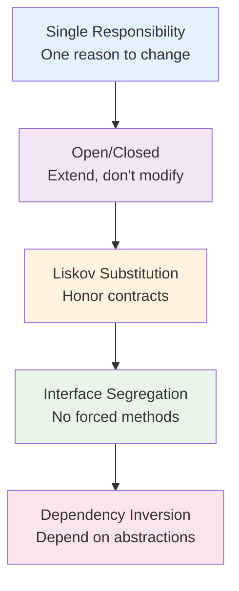

import { useCurrentSidebarCategory } from "@docusaurus/theme-common";

# SOLID Principles

SOLID is a collection of five design principles that guide the creation of maintainable, scalable, and flexible object-oriented systems. Each principle addresses a specific aspect of code organization, from class structure to dependency management. Together, they form a framework for making systems easier to understand, test, extend, and maintain over time.

These principles emerged from decades of software engineering experience and formalize patterns that successful teams use naturally. Rather than prescriptive rules, think of them as guidelines that help you recognize design problems early and apply proven solutions.

## Why SOLID Matters

Well-designed systems following SOLID principles exhibit these qualities:

- **Flexibility**: Changes to one requirement don't cascade through the entire codebase
- **Testability**: Components can be tested in isolation without heavyweight dependencies
- **Reusability**: Modules are cohesive and focused, making them useful in multiple contexts
- **Maintainability**: Clear separation of concerns makes code easier to understand and modify
- **Scalability**: Adding new features or implementations doesn't require modifying existing code

## The Five Principles

<Figure caption="SOLID principles learning path">

</Figure>

### Single Responsibility Principle (SRP)

A class should have only one reason to change. This principle encourages you to keep classes focused on a single responsibility, making them easier to understand, test, and modify. When a class handles multiple concerns, changes to one concern can break others.

### Open/Closed Principle (OCP)

Software entities should be open for extension but closed for modification. You should be able to add new functionality by creating new classes, not by modifying existing ones. This is achieved through abstraction, inheritance, and polymorphism.

### Liskov Substitution Principle (LSP)

Subtypes must be substitutable for their base types without breaking client code. This principle ensures that your inheritance hierarchies are behaviorally sound—subclasses truly honor the contracts of their parent classes, enabling true polymorphism.

### Interface Segregation Principle (ISP)

Clients should not be forced to depend on interfaces they don't use. Rather than creating one large interface, break it into smaller, focused ones. This reduces coupling and makes it clear which capabilities each implementation provides.

### Dependency Inversion Principle (DIP)

High-level modules should not depend on low-level modules; both should depend on abstractions. This principle flips the traditional dependency hierarchy, allowing your business logic to be independent of infrastructure details like databases and external APIs.

## How to Use These Articles

Each principle is presented as a standalone topic with:

- **Clear explanations** of what the principle means and why it matters
- **Real-world scenarios** showing what happens when principles are violated
- **Before/after code examples** in Python, Go, and Node.js
- **Practical guidance** on when to apply and when to avoid
- **Common patterns and pitfalls** to watch for
- **Design review checklists** for evaluating your own code

The principles build on each other but can be studied independently based on your needs.

## Common Misconceptions

**"SOLID is strict rules, not guidelines"** - These are best practices, not laws. Context matters. A simple script might not need perfect SOLID adherence; a framework definitely does.

**"Following SOLID means adding lots of abstractions"** - Over-abstraction adds complexity. Apply principles incrementally as requirements and pain points emerge.

**"All five principles must be applied equally"** - Different projects benefit from different principles. A small CLI tool might focus on SRP and DIP. A plugin system emphasizes OCP and LSP.

**"SOLID is only for object-oriented languages"** - While formulated for OOP, the underlying ideas (separation of concerns, loose coupling, contract preservation) apply to any paradigm.

## Quick Reference

| Principle | Focus | Problem Solved |
|-----------|-------|----------------|
| **SRP** | Class responsibility | Multiple unrelated reasons to change |
| **OCP** | Extensibility | Modification of stable code |
| **LSP** | Type compatibility | Surprising behavior in subclasses |
| **ISP** | Interface design | Forced dependency on unused methods |
| **DIP** | Dependency direction | High-level code coupled to low-level details |

<DocCardList items={useCurrentSidebarCategory().items} />
