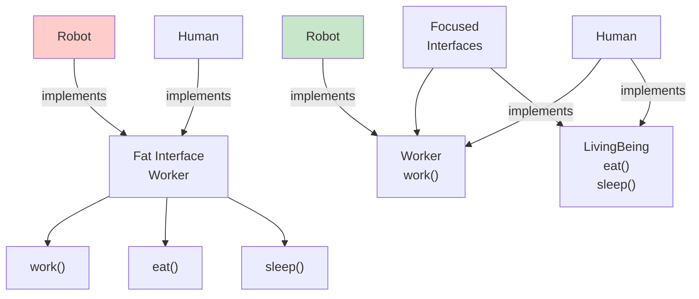

<Hero
  title="Interface Segregation Principle"
  description="Clients should not depend on interfaces they don't use. Break large interfaces into smaller, focused ones."
  size="large"
/>

## TL;DR

The Interface Segregation Principle states that clients should not be forced to depend on interfaces they don't use. Rather than creating one large, monolithic interface, break it into smaller, focused ones aligned with specific client needs. This reduces coupling, makes implementations simpler, and allows flexible composition of capabilities without paying for unused functionality.

## Learning Objectives

You will be able to:

- **Identify fat interfaces** that force unnecessary dependencies
- **Break monolithic interfaces** into cohesive, single-purpose ones
- **Design role-based interfaces** that match client needs
- **Reduce coupling** through focused contracts
- **Apply interface composition** to support multiple capabilities

## Motivating Scenario

Your platform supports multiple user roles: admin, developer, and viewer. You create a single `User` interface with methods for all roles: `deleteUsers()`, `configureSettings()`, `deployApplication()`, `viewDashboard()`, `downloadReports()`. Every user role must implement all methods, even when they don't need most of them. A viewer implementing `deleteUsers()` makes no sense. When you need to add a developer-specific capability, you modify the shared interface, forcing all roles to change.

By applying ISP, you create focused interfaces: `Viewer` (with `viewDashboard()`, `downloadReports()`), `Developer` (with `deployApplication()`, `viewLogs()`), and `Administrator` (with `deleteUsers()`, `configureSettings()`). Roles implement only what they need. Adding capabilities to one role doesn't affect others.

## Core Concepts

### Fat Interfaces vs. Focused Interfaces

A fat interface is one that groups unrelated methods that different clients don't all need.

<Figure caption="Fat interface fragmented into focused interfaces">

</Figure>

The problem with fat interfaces:

1. **Forced Implementation**: Classes implement methods they'll never use
2. **Fragile Dependencies**: Changes to rarely-used methods cascade
3. **Misleading Contracts**: Users of the interface don't know which methods are actually safe to call
4. **Tight Coupling**: Implementations are tightly coupled to the interface

### Interface Roles vs. Implementation Details

Interfaces should define **roles** that clients care about, not implementation details.

**Fat (Wrong):**
```python
class DocumentProcessor:
    def read_file(self): pass
    def write_file(self): pass
    def parse_xml(self): pass
    def validate_schema(self): pass
    def compress_data(self): pass
    def encrypt_data(self): pass
```

**Focused (Right):**
```python
class Reader:
    def read(self): pass

class Writer:
    def write(self): pass

class Validator:
    def validate(self): pass
```

Each interface represents a single role or capability.

### Interface Composition

Small, focused interfaces compose to express complex capabilities:

```python
class PDFProcessor(Reader, Writer, Validator):
    # Implements all three roles
    pass

class PlainTextReader(Reader):
    # Implements only reading
    pass
```

## Practical Example

**BEFORE (ISP Violation - Fat Interface):**

<Tabs groupId="lang" queryString>
  <TabItem value="python" label="Python">
```python title="worker.py" showLineNumbers
from abc import ABC, abstractmethod

class Worker(ABC):
    @abstractmethod
    def work(self): pass

    @abstractmethod
    def eat_lunch(self): pass

    @abstractmethod
    def sleep(self): pass

    @abstractmethod
    def code_review(self): pass

# Human must implement all methods
class Human(Worker):
    def work(self): return "Working..."
    def eat_lunch(self): return "Eating lunch..."
    def sleep(self): return "Sleeping..."
    def code_review(self): return "Reviewing code..."

# Robot must implement all methods, even ones it doesn't do
class Robot(Worker):
    def work(self): return "Working..."
    def eat_lunch(self):
        raise NotImplementedError("Robots don't eat")
    def sleep(self):
        raise NotImplementedError("Robots don't sleep")
    def code_review(self): return "Reviewing code..."

# Client code must know which methods are safe
def manage_worker(worker: Worker):
    print(worker.work())
    # Can we call eat_lunch? Only if it's Human!
    if isinstance(worker, Human):
        print(worker.eat_lunch())
```
  </TabItem>
  <TabItem value="go" label="Go">
```go title="worker.go" showLineNumbers
package main

// Fat interface forces unnecessary methods
type Worker interface {
    Work() string
    EatLunch() string
    Sleep() string
    CodeReview() string
}

type Human struct{}

func (h *Human) Work() string { return "Working..." }
func (h *Human) EatLunch() string { return "Eating..." }
func (h *Human) Sleep() string { return "Sleeping..." }
func (h *Human) CodeReview() string { return "Reviewing..." }

type Robot struct{}

func (r *Robot) Work() string { return "Working..." }
func (r *Robot) EatLunch() string {
    panic("Robots don't eat!") // Violation!
}
func (r *Robot) Sleep() string {
    panic("Robots don't sleep!") // Violation!
}
func (r *Robot) CodeReview() string { return "Reviewing..." }

// Client must check types to know which methods are safe
func ManageWorker(worker Worker) {
    println(worker.Work())
    // Can't call EatLunch safely without type checking!
}
```
  </TabItem>
  <TabItem value="node" label="Node.js">
```javascript title="worker.js" showLineNumbers
// Fat interface forces unnecessary methods
class Worker {
    work() { throw new Error('Not implemented'); }
    eatLunch() { throw new Error('Not implemented'); }
    sleep() { throw new Error('Not implemented'); }
    codeReview() { throw new Error('Not implemented'); }
}

class Human extends Worker {
    work() { return "Working..."; }
    eatLunch() { return "Eating..."; }
    sleep() { return "Sleeping..."; }
    codeReview() { return "Reviewing..."; }
}

class Robot extends Worker {
    work() { return "Working..."; }
    eatLunch() { throw new Error("Robots don't eat"); }
    sleep() { throw new Error("Robots don't sleep"); }
    codeReview() { return "Reviewing..."; }
}

// Client must check types to know which methods are safe
function manageWorker(worker) {
    console.log(worker.work());
    // Can't call eatLunch safely without type checking!
}
```
  </TabItem>
</Tabs>

**Problems:**
- Robots implement nonsensical methods
- Code that eats needs type checking
- Fat interface couples unrelated concepts
- Hard to test robot without dealing with methods it doesn't use

**AFTER (ISP Compliant - Focused Interfaces):**

<Tabs groupId="lang" queryString>
  <TabItem value="python" label="Python">
```python title="worker.py" showLineNumbers
from abc import ABC, abstractmethod

# Focused interfaces
class Workable(ABC):
    @abstractmethod
    def work(self): pass

class Eater(ABC):
    @abstractmethod
    def eat_lunch(self): pass

class Sleeper(ABC):
    @abstractmethod
    def sleep(self): pass

class Reviewer(ABC):
    @abstractmethod
    def code_review(self): pass

# Human implements all relevant interfaces
class Human(Workable, Eater, Sleeper, Reviewer):
    def work(self): return "Working..."
    def eat_lunch(self): return "Eating lunch..."
    def sleep(self): return "Sleeping..."
    def code_review(self): return "Reviewing code..."

# Robot implements only relevant interfaces
class Robot(Workable, Reviewer):
    def work(self): return "Working..."
    def code_review(self): return "Reviewing code..."

# Client code is clear and type-safe
def manage_workable(worker: Workable):
    print(worker.work())

def manage_eater(eater: Eater):
    print(eater.eat_lunch())

def manage_reviewer(reviewer: Reviewer):
    print(reviewer.code_review())

# Usage
human = Human()
manage_workable(human)
manage_eater(human)
manage_reviewer(human)

robot = Robot()
manage_workable(robot)
manage_reviewer(robot)
# manage_eater(robot)  # Compiler error! Robot doesn't implement Eater
```
  </TabItem>
  <TabItem value="go" label="Go">
```go title="worker.go" showLineNumbers
package main

// Focused interfaces
type Workable interface {
    Work() string
}

type Eater interface {
    EatLunch() string
}

type Sleeper interface {
    Sleep() string
}

type Reviewer interface {
    CodeReview() string
}

// Human implements all relevant interfaces
type Human struct{}

func (h *Human) Work() string { return "Working..." }
func (h *Human) EatLunch() string { return "Eating..." }
func (h *Human) Sleep() string { return "Sleeping..." }
func (h *Human) CodeReview() string { return "Reviewing..." }

// Robot implements only relevant interfaces
type Robot struct{}

func (r *Robot) Work() string { return "Working..." }
func (r *Robot) CodeReview() string { return "Reviewing..." }

// Client code is clear and type-safe
func ManageWorkable(worker Workable) {
    println(worker.Work())
}

func ManageEater(eater Eater) {
    println(eater.EatLunch())
}

func ManageReviewer(reviewer Reviewer) {
    println(reviewer.CodeReview())
}

// Usage
human := &Human{}
ManageWorkable(human)
ManageEater(human)
ManageReviewer(human)

robot := &Robot{}
ManageWorkable(robot)
ManageReviewer(robot)
// ManageEater(robot)  // Compile error! Robot doesn't implement Eater
```
  </TabItem>
  <TabItem value="node" label="Node.js">
```javascript title="worker.js" showLineNumbers
// Focused interfaces (as abstract classes)
class Workable {
    work() { throw new Error('Not implemented'); }
}

class Eater {
    eatLunch() { throw new Error('Not implemented'); }
}

class Sleeper {
    sleep() { throw new Error('Not implemented'); }
}

class Reviewer {
    codeReview() { throw new Error('Not implemented'); }
}

// Human implements all relevant interfaces
class Human extends Workable {
    constructor() {
        super();
        Object.assign(this, new Eater(), new Sleeper(), new Reviewer());
    }

    work() { return "Working..."; }
    eatLunch() { return "Eating..."; }
    sleep() { return "Sleeping..."; }
    codeReview() { return "Reviewing..."; }
}

// Robot implements only relevant interfaces
class Robot extends Workable {
    constructor() {
        super();
        Object.assign(this, new Reviewer());
    }

    work() { return "Working..."; }
    codeReview() { return "Reviewing..."; }
}

// Client code is clear and type-safe
function manageWorkable(worker) {
    console.log(worker.work());
}

function manageEater(eater) {
    console.log(eater.eatLunch());
}

function manageReviewer(reviewer) {
    console.log(reviewer.codeReview());
}

// Usage
const human = new Human();
manageWorkable(human);
manageEater(human);
manageReviewer(human);

const robot = new Robot();
manageWorkable(robot);
manageReviewer(robot);
// manageEater(robot);  // Runtime error! Robot doesn't implement Eater
```
  </TabItem>
</Tabs>

**Benefits:**
- No forced implementations of unneeded methods
- Clear, type-safe contracts
- Easy to add new capabilities without touching existing code
- Easier to test each role independently

## When to Use / When Not to Use

**Use ISP when:**
- Different clients need different subsets of a large interface
- You're designing public APIs or frameworks
- Multiple teams will implement the interface
- Capabilities are likely to evolve independently
- You want to minimize coupling between features

**Avoid over-segregation when:**
- All clients use all methods (rare but possible)
- Creating tiny interfaces adds more complexity than benefit
- Methods are tightly cohesive and always used together
- You're building internal utilities with a single implementation

## Patterns and Pitfalls

### Pattern: Adapter Pattern + ISP

Adapters bridge incompatible interfaces:

```python
# Legacy fat interface
class LegacyPaymentSystem:
    def charge_credit_card(self, amount): pass
    def log_transaction(self, details): pass
    def send_email_receipt(self, email): pass

# New focused interfaces
class PaymentProcessor:
    def process(self, amount): pass

# Adapter makes legacy system fit new interface
class LegacyPaymentAdapter(PaymentProcessor):
    def __init__(self, legacy_system):
        self.legacy = legacy_system

    def process(self, amount):
        self.legacy.charge_credit_card(amount)
        # Email and logging handled internally
        return True
```

### Pattern: Role-Based Interfaces

Design interfaces around client roles, not implementation details:

```python
# Role-based (Good)
class Printable:
    def print(self): pass

class Scannable:
    def scan(self): pass

class Faxable:
    def fax(self): pass

# Feature-based (Bad)
class MultifunctionDevice:
    def print(self): pass
    def scan(self): pass
    def fax(self): pass
    def photocopy(self): pass
    def collate(self): pass
```

### Pitfall: Over-Segregation

Don't fragment interfaces unnecessarily:

```python
# Too segregated
class Readable:
    def read(self): pass

class Writable:
    def write(self): pass

class Seekable:
    def seek(self): pass

class Closeable:
    def close(self): pass

class File(Readable, Writable, Seekable, Closeable):
    pass

# Better: Group cohesive operations
class Stream:
    def read(self): pass
    def write(self): pass
    def seek(self): pass
    def close(self): pass
```

## Design Review Checklist

- [ ] No interface method is implemented as "not applicable" or raising exceptions
- [ ] Clients depend only on methods they actually call
- [ ] Interfaces represent cohesive roles or capabilities
- [ ] Adding features doesn't force modifications to unrelated implementations
- [ ] Implementations don't have unused methods
- [ ] Interface names reflect client roles, not implementation details
- [ ] Multiple focused interfaces can be composed to describe complex objects
- [ ] No client performs `isinstance()` checks to determine method safety

## Self-Check

1. **In your codebase, find an interface with 5+ methods. How many of those methods do your implementations actually use? If some are unimplemented stubs, you have ISP violations.**
2. **Do any of your interface methods raise `NotImplementedError` or similar? That's a sign of fat interfaces.**
3. **Could you split this interface into smaller ones based on client needs?**

:::note
**One Takeaway**: Clients shouldn't pay for capabilities they don't use. Break fat interfaces into focused ones aligned with how clients actually use them.

:::

## Next Steps

- Review <a href="../single-responsibility" target="_blank" rel="nofollow noopener noreferrer">Single Responsibility Principle ↗️</a> for class design parallels
- Study <a href="../dependency-inversion" target="_blank" rel="nofollow noopener noreferrer">Dependency Inversion Principle ↗️</a> for interface dependency management
- Learn <a href="../../design-patterns/structural/adapter" target="_blank" rel="nofollow noopener noreferrer">Adapter Pattern ↗️</a> for bridging incompatible interfaces
- Explore <a href="../../design-patterns/structural/facade" target="_blank" rel="nofollow noopener noreferrer">Facade Pattern ↗️</a> for simplifying complex subsystems

## References

1. <a href="https://en.wikipedia.org/wiki/Interface_segregation_principle" target="_blank" rel="nofollow noopener noreferrer">Wikipedia: Interface Segregation Principle ↗️</a>
2. <a href="https://blog.cleancoder.com/uncle-bob/2014/05/17/InterfaceSegregationPrinciple.html" target="_blank" rel="nofollow noopener noreferrer">Uncle Bob: The Interface Segregation Principle ↗️</a>
3. <a href="https://refactoring.guru/design-patterns/adapter" target="_blank" rel="nofollow noopener noreferrer">Refactoring.Guru: Adapter Pattern ↗️</a>
