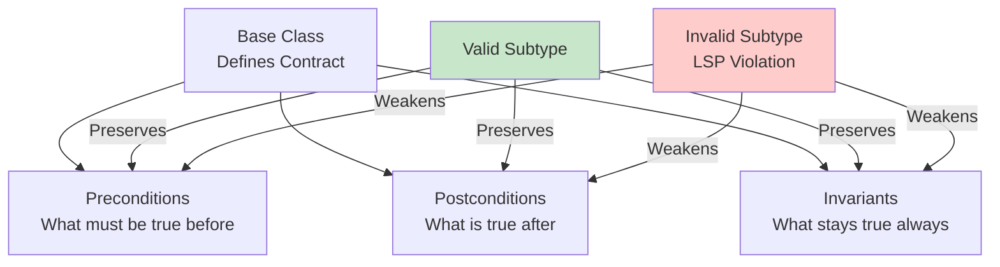

<Hero
  title="Liskov Substitution Principle"
  description="Subtypes must be substitutable for their supertypes without breaking client code. Preserve behavioral contracts."
  size="large"
/>

## TL;DR

The Liskov Substitution Principle states that subclass instances must be usable wherever their parent class is expected without breaking client code. This means subtypes must honor the behavioral contract of their base type: preserve preconditions, postconditions, and invariants. Violating LSP causes runtime surprises, unexpected exceptions, and type-based defects that defeat the purpose of polymorphism.

## Learning Objectives

You will be able to:

- **Understand behavioral contracts** and why inheritance must preserve them
- **Identify LSP violations** in inheritance hierarchies
- **Distinguish** between structural compatibility and behavioral compatibility
- **Apply design techniques** to maintain substitutability
- **Use composition** when inheritance threatens behavioral consistency

## Motivating Scenario

You have a `Bird` base class with a `fly()` method. A junior developer creates a `Penguin` class that extends `Bird`. But penguins don't fly. The developer makes `fly()` throw an exception or do nothing. Now code that accepts `Bird` and calls `fly()` suddenly crashes when given a `Penguin`. The `Penguin` is structurally a `Bird`, but behaviorally it violates the contract. This breaks polymorphism and forces client code to check the actual type before calling `fly()`.

By applying LSP, you recognize that `Penguin` shouldn't inherit from `Bird`. Instead, create `FlyingBird` and `SwimmingBird`, or use composition with a `Movement` interface. Now every subtype truly honors its parent's contract.

## Core Concepts

### The Substitutability Principle

LSP formalizes a critical insight: **type hierarchies should reflect behavioral relationships, not just structural similarities**.

<Figure caption="Behavioral compatibility vs. structural similarity">

</Figure>

### Preconditions, Postconditions, and Invariants

A method's contract includes three parts:

**Preconditions** - What must be true before calling the method. Subtypes cannot strengthen these (require more). Example: `withdraw(amount)` assumes `amount &gt; 0`. A subclass cannot require `amount >= 100`.

**Postconditions** - What must be true after the method completes. Subtypes cannot weaken these (guarantee less). Example: `withdraw(amount)` guarantees the balance decreases. A subclass cannot guarantee less.

**Invariants** - Constraints that must always hold. Subtypes cannot violate them. Example: A bank account invariant: "balance >= 0". A subclass cannot allow negative balances.

### The Covariance and Contravariance Problem

LSP also covers return types and parameter types in overridden methods:

- **Covariance (Return Types)**: A subtype method can return a more specific type than the base method (child of the base return type). ✓ Safe.
- **Contravariance (Parameters)**: A subtype method should accept more general parameter types than the base method. ✗ Most languages don't enforce this; it's a design responsibility.

## Practical Example

**BEFORE (LSP Violation):**

<Tabs groupId="lang" queryString>
  <TabItem value="python" label="Python">
```python title="bird.py" showLineNumbers
class Bird:
    def fly(self):
        """Birds can fly—returns distance flown."""
        return 100  # meters

class Penguin(Bird):
    def fly(self):
        """Penguins cannot fly."""
        raise NotImplementedError("Penguins cannot fly!")

class Eagle(Bird):
    def fly(self):
        return 200  # meters

# Problem: Client code breaks with Penguin
def make_bird_fly(bird: Bird):
    distance = bird.fly()  # Crashes if bird is Penguin!
    print(f"Bird flew {distance} meters")

eagle = Eagle()
make_bird_fly(eagle)  # Works fine

penguin = Penguin()
make_bird_fly(penguin)  # Crashes: NotImplementedError!
```
  </TabItem>
  <TabItem value="go" label="Go">
```go title="bird.go" showLineNumbers
package main

type Bird interface {
    Fly() int  // Returns distance in meters
}

type Penguin struct{}

func (p *Penguin) Fly() int {
    panic("Penguins cannot fly!")  // Violates contract!
}

type Eagle struct{}

func (e *Eagle) Fly() int {
    return 200
}

// Problem: Client code breaks with Penguin
func MakeBirdFly(bird Bird) {
    distance := bird.Fly()  // Panics if bird is Penguin!
    println("Bird flew", distance, "meters")
}

// Usage
MakeBirdFly(&Eagle{})      // Works fine
MakeBirdFly(&Penguin{})    // Panics at runtime!
```
  </TabItem>
  <TabItem value="node" label="Node.js">
```javascript title="bird.js" showLineNumbers
class Bird {
    fly() {
        // Birds can fly—returns distance flown
        return 100;  // meters
    }
}

class Penguin extends Bird {
    fly() {
        // Penguins cannot fly
        throw new Error("Penguins cannot fly!");
    }
}

class Eagle extends Bird {
    fly() {
        return 200;  // meters
    }
}

// Problem: Client code breaks with Penguin
function makeBirdFly(bird) {
    const distance = bird.fly();  // Crashes if bird is Penguin!
    console.log(`Bird flew ${distance} meters`);
}

makeBirdFly(new Eagle());    // Works fine
makeBirdFly(new Penguin());  // Throws error!
```
  </TabItem>
</Tabs>

**AFTER (LSP Compliant):**

<Tabs groupId="lang" queryString>
  <TabItem value="python" label="Python">
```python title="bird.py" showLineNumbers
from abc import ABC, abstractmethod

# Base class for all birds
class Bird(ABC):
    @abstractmethod
    def move(self):
        """All birds move in some way."""
        pass

# Separate hierarchy for flying birds
class FlyingBird(Bird):
    @abstractmethod
    def fly(self):
        """Flying birds can fly."""
        pass

    def move(self):
        return self.fly()

class Eagle(FlyingBird):
    def fly(self):
        return 200  # meters

class Sparrow(FlyingBird):
    def fly(self):
        return 50  # meters

# Separate hierarchy for swimming birds
class SwimmingBird(Bird):
    @abstractmethod
    def swim(self):
        """Swimming birds can swim."""
        pass

    def move(self):
        return self.swim()

class Penguin(SwimmingBird):
    def swim(self):
        return 80  # meters

class Duck(SwimmingBird):
    def swim(self):
        return 40  # meters

# Safe polymorphism: each subtype honors Bird contract
def move_bird(bird: Bird):
    distance = bird.move()
    print(f"Bird moved {distance} units")

move_bird(Eagle())     # Works: Eagle is a FlyingBird
move_bird(Penguin())   # Works: Penguin is a SwimmingBird
move_bird(Duck())      # Works: Duck is a SwimmingBird
```
  </TabItem>
  <TabItem value="go" label="Go">
```go title="bird.go" showLineNumbers
package main

// Base interface for all birds
type Bird interface {
    Move() int  // All birds move
}

// FlyingBird interface
type FlyingBird interface {
    Bird
    Fly() int
}

// SwimmingBird interface
type SwimmingBird interface {
    Bird
    Swim() int
}

// Eagle implements FlyingBird
type Eagle struct{}

func (e *Eagle) Fly() int {
    return 200
}

func (e *Eagle) Move() int {
    return e.Fly()
}

// Penguin implements SwimmingBird
type Penguin struct{}

func (p *Penguin) Swim() int {
    return 80
}

func (p *Penguin) Move() int {
    return p.Swim()
}

// Safe polymorphism
func MoveBird(bird Bird) {
    distance := bird.Move()
    println("Bird moved", distance, "units")
}

// Usage
MoveBird(&Eagle{})   // Works: Eagle is a FlyingBird
MoveBird(&Penguin{}) // Works: Penguin is a SwimmingBird
```
  </TabItem>
  <TabItem value="node" label="Node.js">
```javascript title="bird.js" showLineNumbers
// Base class for all birds
class Bird {
    move() {
        throw new Error('move() must be implemented');
    }
}

// FlyingBird hierarchy
class FlyingBird extends Bird {
    fly() {
        throw new Error('fly() must be implemented');
    }

    move() {
        return this.fly();
    }
}

class Eagle extends FlyingBird {
    fly() {
        return 200;  // meters
    }
}

class Sparrow extends FlyingBird {
    fly() {
        return 50;  // meters
    }
}

// SwimmingBird hierarchy
class SwimmingBird extends Bird {
    swim() {
        throw new Error('swim() must be implemented');
    }

    move() {
        return this.swim();
    }
}

class Penguin extends SwimmingBird {
    swim() {
        return 80;  // meters
    }
}

class Duck extends SwimmingBird {
    swim() {
        return 40;  // meters
    }
}

// Safe polymorphism
function moveBird(bird) {
    const distance = bird.move();
    console.log(`Bird moved ${distance} units`);
}

moveBird(new Eagle());    // Works: Eagle is a FlyingBird
moveBird(new Penguin());  // Works: Penguin is a SwimmingBird
moveBird(new Duck());     // Works: Duck is a SwimmingBird
```
  </TabItem>
</Tabs>

**Benefits:**
- Every subtype truly honors its parent contract
- No type checking needed in client code
- Adding new bird types is safe
- Clear behavioral relationships

## Common LSP Violations

### Violation 1: Weakened Postconditions

```python
class Account:
    def withdraw(self, amount):
        """Withdraw money. Balance never goes negative."""
        if self.balance >= amount:
            self.balance -= amount
        return self.balance

class OverdraftAccount(Account):
    def withdraw(self, amount):
        """Withdraw money, even if balance goes negative."""
        self.balance -= amount  # No check!
        return self.balance
```

The subclass weakens the postcondition (breaking the "never negative" guarantee).

**Fix**: Create separate abstractions or add an `UnsafeAccount` type that doesn't promise balance protection.

### Violation 2: Strengthened Preconditions

```python
class Shape:
    def resize(self, factor):
        """Resize shape by factor."""
        # Works with any factor
        pass

class Square(Shape):
    def resize(self, factor):
        """Resize square. Factor must be > 0."""
        if factor <= 0:
            raise ValueError("Factor must be positive")
        super().resize(factor)
```

The subclass strengthens the precondition (requiring `factor &gt; 0` when the base allows any value).

**Fix**: Enforce the precondition in the base class, or document that factors ≤ 0 are invalid.

### Violation 3: Throwing Unexpected Exceptions

```python
class DataRepository:
    def fetch(self, id):
        """Retrieve data. Returns data or empty."""
        # Documented: never throws
        return self.storage.get(id) or None

class RemoteRepository(DataRepository):
    def fetch(self, id):
        """Retrieve data from remote server."""
        # Throws NetworkError on connection failure!
        response = requests.get(f"https://api.example.com/data/{id}")
        return response.json()
```

The subclass throws exceptions not documented in the base class contract.

**Fix**: Update the base class contract to allow exceptions, or handle them in the subclass.

## When to Use / When Not to Use

**Use LSP when:**
- Designing inheritance hierarchies that will be polymorphically used
- Multiple teams implement subtypes you don't control
- You're building frameworks expecting third-party plugins
- Behavioral compatibility is critical for correctness

**Reconsider inheritance when:**
- Subtypes can't reasonably honor the base contract
- The "is-a" relationship is weak or only structural
- Composition would better express the relationship
- You'd need to add type checks in client code

## Patterns and Pitfalls

### Pattern: Composition Over Inheritance

When inheritance threatens LSP, use composition:

```python
# Bad: Penguin as Bird
class Bird:
    def fly(self): return 100

class Penguin(Bird):  # LSP violation!
    def fly(self): raise NotImplementedError

# Good: Penguin has a movement capability
class MovementCapability:
    def move(self): raise NotImplementedError

class Penguin:
    def __init__(self):
        self.movement = SwimmingMovement()

    def move(self):
        return self.movement.move()
```

### Pattern: Interface Segregation + LSP

Smaller, focused interfaces make substitutability clearer:

```python
class Drawable:
    def draw(self): pass

class Persistent:
    def save(self): pass

class Document(Drawable, Persistent):
    def draw(self): ...
    def save(self): ...
```

### Pitfall: The Circle-Rectangle Problem

A famous LSP violation:

```python
class Rectangle:
    def set_width(self, w): self.width = w
    def set_height(self, h): self.height = h

class Circle(Rectangle):  # LSP violation!
    def set_width(self, w):
        self.width = self.height = w  # Forces width == height

    def set_height(self, h):
        self.width = self.height = h  # Forces width == height
```

A circle isn't a special rectangle—the behavioral contracts differ.

## Design Review Checklist

- [ ] Every subclass truly honors the base class contract
- [ ] Postconditions aren't weakened (guarantees still hold)
- [ ] Preconditions aren't strengthened (still accepts same inputs)
- [ ] Invariants are preserved
- [ ] No unexpected exceptions thrown
- [ ] Client code never needs `isinstance()` or `type()` checks
- [ ] Polymorphic code works with any subtype without surprises
- [ ] Return types are covariant (more specific is OK)
- [ ] Parameter types are appropriately contravariant (if language supports it)

## Self-Check

1. **In your codebase, find a base class with 5+ subclasses. Does every subclass truly honor the contract, or do some special-case behavior?**
2. **Can you pass any subclass to code expecting the base class without it breaking?**
3. **Are there any `if isinstance(obj, SpecificType)` checks that hint at LSP violations?**

:::note
**One Takeaway**: If you can't substitute a subclass for its parent without surprising side effects, the inheritance relationship is wrong. Fix the hierarchy, not the client code.

:::

## Next Steps

- Review <a href="../open-closed" target="_blank" rel="nofollow noopener noreferrer">Open/Closed Principle ↗️</a> for safe extension patterns
- Study <a href="../interface-segregation" target="_blank" rel="nofollow noopener noreferrer">Interface Segregation Principle ↗️</a> to avoid forced implementations
- Learn about <a href="../../general-principles/composition-over-inheritance" target="_blank" rel="nofollow noopener noreferrer">Composition Over Inheritance ↗️</a> as an alternative
- Explore <a href="../../design-patterns/structural/decorator" target="_blank" rel="nofollow noopener noreferrer">Decorator Pattern ↗️</a> for flexible behavior addition

## References

1. <a href="https://en.wikipedia.org/wiki/Liskov_substitution_principle" target="_blank" rel="nofollow noopener noreferrer">Wikipedia: Liskov Substitution Principle ↗️</a>
2. <a href="https://stackify.com/solid-design-liskov-substitution-principle/" target="_blank" rel="nofollow noopener noreferrer">Stackify: Liskov Substitution Principle Explained ↗️</a>
3. <a href="https://blog.cleancoder.com/uncle-bob/2015/01/15/TheThreeRules.html" target="_blank" rel="nofollow noopener noreferrer">Uncle Bob: The Three Rules of TDD ↗️</a>
