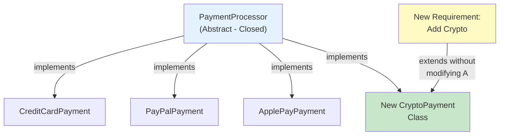

<Hero
  title="Open/Closed Principle"
  description="Software entities should be open for extension, closed for modification. Design for change without breaking existing code."
  size="large"
/>

## TL;DR

The Open/Closed Principle states that software modules should be open for extension but closed for modification. Add new functionality through inheritance, composition, or polymorphism rather than changing existing code. This reduces regression risk, prevents cascading changes, and makes code safer to extend without breaking existing clients.

## Learning Objectives

You will be able to:

- **Understand the paradox** of being simultaneously open for extension and closed for modification
- **Identify violations** where new features require modifying existing classes
- **Apply abstraction** through interfaces and base classes to enable extension
- **Recognize opportunities** for polymorphism and strategy patterns
- **Design extensible systems** that grow without accumulating technical debt

## Motivating Scenario

Your payment processing system handles credit cards and PayPal. When management requests support for Apple Pay, you modify the `PaymentProcessor` class by adding an Apple Pay branch to a massive conditional statement. Later, Google Pay arrives, then crypto payments. The `PaymentProcessor` becomes a sprawling, unmaintainable mess with dozens of `if` statements. Each new payment method requires re-testing the entire class, risking regressions in credit card or PayPal processing.

By applying the Open/Closed Principle, you design an abstract `PaymentMethod` interface. Each payment method (credit card, PayPal, Apple Pay) becomes a concrete implementation. To add Google Pay, you create a new class implementing the interface—no existing code changes. The system is closed for modification but open for extension.

## Core Concepts

### Open vs. Closed: Resolving the Paradox

The principle contains an apparent contradiction:

- **Open for extension**: You can add new functionality or behaviors without limits.
- **Closed for modification**: Existing code doesn't change.

This works through **abstraction**. You fix the abstraction (closed), but concrete implementations can vary (open).

<Figure caption="Open/Closed Principle: Safe extension through abstraction">

</Figure>

### Abstraction: The Key to Extension

Abstraction creates stable contracts that allow variation:

```
Client Code
    ↓
Stable Interface (closed)
    ↓
Multiple Implementations (open for variation)
```

When you depend on an interface rather than concrete classes, adding new implementations doesn't touch the client code or interface.

### Polymorphism as the Mechanism

Polymorphism enables OCP:

- **Compile-time (Static)**: Method overloading, templates (C++)
- **Runtime (Dynamic)**: Interface implementation, inheritance

Runtime polymorphism gives you the most flexibility. A payment processor that accepts any `PaymentMethod` interface can work with payment types it was never written for.

## Practical Example

**BEFORE (OCP Violation):**

<Tabs groupId="lang" queryString>
  <TabItem value="python" label="Python">
```python title="payment.py" showLineNumbers
class PaymentProcessor:
    def process(self, payment_type, amount):
        if payment_type == "credit_card":
            # Credit card logic
            card = get_card_details()
            return charge_card(card, amount)
        elif payment_type == "paypal":
            # PayPal logic
            account = get_paypal_account()
            return transfer_from_paypal(account, amount)
        elif payment_type == "apple_pay":
            # Apple Pay logic
            token = get_apple_pay_token()
            return process_apple_pay(token, amount)
        else:
            raise ValueError(f"Unknown payment type: {payment_type}")
```
  </TabItem>
  <TabItem value="go" label="Go">
```go title="payment.go" showLineNumbers
type PaymentProcessor struct{}

func (p *PaymentProcessor) Process(paymentType string, amount float64) (string, error) {
    switch paymentType {
    case "credit_card":
        // Credit card logic
        card := getCardDetails()
        return chargeCard(card, amount)
    case "paypal":
        // PayPal logic
        account := getPayPalAccount()
        return transferFromPayPal(account, amount)
    case "apple_pay":
        // Apple Pay logic
        token := getApplePayToken()
        return processApplePay(token, amount)
    default:
        return "", fmt.Errorf("unknown payment type: %s", paymentType)
    }
}
```
  </TabItem>
  <TabItem value="node" label="Node.js">
```javascript title="payment.js" showLineNumbers
class PaymentProcessor {
    process(paymentType, amount) {
        if (paymentType === 'credit_card') {
            // Credit card logic
            const card = getCardDetails();
            return chargeCard(card, amount);
        } else if (paymentType === 'paypal') {
            // PayPal logic
            const account = getPayPalAccount();
            return transferFromPayPal(account, amount);
        } else if (paymentType === 'apple_pay') {
            // Apple Pay logic
            const token = getApplePayToken();
            return processApplePay(token, amount);
        } else {
            throw new Error(`Unknown payment type: ${paymentType}`);
        }
    }
}
```
  </TabItem>
</Tabs>

**Problems:**
- Adding Google Pay requires modifying `PaymentProcessor`
- Risk of breaking existing payment types during modification
- Difficult to test in isolation
- Violates Single Responsibility Principle too

**AFTER (OCP Compliant):**

<Tabs groupId="lang" queryString>
  <TabItem value="python" label="Python">
```python title="payment.py" showLineNumbers
from abc import ABC, abstractmethod

# Abstraction (Closed)
class PaymentMethod(ABC):
    @abstractmethod
    def process(self, amount: float) -> str:
        pass

# Implementations (Open for extension)
class CreditCardPayment(PaymentMethod):
    def process(self, amount: float) -> str:
        card = get_card_details()
        return charge_card(card, amount)

class PayPalPayment(PaymentMethod):
    def process(self, amount: float) -> str:
        account = get_paypal_account()
        return transfer_from_paypal(account, amount)

class ApplePayPayment(PaymentMethod):
    def process(self, amount: float) -> str:
        token = get_apple_pay_token()
        return process_apple_pay(token, amount)

# Adding crypto payment requires NO changes to existing code
class CryptoPayment(PaymentMethod):
    def process(self, amount: float) -> str:
        wallet = get_wallet_address()
        return process_blockchain_transaction(wallet, amount)

# Client (Closed)
class PaymentProcessor:
    def process_payment(self, method: PaymentMethod, amount: float) -> str:
        return method.process(amount)

# Usage
processor = PaymentProcessor()
credit_card = CreditCardPayment()
processor.process_payment(credit_card, 99.99)

# Add new payment type without modifying PaymentProcessor
crypto = CryptoPayment()
processor.process_payment(crypto, 0.5)
```
  </TabItem>
  <TabItem value="go" label="Go">
```go title="payment.go" showLineNumbers
package main

// Abstraction (Closed)
type PaymentMethod interface {
    Process(amount float64) (string, error)
}

// Implementations (Open for extension)
type CreditCardPayment struct{}

func (c *CreditCardPayment) Process(amount float64) (string, error) {
    card := getCardDetails()
    return chargeCard(card, amount)
}

type PayPalPayment struct{}

func (p *PayPalPayment) Process(amount float64) (string, error) {
    account := getPayPalAccount()
    return transferFromPayPal(account, amount)
}

type ApplePayPayment struct{}

func (a *ApplePayPayment) Process(amount float64) (string, error) {
    token := getApplePayToken()
    return processApplePay(token, amount)
}

// Adding crypto payment requires NO changes to existing code
type CryptoPayment struct{}

func (c *CryptoPayment) Process(amount float64) (string, error) {
    wallet := getWalletAddress()
    return processBlockchainTransaction(wallet, amount)
}

// Client (Closed)
type PaymentProcessor struct{}

func (p *PaymentProcessor) ProcessPayment(method PaymentMethod, amount float64) (string, error) {
    return method.Process(amount)
}

// Usage
processor := &PaymentProcessor{}
creditCard := &CreditCardPayment{}
processor.ProcessPayment(creditCard, 99.99)

crypto := &CryptoPayment{}
processor.ProcessPayment(crypto, 0.5)
```
  </TabItem>
  <TabItem value="node" label="Node.js">
```javascript title="payment.js" showLineNumbers
// Abstraction (Closed)
class PaymentMethod {
    process(amount) {
        throw new Error('process() must be implemented');
    }
}

// Implementations (Open for extension)
class CreditCardPayment extends PaymentMethod {
    process(amount) {
        const card = getCardDetails();
        return chargeCard(card, amount);
    }
}

class PayPalPayment extends PaymentMethod {
    process(amount) {
        const account = getPayPalAccount();
        return transferFromPayPal(account, amount);
    }
}

class ApplePayPayment extends PaymentMethod {
    process(amount) {
        const token = getApplePayToken();
        return processApplePay(token, amount);
    }
}

// Adding crypto payment requires NO changes to existing code
class CryptoPayment extends PaymentMethod {
    process(amount) {
        const wallet = getWalletAddress();
        return processBlockchainTransaction(wallet, amount);
    }
}

// Client (Closed)
class PaymentProcessor {
    processPayment(method, amount) {
        return method.process(amount);
    }
}

// Usage
const processor = new PaymentProcessor();
const creditCard = new CreditCardPayment();
processor.processPayment(creditCard, 99.99);

const crypto = new CryptoPayment();
processor.processPayment(crypto, 0.5);
```
  </TabItem>
</Tabs>

**Benefits:**
- Add payment types without touching `PaymentProcessor`
- Each payment class is independent and testable
- New implementations can't break existing ones
- Clear separation of concerns

## When to Use / When Not to Use

**Use OCP when:**
- Requirements change frequently or unpredictably
- You have multiple implementations of similar behavior (payment methods, storage backends, notification channels)
- Third-party code or plugins extend your system
- You're designing frameworks or reusable libraries
- Your team grows and different teams own different implementations

**Avoid premature abstraction when:**
- You have no evidence that extension is needed (YAGNI—"You Aren't Gonna Need It")
- Creating abstractions adds complexity without clear benefit
- The problem domain is well-understood and stable
- You're prototyping or exploring an idea

## Patterns and Pitfalls

### Pattern: Strategy Pattern

The strategy pattern embodies OCP by allowing runtime selection of algorithms:

```python
# Strategy interface
class SortingStrategy(ABC):
    @abstractmethod
    def sort(self, items):
        pass

# Concrete strategies
class QuickSort(SortingStrategy):
    def sort(self, items):
        return quicksort_impl(items)

class MergeSort(SortingStrategy):
    def sort(self, items):
        return mergesort_impl(items)

# Client
class DataProcessor:
    def __init__(self, strategy: SortingStrategy):
        self.strategy = strategy

    def process(self, data):
        return self.strategy.sort(data)
```

### Pitfall: Over-Abstraction

Don't create abstractions without clear need:

```python
# Too abstract—premature generalization
class GenericProcessor:
    def process(self, operation, data):
        # Generic processing that doesn't really apply to anything
        pass

# Better: Concrete abstractions based on real requirements
class DataSortProcessor:
    def __init__(self, strategy: SortingStrategy):
        self.strategy = strategy
```

### Pattern: Dependency Inversion + OCP

Combine OCP with dependency injection:

```python
class PaymentProcessor:
    def __init__(self, payment_method: PaymentMethod, logger: Logger):
        self.payment_method = payment_method
        self.logger = logger

    def process(self, amount):
        self.logger.log(f"Processing ${amount}")
        return self.payment_method.process(amount)
```

### Pitfall: Modification Instead of Extension

Resist the urge to add parameters to satisfy new requirements:

```python
# Violates OCP—modifying existing interface
class PaymentMethod(ABC):
    @abstractmethod
    def process(self, amount, currency="USD", retries=1):
        pass

# Better: Subclass or composition
class RetryablePaymentMethod(PaymentMethod):
    def __init__(self, inner: PaymentMethod, retries=1):
        self.inner = inner
        self.retries = retries

    def process(self, amount):
        # Retry logic wraps inner
        pass
```

## Design Review Checklist

- [ ] New requirements trigger extension, not modification of existing classes
- [ ] Abstract base classes or interfaces define stable contracts
- [ ] Concrete implementations are independent and isolated
- [ ] Client code depends on abstractions, not concrete types
- [ ] Each implementation can be tested without touching others
- [ ] Adding a new variant doesn't require a code review of unrelated classes
- [ ] Conditional logic (switch, if-else chains) is minimized
- [ ] Polymorphism is used instead of type checking
- [ ] Dependencies are injected, not hard-coded

## Self-Check

1. **In your current system, where do you have `if` or `switch` statements checking types? Could those be abstracted into implementations?**
2. **When a new feature request arrives, do you modify existing classes or create new ones? If mostly modifying, you're violating OCP.**
3. **Can you add a new payment method, storage backend, or notification channel without changing the main processor?**

:::note
**One Takeaway**: Design for extension through abstraction, not modification. When new requirements arrive, reach for inheritance or composition, not conditional logic.

:::

## Next Steps

- Learn <a href="../liskov-substitution" target="_blank" rel="nofollow noopener noreferrer">Liskov Substitution Principle ↗️</a> for proper inheritance design
- Explore <a href="../dependency-inversion" target="_blank" rel="nofollow noopener noreferrer">Dependency Inversion Principle ↗️</a> to manage dependencies
- Study <a href="../../design-patterns/behavioral/strategy" target="_blank" rel="nofollow noopener noreferrer">Strategy Pattern ↗️</a> for algorithm families
- Review <a href="../../design-patterns/structural/decorator" target="_blank" rel="nofollow noopener noreferrer">Decorator Pattern ↗️</a> for adding behavior

## References

1. <a href="https://en.wikipedia.org/wiki/Open%E2%80%93closed_principle" target="_blank" rel="nofollow noopener noreferrer">Wikipedia: Open/Closed Principle ↗️</a>
2. <a href="https://blog.cleancoder.com/uncle-bob/2014/05/12/TheOpenClosedPrinciple.html" target="_blank" rel="nofollow noopener noreferrer">Uncle Bob: The Open Closed Principle ↗️</a>
3. <a href="https://refactoring.guru/design-patterns/strategy" target="_blank" rel="nofollow noopener noreferrer">Refactoring.Guru: Strategy Pattern ↗️</a>
