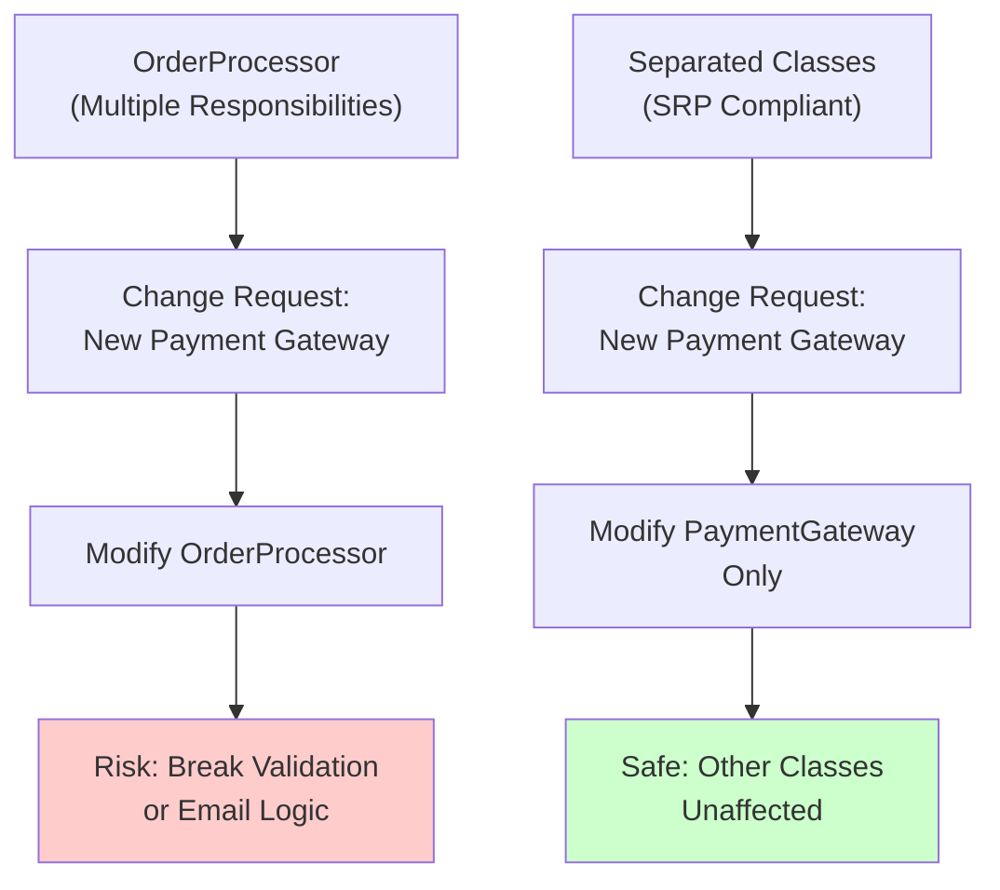

<Hero
  title="Single Responsibility Principle"
  description="A class should have only one reason to change. Master focused, maintainable design."
  size="large"
/>

## What Is the Single Responsibility Principle?

The Single Responsibility Principle (SRP) states that **a class should have only one reason to change**. In other words, a class should have one job or responsibility. This principle encourages cohesion—grouping related functionality together—while reducing coupling between different concerns.

When a class has multiple responsibilities, changes to one responsibility can break the other. For example, a `User` class that handles both user data persistence and email notifications violates SRP. If you need to change how emails are sent, you must modify the `User` class, risking unintended side effects on user persistence logic.

## TL;DR

The Single Responsibility Principle requires that each class handle exactly one concern. Changes to database logic shouldn't touch business logic. Use extraction and composition to separate distinct responsibilities. SRP improves testability, reusability, and maintainability while reducing ripple effects from changes.

## Learning Objectives

You will be able to:
- Identify multiple responsibilities hidden within a single class
- Refactor classes to follow SRP through extraction and composition
- Understand the connection between SRP and change propagation
- Recognize common SRP violations in legacy code
- Apply SRP in real-world scenarios with proper abstraction

## Motivating Scenario

Your team maintains a legacy `OrderProcessor` class that handles order validation, database persistence, payment processing, and email notifications. When the payment gateway changes, the class needs modification, risking bugs in order persistence. When email templates change, the payment logic unexpectedly breaks. The `OrderProcessor` has four reasons to change, making it fragile and hard to test in isolation.

By applying SRP, you extract each responsibility into focused classes: `OrderValidator`, `OrderRepository`, `PaymentGateway`, and `EmailNotifier`. Now changes to payment logic don't affect email functionality, and each class can be tested independently with clear dependencies.

## Core Concepts

### Understanding "Reason to Change"

A "reason to change" isn't just code modification—it's a requirement change. If stakeholders might request changes to:
- Business logic for order validation
- How orders persist to the database
- Which payment processor to use
- Email notification timing

...then you have multiple reasons to change, indicating multiple responsibilities.

<Figure caption="Identifying reasons to change in a violation vs. compliant design">

</Figure>

### The Cohesion-Coupling Balance

SRP works in tandem with cohesion and coupling:
- **Cohesion**: How closely related are methods within a class? High cohesion groups similar functionality.
- **Coupling**: How dependent are classes on each other? Low coupling reduces ripple effects.

When you apply SRP, you increase cohesion within classes and often decrease coupling by making dependencies explicit.

### When Extraction Isn't the Answer

SRP doesn't mean every method should be in its own class. A `Point` class with `x` and `y` coordinates has one responsibility: representing a point. Adding angle calculation, rotation, or distance methods still serves the single responsibility of modeling point geometry—they're all aspects of that one concern.

## Practical Example

Let me show you a violation and then refactor it properly.

**BEFORE (SRP Violation):**

<Tabs groupId="lang" queryString>
<TabItem value="python" label="Python">
```python
class User:
    def __init__(self, username, email):
        self.username = username
        self.email = email

    def save_to_database(self):
        # Database logic mixed with business logic
        connection = create_db_connection()
        query = f"INSERT INTO users (username, email) VALUES ('{self.username}', '{self.email}')"
        connection.execute(query)

    def send_welcome_email(self):
        # Email logic mixed in
        smtp = create_smtp_connection()
        message = f"Welcome {self.username}!"
        smtp.send(self.email, message)

    def validate(self):
        # Validation logic
        return "@" in self.email and len(self.username) > 2
```
</TabItem>
<TabItem value="go" label="Go">
```go
type User struct {
    Username string
    Email    string
}

// Database responsibility
func (u *User) SaveToDatabase() error {
    conn := createDBConnection()
    query := fmt.Sprintf("INSERT INTO users (username, email) VALUES ('%s', '%s')", u.Username, u.Email)
    return conn.Execute(query)
}

// Email responsibility
func (u *User) SendWelcomeEmail() error {
    smtp := createSMTPConnection()
    message := fmt.Sprintf("Welcome %s!", u.Username)
    return smtp.Send(u.Email, message)
}

// Validation responsibility
func (u *User) Validate() bool {
    return strings.Contains(u.Email, "@") && len(u.Username) > 2
}
```
</TabItem>
<TabItem value="nodejs" label="Node.js">
```javascript
class User {
    constructor(username, email) {
        this.username = username;
        this.email = email;
    }

    // Database responsibility
    async saveToDatabase() {
        const connection = createDBConnection();
        const query = `INSERT INTO users (username, email) VALUES ('${this.username}', '${this.email}')`;
        return connection.execute(query);
    }

    // Email responsibility
    async sendWelcomeEmail() {
        const smtp = createSMTPConnection();
        const message = `Welcome ${this.username}!`;
        return smtp.send(this.email, message);
    }

    // Validation responsibility
    validate() {
        return this.email.includes('@') && this.username.length > 2;
    }
}
```
</TabItem>
</Tabs>

**AFTER (SRP Compliant):**

<Tabs groupId="lang" queryString>
<TabItem value="python" label="Python">
```python
class User:
    """Represents user data—single responsibility."""
    def __init__(self, username, email):
        self.username = username
        self.email = email

class UserValidator:
    """Validates user input."""
    def validate(self, user):
        return "@" in user.email and len(user.username) > 2

class UserRepository:
    """Handles user persistence."""
    def save(self, user):
        connection = create_db_connection()
        query = f"INSERT INTO users (username, email) VALUES ('{user.username}', '{user.email}')"
        connection.execute(query)

class EmailService:
    """Handles email notifications."""
    def send_welcome_email(self, user):
        smtp = create_smtp_connection()
        message = f"Welcome {user.username}!"
        smtp.send(user.email, message)

# Usage
user = User("alice", "alice@example.com")
validator = UserValidator()
if validator.validate(user):
    repository = UserRepository()
    repository.save(user)
    email_service = EmailService()
    email_service.send_welcome_email(user)
```
</TabItem>
<TabItem value="go" label="Go">
```go
// User data only
type User struct {
    Username string
    Email    string
}

// Validation responsibility
type UserValidator struct{}

func (v *UserValidator) Validate(u *User) bool {
    return strings.Contains(u.Email, "@") && len(u.Username) > 2
}

// Persistence responsibility
type UserRepository struct{}

func (r *UserRepository) Save(u *User) error {
    conn := createDBConnection()
    query := fmt.Sprintf("INSERT INTO users (username, email) VALUES ('%s', '%s')", u.Username, u.Email)
    return conn.Execute(query)
}

// Email responsibility
type EmailService struct{}

func (e *EmailService) SendWelcomeEmail(u *User) error {
    smtp := createSMTPConnection()
    message := fmt.Sprintf("Welcome %s!", u.Username)
    return smtp.Send(u.Email, message)
}

// Usage
user := &User{Username: "alice", Email: "alice@example.com"}
validator := &UserValidator{}
if validator.Validate(user) {
    repo := &UserRepository{}
    repo.Save(user)
    email := &EmailService{}
    email.SendWelcomeEmail(user)
}
```
</TabItem>
<TabItem value="nodejs" label="Node.js">
```javascript
// User data only
class User {
    constructor(username, email) {
        this.username = username;
        this.email = email;
    }
}

// Validation responsibility
class UserValidator {
    validate(user) {
        return user.email.includes('@') && user.username.length > 2;
    }
}

// Persistence responsibility
class UserRepository {
    async save(user) {
        const connection = createDBConnection();
        const query = `INSERT INTO users (username, email) VALUES ('${user.username}', '${user.email}')`;
        return connection.execute(query);
    }
}

// Email responsibility
class EmailService {
    async sendWelcomeEmail(user) {
        const smtp = createSMTPConnection();
        const message = `Welcome ${user.username}!`;
        return smtp.send(user.email, message);
    }
}

// Usage
const user = new User("alice", "alice@example.com");
const validator = new UserValidator();
if (validator.validate(user)) {
    const repository = new UserRepository();
    await repository.save(user);
    const emailService = new EmailService();
    await emailService.sendWelcomeEmail(user);
}
```
</TabItem>
</Tabs>

## Patterns & Pitfalls

### Pitfall: Over-Fragmentation

Don't extract a responsibility for every method. A `UserRepository` with `save()`, `update()`, and `delete()` is appropriate—they're all persistence operations. Extracting each into separate classes creates unnecessary complexity.

### Pattern: Dependency Injection

SRP becomes powerful with dependency injection. Instead of `UserRepository` creating its own database connection, inject it:

```python
class UserRepository:
    def __init__(self, db_connection):
        self.db = db_connection

    def save(self, user):
        # Use injected connection
        self.db.execute(...)
```

This makes testing easier: inject a mock connection in tests.

### Pitfall: Feature Envy

Watch for methods accessing many properties of another object. This signals that logic should move to the object being queried. If `OrderProcessor.calculateTax()` accesses `order.items`, `order.shipping`, `order.location`, that calculation belongs in `Order`, not `OrderProcessor`.

## When to Use / When Not to Use

**Use SRP when:**
- Classes have multiple reasons to change
- Testing requires mocking multiple concerns
- Teams will independently modify different parts (payment, validation, storage)
- You're building frameworks or libraries with extensibility needs

**Avoid over-applying SRP when:**
- Creating classes so small they become noise
- Building simple scripts or prototypes where cohesion is obvious
- The responsibility is truly inseparable in practice
- Your team is small and understands the coupling

## Design Review Checklist

- [ ] Each class has one clear reason to change
- [ ] Database logic is isolated from business logic
- [ ] Validation logic is separate from persistence
- [ ] Email/notification logic doesn't couple to core domain
- [ ] External service integration (APIs, payment gateways) is abstracted
- [ ] Tests for each class don't require mocking unrelated components
- [ ] No class reads many properties from another (feature envy)
- [ ] High cohesion: methods in a class are closely related
- [ ] Clear naming explains the single responsibility

## Self-Check

1. **In your current project, identify a class with 4+ public methods. How many distinct reasons might it have to change?**
2. **Write down which external systems your `User` or core entity class depends on. Do these dependencies belong there?**
3. **Can you test one responsibility without setting up all others (database, email, payment)?**

## Next Steps

- Read about <a href="../../general-principles/high-cohesion-low-coupling" target="_blank" rel="nofollow noopener noreferrer">High Cohesion, Low Coupling ↗️</a> for broader design principles
- Explore <a href="../../general-principles/composition-over-inheritance" target="_blank" rel="nofollow noopener noreferrer">Composition Over Inheritance ↗️</a> as a complementary pattern
- Learn about <a href="../../../design-patterns/creational/dependency-injection-inversion-of-control" target="_blank" rel="nofollow noopener noreferrer">Dependency Injection ↗️</a> to manage separated responsibilities
- Study the <a href="../open-closed" target="_blank" rel="nofollow noopener noreferrer">Open/Closed Principle ↗️</a> for extension without modification

## One Takeaway

:::note
A class with one responsibility is easier to understand, test, and modify. When requirements change, you modify less code and break fewer things. Invest upfront in separation to pay dividends in maintenance.

:::

## References

1. <a href="https://blog.cleancoder.com/uncle-bob/2014/05/08/SingleResponsibilityPrinciple.html" target="_blank" rel="nofollow noopener noreferrer">Uncle Bob: The Single Responsibility Principle ↗️</a>
2. <a href="https://en.wikipedia.org/wiki/Single-responsibility_principle" target="_blank" rel="nofollow noopener noreferrer">Wikipedia: Single-Responsibility Principle ↗️</a>
