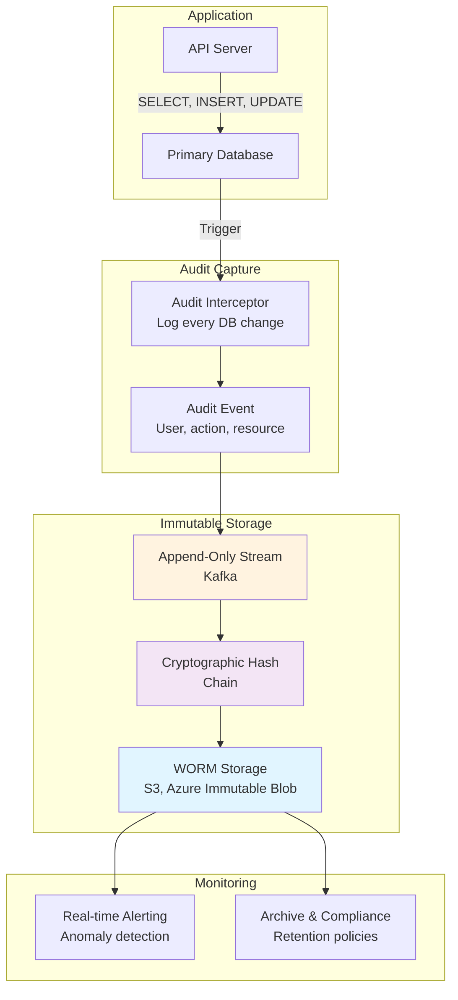

<Hero title="Auditing & Tamper-Evident Logs" subtitle="Maintain immutable records of all data access and changes" size="large" />

## TL;DR

**Audit logs** record every access and modification: WHO, WHAT, WHEN, HOW, WHERE. **Immutable** means append-only—once recorded, cannot be modified, only by deletion policy. **Tamper-evident** uses cryptographic hashing: each log entry signs previous, detecting unauthorized changes. **WORM storage** (write-once-read-many) enforces immutability at storage layer. Regulations require audit trail retention (7-10+ years). Implement centralized audit logging, ship to immutable store immediately, monitor for anomalies.

## Learning Objectives

By the end of this article, you will understand:
- What audit logs should contain (context, timestamps, identities)
- How to make logs tamper-evident using cryptographic hashing
- WORM storage mechanisms and their trade-offs
- Monitoring and anomaly detection on audit logs
- Compliance requirements (SOX, HIPAA, PCI-DSS)
- Performance impact of comprehensive audit logging

## Motivating Scenario

Your company processes healthcare data (HIPAA-regulated). An audit reveals that a contractor accessed patient records they weren't authorized to view, but no one detected it. You need to prove that access occurred, when, and from where—for forensics and compliance. Furthermore, to prevent cover-ups, logs themselves must be immutable: a bad actor cannot delete the log entry proving their unauthorized access. Implement centralized audit logging with tamper-evident storage to satisfy both the regulatory requirement and the integrity guarantee.

## Core Concepts

<Figure caption="Audit Log Pipeline with Tamper-Evidence">

</Figure>

### Audit Log Content

Comprehensive audit logs include:

**Essential fields:**
- **user_id**: Who performed action (human user, service account, or system)
- **action**: What happened (SELECT, INSERT, UPDATE, DELETE, LOGIN, EXPORT)
- **resource**: What was accessed (table, field, file, endpoint)
- **timestamp**: When (UTC, microsecond precision)
- **result**: Success or failure
- **ip_address**: Source IP for network context
- **user_agent**: Client application/browser

**Contextual fields:**
- **request_id**: Trace request across services
- **query_hash**: Hash of actual query (avoid logging sensitive data)
- **row_count**: How many records affected
- **duration_ms**: Slow query detection
- **error_message**: If failed, why

**Example entry:**
```json
{
  "timestamp": "2025-02-14T10:34:22.456Z",
  "user_id": "contractor_123",
  "action": "SELECT",
  "resource": "patients.medical_records",
  "row_count": 50,
  "ip_address": "203.0.113.45",
  "result": "success",
  "request_id": "req_abc123xyz",
  "query_hash": "sha256_abc123...",
  "message": "Queried medical records for patient cohort analysis"
}
```

### Immutable Append-Only Logs

**Immutable** means once written, entries cannot be changed or deleted (except by policy after retention period).

**Implementation:**
1. **Append-only design**: Every write is INSERT, never UPDATE or DELETE
2. **Sequential numbering**: Entry 0, 1, 2, ... (never reuse numbers)
3. **Time ordering**: Entries always increasing timestamp
4. **Replication**: Multiple copies before considering "written"

**Kafka as audit log:**
```
Topic: "audit_logs" (immutable, replicated)
Partition 0: [entry0, entry1, entry2, ...]
Partition 1: [entry0, entry1, entry2, ...]

Consumer reads from beginning, sees all history in order
```

### Tamper-Detection: Cryptographic Hashing

To detect unauthorized modifications, use **hash chains**:

**How it works:**
```
Entry 0: {user: alice, action: SELECT, ...}
  Hash(Entry0) = H0

Entry 1: {user: bob, action: UPDATE, previous_hash: H0, ...}
  Hash(Entry1) = H1 (includes H0)

Entry 2: {user: carol, action: DELETE, previous_hash: H1, ...}
  Hash(Entry2) = H2 (includes H1)
```

If attacker modifies Entry 1, H1 changes, breaking Entry 2's reference. Detection: auditor verifies hash chain.

**Implementation:**
```python
import hashlib
import json

class AuditLog:
    def __init__(self):
        self.entries = []
        self.last_hash = "0" * 64

    def append(self, entry):
        """Add entry, compute hash including previous hash"""
        entry["previous_hash"] = self.last_hash
        entry_json = json.dumps(entry, sort_keys=True)

        current_hash = hashlib.sha256(entry_json.encode()).hexdigest()
        entry["hash"] = current_hash

        self.entries.append(entry)
        self.last_hash = current_hash

        return current_hash

    def verify_integrity(self):
        """Detect if any entry was tampered with"""
        if not self.entries:
            return True

        prev_hash = "0" * 64
        for i, entry in enumerate(self.entries):
            if entry.get("previous_hash") != prev_hash:
                print(f"TAMPERING DETECTED at entry {i}")
                return False

            stored_hash = entry["hash"]
            computed_hash = hashlib.sha256(
                json.dumps({k: v for k, v in entry.items()
                           if k != "hash"},
                          sort_keys=True).encode()
            ).hexdigest()

            if stored_hash != computed_hash:
                print(f"MODIFICATION DETECTED at entry {i}")
                return False

            prev_hash = stored_hash

        return True
```

### WORM (Write-Once-Read-Many) Storage

**WORM storage** enforces immutability at the storage layer itself:

**Cloud providers offer WORM:**
- **AWS S3**: Object Lock (governance/compliance mode)
- **Azure**: Immutable blobs (time-based + legal hold retention)
- **Google Cloud**: Retention policies on GCS buckets

**Benefits:**
- Cannot modify/delete even with admin credentials
- Legal hold: retain indefinitely until explicitly released
- Automat enforcement: no policy needed

**Example (AWS S3 Object Lock):**
```bash
# Create bucket with Object Lock enabled
aws s3api create-bucket \
  --bucket audit-logs-immutable \
  --object-lock-enabled-for-bucket

# Upload audit log with retention
aws s3api put-object \
  --bucket audit-logs-immutable \
  --key 2025-02-14/audit.jsonl \
  --body audit.jsonl \
  --object-lock-mode GOVERNANCE \
  --object-lock-retain-until-date 2035-02-14T00:00:00Z
  # Retention: 10 years, cannot delete until 2035
```

## Practical Example

<Tabs>
  <TabItem value="audit-logging" label="Centralized Audit Logging">
```python
import logging
import json
from datetime import datetime
from pythonjsonlogger import jsonlogger

# Structured JSON logging for audits
class AuditFormatter(jsonlogger.JsonFormatter):
    def add_fields(self, log_record, record, message_dict):
        super().add_fields(log_record, record, message_dict)
        log_record['timestamp'] = datetime.utcnow().isoformat()
        log_record['severity'] = record.levelname

# Configure audit logger
audit_logger = logging.getLogger('audit')
audit_logger.setLevel(logging.INFO)

# Send to stdout (collected by log aggregator)
console_handler = logging.StreamHandler()
console_handler.setFormatter(AuditFormatter())
audit_logger.addHandler(console_handler)

# Log database access
def query_user_data(user_id, caller_id, caller_ip):
    audit_logger.info('User data query', extra={
        'user_id': user_id,
        'caller_id': caller_id,
        'action': 'SELECT',
        'resource': 'users.profile',
        'ip_address': caller_ip,
        'result': 'success'
    })

    # Perform actual database query
    return db.query("SELECT * FROM users WHERE id = ?", user_id)

# Logs output:
# {"timestamp": "2025-02-14T10:34:22Z", "severity": "INFO",
#  "user_id": 456, "caller_id": "contractor_123", "action": "SELECT", ...}
```
  </TabItem>

  <TabItem value="tamper-detection" label="Tamper-Detection Verification">
```python
import hashlib
import json
from datetime import datetime

def verify_audit_log_integrity(log_file):
    """
    Verify audit log hasn't been tampered with.
    Read from immutable storage, check hash chain.
    """
    with open(log_file, 'r') as f:
        entries = [json.loads(line) for line in f]

    if not entries:
        return True, "Empty log"

    # Verify hash chain
    expected_prev_hash = "0" * 64
    modified_entries = []

    for i, entry in enumerate(entries):
        # Check previous hash link
        if entry.get("hash_prev") != expected_prev_hash:
            modified_entries.append(i)
            continue

        # Recompute this entry's hash
        entry_copy = {k: v for k, v in entry.items() if k != "hash"}
        computed_hash = hashlib.sha256(
            json.dumps(entry_copy, sort_keys=True).encode()
        ).hexdigest()

        stored_hash = entry.get("hash")
        if computed_hash != stored_hash:
            modified_entries.append(i)
            continue

        expected_prev_hash = stored_hash

    if modified_entries:
        return False, f"Tampering detected at entries: {modified_entries}"

    return True, f"Log integrity verified: {len(entries)} entries"

# Usage
is_valid, message = verify_audit_log_integrity("audit_2025_02_14.jsonl")
print(message)
if not is_valid:
    raise SecurityError("Audit log integrity compromised!")
```
  </TabItem>

  <TabItem value="anomaly-detection" label="Anomaly Detection">
```python
from collections import defaultdict
from datetime import datetime, timedelta

class AuditAnomalyDetector:
    def __init__(self):
        self.user_actions = defaultdict(list)
        self.resource_access = defaultdict(list)

    def check_anomalies(self, audit_entries):
        """Detect suspicious patterns"""
        alerts = []

        for entry in audit_entries:
            user_id = entry['user_id']
            action = entry['action']
            timestamp = datetime.fromisoformat(entry['timestamp'])

            self.user_actions[user_id].append((timestamp, action))
            self.resource_access[entry['resource']].append((timestamp, user_id))

        # Rule 1: User accessing resource outside normal hours
        for user_id, actions in self.user_actions.items():
            for timestamp, action in actions:
                if timestamp.hour not in range(7, 19):  # Outside 7am-7pm
                    alerts.append(f"Off-hours access: {user_id} at {timestamp}")

        # Rule 2: Bulk export
        for user_id, actions in self.user_actions.items():
            export_count = sum(1 for _, a in actions if a == 'EXPORT')
            if export_count > 5:
                alerts.append(f"Bulk export by {user_id}: {export_count} times")

        # Rule 3: Access to sensitive resources
        sensitive_resources = ['patients.medical_records', 'payments.credit_cards']
        for resource in sensitive_resources:
            if resource in self.resource_access:
                # Flag multiple different users accessing in short time
                recent = self.resource_access[resource]
                if len(set(u for _, u in recent[-10:])) > 5:
                    alerts.append(f"Multiple users accessing {resource} in short time")

        return alerts

# Usage
detector = AuditAnomalyDetector()
alerts = detector.check_anomalies(audit_log_entries)
for alert in alerts:
    print(f"SECURITY ALERT: {alert}")
```
  </TabItem>
</Tabs>

## When to Use / When Not to Use

<Vs items={[
{label: "Worth the Cost", points: [
      "Healthcare (HIPAA): patient records",
      "Finance (SOX): transaction logs",
      "Cards (PCI-DSS): credit card access",
      "Legal holds: litigation data",
      "Sensitive credentials: admin changes",
      "Compliance-required retention"
    ]},
{label: "May Overlog", points: [
      "Read-only analytics queries (millions/min)",
      "Cache hits (expected, high-volume)",
      "Internal system operations",
      "Automated batch jobs",
      "High-frequency instrumentation",
      "Non-sensitive operational logs"
    ]}
]} highlight={[0, 1]} />

## Patterns & Pitfalls

<Showcase
  sections={[
    {
      label: "Sampling vs Comprehensive Logging",
      body: "Logging every query for 1M QPS is expensive. Sample (log 1/100 requests) for cost, but document sampling rate. For sensitive data, always log full record. Use stratified sampling: sample less on high-volume endpoints, more on sensitive ones."
    },
    {
      label: "Log Shipping Latency",
      body: "If audit log arrives 1 hour late to immutable storage, attacker has 1-hour window to cover tracks locally. Ship logs in real-time: use Kafka/syslog with immediate forwarding to WORM storage. Monitor shipping lag."
    },
    {
      label: "Query Hash vs Full Query Logging",
      body: "Logging full SQL queries risks exposing sensitive data in logs themselves. Hash queries instead: hash(SELECT * FROM users WHERE ssn='123-45-6789') stores only hash, not the SSN. When auditing, can correlate with query logs."
    },
    {
      label: "Compliance Retention Periods",
      body: "Different regulations require different retention: SOX (7 years), HIPAA (6 years), GDPR (varies by purpose). Don't delete audit logs after retention—archive to cheaper storage. Document retention justification for each data type."
    },
    {
      label: "Access to Audit Logs Themselves",
      body: "Who can view audit logs? If unrestricted, malicious admin can inspect logs for their own wrongdoing. Use role-based access: investigators can view all logs, engineers only their own service logs. Audit access to audit logs!"
    },
    {
      label: "Performance Impact of Synchronous Logging",
      body: "If application waits for audit log to persist before returning response, latency increases. Use async: application returns quickly, audit log shipped separately. Risk: application crash loses in-flight logs. Balance with queueing."
    }
  ]}
/>

## Design Review Checklist

<Checklist items={[
  "Identified all events requiring audit logging (DDL, DML, access, admin changes)",
  "Documented audit log content: user, action, resource, timestamp, result, IP",
  "Chosen immutable storage: WORM (S3, Azure), Kafka, or custom append-only DB",
  "Configured hash chain for tamper-detection verification",
  "Set retention periods per regulation: SOX (7yr), HIPAA (6yr), GDPR (?)",
  "Planned log shipping: real-time transport to immutable store",
  "Set up anomaly detection: unauthorized access, bulk exports, off-hours access",
  "Configured audit log access control: who can view logs?",
  "Tested log integrity: verify hash chain, detect tampering",
  "Monitored log volume and performance impact on application"
]} />

## Self-Check

- What should audit logs contain? (Hint: WHO, WHAT, WHEN, HOW, WHERE)
- How do you detect if audit logs were tampered with? (Hint: cryptographic hash chain)
- What's WORM storage and why use it? (Hint: enforces immutability at storage layer)
- Why log query hash instead of full query? (Hint: avoid exposing sensitive data in logs)
- What's the difference between GOVERNANCE and COMPLIANCE mode in S3 Object Lock? (Hint: governance can be overridden with permission, compliance cannot)

## Next Steps

- **Implement centralized logging**: use JSON logger format, send to log aggregator
- **Set up WORM storage**: enable S3 Object Lock or Azure immutable blobs
- **Verify integrity**: run hash chain verification periodically
- **Build anomaly detection**: flag off-hours access, bulk exports, suspicious patterns
- **Document retention**: justify retention periods per regulation

## References

- <a href="https://aws.amazon.com/s3/features/object-lock/" target="_blank" rel="nofollow noopener noreferrer">AWS S3 Object Lock Documentation ↗️</a>
- <a href="https://learn.microsoft.com/en-us/azure/storage/blobs/immutable-storage-overview" target="_blank" rel="nofollow noopener noreferrer">Azure Immutable Blob Storage ↗️</a>
- <a href="https://cloud.google.com/storage/docs/bucket-lock" target="_blank" rel="nofollow noopener noreferrer">Google Cloud Bucket Lock ↗️</a>
- <a href="https://owasp.org/www-project-logging-cheat-sheet/" target="_blank" rel="nofollow noopener noreferrer">OWASP Logging Cheat Sheet ↗️</a>
