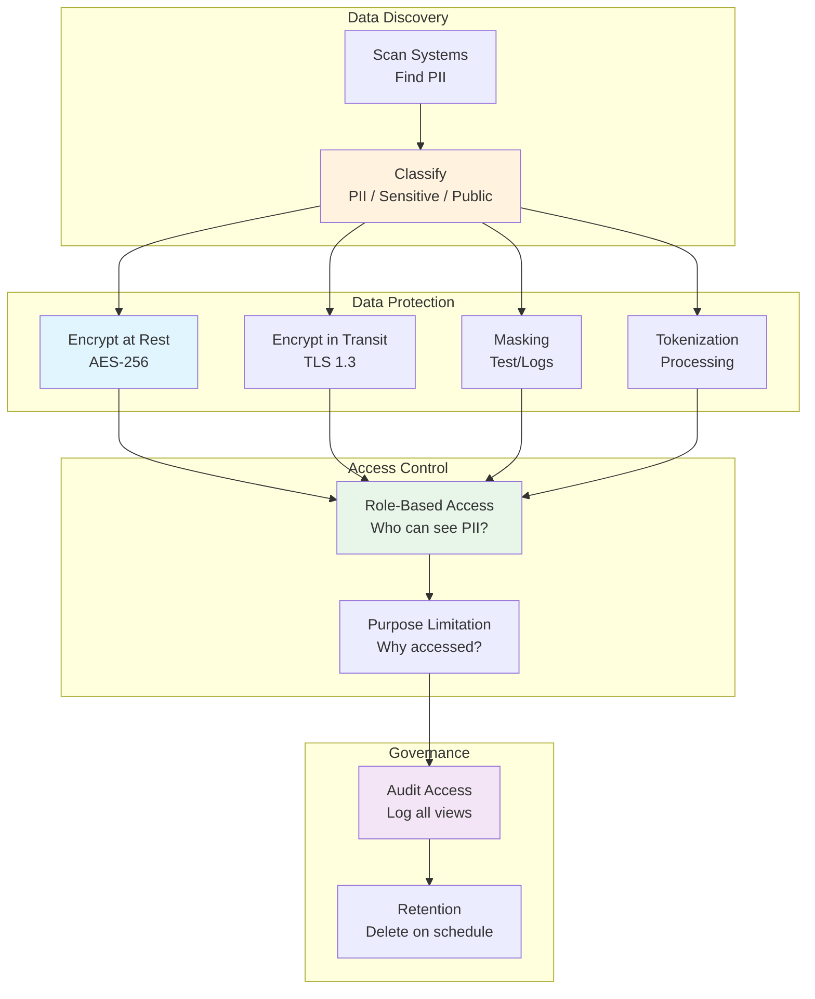

<Hero title="PII Classification, Masking & Tokenization" subtitle="Identify and protect sensitive personal data" size="large" />

## TL;DR

**PII (Personally Identifiable Information)** includes name, email, SSN, phone, IP address—anything identifying a person. **Data minimization**: collect only necessary PII, delete when no longer needed. **Classification**: label data by sensitivity (PII, Sensitive, Internal, Public). **Encryption**: AES-256 at rest, TLS 1.3 in transit. **Masking**: show only last 4 digits of SSN (****-**-1234), hash for test data. **Tokenization**: replace sensitive value with random token, encrypt token-value map separately. Use classification to drive protection level: Public data unencrypted, PII encrypted + access-controlled.

## Learning Objectives

By the end of this article, you will understand:
- What qualifies as PII and how to identify it
- Data classification schemes and their applications
- Encryption strategies for rest and transit
- Masking techniques for testing and analytics
- Tokenization for processing without exposing sensitive data
- Access control based on data sensitivity
- Purpose limitation and data minimization principles

## Motivating Scenario

Your payment processing company stores credit cards. A developer needs to test checkout flow: they want production data. Giving them real credit cards is a liability. Instead, tokenize: store token "tok_abc123xyz" in logs/test databases, keep encrypted mapping `{tok_abc123xyz → 4532XXXXXX1234}` in secure vault. Developers see tokens but never actual numbers. Analytics team wants payment trends without seeing card numbers: run aggregations on tokenized data. Fraud team investigates a specific card: decrypt mapping only for authorized investigators.

## Core Concepts

<Figure caption="PII Protection: Classification to Encryption">

</Figure>

### Data Classification

**Classification** labels data by sensitivity, driving protection requirements:

**Common scheme:**
- **Public**: Anonymized, no restrictions, safe on internet
- **Internal**: Company-only, not public but not sensitive
- **Sensitive**: Restricted access, financial/health data
- **PII**: Personal data, highest protection, GDPR/CCPA regulated
- **Secret**: Encryption keys, credentials, don't log

**Example:**
```
Name: "Alice Smith"           → PII (identifies person)
Email: "alice@example.com"    → PII (directly identifies)
Age: 32                       → Sensitive (with name = PII)
Country: "USA"                → Internal (demographic, anonymizable)
Purchase count: 15            → Public (aggregated, anonymized)
Credit card: 4532-XXXX-XXXX-1234  → Secret (encrypt everywhere)
```

### Encryption at Rest

**AES-256** is standard for encrypting sensitive data in databases:

**Key management:**
- Store encryption keys separately from encrypted data
- Use key management service (AWS KMS, Azure Key Vault, HashiCorp Vault)
- Rotate keys regularly (annually minimum)
- Never hardcode keys in application code

**Example flow:**
```
Credit card: 4532123456789012
  ↓ encrypt with key from KMS
Encrypted: 7fEkX9jR2... (gibberish)
  ↓ store in database
[encrypted_value, key_id]
  ↓ on retrieval, fetch key from KMS
  ↓ decrypt
Credit card: 4532123456789012
```

### Encryption in Transit

**TLS 1.3** for all network communication:

**Best practices:**
- HTTPS everywhere (automatic redirect from HTTP)
- Disable SSL 3.0, TLS 1.0, 1.1 (outdated)
- Enforce TLS 1.2 minimum (1.3 preferred)
- Use strong cipher suites (TLS_CHACHA20, TLS_AES_256_GCM)
- Certificate pinning for critical APIs (prevent MITM)

### Masking for Testing

**Masking** hides sensitive data while preserving structure:

**Techniques:**
1. **Truncation**: Show only last 4 digits (SSN: ****-**-1234)
2. **Hashing**: Hash PII for test (credit card: sha256("4532...") = "abc123...")
3. **Substitution**: Replace with fake (Name: "Jane Doe", Email: "test@example.com")
4. **Shuffling**: Reorder data (scramble columns to break linking)

**Example:**
```sql
-- Production query
SELECT ssn, name, salary FROM employees;
-- Result: 123-45-6789, Alice Smith, 150000

-- Masked query (for test database)
SELECT CONCAT('***-**-', RIGHT(ssn, 4)), 'Masked User', salary
FROM employees;
-- Result: ***-**-6789, Masked User, 150000
```

### Tokenization

**Tokenization** replaces sensitive values with tokens, processing without exposure:

**Flow:**
```
Credit card: 4532123456789012
  ↓ send to tokenization service
  ↓ returns token: tok_abc123xyz
  ↓ store token in logs, databases, caches

Later: decrypt token → recover card number (only if authorized)
```

**Advantage over encryption:**
- Encrypted data is still dangerous if decrypted accidentally
- Token leakage doesn't expose actual card number
- Token can have limited scope: only valid for specific merchant

## Practical Example

<Tabs>
  <TabItem value="classification" label="Data Classification">
```python
from enum import Enum
from dataclasses import dataclass

class DataClass(Enum):
    PUBLIC = "public"
    INTERNAL = "internal"
    SENSITIVE = "sensitive"
    PII = "pii"
    SECRET = "secret"

@dataclass
class Field:
    name: str
    classification: DataClass
    encryption_required: bool
    retention_days: int

# Define schema with classifications
user_fields = [
    Field("user_id", DataClass.INTERNAL, False, 2555),  # 7 years
    Field("name", DataClass.PII, True, 2555),
    Field("email", DataClass.PII, True, 2555),
    Field("ssn", DataClass.SECRET, True, 2555),
    Field("country", DataClass.INTERNAL, False, 2555),
    Field("purchase_count", DataClass.PUBLIC, False, 0),  # No retention
]

# Policy enforcement
def check_access(user_role: str, field: Field) -> bool:
    access_matrix = {
        "public": [DataClass.PUBLIC],
        "analyst": [DataClass.PUBLIC, DataClass.INTERNAL],
        "developer": [DataClass.PUBLIC, DataClass.INTERNAL, DataClass.SENSITIVE],
        "admin": [DataClass.PUBLIC, DataClass.INTERNAL, DataClass.SENSITIVE,
                  DataClass.PII],
        "security": [DataClass.PUBLIC, DataClass.INTERNAL, DataClass.SENSITIVE,
                     DataClass.PII, DataClass.SECRET]
    }

    allowed = access_matrix.get(user_role, [])
    return field.classification in allowed

# Usage
print(check_access("analyst", Field("name", DataClass.PII, True, 2555)))
# False: analyst cannot access PII

print(check_access("admin", Field("name", DataClass.PII, True, 2555)))
# True: admin can access PII
```
  </TabItem>

  <TabItem value="encryption" label="Encryption at Rest">
```python
from cryptography.fernet import Fernet
import boto3
import base64

class EncryptionManager:
    def __init__(self):
        self.kms = boto3.client('kms')

    def encrypt_field(self, plaintext, key_id):
        """Encrypt sensitive field using KMS"""
        response = self.kms.encrypt(
            KeyId=key_id,
            Plaintext=plaintext.encode('utf-8')
        )
        return response['CiphertextBlob']

    def decrypt_field(self, ciphertext, key_id):
        """Decrypt only when necessary, log access"""
        response = self.kms.decrypt(
            CiphertextBlob=ciphertext
        )
        return response['Plaintext'].decode('utf-8')

# Usage
manager = EncryptionManager()

# Store
ssn = "123-45-6789"
encrypted = manager.encrypt_field(ssn, 'arn:aws:kms:...:key/12345')
# Store encrypted value in database

# Retrieve (only for authorized access)
decrypted = manager.decrypt_field(encrypted, 'arn:aws:kms:...:key/12345')
# Audit logs record: who decrypted, when, why
```
  </TabItem>

  <TabItem value="masking" label="Data Masking for Tests">
```python
import re

def mask_ssn(ssn: str) -> str:
    """Show only last 4 digits"""
    return f"***-**-{ssn[-4:]}"

def mask_credit_card(card: str) -> str:
    """Show only first 4 and last 4"""
    card_clean = card.replace("-", "")
    return f"{card_clean[:4]}-{'X'*8}-{card_clean[-4:]}"

def mask_email(email: str) -> str:
    """Keep domain, mask local part"""
    parts = email.split('@')
    local = parts[0]
    domain = parts[1]
    masked_local = local[0] + '*' * (len(local)-2) + local[-1]
    return f"{masked_local}@{domain}"

# Usage
print(mask_ssn("123-45-6789"))
# ***-**-6789

print(mask_credit_card("4532-1234-5678-9012"))
# 4532-XXXX-XXXX-9012

print(mask_email("alice.smith@example.com"))
# a***h@example.com
```
  </TabItem>

  <TabItem value="tokenization" label="Tokenization Pattern">
```python
import secrets
import json
from cryptography.fernet import Fernet

class TokenizationVault:
    def __init__(self, encryption_key):
        self.cipher = Fernet(encryption_key)
        self.token_map = {}  # In production: DynamoDB, Vault, etc.

    def tokenize(self, sensitive_value: str) -> str:
        """Generate token, store encrypted mapping"""
        # Generate cryptographically secure token
        token = f"tok_{secrets.token_hex(16)}"

        # Store encrypted mapping in vault
        encrypted_value = self.cipher.encrypt(sensitive_value.encode())
        self.token_map[token] = encrypted_value

        return token

    def detokenize(self, token: str) -> str:
        """Recover original value (only for authorized users)"""
        if token not in self.token_map:
            raise ValueError(f"Token not found: {token}")

        encrypted = self.token_map[token]
        plaintext = self.cipher.decrypt(encrypted).decode()
        return plaintext

# Usage
key = Fernet.generate_key()
vault = TokenizationVault(key)

# Payment processing
card = "4532-1234-5678-9012"
token = vault.tokenize(card)
print(f"Token: {token}")
# Token: tok_a1b2c3d4e5f6g7h8

# Store token in logs, databases
print(f"Stored in database: order_123, card_token={token}")

# Later: recover card (only for authorized settlement)
recovered_card = vault.detokenize(token)
print(f"Recovered: {recovered_card}")
# 4532-1234-5678-9012
```
  </TabItem>
</Tabs>

## When to Use / When Not to Use

<Vs items={[
{label: "Encryption (Full Value)", points: [
      "Databases with PII at rest",
      "Backups and archives",
      "Transmission over network",
      "Highest security requirements",
      "HIPAA, PCI-DSS compliance",
      "Financial/health records"
    ]},
{label: "Masking (Hide Structure)", points: [
      "Test databases",
      "Application logs",
      "Analytics dashboards",
      "Development environments",
      "Error messages",
      "Debugging output"
    ]}
]} highlight={[0, 1]} />

## Patterns & Pitfalls

<Showcase
  sections={[
    {
      label: "Data Minimization: Collect Only What's Necessary",
      body: "Collecting 'just in case' data increases breach risk. Audit: what PII do you actually need? Delete birth date if you only need age. Never collect SSN unless legally required. Smaller dataset = smaller attack surface."
    },
    {
      label: "Purpose Limitation: Use Data Only as Promised",
      body: "Collected email for receipts but using it for marketing? GDPR violation. Document why data was collected, enforce in code: if purpose != \"marketing\", block that use. Implement field-level purpose restrictions."
    },
    {
      label: "Key Rotation Without Reencryption Risk",
      body: "Rotating encryption keys means reencrypting all data. Plan: 1) Generate new key, 2) Background process reencrypts old data, 3) Mark as rotated, 4) Delete old key. Never delete old key immediately; keep for recovery."
    },
    {
      label: "Testing PII Leakage in Logs",
      body: "Developers log too much: log(request) includes request body with credit cards. Implement safe logging: strip sensitive fields before logging. Or mask: log only last 4 digits. Regular security scans for PII in logs."
    },
    {
      label: "Encryption vs Hashing Confusion",
      body: "Encryption is reversible (need key). Hashing is one-way (cannot recover). For passwords: hash. For credit cards: encrypt (need to process). Don't use hashing where you need original value back."
    },
    {
      label: "Token Collision Risk",
      body: "If tokens not cryptographically random, attacker could guess tokens. Use secrets.token_hex() or /dev/urandom. Token space large enough? 128-bit tokens (tok_...32hex chars) provide collision resistance."
    }
  ]}
/>

## Design Review Checklist

<Checklist items={[
  "Conducted PII discovery: where is sensitive data stored/processed?",
  "Classified all data: Public, Internal, Sensitive, PII, Secret",
  "Documented purpose for each PII collection: why needed?",
  "Implemented encryption at rest: AES-256 for PII, key in vault",
  "Enforced TLS 1.3+ for all network transmission",
  "Set up key rotation: annual minimum, plan reencryption",
  "Implemented field-level access control: who can access which PII?",
  "Configured masking for test data: never use production data in dev",
  "Deployed tokenization for sensitive processing (payments, health)",
  "Audit PII access: log all reads/writes/decryptions with user context"
]} />

## Self-Check

- What's the difference between PII, Sensitive, and Internal data? (Hint: regulatory requirements, identifiable)
- When would you encrypt vs mask vs tokenize? (Hint: production vs testing, processability)
- How do you prevent encryption key leakage? (Hint: key vault, separate from data, rotate)
- What's purpose limitation? (Hint: use data only for stated purpose, enforce in code)
- Why use tokens instead of just encrypting? (Hint: token leak doesn't expose actual value)

## Next Steps

- **Audit your systems**: find all PII, classify by sensitivity
- **Implement encryption**: encrypt PII at rest, set up key management
- **Enforce TLS**: enable HTTPS everywhere, disable weak protocols
- **Mask test data**: generate synthetic data, never copy production
- **Monitor access**: audit all PII reads, alert on anomalies

## References

- <a href="https://aws.amazon.com/kms/" target="_blank" rel="nofollow noopener noreferrer">AWS Key Management Service ↗️</a>
- <a href="https://www.owasp.org/index.php/Data_Exposure" target="_blank" rel="nofollow noopener noreferrer">OWASP Data Exposure Prevention ↗️</a>
- <a href="https://gdpr-info.eu/" target="_blank" rel="nofollow noopener noreferrer">GDPR Official Text ↗️</a>
- <a href="https://www.pcisecuritystandards.org/" target="_blank" rel="nofollow noopener noreferrer">PCI Security Standards Council ↗️</a>
