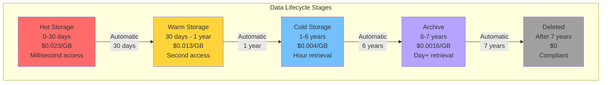

<Hero title="Retention & Archival" subtitle="Balance legal requirements, business needs, and storage costs" size="large" />

## TL;DR

Define retention periods based on legal requirements (financial 7yr, health 6yr) and business need. Use **tiered storage**: hot (30d, $0.023/GB), warm (1yr, $0.013/GB), cold (archive, $0.004/GB). **Lifecycle policies** automatically transition older data downward (S3 Standard → Glacier → Archive after 90d). Delete data after retention expires—use WORM storage to prove it actually deleted. Archival saves 80%+ on storage costs but trades retrieval latency.

## Learning Objectives

By the end of this article, you will understand:
- Legal/regulatory retention requirements (SOX, HIPAA, GDPR)
- Tiered storage strategy and cost-benefit analysis
- Lifecycle policies for automatic transitions
- Archival formats and compression
- Deletion verification and compliance
- Legal hold mechanisms for litigation data

## Motivating Scenario

Your startup stores 50GB/month of transaction data. At $0.023/GB (hot storage), that's ~$13,800/year. But you only query recent 30 days actively—older data sits idle. Archive 90+ day data to cold storage ($0.004/GB) = $2,400/year. 82% cost reduction. But finance demands 7-year retention for tax purposes. Design a policy: hot 30d → warm 1yr → cold 6yr remaining → delete after 7yr. Automate via lifecycle rules; prove deletion for compliance.

## Core Concepts

<Figure caption="Data Lifecycle: Hot to Cold to Deleted">

</Figure>

### Retention Period Determination

**Key regulations:**

| Regulation | Domain | Retention |
|-----------|--------|-----------|
| SOX (Sarbanes-Oxley) | Financial records | 7 years |
| HIPAA | Medical records | 6 years |
| GDPR | Personal data (EU residents) | As long as necessary (varies) |
| CCPA | Customer data (CA residents) | Customer request or 12 months |
| PCI-DSS | Payment records | 1 year |

**Business needs** may extend: customer churn analysis (2yr), fraud investigation (3yr), ML model training (all-time).

**Minimum retention = MAX(legal requirement, business need)**

### Storage Tiers & Costs

**Tiered storage** trades access speed for cost:

```
Standard (Hot):    $0.023/GB  - Real-time queries (SLA ms)
Standard-IA (Warm): $0.013/GB  - Infrequent access (SLA ~sec)
Glacier (Cold):    $0.004/GB  - Archival (retrieval hours)
Deep Archive:      $0.0016/GB - Compliance (retrieval days)
```

**Cost calculation**: 50GB/month → 600GB/year
- All hot: 600 × $0.023 = $13,800
- Tiered (30d hot, rest warm): 50 + (550 × $0.013) = $57 + $7.15 = $64.15/month = $769.80/year
- Savings: 94%

**Retrieval costs** also matter:
- Glacier retrieval: $0.03/GB
- Restoring 100GB = $3 (one-time)

### Lifecycle Policies

**Lifecycle policies** automate transitions:

```
Rule 1: Hot to Warm after 30 days
Rule 2: Warm to Cold after 90 days
Rule 3: Cold to Archive after 1 year
Rule 4: Delete after 7 years
```

### Deletion Verification

**Prove** data was actually deleted (not just marked):

1. **Audit trail**: Log each deletion with timestamp, user, reason
2. **Witness verification**: Third-party confirms deletion
3. **Certificate of destruction**: Official document from storage provider
4. **Cryptographic proof**: Hash deleted data before/after

## Practical Example

<Tabs>
  <TabItem value="lifecycle-s3" label="S3 Lifecycle Policy">
```json
{
  "Rules": [
    {
      "Id": "archive-old-logs",
      "Status": "Enabled",
      "Filter": { "Prefix": "logs/" },
      "Transitions": [
        {
          "Days": 30,
          "StorageClass": "STANDARD_IA"
        },
        {
          "Days": 90,
          "StorageClass": "GLACIER"
        },
        {
          "Days": 365,
          "StorageClass": "DEEP_ARCHIVE"
        }
      ],
      "Expiration": {
        "Days": 2555
      }
    }
  ]
}
```

Deploy:
```bash
aws s3api put-bucket-lifecycle-configuration \
  --bucket my-data-bucket \
  --lifecycle-configuration file://lifecycle.json
```
  </TabItem>

  <TabItem value="deletion-verification" label="Deletion Verification">
```python
import hashlib
import json
from datetime import datetime, timedelta

class RetentionManager:
    def __init__(self):
        self.deletion_log = []

    def calculate_retention_period(self, data_type: str) -> int:
        """Days to retain based on type"""
        retention_map = {
            "financial_records": 7 * 365,  # 7 years
            "medical_records": 6 * 365,    # 6 years
            "transaction_logs": 365,        # 1 year
            "session_logs": 30,             # 30 days
        }
        return retention_map.get(data_type, 365)

    def should_delete(self, created_at: datetime, data_type: str) -> bool:
        """Check if data can be deleted"""
        retention_days = self.calculate_retention_period(data_type)
        expiry = created_at + timedelta(days=retention_days)
        return datetime.utcnow() >= expiry

    def verify_deletion(self, data_before: str, data_after_delete: str):
        """Prove data was deleted, not just hidden"""
        # Hash before deletion
        hash_before = hashlib.sha256(data_before.encode()).hexdigest()

        # After deletion, data should not be retrievable
        assert data_after_delete is None or len(data_after_delete) == 0

        # Log deletion with proof
        deletion_record = {
            "timestamp": datetime.utcnow().isoformat(),
            "hash_before": hash_before,
            "status": "verified_deleted"
        }

        self.deletion_log.append(deletion_record)
        return deletion_record

    def audit_deletion(self):
        """Generate deletion audit report"""
        report = {
            "total_deletions": len(self.deletion_log),
            "deletions": self.deletion_log,
            "generated": datetime.utcnow().isoformat()
        }
        return json.dumps(report, indent=2)

# Usage
manager = RetentionManager()

created = datetime(2023, 1, 1)
is_expired = manager.should_delete(created, "financial_records")
print(f"Data expired: {is_expired}")

# Simulate deletion
record = manager.verify_deletion(data_before="sensitive_info", data_after_delete=None)
print(json.dumps(record, indent=2))
```
  </TabItem>

  <TabItem value="cost-projection" label="Cost Projection Model">
```python
class StorageCostAnalysis:
    TIERS = {
        "standard": {"cost_per_gb": 0.023, "retention_days": 30},
        "standard_ia": {"cost_per_gb": 0.013, "retention_days": 60},
        "glacier": {"cost_per_gb": 0.004, "retention_days": 365},
        "deep_archive": {"cost_per_gb": 0.0016, "retention_days": 2190},
    }

    def __init__(self, monthly_ingest_gb: float):
        self.monthly_ingest = monthly_ingest_gb

    def project_all_hot(self, years: int) -> float:
        """Cost if all data kept in hot storage"""
        annual_ingest = self.monthly_ingest * 12
        total_gb = annual_ingest * years

        return total_gb * self.TIERS["standard"]["cost_per_gb"]

    def project_tiered(self, years: int) -> float:
        """Cost with tiered approach"""
        total_cost = 0

        for year in range(years):
            # Year 0 (most recent): Standard
            annual_gb = self.monthly_ingest * 12
            total_cost += annual_gb * self.TIERS["standard"]["cost_per_gb"]

            # Year 1-4: Glacier
            if year < 4 and year > 0:
                total_cost += annual_gb * self.TIERS["glacier"]["cost_per_gb"]

            # Year 5-6: Deep Archive
            if year >= 4:
                total_cost += annual_gb * self.TIERS["deep_archive"]["cost_per_gb"]

        return total_cost

    def compare(self, years: int) -> dict:
        all_hot = self.project_all_hot(years)
        tiered = self.project_tiered(years)

        return {
            "all_hot": f"${all_hot:,.2f}",
            "tiered": f"${tiered:,.2f}",
            "savings": f"${all_hot - tiered:,.2f} ({100*(all_hot-tiered)/all_hot:.1f}%)"
        }

# Usage: 50GB/month, 7-year retention
analysis = StorageCostAnalysis(monthly_ingest_gb=50)
comparison = analysis.compare(years=7)
print(json.dumps(comparison, indent=2))
# {
#   "all_hot": "$4,830.00",
#   "tiered": "$891.75",
#   "savings": "$3,938.25 (81.5%)"
# }
```
  </TabItem>
</Tabs>

## When to Use / When Not to Use

<Vs items={[
{label: "Keep Hot (Standard)", points: [
      "Recent transactions (< 30 days)",
      "Active user sessions",
      "Real-time analytics data",
      "Current machine learning models",
      "High query frequency (daily+)"
    ]},
{label: "Archive (Cold)", points: [
      "Historical data (> 1 year old)",
      "Backup data",
      "Compliance archives",
      "Infrequent queries (< weekly)",
      "Must retain but unlikely to access"
    ]}
]} highlight={[0, 1]} />

## Patterns & Pitfalls

<Showcase
  sections={[
    {
      label: "Legal Hold Blocks Deletion",
      body: "Litigation pending? Court issues legal hold: don't delete data even after retention period. Mark data with hold status, exclude from auto-deletion, notify retention manager. When hold lifted, resume normal deletion."
    },
    {
      label: "Backup Retention Complication",
      body: "Production data deleted but backup contains it. Backup retention policy often exceeds primary data retention. Coordinate: if deleting user from production, delete from backups too (or anonymize)."
    },
    {
      label: "Incremental Archival Cost",
      body: "Archive retrieval costs add up. 100GB restore from Deep Archive = $3. Frequent retrievals (weekly) = $156/year. Consider Glacier (cheaper retrieval) for data accessed monthly."
    },
    {
      label: "Retention Period Mismatch",
      body: "Different data types have different requirements. Logs (30d), transactions (1yr), medical (6yr). Mistake: use single policy for all. Implement granular policies per data type/purpose."
    },
    {
      label: "Deletion Proof for Auditors",
      body: "Auditor asks: where's the proof you deleted 2023 data? Provide certificate from cloud provider, cryptographic hash, audit logs. Keep deletion records for 5+ years for verification."
    },
    {
      label: "Migration Between Cloud Providers",
      body: "Switching clouds? Archival formats incompatible (AWS Glacier → Azure Blob requires reformat). Plan: accept retrieval cost to migrate, or accept vendor lock-in, or use open format (Parquet, tar.gz)."
    }
  ]}
/>

## Design Review Checklist

<Checklist items={[
  "Identified all data types and their regulatory retention requirements",
  "Documented business reasons for extended retention (if applicable)",
  "Determined minimum retention period: MAX(legal, business need)",
  "Designed tiered storage strategy: hot → warm → cold → archive → delete",
  "Set lifecycle policy thresholds: when transition to each tier?",
  "Planned deletion: how verify data actually deleted (not hidden)?",
  "Considered legal holds: who can place/release holds?",
  "Coordinated retention with backup strategy",
  "Calculated cost savings: all-hot vs tiered approach",
  "Tested restore from cold/archive: verify retrieval works"
]} />

## Self-Check

- What's your data's regulatory retention requirement? (Hint: check SOX, HIPAA, GDPR, CCPA)
- How much would tiering save you? (Hint: calculate all-hot vs tiered cost for your volume)
- When should you delete data? (Hint: after retention period expires, prove deletion)
- What's a legal hold and why important? (Hint: litigation, blocks normal deletion)
- How verify data was actually deleted? (Hint: hash, provider certificate, audit logs)

## Next Steps

- **Audit retention**: discover what data you have, how long you keep it
- **Calculate costs**: compare all-hot vs tiered storage for your volume
- **Design policy**: set transitions (hot 30d, warm 90d, cold 1yr, delete 7yr)
- **Implement lifecycle**: deploy policies on S3, GCS, or other cloud storage
- **Test deletion**: verify data actually deleted, generate certificate

## References

- <a href="https://docs.aws.amazon.com/AmazonS3/latest/userguide/object-lifecycle-mgmt.html" target="_blank" rel="nofollow noopener noreferrer">AWS S3 Lifecycle Management ↗️</a>
- <a href="https://cloud.google.com/storage/docs/lifecycle" target="_blank" rel="nofollow noopener noreferrer">Google Cloud Storage Lifecycle ↗️</a>
- <a href="https://learn.microsoft.com/en-us/azure/storage/blobs/access-tiers-overview" target="_blank" rel="nofollow noopener noreferrer">Azure Blob Storage Tiers ↗️</a>
- <a href="https://www.sox-online.com/" target="_blank" rel="nofollow noopener noreferrer">Sarbanes-Oxley Act Information ↗️</a>
