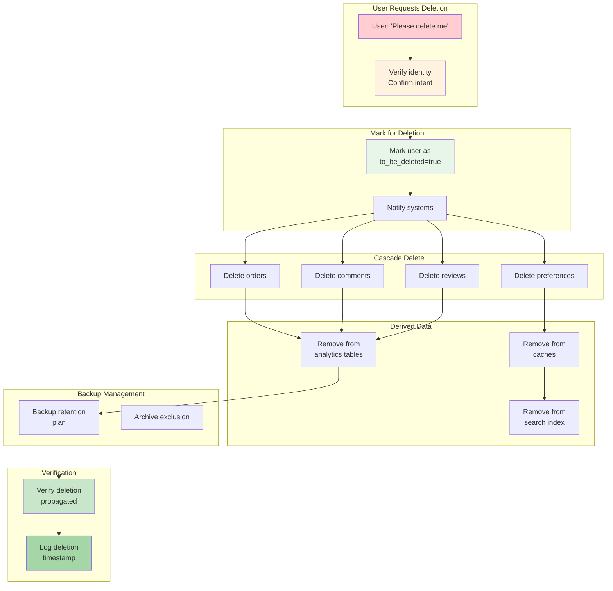

<Hero title="Right to Erasure & Data Portability" subtitle="Implement user data rights: deletion and export on demand" size="large" />

## TL;DR

**GDPR Article 17 (Right to Erasure)**: User can request deletion; you must delete within 30 days. **Exceptions**: legal obligations (contracts, audits), fraud investigation, retention policies. **Article 20 (Data Portability)**: User can request export in portable format (JSON, CSV); you must provide within 30 days. **Challenges**: cascading deletes (user delete → related orders, comments), backups (data lives in backups after deletion), derived data (user ID in analytics tables). Build deletion as first-class feature, not afterthought. Track data lineage to enable complete deletion. Maintain audit trail of all deletions.

## Learning Objectives

By the end of this article, you will understand:
- GDPR right to erasure and right to data portability
- How to implement deletion workflows at scale
- Handling cascading deletes across systems
- Data export formats and compliance
- Backups and disaster recovery implications
- Legal holds that override erasure requests
- Audit trails for deletion verification

## Motivating Scenario

User requests deletion under GDPR. Your process: 1) Delete from user table, 2) Done. But user ID appears in orders, comments, reviews, analytics events, backups. A compliance audit finds orders still linked to deleted user—you fail. Correct approach: 1) Mark user for deletion, 2) Delete from all tables (orders, cascade), 3) Delete from analytics (remove user_id from events), 4) Schedule backup deletion, 5) Verify deletion propagated, 6) Maintain audit log. 30 days later, prove user data gone.

## Core Concepts

<Figure caption="Data Deletion Workflow: Cascading and Archival">

</Figure>

### Right to Erasure (GDPR Article 17)

**User rights:**
- Request deletion of personal data
- Organization must delete within 30 days
- No fee for deletion request

**Exceptions** (legitimate reasons to retain):
1. Legal obligation (contract, audit trail, tax law)
2. Fraud investigation (suspicious deletion request)
3. Public interest (news archives)
4. Consent not withdrawn (user consented to different purpose)
5. Legal hold (litigation pending)

### Right to Data Portability (GDPR Article 20)

**User rights:**
- Request export of personal data
- Format: commonly used, portable (JSON, CSV, XML)
- Machine-readable (not PDF scan)
- Provided within 30 days

**Includes:**
- All directly provided data (profile, settings, content)
- Inferred data (behavioral profiles OK if identified separately)
- Excludes: data not "personal" (anonymized, aggregated)

**Caveat:** Not if "commercially sensitive" (algorithms, trade secrets)

### Cascading Deletes & Data Lineage

**Problem:** User ID appears in dozens of tables. Foreign key constraints can help, but non-relational systems don't enforce.

**Solution: Track data lineage**
```
User 123
  ├─ orders (user_id FK)
  ├─ payments (user_id)
  ├─ comments (user_id)
  ├─ reviews (user_id)
  └─ preferences (user_id)

Analytics events
  └─ events table (user_id column)

Cache
  ├─ redis: user:123:profile
  └─ redis: user:123:orders

Search
  ├─ elasticsearch: users index (user_id)
  └─ elasticsearch: comments index (user_id)

Backups
  └─ daily backup (contains all)
  └─ weekly archive (contains all)
```

Deletion must handle all.

### Backup & Archival Complications

**Backups contain deleted data:**
- Daily backup 2025-02-14 includes user 123
- User deleted 2025-02-15
- Backup retention: 30 days
- Until 2025-03-16, user data accessible via backup

**Options:**
1. Exclude deleted users from future backups (can't modify existing)
2. Accept backup retention > deletion request latency
3. Rewrite backups to remove deleted user (expensive)
4. Purge-on-restore: during restore, filter deleted users

**GDPR requirement:** Document backup retention in privacy policy. If backup retention outlasts deletion, disclose.

## Practical Example

<Tabs>
  <TabItem value="deletion-workflow" label="Deletion Workflow">
```python
from datetime import datetime, timedelta
from enum import Enum

class DeletionStatus(Enum):
    REQUESTED = "requested"
    VERIFIED = "verified"
    IN_PROGRESS = "in_progress"
    COMPLETED = "completed"
    FAILED = "failed"

class DeletionRequest:
    def __init__(self, user_id: int, request_timestamp: datetime):
        self.user_id = user_id
        self.request_timestamp = request_timestamp
        self.deadline = request_timestamp + timedelta(days=30)
        self.status = DeletionStatus.REQUESTED
        self.audit_log = []

    def verify_identity(self, verification_token: str) -> bool:
        """Step 1: Verify user identity"""
        # Verify token matches user's email verification link
        is_valid = verify_token(verification_token, self.user_id)

        if is_valid:
            self.status = DeletionStatus.VERIFIED
            self.audit_log.append({
                "action": "identity_verified",
                "timestamp": datetime.utcnow().isoformat()
            })
        return is_valid

    def execute_deletion(self, db_connection):
        """Step 2: Execute cascading deletes"""
        self.status = DeletionStatus.IN_PROGRESS

        try:
            # Delete from primary user table
            db_connection.execute(
                "DELETE FROM users WHERE user_id = %s",
                (self.user_id,)
            )

            # Cascade deletes (or soft delete + cleanup job)
            tables_to_delete = [
                "orders", "comments", "reviews", "preferences",
                "notifications", "saved_items"
            ]

            for table in tables_to_delete:
                db_connection.execute(
                    f"DELETE FROM {table} WHERE user_id = %s",
                    (self.user_id,)
                )

            db_connection.commit()

            self.status = DeletionStatus.COMPLETED
            self.audit_log.append({
                "action": "deletion_executed",
                "timestamp": datetime.utcnow().isoformat(),
                "tables_affected": tables_to_delete
            })

        except Exception as e:
            self.status = DeletionStatus.FAILED
            self.audit_log.append({
                "action": "deletion_failed",
                "error": str(e),
                "timestamp": datetime.utcnow().isoformat()
            })
            raise

    def verify_deletion_complete(self, db_connection) -> bool:
        """Step 3: Verify user data gone"""
        # Check all tables for remaining data
        count_query = """
            SELECT COUNT(*) FROM (
                SELECT * FROM orders WHERE user_id = %s
                UNION ALL
                SELECT * FROM comments WHERE user_id = %s
                -- ... more tables
            ) AS remaining
        """

        result = db_connection.execute(count_query, (self.user_id, self.user_id))
        remaining_count = result.fetchone()[0]

        verified = remaining_count == 0
        self.audit_log.append({
            "action": "deletion_verified",
            "remaining_records": remaining_count,
            "verified": verified,
            "timestamp": datetime.utcnow().isoformat()
        })

        return verified

# Usage
request = DeletionRequest(user_id=123, request_timestamp=datetime.utcnow())
request.verify_identity("token_abc123xyz")
request.execute_deletion(db)
is_complete = request.verify_deletion_complete(db)
print(f"Deletion complete: {is_complete}")
```
  </TabItem>

  <TabItem value="data-export" label="Data Export (Portability)">
```python
import json
import csv
from io import StringIO

class DataExporter:
    def __init__(self, user_id: int):
        self.user_id = user_id
        self.export_data = {}

    def fetch_all_user_data(self, db_connection):
        """Gather all personal data"""
        # User profile
        user = db_connection.execute(
            "SELECT * FROM users WHERE user_id = %s",
            (self.user_id,)
        ).fetchone()
        self.export_data['profile'] = dict(user)

        # Orders and transactions
        orders = db_connection.execute(
            "SELECT * FROM orders WHERE user_id = %s",
            (self.user_id,)
        ).fetchall()
        self.export_data['orders'] = [dict(o) for o in orders]

        # Comments and reviews
        comments = db_connection.execute(
            "SELECT * FROM comments WHERE user_id = %s",
            (self.user_id,)
        ).fetchall()
        self.export_data['comments'] = [dict(c) for c in comments]

        # Settings and preferences
        prefs = db_connection.execute(
            "SELECT * FROM preferences WHERE user_id = %s",
            (self.user_id,)
        ).fetchone()
        if prefs:
            self.export_data['preferences'] = dict(prefs)

    def export_json(self) -> str:
        """Machine-readable JSON export"""
        return json.dumps(self.export_data, indent=2, default=str)

    def export_csv(self) -> dict:
        """CSV per data type"""
        exports = {}

        # Profile as CSV
        if 'profile' in self.export_data:
            output = StringIO()
            writer = csv.DictWriter(output, fieldnames=self.export_data['profile'].keys())
            writer.writeheader()
            writer.writerow(self.export_data['profile'])
            exports['profile.csv'] = output.getvalue()

        # Orders as CSV
        if 'orders' in self.export_data:
            output = StringIO()
            if self.export_data['orders']:
                writer = csv.DictWriter(output, fieldnames=self.export_data['orders'][0].keys())
                writer.writeheader()
                writer.writerows(self.export_data['orders'])
            exports['orders.csv'] = output.getvalue()

        return exports

# Usage
exporter = DataExporter(user_id=123)
exporter.fetch_all_user_data(db)

# JSON export
json_data = exporter.export_json()
print(f"Exported {len(json_data)} bytes of JSON")

# CSV exports
csv_files = exporter.export_csv()
for filename, content in csv_files.items():
    print(f"Created {filename}: {len(content)} bytes")
```
  </TabItem>

  <TabItem value="backup-handling" label="Backup Deletion Handling">
```python
import datetime

class BackupDeletionHandler:
    def __init__(self, backup_retention_days: int = 30):
        self.backup_retention_days = backup_retention_days

    def schedule_backup_exclusion(self, user_id: int, deletion_timestamp: datetime.datetime):
        """
        After user deletion, exclude from future backups.
        Existing backups containing user will expire naturally.
        """
        exclusion_record = {
            "user_id": user_id,
            "excluded_from": deletion_timestamp,
            "reason": "User requested right to erasure (GDPR Article 17)",
            "backup_purge_date": deletion_timestamp + datetime.timedelta(days=self.backup_retention_days)
        }

        # Store in exclusion list (queried during restore)
        store_in_exclusion_db(exclusion_record)

        print(f"User {user_id} excluded from backups starting {deletion_timestamp}")
        print(f"Backups will be purged after {exclusion_record['backup_purge_date']}")

    def on_backup_restore(self, db_connection):
        """During restore, filter out excluded users"""
        # Query exclusion list
        exclusions = db_connection.execute(
            "SELECT user_id FROM deleted_users WHERE deleted_at >= ?",
            (datetime.datetime.utcnow() - datetime.timedelta(days=self.backup_retention_days),)
        ).fetchall()

        excluded_ids = [row[0] for row in exclusions]

        # When restoring, skip these users
        print(f"Restoring backup with {len(excluded_ids)} users excluded: {excluded_ids}")

        return excluded_ids

    def generate_deletion_report(self, deletion_timestamp: datetime.datetime) -> dict:
        """For auditors: when will deleted user completely disappear?"""
        latest_possible_deletion = deletion_timestamp + datetime.timedelta(days=self.backup_retention_days)

        return {
            "user_deletion_requested": deletion_timestamp.isoformat(),
            "deleted_from_primary_systems": deletion_timestamp.isoformat(),
            "backup_last_contains_data": latest_possible_deletion.isoformat(),
            "guaranteed_complete_deletion": latest_possible_deletion.isoformat(),
            "backup_retention_policy_days": self.backup_retention_days,
            "compliance_note": f"User data guaranteed absent after {self.backup_retention_days} days"
        }

# Usage
handler = BackupDeletionHandler(backup_retention_days=30)
handler.schedule_backup_exclusion(user_id=123, deletion_timestamp=datetime.datetime.utcnow())

report = handler.generate_deletion_report(datetime.datetime.utcnow())
print(json.dumps(report, indent=2))
```
  </TabItem>
</Tabs>

## When to Use / When Not to Use

<Vs items={[
{label: "Honor Deletion", points: [
      "User requests deletion (no exceptions)",
      "Account no longer active (user departed)",
      "Data no longer necessary for purpose",
      "User revokes consent",
      "GDPR applies to EU residents",
      "No active legal hold"
    ]},
{label: "Refuse / Defer Deletion", points: [
      "Fraud investigation ongoing",
      "Contract requires retention (7yr)",
      "Tax law mandates retention (7yr)",
      "Court order / legal hold",
      "Regulatory compliance",
      "Public interest (news archive)"
    ], highlightTone: "positive"}
]} highlight={[0, 1]} />

## Patterns & Pitfalls

<Showcase
  sections={[
    {
      label: "Soft Delete vs Hard Delete",
      body: "Hard delete immediately removes data (GDPR-compliant). Soft delete marks as deleted but retains (risky—data still accessible). If using soft delete, explain to users: their data logically deleted but technically remains (for backup). Hard delete is cleanest but harder to undo (no recovery from mistakes)."
    },
    {
      label: "Deletion in Distributed Systems",
      body: "User deleted from primary database but cached in Redis, in Elasticsearch, in analytics Kafka. Must coordinate deletion across all stores. Use event: UserDeleted → all systems consume and delete their copy. Risk: one system misses the event (user partly recoverable)."
    },
    {
      label: "Deletion Verification at Scale",
      body: "Checking user doesn't exist in 100 tables is slow. Optimize: maintain list of systems with user data (data lineage), check only those. Or: periodic scans for orphaned user_ids (monthly reconciliation)."
    },
    {
      label: "Anonymization vs Deletion",
      body: "Delete sensitive but keep aggregate: replace name with 'Anonymous User', age with '30-40', location with 'USA'. Balances privacy and analytics. But if user can re-identify (linked to other data), not truly anonymized = GDPR still applies."
    },
    {
      label: "Export Format Matters",
      body: "User expects human-readable (CSV, JSON), not database dumps. Include headers, friendly column names, dates in ISO format. Avoid: binary formats, custom schemas, incomplete data."
    },
    {
      label: "30-Day Deadline Crunch",
      body: "30 days sounds long until you realize: cascading deletes take time, backups need rotation, analytics rebuilding. Start immediately; don't wait. Have deletion workflow documented and tested BEFORE users request it."
    }
  ]}
/>

## Design Review Checklist

<Checklist items={[
  "Documented which data is personal (GDPR scope)",
  "Identified all systems storing personal data (data lineage map)",
  "Designed cascading delete logic: what deletes when?",
  "For each table: how to delete user records efficiently?",
  "Planned deletion in derived data: analytics, caches, search indexes",
  "Documented backup retention vs deletion latency",
  "Implemented deletion request verification (identity confirmation)",
  "Built deletion workflow: request → verify → delete → confirm",
  "Designed data export: JSON/CSV format, include all personal data",
  "Audit trail: log all deletions/exports with timestamp and reason"
]} />

## Self-Check

- What's the 30-day deadline for? (Hint: GDPR Article 17 window)
- Why hard delete instead of soft delete? (Hint: true GDPR compliance)
- What happens to backups after user deletion? (Hint: still contain data until backup expires)
- How do you export data for portability? (Hint: JSON/CSV, machine-readable, all personal data)
- What exceptions allow refusing deletion? (Hint: fraud investigation, legal hold, contract)

## Next Steps

- **Map data lineage**: find all systems with personal data
- **Implement deletion workflow**: request → verify → cascade delete → confirm
- **Design data export**: JSON/CSV with all personal fields
- **Test deletion**: delete test user, verify from all systems
- **Document process**: SOP for handling deletion/export requests

## References

- <a href="https://gdpr-info.eu/art-17-gdpr/" target="_blank" rel="nofollow noopener noreferrer">GDPR Article 17 (Right to Erasure) ↗️</a>
- <a href="https://gdpr-info.eu/art-20-gdpr/" target="_blank" rel="nofollow noopener noreferrer">GDPR Article 20 (Data Portability) ↗️</a>
- <a href="https://ico.org.uk/for-organisations/guide-to-data-protection/guide-to-the-general-data-protection-regulation-gdpr/" target="_blank" rel="nofollow noopener noreferrer">ICO GDPR Guide ↗️</a>
- <a href="https://www.privacy-regulation.eu/" target="_blank" rel="nofollow noopener noreferrer">Privacy Regulation EU ↗️</a>
