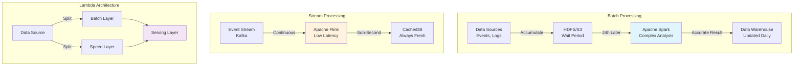

<Hero title="Batch vs Streaming" subtitle="Trade-offs between accuracy and latency in data processing" size="large" />

## TL;DR

Choose **batch processing** for accurate, comprehensive analysis at the cost of latency—process gigabytes of data every night with Apache Spark. Choose **streaming** for sub-second metrics and real-time alerting—consume events continuously from Kafka with Flink. Use **Lambda architecture** for both accuracy and latency: batch layer computes complete results, speed layer handles new events, serving layer merges. **Kappa architecture** simplifies by using event log replay instead of batch. Neither is universally better; choose based on your latency requirements and acceptable staleness.

## Learning Objectives

By the end of this article, you will understand:
- Fundamental differences between batch and streaming processing models
- Trade-offs in latency, accuracy, complexity, and fault recovery
- When to use batch, streaming, Lambda, or Kappa architectures
- How to prevent common pitfalls like exactly-once delivery and state management
- Real-world patterns for combining batch and streaming

## Motivating Scenario

You're building a recommendation engine for an e-commerce platform. The data science team needs to compute user-item similarities from millions of events daily—this should be highly accurate but can be 1-2 hours stale. Simultaneously, the marketing team needs to know within seconds when a user abandons their cart, so inventory can be adjusted. You cannot satisfy both requirements with a single approach. Batch handles the large computation; streaming handles the real-time signal. This is where understanding batch vs streaming becomes critical.

## Core Concepts

<Figure caption="Batch vs Streaming Processing Pipeline Architecture">

</Figure>

### Batch Processing Fundamentals

**Batch processing** groups data into fixed-size collections, processes them together, and produces results at defined intervals. Apache Spark and Hadoop are canonical examples.

**Characteristics:**
- **Latency**: Hours to days (typical: nightly runs)
- **Accuracy**: High—processes complete, immutable dataset
- **Complexity**: Lower—simpler distributed logic
- **Fault recovery**: Straightforward restart from last checkpoint
- **Cost**: High throughput, lower per-event overhead

**When batch excels:**
- Bulk analytics: monthly revenue reports, user cohort analysis
- Complex joins: correlating multiple large datasets
- Historical analysis: trend detection over months/years
- Cost-sensitive: processing at night when compute is cheaper

### Stream Processing Fundamentals

**Stream processing** applies transformations to events as they arrive, producing continuous updates.

**Characteristics:**
- **Latency**: Milliseconds to seconds
- **Accuracy**: Approximate due to windowing and state limits
- **Complexity**: Higher—must manage state, timing, ordering
- **Fault recovery**: Complex—must replay or checkpoint state
- **Cost**: Lower latency, continuous resource usage

**When streaming excels:**
- Real-time alerting: fraud detection, anomaly detection
- Live dashboards: stock prices, user activity counts
- Time-sensitive actions: inventory updates, recommendation refreshes
- Event-driven workflows: triggering downstream systems instantly

### Lambda Architecture: Best of Both

Combines batch (accuracy) and stream (latency) layers:

```
Speed Layer (Real-time, ~1-2 min accuracy)
         ↓
    Serving Layer (Merge results)
         ↑
Batch Layer (High accuracy, delayed)
```

**Example workflow:**
1. Events stream into Kafka
2. Speed layer: Flink computes approximate click-through rate every 10 seconds
3. Batch layer: Spark runs nightly, computes exact click-through rate with all data
4. Serving layer: Returns latest speed-layer result, replaces with batch result when available

**Trade-offs:** Code duplication (same logic in Spark and Flink), operational complexity.

### Kappa Architecture: Streaming Simplification

Uses a single streaming layer with event log for replay:

```
Event Log (Kafka)
     ↓
Stream Processor (Flink)
     ↓
State Store (incremental updates)
```

If logic changes or bugs occur, replay the event log to rebuild state. Eliminates batch layer.

**Trade-offs:** Requires immutable event log, must handle state carefully, not suitable for complex aggregations over massive historical windows.

## Practical Example

<Tabs>
  <TabItem value="batch-spark" label="Batch (Apache Spark)">
```python
from pyspark.sql import SparkSession
from pyspark.sql.functions import col, count, avg, year, month

spark = SparkSession.builder.appName("DailyAnalytics").getOrCreate()

# Read nightly events (accumulated from previous day)
events = spark.read.parquet("s3://events/2025-02-14/")

# Complex aggregation: user behavior by cohort
user_stats = (
    events
    .filter(col("event_type") == "purchase")
    .groupBy("user_id", "cohort")
    .agg(
        count("*").alias("purchases"),
        avg("amount").alias("avg_value"),
        col("country")
    )
    .filter(col("purchases") > 5)  # High-value users only
)

# Write curated results to warehouse
user_stats.write.mode("overwrite").parquet("s3://warehouse/user_cohorts/")
print(f"Processed {events.count()} events, {user_stats.count()} cohorts")
```

**Timing:** Runs once daily at 2 AM, takes ~30 min for 1B events. Results available by 3 AM.
  </TabItem>

  <TabItem value="stream-flink" label="Streaming (Apache Flink)">
```python
from pyflink.datastream import StreamExecutionEnvironment
from pyflink.datastream.functions import MapFunction, AggregateFunction
from pyflink.datastream.windowed_stream import CountedWindowAssigner
import json
import time

env = StreamExecutionEnvironment.get_execution_environment()

# Source: Kafka topic
kafka_stream = env.add_source(...)  # KafkaSource("localhost:9092", "events")

class EventParser(MapFunction):
    def map(self, record):
        event = json.loads(record)
        return (event["user_id"], event["event_type"], event["value"])

# Apply windowing: tumbling 10-second window
windowed = (
    kafka_stream
    .map(EventParser())
    .key_by(lambda x: x[0])  # Key by user_id
    .window(TumblingProcessingTimeWindow.of(10000))  # 10 sec windows
)

class WindowAgg(AggregateFunction):
    def create_accumulator(self):
        return (0, 0.0)  # (count, sum)

    def add(self, value, accumulator):
        return (accumulator[0] + 1, accumulator[1] + value[2])

    def get_result(self, accumulator):
        count, total = accumulator
        avg = total / count if count > 0 else 0
        return f"User bought {count} items, avg=${avg:.2f}"

result = windowed.aggregate(WindowAgg())

# Sink to Redis for real-time dashboard
result.add_sink(...)  # RedisSink("localhost:6379")

env.execute("StreamingAnalytics")
```

**Timing:** Continuous processing, results update every 10 seconds. Latency ~200ms.
  </TabItem>

  <TabItem value="lambda-combined" label="Lambda Architecture">
```python
# BATCH LAYER: Nightly reconciliation (Spark)
batch_result = (
    spark.read.parquet("s3://events/archive/2024/")
    .groupBy("user_id")
    .agg(
        count("*").alias("lifetime_purchases"),
        sum("amount").alias("lifetime_value")
    )
    .write.mode("overwrite")
    .parquet("s3://warehouse/lifetime_metrics/")
)

# SPEED LAYER: Real-time updates (Flink, same aggregation)
speed_result = (
    kafka_stream
    .key_by(lambda x: x["user_id"])
    .window(SlidingProcessingTimeWindow.of(
        windowSize=60000,      # 1 minute window
        slidingInterval=10000   # Update every 10 sec
    ))
    .aggregate(
        createAccumulator=lambda: {"count": 0, "sum": 0},
        add=lambda x, acc: {
            "count": acc["count"] + 1,
            "sum": acc["sum"] + x["amount"]
        }
    )
    .add_sink(RedisSink("cache:purchases"))
)

# SERVING LAYER: API returns latest
# GET /user/123/stats:
# {
#   "cached_count": 45,           <- from speed layer (10 sec old)
#   "cached_sum": 12500,
#   "accurate_count": 1250,        <- from batch layer (1 day old)
#   "accurate_sum": 350000,
#   "recommended_use": "accurate"  <- because 22+ hours old
# }
```
  </TabItem>
</Tabs>

## When to Use / When Not to Use

<Vs items={[
{label: "Batch Processing", points: [
      "Historical analysis (trend detection)",
      "Complex multi-dataset joins",
      "Accurate aggregate reporting",
      "Cost optimization (off-peak processing)",
      "Reproducible results (deterministic)",
      "Weekly/monthly/daily cadences"
    ]},
{label: "Stream Processing", points: [
      "Real-time alerting & anomaly detection",
      "Live dashboard updates",
      "Inventory/stock level updates",
      "Recommendation refreshes",
      "Event-driven triggers",
      "Sub-second latency requirements"
    ]}
]} highlight={[0, 1]} />

## Patterns & Pitfalls

<Showcase
  sections={[
    {
      label: "Exactly-Once Semantics: The Hard Problem",
      body: "Streaming systems face three delivery guarantees: at-most-once (may lose), at-least-once (may duplicate), exactly-once (delivered precisely once). Achieving exactly-once requires idempotent operations (safeRewriting same record twice) or deduplication tokens (skip duplicate event IDs). Batch systems naturally provide exactly-once since data is immutable."
    },
    {
      label: "State Management & Checkpointing",
      body: "Stateful streaming (aggregations, joins) requires maintaining state across events. If worker crashes, replay from checkpoint. Without careful management, state becomes corrupted or memory exhausts. Batch avoids this by processing immutable snapshots."
    },
    {
      label: "Lambda Complexity",
      body: "Maintaining identical logic in two languages/frameworks (Spark + Flink) creates maintenance burden and consistency bugs. Kappa simplifies but requires pure streaming architecture. Choose based on your accuracy requirements."
    },
    {
      label: "Windowing Semantics",
      body: "Streaming requires defining windows: tumbling (non-overlapping), sliding (overlapping), session (event-driven). Different windows produce different results for the same data. Batch doesn't require windowing—processes complete dataset."
    },
    {
      label: "Testing & Reproducibility",
      body: "Batch pipelines are easier to test: replay data, verify output deterministically. Streaming tests require mocking Kafka, managing time/event ordering. Use time-domain testing: inject events with explicit timestamps."
    },
    {
      label: "Late Data & Out-of-Order Events",
      body: "Streaming systems must handle events arriving late or out-of-order. Batch assumes all data is present before processing. Implement watermarks in Flink/Spark Streaming to tolerate late arrivals."
    }
  ]}
/>

## Design Review Checklist

<Checklist items={[
  "Documented latency requirements (RTAs): minutes? seconds? milliseconds?",
  "Identified maximum acceptable staleness for each use case",
  "For batch: defined schedule (hourly, daily, weekly) and estimated duration",
  "For streaming: chose processing guarantee (at-least-once vs exactly-once)",
  "Designed state management: size limits, checkpointing strategy, recovery plan",
  "If Lambda: documented logic duplication between batch and speed layers",
  "Tested failure scenarios: worker crash, backlog, state corruption",
  "Monitored latency and accuracy: end-to-end SLA metrics",
  "Planned cost: compute, storage, and network per 1M events",
  "Reviewed data ordering: in-batch order preserved? streaming order guaranteed?"
]} />

## Self-Check

- When would you choose batch over streaming? (Hint: when accurate results matter more than speed)
- What's Lambda vs Kappa architecture? (Hint: Lambda has batch + stream layers; Kappa is stream-only with replay)
- Why is exactly-once semantics hard in streaming? (Hint: must handle duplicate delivery or reordering)
- How do you test streaming pipelines? (Hint: use time-domain testing with deterministic event injection)
- What role does the event log play in both architectures?

## Next Steps

- **Implement a simple Spark batch job**: accumulate events, run daily, write results to Parquet
- **Build a Flink streaming app**: consume Kafka, compute 10-second windowed aggregates, write to Redis
- **Design a Lambda architecture**: define where batch and speed layers split, plan serving layer merges
- **Monitor both**: track end-to-end latency, compare streaming vs batch accuracy (should converge)
- **Deep dive**: study <a href="https://engineering.fb.com/2016/02/26/web/the-evolution-of-batch-size-normalization/" target="_blank" rel="nofollow noopener noreferrer">Facebook's evolution from batch to streaming ↗️</a>

## References

- <a href="https://spark.apache.org/docs/latest/" target="_blank" rel="nofollow noopener noreferrer">Apache Spark Documentation ↗️</a>
- <a href="https://flink.apache.org/" target="_blank" rel="nofollow noopener noreferrer">Apache Flink Official Site ↗️</a>
- <a href="https://kafka.apache.org/" target="_blank" rel="nofollow noopener noreferrer">Apache Kafka Documentation ↗️</a>
- <a href="https://learning.oreilly.com/library/view/streaming-systems/9781491983867/" target="_blank" rel="nofollow noopener noreferrer">Streaming Systems Book (O'Reilly) ↗️</a>
