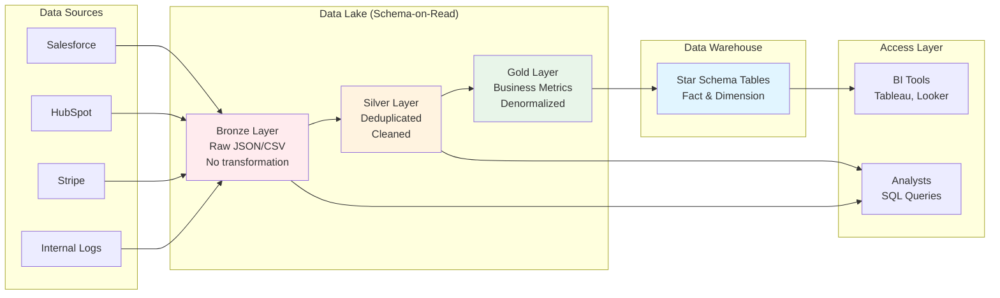

<Hero title="ETL/ELT, Data Lakes & Warehouses" subtitle="Build analytics platforms with raw and curated data" size="large" />

## TL;DR

**ETL (Extract-Transform-Load)** applies transformations before storing—enforces schema upfront, slow to adapt. **ELT (Extract-Load-Transform)** loads raw data first, transforms in-place—flexible, modern, cloud-native. **Data lakes** store raw unstructured data at petabyte scale (S3 + data catalog). **Data warehouses** provide curated, optimized schemas for analytics queries. Most effective modern architecture: bronze (raw) → silver (cleaned) → gold (analytics) layers in a data lake, with warehouse as optimized query layer for BI tools.

## Learning Objectives

By the end of this article, you will understand:
- Fundamental differences between ETL and ELT approaches
- Trade-offs between schema-on-write (ETL) and schema-on-read (ELT)
- Data lake architecture and typical use cases
- Data warehouse schemas: star, snowflake, denormalized
- The medallion architecture (bronze-silver-gold layers)
- How to choose between lake vs warehouse vs hybrid approach

## Motivating Scenario

Your company collects data from 50 different SaaS tools (Salesforce, HubSpot, Stripe, etc.) with varying schemas that change monthly. You need analysts to query this data in real-time. With traditional ETL, you'd write transformations for each source—but schema changes break everything. With ELT, you dump all raw data to S3 as-is, define schemas in SQL queries, quickly adapt to changes. Then, for frequently-used metrics (revenue by region, customer lifetime value), you materialize optimized tables in a warehouse using dbt, giving analysts both flexibility (raw data queries) and performance (pre-built tables).

## Core Concepts

<Figure caption="Data Lake to Warehouse Architecture with Medallion Pattern">

</Figure>

### ETL vs ELT

**ETL (Extract-Transform-Load):**
1. Extract data from sources
2. Transform in separate pipeline (Informatica, Talend)
3. Load into structured warehouse

**Characteristics:**
- Schema defined upfront (schema-on-write)
- Transformations centralized and versioned
- Data quality enforced before warehouse entry
- Slow to adapt to new source schemas
- Complex for handling messy/unstructured data

**ELT (Extract-Load-Transform):**
1. Extract data from sources
2. Load raw into data lake
3. Transform using SQL/dbt in the warehouse itself

**Characteristics:**
- Schema flexible (schema-on-read)
- Transformations stay with queries, easier to test
- Raw data always available for recomputation
- Adapt quickly to schema changes
- Better for cloud data warehouses (Snowflake, BigQuery)

### Data Lake Architecture

A **data lake** stores raw, unstructured, and structured data at massive scale. Typically S3 + metadata catalog (Glue, Unity Catalog).

**Medallion Architecture** organizes data in layers:

**Bronze Layer:**
- Raw data as-received from sources
- Minimal transformations: add timestamp, source metadata
- Format: JSON, Parquet, CSV
- Retention: Long-term (archive historical changes)

**Silver Layer:**
- Deduplicated, validated data
- Standard naming conventions
- Dropped nulls/invalid records
- Merged incremental updates
- Format: Parquet with schema evolution

**Gold Layer:**
- Business-ready metrics and dimensions
- Denormalized for BI tools
- Pre-aggregated tables (daily revenue, user cohorts)
- Join fact and dimension tables
- Format: Parquet optimized for analytical queries

**Example flow:**
```
Raw Salesforce JSON (Bronze)
  → Parse, add metadata, validate (Silver)
    → Group by customer, compute lifetime value (Gold)
      → Pre-build dashboard tables (Warehouse)
```

### Data Warehouse

A **data warehouse** organizes data into highly optimized schemas for analytical queries.

**Common schemas:**

**Star Schema:**
- Central fact table (transactions, events)
- Dimension tables (users, products, dates)
- Fact joins dimensions on foreign keys
- Fast aggregations, simple joins

**Snowflake Schema:**
- Extended star schema
- Dimension tables further normalized
- Reduces redundancy, increases query complexity
- Used when dimension data is very large

**Denormalized Schema:**
- Flatten fact + dimensions into single table
- Fastest queries, most storage
- Used in data lakes where storage cheap

### Data Quality & Transformation

**dbt (data build tool)** defines transformations as SQL queries:
- Version control transformations
- Test data quality (NOT NULL, unique, foreign keys)
- Generate documentation
- Modular: reference other models

## Practical Example

<Tabs>
<TabItem value="etl-traditional" label="ETL (Traditional)">
```python
# Informatica-style ETL using Python
import pandas as pd
import psycopg2
from datetime import datetime

# EXTRACT
salesforce_df = read_salesforce_api()  # Connect to Salesforce

# TRANSFORM
# Validate required columns
assert 'account_id' in salesforce_df.columns
assert 'amount' in salesforce_df.columns

# Clean and standardize
salesforce_df['amount'] = salesforce_df['amount'].fillna(0)
salesforce_df['created_at'] = pd.to_datetime(
    salesforce_df['created_at']
)

# Compute derived fields
salesforce_df['year'] = salesforce_df['created_at'].dt.year
salesforce_df['month'] = salesforce_df['created_at'].dt.month

# Join with reference data
accounts_df = load_from_warehouse("SELECT id, name FROM accounts")
salesforce_df = salesforce_df.merge(
    accounts_df,
    left_on='account_id',
    right_on='id'
)

# LOAD
conn = psycopg2.connect("dbname=warehouse")
cur = conn.cursor()

# Truncate (or use CDC logic)
cur.execute("TRUNCATE TABLE sales")

# Insert
salesforce_df.to_sql('sales', conn, if_exists='append')
conn.commit()
conn.close()

print(f"Loaded {len(salesforce_df)} records")
```

**Issues:**
- If Salesforce adds new field, pipeline breaks
- If validation logic changes, must reprocess all data
- Tightly coupled to source schema
</TabItem>

<TabItem value="elt-modern" label="ELT (Modern)">
```python
# ELT: Load raw, transform in warehouse
from google.cloud import storage, bigquery
import json
from datetime import datetime

# EXTRACT & LOAD (minimal transformation)
salesforce_data = fetch_salesforce_api()

# Save raw to GCS
client = storage.Client()
bucket = client.bucket('data-lake-raw')

blob = bucket.blob(
    f"salesforce/daily/{datetime.utcnow().date()}/data.jsonl"
)

# Write raw JSON as-is (no schema enforcement)
blob.upload_from_string(
    '\n'.join([json.dumps(record) for record in salesforce_data]),
    content_type='application/json'
)

print(f"Uploaded {len(salesforce_data)} raw records to GCS")

# TRANSFORM (done in SQL in warehouse)
bq_client = bigquery.Client()

# Create table from raw GCS files (auto-schema detection)
job_config = bigquery.LoadJobConfig(
    source_format=bigquery.SourceFormat.NEWLINE_DELIMITED_JSON,
    autodetect=True
)

load_job = bq_client.load_table_from_uri(
    "gs://data-lake-raw/salesforce/daily/2025-02-14/data.jsonl",
    "raw.salesforce_sales",
    job_config=job_config
)

load_job.result()
print(f"Loaded into raw table: {load_job.output_rows} rows")
```

Transformation happens in SQL/dbt (see next tab)
</TabItem>

<TabItem value="dbt-transformation" label="dbt Transformation">
```sql
-- models/marts/fct_sales.sql

{{ config(
    materialized='table',
    indexes=[
        {'columns': ['account_id'], 'unique': False},
    ]
) }}

WITH raw_sales AS (
    -- Bronze layer: raw from Salesforce
    SELECT
        id,
        account_id,
        amount,
        created_at,
        CAST(created_at AS DATE) AS sales_date,
        EXTRACT(YEAR FROM created_at) AS sales_year,
        EXTRACT(MONTH FROM created_at) AS sales_month
    FROM {{ source('raw', 'salesforce_sales') }}
    WHERE amount > 0  -- Silver layer: validation
        AND created_at IS NOT NULL
),

with_account_dims AS (
    -- Join with dimension table (Gold layer)
    SELECT
        rs.id,
        rs.account_id,
        a.name AS account_name,
        rs.amount,
        rs.sales_date,
        rs.sales_year,
        rs.sales_month
    FROM raw_sales rs
    LEFT JOIN {{ ref('dim_accounts') }} a
        ON rs.account_id = a.account_id
)

SELECT
    id,
    account_id,
    account_name,
    amount,
    sales_date,
    sales_year,
    sales_month
FROM with_account_dims

-- Test data quality

    
        {{ exceptions.raise_compiler_error("Missing account_id column!") }}
    

```

**Run dbt:**
```bash
dbt run  # Builds SQL models
dbt test # Validates data (NOT NULL, unique, foreign keys)
dbt docs generate  # Creates documentation
```

**Results:**
- Can adapt to new Salesforce fields automatically
- Raw data always available for recomputation
- Transformations testable and version-controlled
</TabItem>
</Tabs>

## When to Use / When Not to Use

<Vs items={[
{label: "Data Lake", points: [
      "Ingest diverse, unstructured sources",
      "Schema changes frequently",
      "Long-term historical storage",
      "Exploratory analytics",
      "Ad-hoc SQL queries",
      "Cost-optimized storage (S3)"
    ]},
{label: "Data Warehouse", points: [
      "BI tool dashboards",
      "Consistent schema required",
      "Fast, predictable queries",
      "Business metrics reporting",
      "Complex aggregations pre-built",
      "Query performance critical"
    ]}
]} highlight={[0, 1]} />

## Patterns & Pitfalls

<Showcase
  sections={[
    {
      label: "Schema Evolution Without Breaking",
      body: "When Salesforce adds a field, ELT auto-detects it; ETL breaks. Use schema-on-read: define expected columns in transformations, ignore unknowns. Version schemas in dbt (v1, v2 models) for controlled evolution."
    },
    {
      label: "Data Quality at Multiple Layers",
      body: "Tests at each layer catch issues early. Bronze tests: source data present? Silver tests: no duplicates? Gold tests: revenue_sum > 0? Early tests prevent garbage propagating downstream."
    },
    {
      label: "Partition for Performance",
      body: "Parquet files partitioned by date: analysts query only needed dates. Query 1 year of sales data efficiently instead of scanning 10 years. S3 Select skips non-partition data automatically."
    },
    {
      label: "Denormalization Trade-offs",
      body: "Data warehouses often denormalize (wide tables) for query speed. Data lakes can stay normalized if storage cheap. Choose based on query patterns: high-cardinality dimensions (millions of customers) justify normalization."
    },
    {
      label: "Incremental Loads vs Full Refreshes",
      body: "Full refresh: simple, but slow for large data. Incremental: only load changes since last run, much faster. Use CDC for incremental sources; timestamp-based for others. dbt handles both patterns."
    },
    {
      label: "Handling Late Arrivals",
      body: "Fact table shows yesterday's sales incomplete; late orders arrive today. Incremental loads with lookback window (reprocess last 2 days) or set-theoretic deltas (only process changed rows)."
    }
  ]}
/>

## Design Review Checklist

<Checklist items={[
  "Documented all data sources: structure, schema, change frequency",
  "Decided ETL vs ELT: which transformation approach fits?",
  "Designed medallion layers: Bronze (raw) → Silver (clean) → Gold (metrics)",
  "Defined data quality tests at each layer (uniqueness, NOT NULL, ranges)",
  "Chose partitioning strategy: by date? by region? what queries access?",
  "For ETL: documented transformation logic, error handling, retry logic",
  "For ELT: planned schema evolution, versioning, backward compatibility",
  "Configured incremental loads: timestamp-based? offset-based? CDC?",
  "Monitored pipeline: latency, record counts, quality metrics",
  "Documented data lineage: where does each column come from?"
]} />

## Self-Check

- What's the key difference between ETL and ELT? (Hint: when transformation happens: before or after load)
- Why is schema-on-read flexible? (Hint: fields can be added/removed without breaking pipeline)
- What's the medallion architecture? (Hint: Bronze raw → Silver clean → Gold metrics)
- When would you denormalize in a warehouse? (Hint: when query speed matters more than storage)
- How do incremental loads improve performance? (Hint: process only changes, not full dataset)

## Next Steps

- **Build a simple ELT pipeline**: load JSON to S3, transform with SQL queries
- **Design dbt models**: write SQL models with tests, materialize as tables
- **Set up medallion layers**: create Bronze, Silver, Gold schemas in BigQuery/Snowflake
- **Implement incremental loads**: add timestamp tracking, process deltas
- **Monitor data quality**: set up tests, alerting on failures

## References

- <a href="https://www.getdbt.com/docs/" target="_blank" rel="nofollow noopener noreferrer">dbt Documentation ↗️</a>
- <a href="https://docs.snowflake.com/en/" target="_blank" rel="nofollow noopener noreferrer">Snowflake Documentation ↗️</a>
- <a href="https://cloud.google.com/bigquery/docs" target="_blank" rel="nofollow noopener noreferrer">Google BigQuery Documentation ↗️</a>
- <a href="https://databricks.com/blogs/2020/01/30/what-format-should-i-use-for-my-data.html" target="_blank" rel="nofollow noopener noreferrer">Medallion Architecture by Databricks ↗️</a>
