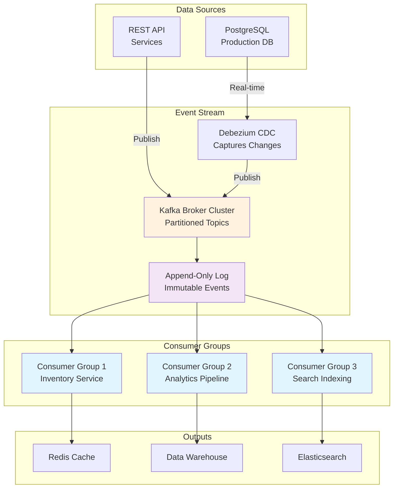

<Hero title="Event Streams & Log-Based Integration" subtitle="Real-time data integration using append-only event logs" size="large" />

## TL;DR

**Event logs** (Apache Kafka, Apache Pulsar) are distributed append-only message brokers enabling real-time, durable data integration. **Change Data Capture (CDC)** extracts database changes automatically and publishes to event logs, synchronizing systems in real-time. **Event sourcing** stores all state changes as immutable events, enabling perfect audit trails and temporal queries. Use event logs as the backbone of event-driven architectures: publish user events, subscribe with independent consumer groups, replay for recovery or recomputation.

## Learning Objectives

By the end of this article, you will understand:
- How event logs provide durability, ordering, and replayability
- CDC patterns for real-time database synchronization
- Event sourcing as an alternative to database updates
- Consumer groups for scaling independent consumers
- Trade-offs in ordering, latency, and operational complexity
- When to use log-based integration vs request-response patterns

## Motivating Scenario

You operate an e-commerce platform with separate services for payments, inventory, and fulfillment. When a user places an order, your payment service must tell inventory to reserve stock, which must tell fulfillment to prepare shipment. Direct API calls create tight coupling and cascading failures. Alternatively, payment publishes a "PaymentProcessed" event to Kafka. Inventory and fulfillment each consume independently, process in their own time, and can replay events for recovery. If fulfillment crashes, restart and replay missed events from Kafka—perfect synchronization without coupling.

## Core Concepts

<Figure caption="Event Log Architecture with CDC and Consumer Groups">

</Figure>

### Event Log Fundamentals

An **event log** is a distributed, append-only data structure where each entry represents an immutable event. Kafka organizes events into **partitions**, with each partition being a totally ordered log. A **topic** is a collection of partitions for related events.

**Key properties:**
- **Immutable**: Once published, events cannot be modified or deleted (except by retention policy)
- **Ordered within partition**: Events in partition 0 always arrive in publish order to a consumer
- **Replicated**: Events are copied across brokers for durability
- **Replayable**: Consumers can seek to any point and replay from there
- **Retention**: Events retained for configurable period (days to years)

**Partitions distribute load:**
- Topic with 3 partitions can have 3 parallel consumers, each consuming one partition
- Partitioning key (e.g., user_id) determines which partition stores an event
- Events with same key always go to same partition, preserving order for that key

### Change Data Capture (CDC)

**CDC** automatically extracts all database changes and publishes them to an event log. Instead of applications writing to both database and Kafka, CDC observer publishes changes automatically.

**Mechanisms:**
1. **Query-based CDC**: Poll database periodically. Simple but high latency and database load.
2. **Log-based CDC**: Read database transaction log (PostgreSQL WAL, MySQL binlog). Fast and accurate. Requires privileged access.
3. **Query + Timestamp**: Track highest seen timestamp, query changes since then. Catches most changes but misses deletes.

**Example: Debezium + PostgreSQL**
- Debezium connector reads PostgreSQL WAL
- Publishes INSERT/UPDATE/DELETE events to Kafka topics (one per table)
- Each event includes before/after values
- Consumers read and apply changes to replica databases or caches

### Event Sourcing

**Event sourcing** differs from CDC: instead of updating records in place, store all state changes as events. The current state is computed by replaying all events.

**Example sequence for user account:**
```
Event 1: UserCreated{id: 123, email: "alice@example.com"}
Event 2: EmailVerified{id: 123}
Event 3: NameUpdated{id: 123, name: "Alice Smith"}
Event 4: AddressAdded{id: 123, address: "123 Main St"}
Event 5: AddressRemoved{id: 123}  (if user deleted address)
```

**Advantages:**
- **Perfect audit trail**: Every state change is recorded
- **Temporal queries**: Compute state at any point in time
- **Debugging**: Replay sequence of events to understand how state changed
- **Alternative implementations**: Compute different materialized views from same events

**Disadvantages:**
- **Complexity**: Application must handle events, idempotency, snapshots
- **Query difficulty**: Cannot easily query current state; must replicate to queryable store
- **Event schema evolution**: Changing event structure requires migration

### Consumer Groups

**Consumer groups** enable multiple independent applications to consume same topic without interfering.

**Mechanics:**
- Each consumer in a group gets assigned one or more partitions
- Kafka tracks consumed offsets per group
- If consumer crashes, another in group picks up partitions
- Different groups can consume same topic at different speeds

**Example:**
```
Topic: orders (3 partitions)

Group "inventory":
  - Consumer 1 reads partition 0
  - Consumer 2 reads partition 1
  - Consumer 3 reads partition 2

Group "analytics":
  - Consumer A reads all 3 partitions (since only 1 consumer)
  - Processes independently of inventory group
```

## Practical Example

<Tabs>
  <TabItem value="kafka-producer" label="Kafka Producer">
```python
from kafka import KafkaProducer
import json
import time
from datetime import datetime

# Initialize producer
producer = KafkaProducer(
    bootstrap_servers=['localhost:9092'],
    value_serializer=lambda v: json.dumps(v).encode('utf-8'),
    acks='all'  # Wait for all replicas to acknowledge
)

# Publish order events
orders = [
    {"order_id": 1001, "user_id": 123, "amount": 99.99, "items": 3},
    {"order_id": 1002, "user_id": 456, "amount": 249.50, "items": 1},
    {"order_id": 1003, "user_id": 123, "amount": 45.00, "items": 2},
]

for order in orders:
    event = {
        "event_type": "OrderPlaced",
        "timestamp": datetime.utcnow().isoformat(),
        "data": order,
        "version": 1
    }

    # Key by user_id to ensure orders for same user go to same partition
    future = producer.send(
        'orders',
        value=event,
        key=str(order["user_id"]).encode('utf-8')
    )

    # Wait for confirmation
    record_metadata = future.get(timeout=10)
    print(f"Sent to partition {record_metadata.partition}, "
          f"offset {record_metadata.offset}")

producer.close()
```
  </TabItem>

  <TabItem value="kafka-consumer" label="Kafka Consumer">
```python
from kafka import KafkaConsumer
import json
from datetime import datetime

# Create consumer group
consumer = KafkaConsumer(
    'orders',
    bootstrap_servers=['localhost:9092'],
    group_id='inventory-service',
    value_deserializer=lambda m: json.loads(m.decode('utf-8')),
    auto_offset_reset='earliest',  # Start from beginning if no offset
    enable_auto_commit=False  # Manual offset management
)

processed_orders = []

for message in consumer:
    event = message.value
    print(f"Received event: {event['event_type']}")

    try:
        if event['event_type'] == 'OrderPlaced':
            order_data = event['data']

            # Reserve inventory for each item
            for item_id in range(order_data['items']):
                print(f"  Reserving item {item_id} for order {order_data['order_id']}")

            # Business logic: update inventory DB
            processed_orders.append(order_data['order_id'])

        # Manual commit: only after successful processing
        consumer.commit()

    except Exception as e:
        print(f"Error processing event: {e}")
        # Do NOT commit, will retry next poll

print(f"Processed {len(processed_orders)} orders")
consumer.close()
```
  </TabItem>

  <TabItem value="cdc-debezium" label="CDC with Debezium">
```json
{
  "name": "postgres-orders-connector",
  "config": {
    "connector.class": "io.debezium.connector.postgresql.PostgresConnector",
    "database.hostname": "postgres.internal",
    "database.port": 5432,
    "database.user": "replication",
    "database.password": "secret",
    "database.dbname": "production",
    "database.server.name": "prod-db",
    "table.include.list": "public.orders,public.users",
    "plugin.name": "pgoutput",
    "publication.name": "debezium_pub",
    "publication.autocreate.mode": "all_tables",
    "topic.prefix": "cdc",
    "transforms": "route",
    "transforms.route.type": "org.apache.kafka.connect.transforms.RegexRouter",
    "transforms.route.regex": "([^.]+)\\.([^.]+)\\.([^.]+)",
    "transforms.route.replacement": "$3"
  }
}
```

**Deployed via:**
```bash
curl -X POST http://localhost:8083/connectors \
  -H "Content-Type: application/json" \
  -d @postgres-connector.json

# Results in topics: orders, users
# Each event: {"before": {...}, "after": {...}, "op": "c|u|d"}
```
  </TabItem>

  <TabItem value="event-sourcing" label="Event Sourcing Pattern">
```python
from dataclasses import dataclass
from typing import List
from datetime import datetime
import json

@dataclass
class Event:
    event_type: str
    user_id: int
    timestamp: datetime
    data: dict

class UserEventStore:
    def __init__(self):
        self.events: List[Event] = []

    def apply_event(self, event: Event):
        """Append event to immutable log"""
        self.events.append(event)

    def get_current_state(self, user_id: int):
        """Rebuild current state by replaying all events"""
        state = {
            "user_id": user_id,
            "email": None,
            "verified": False,
            "address": None,
            "created_at": None
        }

        for event in self.events:
            if event.user_id != user_id:
                continue

            if event.event_type == "UserCreated":
                state["email"] = event.data["email"]
                state["created_at"] = event.timestamp

            elif event.event_type == "EmailVerified":
                state["verified"] = True

            elif event.event_type == "AddressUpdated":
                state["address"] = event.data["address"]

        return state

    def get_state_at_time(self, user_id: int, time: datetime):
        """Temporal query: state at specific point in time"""
        state = {}
        for event in self.events:
            if event.user_id != user_id or event.timestamp > time:
                continue
            # Apply same logic as above...
        return state

# Usage
store = UserEventStore()

store.apply_event(Event(
    "UserCreated",
    user_id=123,
    timestamp=datetime(2025, 1, 1),
    data={"email": "alice@example.com"}
))

store.apply_event(Event(
    "EmailVerified",
    user_id=123,
    timestamp=datetime(2025, 1, 2),
    data={}
))

# Current state
print(store.get_current_state(123))
# {'user_id': 123, 'email': 'alice@example.com', 'verified': True, ...}

# State on 2025-01-01 (before verification)
print(store.get_state_at_time(123, datetime(2025, 1, 1, 23, 59)))
# {'user_id': 123, 'email': 'alice@example.com', 'verified': False, ...}
```
  </TabItem>
</Tabs>

## When to Use / When Not to Use

<Vs items={[
{label: "Event Logs (Kafka)", points: [
      "Loose coupling between services",
      "Different teams own producers/consumers",
      "High throughput event streaming",
      "Replay and recovery from events",
      "Multiple independent consumers",
      "Audit trail of all changes"
    ]},
{label: "Request-Response APIs", points: [
      "Immediate consistency required",
      "Request-reply pattern natural",
      "Real-time query results needed",
      "Simple point-to-point calls",
      "Lower operational complexity",
      "Easier to understand flow"
    ]}
]} highlight={[0, 1]} />

## Patterns & Pitfalls

<Showcase
  sections={[
    {
      label: "Partition Key Selection",
      body: "Choose partition keys carefully: partition by user_id keeps user events ordered, partition by timestamp spreads load evenly. Mistake: partition by random key loses all ordering. Choose key that matches your consumer grouping (e.g., user_id for user-specific consumers)."
    },
    {
      label: "Exactly-Once Processing",
      body: "Consumers must handle duplicates: publish same event twice, apply same processing twice. Either make operations idempotent (SET vs INCREMENT) or track processed event IDs. Kafka's exactly-once semantics requires transactions, which have performance cost."
    },
    {
      label: "Event Schema Evolution",
      body: "Add fields to events carefully: old consumers must ignore new fields, new consumers must handle missing fields from old events. Use versioning (v1, v2) or Avro schema registry to manage evolution. Never remove fields required by existing consumers."
    },
    {
      label: "Consumer Lag Monitoring",
      body: "Monitor distance between producer offset and consumer offset: high lag means consumers falling behind, may indicate processing issues or underpowered consumers. Set alerts when lag grows consistently."
    },
    {
      label: "Dead Letter Queues (DLQs)",
      body: "Events that fail processing repeatedly are 'poison pills.' Send to DLQ for manual inspection instead of blocking consumer. Implement fallback: try main queue, catch exception, send to DLQ, continue processing next event."
    },
    {
      label: "Retention vs Storage Cost",
      body: "Kafka retention is not free: 1M events/second * 30-day retention = massive disk. Size cluster accordingly or use tiered storage. Balance between replay capability and cost."
    }
  ]}
/>

## Design Review Checklist

<Checklist items={[
  "Identified all event types and documented schema (Avro or JSON schema)",
  "Chose partition key strategy: what distributes events fairly? what preserves ordering?",
  "Defined consumer groups: how many independent consumers needed?",
  "Planned retention: how far back must events be replayed? (days? years?)",
  "For CDC: identified all database changes to capture, chose CDC connector",
  "For event sourcing: defined event aggregates and snapshots to optimize replay",
  "Configured monitoring: consumer lag, producer throughput, error rates",
  "Implemented DLQs: where do poison pill events go?",
  "Tested failure scenarios: producer failure, consumer crash, partition loss",
  "Planned operational complexity: cluster sizing, monitoring, alerting"
]} />

## Self-Check

- What's the difference between event logs and request-response APIs? (Hint: async, decoupled, replay-able)
- How does CDC extract database changes in real-time? (Hint: reads transaction log, not polling)
- What does event sourcing add vs CDC? (Hint: immutable event history, temporal queries, debugging)
- Why choose partition keys carefully? (Hint: determines ordering and consumer parallelism)
- What's a consumer group and why use them? (Hint: multiple independent applications consuming same topic)

## Next Steps

- **Set up Kafka locally**: Docker Compose, publish/consume events, see partition assignment
- **Deploy Debezium**: connect to PostgreSQL, extract changes, watch CDC topics populate
- **Build event-driven service**: publish events from one service, consume in another, verify decoupling
- **Implement DLQ pattern**: send failing events to dead letter queue, monitor manually
- **Design event schema**: define versioning strategy, evolve carefully

## References

- <a href="https://kafka.apache.org/documentation/" target="_blank" rel="nofollow noopener noreferrer">Apache Kafka Official Documentation ↗️</a>
- <a href="https://debezium.io/documentation/reference/" target="_blank" rel="nofollow noopener noreferrer">Debezium CDC Documentation ↗️</a>
- <a href="https://pulsar.apache.org/docs/concepts-overview/" target="_blank" rel="nofollow noopener noreferrer">Apache Pulsar Guide ↗️</a>
- <a href="https://martinfowler.com/articles/201701-event-sourcing.html" target="_blank" rel="nofollow noopener noreferrer">Event Sourcing by Martin Fowler ↗️</a>
