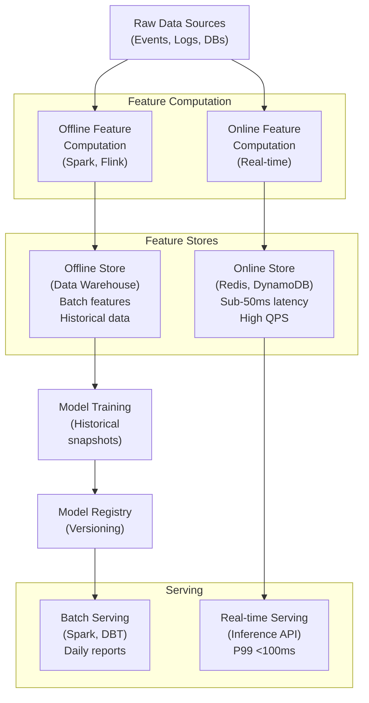

<Hero
  title="ML Feature Stores and Model Serving Architecture"
  subtitle="Build scalable feature stores and model serving pipelines supporting online/offline feature computation, real-time inference, and batch processing at enterprise scale."
  difficulty="intermediate"
  time="15 min read"
/>

## TL;DR

Feature stores decouple feature engineering from model training and serving by managing a centralized repository of computed features. Implement dual-layer architecture: **offline store** (batch features, 100k+ rows, lower freshness) and **online store** (sub-50ms features, &lt;1s freshness, high QPS). Support batch serving (daily reports), real-time serving (P99 &lt;100ms), and streaming features (event-driven). Use feature versioning, lineage tracking, and point-in-time correctness to prevent training-serving skew and enable reproducibility.

## Learning Objectives

By the end of this article, you'll understand:
- Online vs offline feature store trade-offs and architecture
- Batch, real-time, and streaming model serving patterns
- Feature computation pipelines and orchestration
- Training-serving skew prevention techniques
- Model registry design and versioning strategies
- Feature freshness and consistency guarantees

## Motivating Scenario

Your recommendation engine experiences 5% CTR drop week-over-week. Investigation reveals offline features used for training are 48 hours stale in production serving, while newer features with different distributions are unavailable in batch training. Separate feature calculations in training and serving pipelines cause divergence. A customer on day 1 with &lt; 24 hours of history gets stale features compared to day 2 when fresh data arrives. You need a unified feature platform ensuring training and serving use identical feature definitions with known staleness bounds.

## Core Concepts

<Figure title="ML Feature Store and Serving Architecture">

</Figure>

### Feature Store Architecture

**Offline Store:**
- Batch-computed features (daily/hourly cadence)
- Data warehouse (Snowflake, BigQuery, Redshift)
- Large feature matrices (millions of rows)
- Used for training, batch serving, analytics
- Freshness: 1-24 hours typical
- Lower QPS, higher latency acceptable

**Online Store:**
- Real-time feature computation or cached features
- Low-latency backends (Redis, DynamoDB, Cassandra)
- Subset of features needed for inference
- Serves with &lt;50ms latency at high QPS
- Freshness: &lt; 1 minute (streaming) to daily (batch sync)
- Point-in-time joins prevent training-serving skew

### Model Serving Patterns

**Batch Serving:**
- Compute predictions for entire user base daily/hourly
- Output to data warehouse or messaging
- High throughput, latency not critical
- Use for recommendations, daily emails, dashboards
- Efficient for large-scale scoring

**Real-Time Serving:**
- Single-instance prediction on user request
- Latency-critical (P99 &lt;100ms, P95 &lt;50ms)
- Requires fast feature lookup from online store
- Horizontal scaling with load balancer
- Return predictions synchronously

**Streaming Serving:**
- Predictions on streaming events (Kafka, Pubsub)
- Process events at source with pre-computed features
- Update predictions as features change
- Used for fraud detection, real-time personalization

### Feature Freshness and Consistency

**Staleness Windows:**
- User features: tolerate 1-24 hours stale
- Item/catalog features: tolerate minutes stale
- Real-time features: &lt; 1 second stale
- Select freshness by use case, not uniformly

**Point-in-Time Correctness:**
- Training uses features as they existed at label time
- Serving uses latest features (or specify as-of time)
- Join historical feature snapshots at exact timestamps
- Prevents training-serving divergence from feature evolution

**Feature Versioning:**
- Track feature computation logic changes
- Maintain multiple versions in online store
- Experiment with new features before rollout
- Document lineage and data sources

## Practical Example

<Tabs>
<TabItem value="python" label="Python (Feature Store Design)">
```python
import pandas as pd
from datetime import datetime, timedelta
from typing import Dict, List, Optional
import json

class FeatureStore:
    """Feature store with online/offline layers"""

    def __init__(self):
        self.offline_features = {}  # Simulates data warehouse
        self.online_features = {}   # Simulates Redis/DynamoDB
        self.feature_metadata = {}
        self.feature_versions = {}

    def register_feature(self, feature_name: str, computation_func,
                        freshness_seconds: int = 3600,
                        is_streaming: bool = False):
        """Register a feature with metadata"""
        self.feature_metadata[feature_name] = {
            'created_at': datetime.utcnow(),
            'freshness_seconds': freshness_seconds,
            'is_streaming': is_streaming,
            'version': 1
        }
        self.feature_versions[feature_name] = computation_func
        print(f"Registered feature: {feature_name} (v1)")

    def compute_offline_features(self, feature_name: str,
                                 user_ids: List[int]) -> pd.DataFrame:
        """Compute features for batch training/serving"""
        print(f"Computing offline features: {feature_name}")

        # Simulate batch feature computation
        features = []
        for user_id in user_ids:
            value = self.feature_versions[feature_name](user_id)
            features.append({
                'user_id': user_id,
                'feature_value': value,
                'timestamp': datetime.utcnow()
            })

        return pd.DataFrame(features)

    def compute_online_feature(self, feature_name: str,
                              user_id: int,
                              cached: bool = False) -> Dict:
        """Compute single feature for online serving"""
        key = f"{feature_name}:{user_id}"

        # Check online cache
        if cached and key in self.online_features:
            cached_data = self.online_features[key]
            age_seconds = (datetime.utcnow() -
                          cached_data['cached_at']).total_seconds()

            if age_seconds < self.feature_metadata[feature_name][
                'freshness_seconds']:
                print(f"Cache HIT: {key}")
                return cached_data

        # Cache miss - compute online
        print(f"Cache MISS: {key} - computing")
        value = self.feature_versions[feature_name](user_id)

        result = {
            'user_id': user_id,
            'feature_value': value,
            'timestamp': datetime.utcnow(),
            'cached_at': datetime.utcnow()
        }

        # Update online store
        self.online_features[key] = result
        return result

    def point_in_time_join(self, user_id: int,
                          target_timestamp: datetime,
                          features: List[str]) -> Dict:
        """Get features as they existed at target time (training)"""
        print(f"Point-in-time join for user {user_id} at {target_timestamp}")

        # In production: query offline store for historical snapshots
        result = {}
        for feature_name in features:
            # Simulate lookup of feature value at specific time
            value = self.feature_versions[feature_name](user_id)
            result[feature_name] = {
                'value': value,
                'as_of_timestamp': target_timestamp
            }

        return result

    def get_feature_for_inference(self, user_id: int,
                                 features: List[str],
                                 use_fresh: bool = True) -> Dict:
        """Get features for real-time inference"""
        print(f"Fetching features for inference: {features}")

        result = {}
        for feature_name in features:
            # Use online store for real-time features
            feature_data = self.compute_online_feature(
                feature_name,
                user_id,
                cached=not use_fresh
            )
            result[feature_name] = feature_data['feature_value']

        return result

    def sync_offline_to_online(self, feature_name: str,
                              batch_df: pd.DataFrame):
        """Sync batch features from offline to online store"""
        print(f"Syncing {feature_name} to online store")

        for _, row in batch_df.iterrows():
            key = f"{feature_name}:{row['user_id']}"
            self.online_features[key] = {
                'user_id': row['user_id'],
                'feature_value': row['feature_value'],
                'timestamp': row['timestamp'],
                'cached_at': datetime.utcnow()
            }

    def update_feature_version(self, feature_name: str,
                              new_computation_func):
        """Update feature computation logic"""
        old_version = self.feature_metadata[feature_name]['version']
        new_version = old_version + 1

        self.feature_versions[feature_name] = new_computation_func
        self.feature_metadata[feature_name]['version'] = new_version

        print(f"Updated {feature_name}: v{old_version} -> v{new_version}")

    def get_feature_stats(self, feature_name: str) -> Dict:
        """Get feature statistics"""
        online_keys = [k for k in self.online_features.keys()
                      if k.startswith(feature_name)]

        return {
            'feature_name': feature_name,
            'version': self.feature_metadata[feature_name]['version'],
            'freshness_seconds': self.feature_metadata[feature_name][
                'freshness_seconds'],
            'online_entries': len(online_keys),
            'last_computed': self.feature_metadata[feature_name]['created_at']
        }

# Example usage
def main():
    store = FeatureStore()

    # Register features
    def user_total_spend(user_id):
        return 100.0 + user_id * 10  # Simulated

    def user_days_active(user_id):
        return 30 + user_id % 7      # Simulated

    store.register_feature('total_spend', user_total_spend,
                          freshness_seconds=3600)
    store.register_feature('days_active', user_days_active,
                          freshness_seconds=86400)

    print("=== Batch Feature Computation ===")
    user_ids = [1, 2, 3, 4, 5]
    batch_df = store.compute_offline_features('total_spend', user_ids)
    print(batch_df)
    print()

    print("=== Online Feature Serving ===")
    features = store.get_feature_for_inference(
        user_id=1,
        features=['total_spend', 'days_active']
    )
    print(f"Features for inference: {features}\n")

    print("=== Sync to Online Store ===")
    store.sync_offline_to_online('total_spend', batch_df)
    print()

    print("=== Feature Version Update ===")
    def user_total_spend_v2(user_id):
        return 150.0 + user_id * 15  # Updated calculation

    store.update_feature_version('total_spend', user_total_spend_v2)
    print()

    print("=== Point-in-Time Join (Training) ===")
    training_features = store.point_in_time_join(
        user_id=1,
        target_timestamp=datetime.utcnow() - timedelta(days=1),
        features=['total_spend', 'days_active']
    )
    print(f"Training features: {training_features}\n")

    print("=== Feature Stats ===")
    stats = store.get_feature_stats('total_spend')
    print(json.dumps(stats, indent=2, default=str))
```
</TabItem>

<TabItem value="go" label="Go (Feature Serving API)">
```go
package main

import (
	"encoding/json"
	"fmt"
	"net/http"
	"sync"
	"time"
)

type FeatureValue struct {
	Value     float64   `json:"value"`
	Timestamp time.Time `json:"timestamp"`
	Version   int       `json:"version"`
}

type OnlineStore struct {
	mu       sync.RWMutex
	features map[string]map[int]FeatureValue
}

type ModelServer struct {
	featureStore *OnlineStore
	modelVersion string
	serverName   string
}

func NewOnlineStore() *OnlineStore {
	return &OnlineStore{
		features: make(map[string]map[int]FeatureValue),
	}
}

func NewModelServer(fs *OnlineStore, modelVersion string) *ModelServer {
	return &ModelServer{
		featureStore: fs,
		modelVersion: modelVersion,
		serverName:   fmt.Sprintf("inference-server-%d", time.Now().Unix()),
	}
}

// Set feature value
func (os *OnlineStore) SetFeature(featureName string, userID int,
	value float64, version int) {
	os.mu.Lock()
	defer os.mu.Unlock()

	if _, exists := os.features[featureName]; !exists {
		os.features[featureName] = make(map[int]FeatureValue)
	}

	os.features[featureName][userID] = FeatureValue{
		Value:     value,
		Timestamp: time.Now(),
		Version:   version,
	}
	fmt.Printf("[Feature Store] Set %s:%d = %.2f (v%d)\n",
		featureName, userID, value, version)
}

// Get feature value
func (os *OnlineStore) GetFeature(featureName string,
	userID int) (*FeatureValue, error) {
	os.mu.RLock()
	defer os.mu.RUnlock()

	features, exists := os.features[featureName]
	if !exists {
		return nil, fmt.Errorf("feature not found: %s", featureName)
	}

	value, exists := features[userID]
	if !exists {
		return nil, fmt.Errorf("feature value not found for user: %d",
			userID)
	}

	return &value, nil
}

// Inference request
type InferenceRequest struct {
	UserID       int      `json:"user_id"`
	Features     []string `json:"features"`
	ModelVersion string   `json:"model_version"`
}

type Prediction struct {
	Score       float64            `json:"score"`
	UserID      int                `json:"user_id"`
	Features    map[string]float64 `json:"features"`
	ModelID     string             `json:"model_id"`
	Timestamp   time.Time          `json:"timestamp"`
	LatencyMs   float64            `json:"latency_ms"`
	ServerName  string             `json:"server_name"`
}

// Predict endpoint
func (ms *ModelServer) Predict(w http.ResponseWriter,
	r *http.Request) {
	startTime := time.Now()

	var req InferenceRequest
	if err := json.NewDecoder(r.Body).Decode(&req); err != nil {
		http.Error(w, err.Error(), http.StatusBadRequest)
		return
	}

	// Fetch features from online store
	features := make(map[string]float64)
	for _, featureName := range req.Features {
		fv, err := ms.featureStore.GetFeature(featureName, req.UserID)
		if err != nil {
			http.Error(w, fmt.Sprintf("Feature error: %v", err),
				http.StatusNotFound)
			return
		}
		features[featureName] = fv.Value
	}

	// Simulate model inference
	score := 0.5
	for _, fv := range features {
		score += fv * 0.1
	}

	prediction := Prediction{
		Score:      score,
		UserID:     req.UserID,
		Features:   features,
		ModelID:    ms.modelVersion,
		Timestamp:  time.Now(),
		LatencyMs:  time.Since(startTime).Seconds() * 1000,
		ServerName: ms.serverName,
	}

	w.Header().Set("Content-Type", "application/json")
	json.NewEncoder(w).Encode(prediction)

	fmt.Printf("[Inference] User %d score=%.3f latency=%.2fms\n",
		req.UserID, score, prediction.LatencyMs)
}

// Health check
func (ms *ModelServer) Health(w http.ResponseWriter, r *http.Request) {
	w.Header().Set("Content-Type", "application/json")
	json.NewEncoder(w).Encode(map[string]interface{}{
		"status":  "healthy",
		"model":   ms.modelVersion,
		"server":  ms.serverName,
		"uptime":  time.Now().Unix(),
	})
}

func main() {
	// Initialize online store
	featureStore := NewOnlineStore()

	// Populate with features (simulating sync from offline store)
	featureStore.SetFeature("total_spend", 1, 150.0, 2)
	featureStore.SetFeature("days_active", 1, 35, 1)
	featureStore.SetFeature("total_spend", 2, 250.0, 2)
	featureStore.SetFeature("days_active", 2, 42, 1)

	// Create inference server
	modelServer := NewModelServer(featureStore, "model-v1.2.0")

	// Routes
	http.HandleFunc("/health", modelServer.Health)
	http.HandleFunc("/predict", modelServer.Predict)

	fmt.Println("Starting inference server on :8080")
	http.ListenAndServe(":8080", nil)
}
```
</TabItem>

<TabItem value="orchestration" label="DAG Orchestration (Pseudocode)">
```yaml
# Feature computation and serving pipeline DAG
pipeline:
  name: "recommendation_ml_pipeline"
  version: "1.0"
  schedule: "0 */6 * * *"  # Every 6 hours

stages:
  # Stage 1: Offline feature computation
  compute_offline_features:
    task: "spark_job"
    config:
      script: "compute_features.py"
      partition_by: ["date", "region"]
      output: "s3://features/offline/"
    resources:
      workers: 50
      memory_gb: 500
    timeout_minutes: 120

  # Stage 2: Sync to online store (async, near real-time)
  sync_to_online_store:
    task: "streaming_job"
    depends_on: "compute_offline_features"
    config:
      source: "s3://features/offline/"
      destination: "redis://feature-store"
      batch_size: 10000
      freshness_ttl_seconds: 3600
    resources:
      replicas: 3
      memory_gb: 32

  # Stage 3: Model training
  train_model:
    task: "ml_training"
    depends_on: "compute_offline_features"
    config:
      features_path: "s3://features/offline/"
      labels_path: "s3://labels/"
      model_type: "xgboost"
      hyperparameters:
        max_depth: 7
        learning_rate: 0.1
      training_sample_fraction: 1.0
      point_in_time_join: true
    resources:
      gpu: 4
      memory_gb: 128
    timeout_minutes: 180

  # Stage 4: Model registry and validation
  register_model:
    task: "model_validation"
    depends_on: "train_model"
    config:
      model_registry: "gs://models/"
      validation_dataset: "s3://validation/"
      min_auc: 0.85
      max_model_size_mb: 500
      enable_adversarial_testing: true
    on_success:
      - notify_slack("Model registered: {model_version}")

  # Stage 5: Deploy to batch serving
  batch_serve:
    task: "batch_serving"
    depends_on: "register_model"
    config:
      model_version: "{latest}"
      input_dataset: "s3://batch_users/"
      output_location: "s3://predictions/batch/"
      batch_size: 100000
      parallelism: 100
    resources:
      workers: 50
    timeout_minutes: 240

  # Stage 6: Deploy to real-time serving (canary)
  canary_serve:
    task: "k8s_deployment"
    depends_on: "register_model"
    config:
      deployment: "inference-server"
      replicas: 2  # Canary with low replicas
      model_version: "{latest}"
      metrics_to_monitor:
        - latency_p99_ms
        - inference_error_rate
        - feature_freshness_seconds
      canary_traffic_percent: 5
      success_criteria:
        latency_p99_ms: 100
        error_rate_percent: 0.1
      success_duration_minutes: 30
    on_success:
      - deploy_production_inference

  deploy_production_inference:
    task: "k8s_deployment"
    config:
      deployment: "inference-server-prod"
      replicas: 20
      model_version: "{latest}"

monitoring:
  metrics:
    - name: "feature_freshness"
      query: "MAX(feature_staleness_seconds)"
      alert_threshold: 7200
    - name: "inference_latency_p99"
      query: "P99(inference_latency_ms)"
      alert_threshold: 100
    - name: "model_drift"
      query: "feature_distribution_change > 0.1"
      alert_threshold: "any"
  notifications:
    slack_channel: "#ml-platform"
    pagerduty_service: "ml-infrastructure"

alerts:
  - name: "high_feature_staleness"
    condition: "feature_freshness > 24h"
    severity: "warning"
  - name: "inference_latency_slo_violation"
    condition: "inference_latency_p99 > 150ms"
    severity: "critical"
  - name: "online_store_unavailable"
    condition: "redis_connectivity_errors > 10 in 5m"
    severity: "critical"
```
</TabItem>
</Tabs>

## When to Use / When Not to Use

<Vs items={[
{
    label: "Implement Feature Store When:",
    points: ["Multiple models share feature definitions (code reuse)", "Feature engineering is expensive (compute-intensive)", "Training-serving skew is causing production issues", "Real-time inference requires sub-100ms latency", "Need strict feature versioning and lineage tracking", "Many data scientists collaborating on features"]
  },
{
    label: "Keep Features In-Pipeline When:",
    points: ["Single model with unique features (no reuse)", "Simple feature engineering (linear transformations)", "Batch processing only (no real-time serving)", "Small team, low complexity (early stage)", "Features change frequently (low stability)", "Managed ML platform handles feature management"]
  }
]} />

## Patterns & Pitfalls

<Showcase  sections={[{
      title: "Point-in-Time Correctness",
      description: "Always join historical features at label time during training. Prevents data leakage and divergence between training and serving feature versions.",
      icon: "✓",
      positive: true
    }, {
      title: "Training-Serving Skew",
      description: "Using different feature definitions or stale data in serving vs training degrades model performance. Share feature definitions; sync offline to online at consistent intervals.",
      icon: "✗",
      positive: false
    }, {
      title: "Feature Staleness Management",
      description: "Set explicit SLAs for feature freshness (1h, 1m, &lt;1s). Monitor actual staleness; alert when exceeded. Know acceptable staleness for each use case.",
      icon: "✓",
      positive: true
    }, {
      title: "Expensive Online Lookups",
      description: "Real-time feature computation in serving causes latency spikes. Pre-compute and cache; use streaming updates for high-velocity features.",
      icon: "✓",
      positive: true
    }, {
      title: "Unbounded Feature Growth",
      description: "Adding features without removing old ones bloats store and serving latency. Regular feature hygiene; track feature importance; deprecate unused features.",
      icon: "✗",
      positive: false
    }, {
      title: "Model Registry Discipline",
      description: "Track model lineage: which features, which data version, which hyperparameters. Enable reproducibility and debugging of production issues.",
      icon: "✓",
      positive: true
    }]}
/>

## Design Review Checklist

<Checklist
  items={[
    { label: "Feature definitions consistent between training and serving", checked: false },
    { label: "Point-in-time joins implemented for training data", checked: false },
    { label: "Online store latency SLA met (P99 &lt;100ms for serving)", checked: false },
    { label: "Offline-to-online sync tested and monitored", checked: false },
    { label: "Feature freshness SLAs defined and tracked for each feature", checked: false },
    { label: "Model registry stores features, data version, and hyperparameters", checked: false },
    { label: "Feature versioning enables A/B testing new feature logic", checked: false },
    { label: "Monitoring alerts on training-serving data distribution divergence", checked: false },
    { label: "Feature computation orchestration automated (Airflow, Kubeflow)", checked: false },
    { label: "Documentation explains feature definitions and expected staleness", checked: false }
  ]}
/>

## Self-Check

Ask yourself:
- Are my training and serving features identical in definition and freshness?
- Can I pinpoint which features were used in which model version?
- What's the acceptable staleness for each feature?
- Do I test inference serving with the same feature versions as training?
- Is feature computation deterministic and reproducible?

## One Key Takeaway

:::info
**Feature stores solve training-serving skew by centralizing feature definitions and management. The key is point-in-time correctness during training and strict synchronization between offline computation and online serving. Without this foundation, model performance inevitably diverges between training and production.**

:::

## Next Steps

1. **Audit current features** - Map all features used in training and serving
2. **Identify skew sources** - Find where training/serving features diverge
3. **Implement offline store** - Batch compute and warehouse features
4. **Build online store** - Deploy low-latency feature lookup (Redis/DynamoDB)
5. **Synchronize layers** - Automate offline-to-online sync
6. **Add point-in-time joins** - Retrain with historical feature snapshots
7. **Establish monitoring** - Track freshness, distribution drift, latency SLAs

## References

- <a href="https://feast.dev/" target="_blank" rel="nofollow noopener noreferrer">Feast Feature Store ↗️</a>
- <a href="https://www.tecton.ai/" target="_blank" rel="nofollow noopener noreferrer">Tecton Feature Platform ↗️</a>
- <a href="https://arxiv.org/abs/2004.14294" target="_blank" rel="nofollow noopener noreferrer">Hidden Technical Debt in ML Systems ↗️</a>
- <a href="https://www.databricks.com/blog/2022/01/25/what-is-a-feature-store.html" target="_blank" rel="nofollow noopener noreferrer">Databricks: What is a Feature Store? ↗️</a>
- <a href="https://cloud.google.com/architecture/patterns-for-machine-learning" target="_blank" rel="nofollow noopener noreferrer">Google Cloud ML Patterns ↗️</a>
