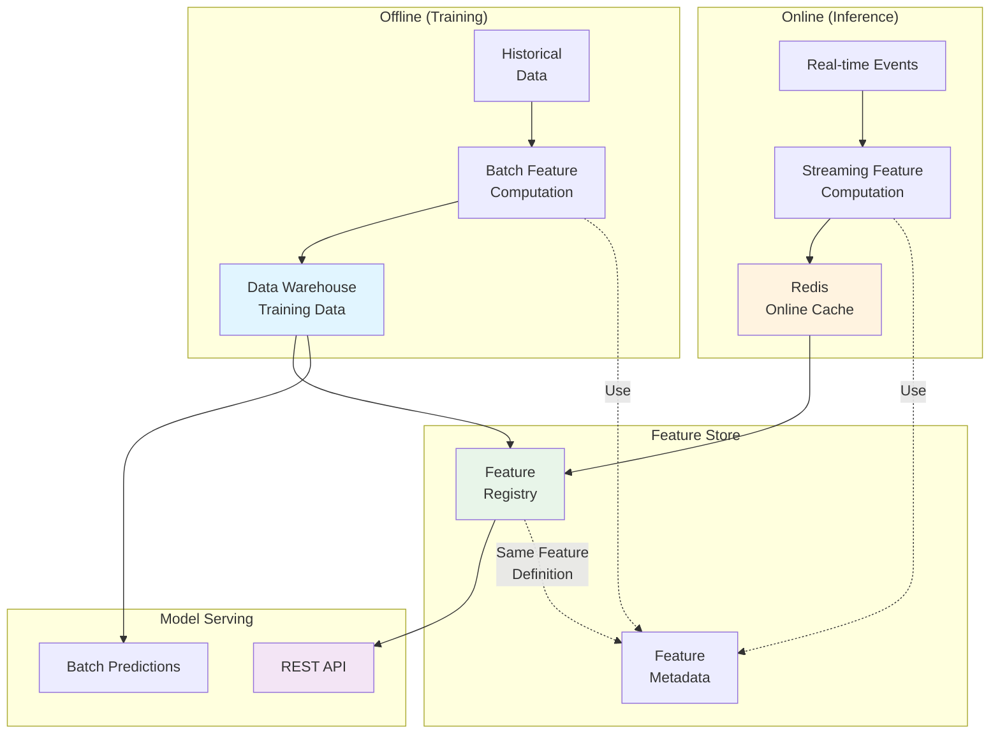

<Hero title="ML Feature Stores & Model Serving" subtitle="Manage features and serve ML models in production" size="large" />

## TL;DR

A **feature store** is a centralized repository managing ML features: computed values used for training and inference. **Offline features** (training data) pre-computed in batch and stored in data warehouse. **Online features** (inference) stored in low-latency cache (Redis), retrieved in &lt;100ms during predictions. **Training-serving skew**—features computed differently during training vs serving—is the silent killer of ML systems. **Model serving** deploys models as REST APIs or streaming predictions, with canary deployments for safety. Never compute features differently between training and serving; use feature store as single source of truth.

## Learning Objectives

By the end of this article, you will understand:
- Difference between offline and online features
- Feature store architecture and components
- How to prevent training-serving skew
- Model serving patterns: batch, REST, streaming
- Monitoring for data drift and model degradation
- Cost-latency trade-offs in feature and model systems

## Motivating Scenario

Your ML team builds a fraud detection model using 50 features (transaction amount, user age, historical purchase count, etc.). Training happens monthly on historical data: 30 days to compute features, 2 days to train model. Serving needs predictions in &lt;100ms for real-time fraud checks. During training, features computed from cleaned, deduplicated transaction data. In production, features computed from raw transaction stream—slightly different logic leads to training-serving skew: model sees different data distributions, accuracy drops 30%. You need a feature store ensuring training and serving use identical feature computations.

## Core Concepts

<Figure caption="Feature Store: Training to Production Pipeline">

</Figure>

### Offline Features (Training)

**Offline features** are pre-computed from historical data and stored in a data warehouse for model training.

**Characteristics:**
- Computed once, reused multiple times
- No latency constraints (can take hours)
- High accuracy: can use expensive transformations
- Snapshot at specific time (not real-time)

**Typical pipeline:**
```
Raw transaction data (30 days)
  → Group by user, compute aggregates
  → Join with user demographics
  → Create feature matrix: [user_id, amount_mean, purchase_count, age, ...]
  → Store in warehouse as training dataset
```

**Tools:** Spark/Pandas for batch computation, store in Parquet or database.

### Online Features (Inference)

**Online features** are retrieved in real-time during model predictions, stored in low-latency cache.

**Characteristics:**
- Must respond &lt;100ms typically
- Stored in Redis, DynamoDB, or specialized feature cache
- Computed continuously as events arrive
- Always fresh, but limited history

**Typical flow:**
```
Real-time event: user purchases item
  → Query online feature store: "user_123 features"
  → Feature store returns: {amount_mean: 45.2, purchase_count: 12, ...}
  → Feed to model: predict fraud?
  → Return prediction &lt;50ms
```

### Training-Serving Skew

**Training-serving skew** occurs when features differ between training and serving.

**Common causes:**
1. **Logic differences**: Training uses deduplicated data, serving uses raw
2. **Data availability**: Training sees 30-day history, serving only 7-day
3. **Timing**: Training uses yesterday's aggregates, serving uses real-time
4. **Schema changes**: Production DB changed, training logic didn't update

**Example skew:**
```
Training: average_purchase =
  SELECT AVG(amount) FROM transactions
  WHERE user_id = 123 AND amount > 0 AND NOT duplicate

Serving: average_purchase =
  SELECT AVG(amount) FROM transactions
  WHERE user_id = 123
  // Forgot to filter duplicates and invalid amounts!
```

Result: Model trained on [avg=50], sees [avg=62] in production, predictions wrong.

**Prevention:**
- Store feature definitions in feature registry
- Generate both training and serving code from same definition
- Use feature store libraries (Feast, Tecton) that enforce this

### Feature Store Architecture

**Components:**

1. **Feature Registry**: Central repository of feature definitions
   - Name, description, computation logic
   - Data type, freshness requirements
   - Training vs serving requirements

2. **Offline Store** (Data Warehouse): Historical features for training
   - Large, durable, slow
   - Parquet in S3, BigQuery, Snowflake

3. **Online Store** (Cache): Real-time features for serving
   - Small, fast, volatile
   - Redis, DynamoDB, specialized systems

4. **Feature Computation Engine**: Transforms raw data into features
   - Batch (Spark): offline
   - Streaming (Flink): online
   - Both read from same registry, use same logic

### Model Serving Patterns

**Batch Predictions:**
- Pre-compute predictions for all entities nightly
- Store in database
- API returns precomputed value instantly
- Best for: recommendation systems, customer segments

**REST API (Online):**
- Request arrives: /predict?user_id=123
- Fetch features from online store
- Run model inference
- Return prediction
- Best for: fraud detection, real-time scoring

**Streaming:**
- Model subscribes to event stream (Kafka)
- Receives transactions, computes features, runs model
- Publishes predictions downstream
- Best for: continuous monitoring, alert systems

## Practical Example

<Tabs>
  <TabItem value="feast-offline" label="Feast: Offline Features">
```python
# features.py
from feast import FeatureView, Entity, FeatureStore
from feast.data_sources import BigQuerySource

# Define entity
user = Entity(name="user_id", value_type=ValueType.INT64)

# Define data source
user_stats_source = BigQuerySource(
    table="project.dataset.user_statistics",
    timestamp_field="event_timestamp",
    created_timestamp_column="created_timestamp"
)

# Define features
user_stats_view = FeatureView(
    name="user_stats",
    entities=[user],
    ttl=86400 * 30,  # 30-day history
    features=[
        Feature(name="total_purchases", dtype=ValueType.INT64),
        Feature(name="avg_purchase_value", dtype=ValueType.FLOAT),
        Feature(name="days_since_last_purchase", dtype=ValueType.INT64),
    ],
    online=True,  # Also materialize to online store
    source=user_stats_source
)

# Training: Get historical features
store = FeatureStore(repo_path=".")

training_data = store.get_historical_features(
    entity_df=pd.DataFrame({
        'user_id': [1, 2, 3, ...],
        'event_timestamp': [datetime(...), ...]
    }),
    features=['user_stats:total_purchases',
              'user_stats:avg_purchase_value']
).to_df()

# Save for training
training_data.to_csv('training_features.csv')
```
  </TabItem>

  <TabItem value="feast-online" label="Feast: Online Features">
```python
from feast import FeatureStore

store = FeatureStore(repo_path=".")

# Materialize latest features to Redis
store.materialize_incremental(end_date=datetime.utcnow())

# Online: Retrieve features for prediction
features = store.get_online_features(
    features=['user_stats:total_purchases',
              'user_stats:avg_purchase_value'],
    entity_rows=[{'user_id': 123}]
)

print(features)
# {
#   'user_stats:total_purchases': [45],
#   'user_stats:avg_purchase_value': [52.30],
# }

# Feed to model
prediction = fraud_model.predict(features)
```
  </TabItem>

  <TabItem value="model-serving" label="Model Serving API">
```python
from fastapi import FastAPI
from feast import FeatureStore
import joblib

app = FastAPI()
store = FeatureStore(repo_path=".")
model = joblib.load("fraud_model.pkl")

@app.post("/predict")
async def predict(user_id: int, transaction_amount: float):
    # Fetch features from online store
    try:
        features = store.get_online_features(
            features=['user_stats:total_purchases',
                      'user_stats:avg_purchase_value'],
            entity_rows=[{'user_id': user_id}]
        )
    except Exception as e:
        return {"error": f"Feature fetch failed: {e}"}

    # Build feature vector
    feature_vector = [
        features['user_stats:total_purchases'][0],
        features['user_stats:avg_purchase_value'][0],
        transaction_amount,
        # ... other features
    ]

    # Get prediction
    fraud_prob = model.predict_proba([feature_vector])[0][1]

    return {
        "user_id": user_id,
        "fraud_probability": float(fraud_prob),
        "recommended_action": "block" if fraud_prob > 0.8 else "allow"
    }

# curl -X POST http://localhost:8000/predict \
#   -H "Content-Type: application/json" \
#   -d '{"user_id": 123, "transaction_amount": 599.99}'
```
  </TabItem>

  <TabItem value="monitoring" label="Data Drift Detection">
```python
import numpy as np
from scipy import stats

def check_data_drift(
    historical_data,
    recent_data,
    feature_name,
    threshold=0.05
):
    """
    Detect if feature distribution changed significantly
    """
    # Kolmogorov-Smirnov test
    statistic, p_value = stats.ks_2samp(
        historical_data[feature_name],
        recent_data[feature_name]
    )

    drifted = p_value < threshold
    return {
        "feature": feature_name,
        "drifted": drifted,
        "p_value": p_value,
        "historical_mean": historical_data[feature_name].mean(),
        "recent_mean": recent_data[feature_name].mean(),
    }

# Monitor features
features = ['total_purchases', 'avg_purchase_value', 'days_since_purchase']
drifts = [
    check_data_drift(training_data, production_data, f)
    for f in features
]

for drift in drifts:
    if drift['drifted']:
        print(f"ALERT: {drift['feature']} drifted!")
        print(f"  Historical mean: {drift['historical_mean']:.2f}")
        print(f"  Recent mean: {drift['recent_mean']:.2f}")
```
  </TabItem>
</Tabs>

## When to Use / When Not to Use

<Vs items={[
{label: "Batch Predictions", points: [
      "Customer segments for campaigns",
      "Recommendation lists for homepage",
      "Churn risk scores for outreach",
      "No latency constraints",
      "Process millions entities efficiently",
      "Lower serving infrastructure cost"
    ]},
{label: "Online (Real-time) Predictions", points: [
      "Fraud detection at transaction time",
      "Personalized pricing",
      "Real-time recommendations",
      "Sub-100ms latency required",
      "Unpredictable entity access patterns",
      "Model requires current context"
    ]}
]} highlight={[0, 1]} />

## Patterns & Pitfalls

<Showcase
  sections={[
    {
      label: "Training-Serving Skew: The Silent Killer",
      body: "Feature computed differently during training and serving causes model accuracy to drop mysteriously after deployment. Use feature store to define features once, generate training and serving code from same definition. Version features: if changing logic, create new feature version."
    },
    {
      label: "Online Feature Latency Matters",
      body: "If online feature store takes 500ms to respond, your API endpoint (fraud prediction) now takes 600ms (500 features + 100 model inference). For &lt;100ms latency, must cache aggressively. Materialize offline to online store frequently."
    },
    {
      label: "Feature Data Quality",
      body: "Bad features = bad model, no matter how good training algorithm. Monitor feature quality: nulls, outliers, drift. Set up alerts when NaN rate increases, distribution shifts, or new values appear unexpectedly."
    },
    {
      label: "Stale Features in Cache",
      body: "Online Redis cache becomes stale: user made purchase 10 minutes ago, but purchase_count not updated for 1 hour. Either materialize very frequently (expensive) or accept staleness. Document feature freshness SLAs."
    },
    {
      label: "Model Deployment & Rollback",
      body: "New model performs worse in production than in tests. Use canary deployment: route 10% traffic to new model, monitor metrics, gradually increase if healthy. Always keep previous model ready for instant rollback."
    },
    {
      label: "Feature Explosion",
      body: "100 original features → 1000 derived features → model train time explodes. Be disciplined: feature engineering is iterative. Start simple, add features with clear business justification. Remove low-importance features regularly."
    }
  ]}
/>

## Design Review Checklist

<Checklist items={[
  "Defined entities (users, products, transactions) that features attach to",
  "Listed all features and their source data (offline vs online)",
  "Documented feature computation logic: exactly same for training and serving?",
  "Chose feature store (Feast, Tecton, custom) or built it?",
  "Configured offline store: where do training features live? (DW, S3)",
  "Configured online store: where do inference features live? (Redis, DynamoDB)",
  "Set up materialization schedule: how often refresh online features?",
  "Planned model serving: batch, REST API, streaming?",
  "Configured monitoring: data drift detection, feature quality checks",
  "Tested failure scenarios: online store down, feature unavailable, staleness"
]} />

## Self-Check

- What's the difference between offline and online features? (Hint: batch vs real-time, accuracy vs latency)
- How do you prevent training-serving skew? (Hint: single source of truth, same logic for both)
- Why does online feature latency matter for predictions? (Hint: adds to total request latency)
- What's data drift and how detect it? (Hint: feature distribution changes, K-S test)
- When would you use batch predictions vs online? (Hint: latency requirements, entity count)

## Next Steps

- **Set up Feast locally**: define features, train model, serve predictions
- **Implement online store**: materialize features to Redis, test retrieval latency
- **Build monitoring**: detect data drift, track prediction latency and accuracy
- **Test skew scenarios**: intentionally compute features differently, measure impact
- **Design canary deployment**: gradually route traffic to new model, monitor metrics

## References

- <a href="https://feast.dev/docs/" target="_blank" rel="nofollow noopener noreferrer">Feast Feature Store Documentation ↗️</a>
- <a href="https://www.tecton.ai/" target="_blank" rel="nofollow noopener noreferrer">Tecton Feature Platform ↗️</a>
- <a href="https://kserve.github.io/website/" target="_blank" rel="nofollow noopener noreferrer">KServe Model Serving ↗️</a>
- <a href="https://arxiv.org/abs/1810.03291" target="_blank" rel="nofollow noopener noreferrer">Hidden Technical Debt in Machine Learning Systems ↗️</a>
